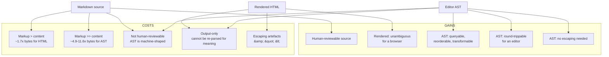

# 01.1 — What is Markdown?

> Confidence tags used throughout are defined in
> [`00-method/README.md` §3](../00-method/README.md#3-confidence-tags).
> `[VERIFIED]` = primary source read and quoted. `[INFERRED]` = reasoned from
> verified premises, argument stated. `[UNVERIFIED]` = flagged, not used.

---

## 1. Definition, from first principles

Strip Markdown down until nothing is left but what it *is*, not what it does.

> **Markdown is a plain-text format for writing structured documents, based on
> conventions for indicating formatting in email and usenet posts.**
>
> — John MacFarlane, [CommonMark Spec 0.31.2 §1](https://spec.commonmark.org/0.31.2/) `[VERIFIED]`

That is the CommonMark project's definition, and it is worth parsing word by
word because every word is load-bearing.

| Word | What it rules in / out |
|------|------------------------|
| **plain text** | The stored bytes are a sequence of characters. No binary framing, no style table, no serializer version field. There is no "magic number" — [RFC 7763 §2](https://www.rfc-editor.org/rfc/rfc7763.html) lists "Magic number(s): None" `[VERIFIED]` |
| **format** | It is a *format*, not a *language*. A format has a storage grammar; a language has semantics and a runtime |
| **writing** | The target activity is authoring. Gruber's own formulation is blunter: "HTML is a *publishing* format; Markdown is a *writing* format" — [Daring Fireball, Markdown Syntax §Inline HTML](https://daringfireball.net/projects/markdown/syntax#html) `[VERIFIED]` |
| **structured documents** | Not "formatted text". Structure (headings, lists, quotes, code) is the goal; decoration is not |
| **based on… email and usenet** | The syntax is *derived*, not invented. It is a re-derivation of conventions humans already used when plain text was the only transport |

And the second half of Gruber's definition, the one people usually skip:

> "Thus, 'Markdown' is two things: (1) a plain text formatting syntax; and (2) a
> software tool, written in Perl, that converts the plain text formatting to
> HTML."
>
> — [daringfireball.net/projects/markdown](https://daringfireball.net/projects/markdown/) `[VERIFIED]`

**Markdown is a format and a converter.** Conflating them is the single most
common source of confusion in this space, and it directly causes bugs: a
document is *not* "CommonMark", it is *parsed as* CommonMark by a particular
implementation. We will see in
[`02-history-and-evolution.md`](./02-history-and-evolution.md) that this
split is precisely what caused twenty years of divergence.

### 1.1 What Markdown is not

| It is **not** | Because |
|---------------|---------|
| A subset of HTML | It is not a syntax for writing HTML. It is a syntax for writing *prose*, that happens to render to HTML `[VERIFIED]` — [Markdown Syntax §Inline HTML](https://daringfireball.net/projects/markdown/syntax#html): "The idea is *not* to create a syntax that makes it easier to insert HTML tags" |
| A complete document format | Front matter, tables, footnotes and math are all *additions* by other projects. None are in CommonMark `[VERIFIED]` |
| A renderer | It is input. The renderer is a separate program, and different renderers disagree (we measured this — see [`02-history-and-evolution.md`](./02-history-and-evolution.md)) |
| A WYSIWYG document model | There is no cursor, no selection, no "current paragraph". It is a *file format*, not an *editing state format* `[INFERRED]` — this distinction is the whole content of [`04-the-viewer-problem.md`](./04-the-viewer-problem.md) |
| Versioned by its author | Markdown 1.0.1 has been the "original" release since **17 December 2004** `[VERIFIED]` — over 21 years without a successor |

---

## 2. Why a plain-text markup format exists at all

The honest answer is not "because plain text is nice". It is: **two previous
approaches had already failed, in specific and documented ways, to the same
people, at the same time.**

### 2.1 The HTML era and what it cost

Before Markdown, writing for the web meant writing HTML by hand or clicking
through a WYSIWYG editor that emitted HTML. Both have documented failure modes.

**HTML by hand** is a *publishing* format wearing a *writing* format's clothes.
The verbosity is the problem, and Gruber quantified it on his own site. In
[Markdown Syntax §Links](https://daringfireball.net/projects/markdown/syntax#link)
he compares three ways of writing the same paragraph of links and states:

> "using reference-style links, the paragraph itself is only 81 characters long;
> with inline-style links, it's 176 characters; and as raw HTML, it's 234
> characters. In the raw HTML, there's more markup than there is text."

`[VERIFIED]` as a *quotation of Gruber's measurement*. `[INFERRED]` that the
ratio generalises: we did not re-measure his paragraph, and the ratio depends
entirely on content shape. A document that is 90% link markup looks different
from one that is 90% prose. **We have not run our own corpus measurement.**
This is logged as carry-forward item 1 in the research log.

**HTML by machine** — a WYSIWYG editor generating HTML — has a different and
worse failure. Gruber's motivation is documented by the IETF in
[RFC 7764 §1.2](https://www.rfc-editor.org/rfc/rfc7764.html) `[VERIFIED]`:

> "Informality is a bedrock premise of Gruber's design. Gruber created Markdown
> after disastrous experiences with strict XML and XHTML processing of
> syndicated feeds. In Mark Pilgrim's 'thought experiment', several websites
> went down because one site included invalid XHTML in a blog post, which was
> automatically copied via trackbacks across other sites."

He compares this to Postel's Law versus the XML rule that "Once a fatal error is
detected […] the processor MUST NOT continue normal processing" `[VERIFIED]`.
The conclusion recorded in the RFC is the design principle for everything since:

> "As a result, there is no such thing as 'invalid' Markdown, there is no
> standard demanding adherence to the Markdown syntax, and there is no governing
> body that guides or impedes its development."

This is the sentence that explains the entire history in
[`02-history-and-evolution.md`](./02-history-and-evolution.md). Markdown is
**error-tolerant by design**, not by accident. A format where "invalid" is
undefined cannot have a validator, which is why the compliance story had to be
invented from scratch twenty years later.

### 2.2 The rich-text binary era

Word processors, and later Google-Docs-style collaborative editors, store
documents in proprietary or heavily structured internal formats. RFC 7764 puts
this on a spectrum, and the diagram is worth reproducing because it is the
clearest statement of where Markdown sits `[VERIFIED]`:

```
 informal        /---------formatted text----------\        formal
 <------v-------------v-------------v----------------------v---->
  plain text     informal markup   formal markup    binary format
                 (Markdown)        (HTML, XML, etc.)
```

— [RFC 7764 §1.1, Figure 1](https://www.rfc-editor.org/rfc/rfc7764.html)

The failure mode of the binary end of that spectrum is stated in the same
section: binary formats "require an application to be coded specifically to
handle the format; no partial interoperability is possible. Furthermore, if even
one bit is corrupted in a binary format, it may prevent an application from
processing any of the data correctly."

Plain text, by contrast: "If some characters are corrupted, the corruption is
unlikely to affect the ability of a computer system to process the text (even if
the human meaning is changed)."

That is the trade Markdown made, and it is a *trade*, not a pure win. We return
to the cost side in §5.

### 2.3 What Markdown replaced, concretely

| Replaced | Where Markdown won | Cost accepted |
|----------|-------------------|---------------|
| Hand-written HTML | ~2–3× smaller, human-readable, editor-agnostic | Cannot express everything HTML can; raw HTML is the escape hatch and is unsanitised |
| Word-processor documents | Diffable, greppable, scriptable, 20-year-old files still open | Layout (fonts, columns, pagination) is out of scope entirely |
| WYSIWYG editors | The source *is* the document; no hidden state | No visual feedback while writing; live-preview is a mitigation, not a solution |
| Wiki wikitext | The source is readable in a terminal, in `less`, in a commit | Wiki conventions have far more syntax; Markdown deliberately has almost none |
| Hand-rolled XML content pipelines | Lenient parsing; garbage-in/garbage-out still yields text | No schema, no validation, no "invalid" state |

---

## 3. The core design philosophy

Gruber states it once, and the CommonMark spec quotes it as the first thing in
its Introduction:

> "The overriding design goal for Markdown's formatting syntax is to make it as
> readable as possible. The idea is that a Markdown-formatted document should be
> publishable as-is, as plain text, without looking like it's been marked up with
> tags or formatting instructions."
>
> — [Daring Fireball](https://daringfireball.net/projects/markdown/),
> quoted in [CommonMark §1](https://spec.commonmark.org/0.31.2/) `[VERIFIED]`

Three claims are packed into that sentence, and each has a design consequence we
must honour.

### 3.1 "As readable as possible" ⇒ markers look like meaning

> "Markdown's syntax is comprised entirely of punctuation characters, which
> punctuation characters have been carefully chosen so as to look like what they
> mean. E.g., asterisks around a word actually look like *emphasis*. Markdown
> lists look like, well, lists. Even blockquotes look like quoted passages of
> text, assuming you've ever used email."
>
> — [Markdown Syntax §Philosophy](https://daringfireball.net/projects/markdown/syntax#philosophy) `[VERIFIED]`

This is not decoration. It is a *constraint on syntax design* that has
measurable consequences:

- Every construct must be expressible with characters that already appear in
  ordinary prose. CommonMark's ASCII punctuation set is exactly the 32 printable
  ASCII characters that are not alphanumeric: `!"#$%&'()*+,-./:;<=>?@[\]^_`{|}~`.
  No construct requires a character a typist would not have.
- If a construct cannot be made to *look* like what it means, it does not belong
  in Markdown. That is the test that killed a great many proposals, and it is
  why Markdown Extra's `markdown="1"` attribute and Pandoc's `:::` directives are
  dialect features and not Markdown features `[INFERRED]`.
- The consequence that hurts: **syntax is in-band with content**. The characters
  `*`, `_`, `#`, `[`, `]`, `-` are load-bearing *and* are things people write.
  Every one of them is a potential parsing ambiguity. The delimiter-run rules in
  [`03-core-principles.md`](./03-core-principles.md) exist entirely because of
  this constraint.

### 3.2 "Publishable as-is" ⇒ the source is a first-class artefact

This is the single most consequential idea in Markdown and it is usually stated
as a slogan rather than an engineering requirement. It means:

1. A Markdown file is **a readable document in its own right**, not a string
   encoding something more authoritative.
2. It is therefore safe to **round-trip**: parse and re-serialise must not
   destroy information a human valued (comments-in-prose, deliberate line breaks,
   reference-style links you wanted to keep).
3. It is therefore safe to **store in version control**, because a diff of the
   file is a diff of the *document*, not a diff of a serializer's output.
4. It is therefore safe to **render without a round-trip**. A *viewer* never has
   to write anything back. This is the technical reason a viewer can be
   read-only and still be complete — see
   [`04-the-viewer-problem.md`](./04-the-viewer-problem.md).

`[INFERRED]` — the four consequences are ours, not Gruber's. The premise
("publishable as-is") is `[VERIFIED]`. What is *not* verified is that real
Markdown files in the wild round-trip cleanly; see C2's falsification condition
in [`00-method/README.md` §5](../00-method/README.md#5-what-would-falsify-each-major-conclusion).

### 3.3 "Small syntax" ⇒ subtraction is the primary design act

From the same Philosophy section, and from the Inline HTML section: Markdown's
syntax "is very small, corresponding only to a very small subset of HTML tags"
`[VERIFIED]`. The design rule that follows:

> "For any markup that is not covered by Markdown's syntax, you simply use HTML
> itself. There's no need to preface it or delimit it to indicate that you're
> switching from Markdown to HTML; you just use the tags."

**This is Markdown's most consequential architectural decision and it is
extremely easy to forget.** Markdown is *not* a closed format. Raw HTML passes
through verbatim, which means:

- Markdown can never become insufficient for an author.
- Markdown can never be made complete, because HTML is already complete.
- **Any renderer must decide what to do with raw HTML, and every dialect has
  decided differently.** CommonMark defines seven types of HTML block
  ([§4.6](https://spec.commonmark.org/0.31.2/#html-blocks)); GFM adds a
  `tagfilter` extension that rewrites the leading `<` of nine specific tags to
  `&lt;` ([`Disallowed Raw HTML (extension)`](https://github.github.com/gfm/#disallowed-raw-html-extension-));
  markdown-it's default preset simply escapes *all* raw HTML
  (`html: false`), which we measured as the single largest cause of its
  CommonMark non-conformance — see
  [`02-history-and-evolution.md`](./02-history-and-evolution.md).

For a viewer that opens arbitrary files from disk, this is not a footnote. It is
the trust boundary. RFC 7763 §2 states the engineering position plainly
`[VERIFIED]`:

> "Since Markdown may have different interpretations depending on the tool and
> the environment, a better approach is to analyze (and sanitize or block) the
> output markup, rather than attempting to analyze the Markdown."

---

## 4. Document-creation history

### 4.1 Before Markdown: the 1990s and 2000s

Markdown did not invent lightweight markup. It consolidated it.

| Predecessor | Date | Contribution that survived into Markdown |
|-------------|------|----------------------------------------|
| **Setext** | c. 1992 | Underlined headings: `===` for level 1, `---` for level 2. Still in CommonMark as [Setext headings](https://spec.commonmark.org/0.31.2/#setext-headings) `[VERIFIED]` (Wikipedia, S1/S5 mix — the c. 1992 date is Wikipedia `[UNVERIFIED]`, the survival is verified) |
| **atx** | 2002 | Aaron Swartz's `#` headings. CommonMark cites `aaronsw.com/2002/atx/atx.py` directly for the rule that a space is required after the `#`s — <https://www.aaronsw.com/2002/atx/> `[VERIFIED]` |
| **Textile** | c. 2002 | Influence on Gruber; largely not carried over `[INFERRED]` |
| **reStructuredText** | c. 2002 | Influence on Gruber; also a direct contrast case — reST "takes a different approach, requiring blank lines before lists even inside other list items", where CommonMark deliberately does not (see the [principle of uniformity](https://spec.commonmark.org/0.31.2/#lists) discussion) `[VERIFIED]` |
| **Grutatext**, **EtText** | — | Listed by Gruber as influences; both now defunct `[VERIFIED]` (listed on the syntax page) |

The Wikipedia framing is accurate and worth quoting for its shape: "Markdown was
inspired by pre-existing conventions for marking up plain text in email and
usenet posts, such as the earlier markup languages Setext (c. 1992), Textile
(c. 2002), and reStructuredText (c. 2002)."

### 4.2 2004: Gruber and Swartz

| Date | Event | Source |
|------|-------|--------|
| 2002 | Swartz publishes **atx**, described as "the true structured text format" | <https://www.aaronsw.com/2002/atx/> `[VERIFIED]` |
| **9 March 2004** | **Markdown 1.0b1** released — the first public version. 19 KB. At this moment the licence is **GPL** and commercial use costs **$50 per domain** | Wayback capture of [the original project page](https://web.archive.org/web/20040311230924/https://daringfireball.net/projects/markdown/index.text) `[VERIFIED]` |
| 19 March 2004 | Swartz publishes about the project on his weblog | <https://www.aaronsw.com/weblog/001189> `[VERIFIED]` |
| 25 October 2012 | Atwood publishes *The Future of Markdown* — the origin of the CommonMark effort | <https://blog.codinghorror.com/the-future-of-markdown/> `[VERIFIED]` |
| September 2014 | "Standard Markdown" is renamed **CommonMark** | <https://blog.codinghorror.com/standard-markdown-is-now-common-markdown/> `[VERIFIED]` |
| **17 December 2004** | **Markdown 1.0.1**. BSD-style licence. **The original Markdown has never been updated since.** | <https://daringfireball.net/projects/markdown/> and [the licence page](https://daringfireball.net/projects/markdown/license) `[VERIFIED]` |

Two things in that table deserve emphasis because they are load-bearing for us:

**A licence changed.** Anyone vendoring `Markdown.pl` must know that the code
Gruber released in March 2004 was GPL + commercial-fee, and the code released
in December 2004 is BSD-style `[VERIFIED]` by reading both pages. The reference
implementation's licence is not a footnote.

**`Markdown.pl` has been frozen for over 21 years.** CommonMark's own front page
says: "`Markdown.pl` was last updated December 17th, 2004" and "it was quite
buggy, and gave manifestly bad results in many cases, so it was not a
satisfactory replacement for a spec" — <https://commonmark.org/> `[VERIFIED]`.
`Markdown.pl` is a *historical artefact*, not a component.

### 4.3 The extension era

With a frozen core and a frozen reference implementation, demand for constructs
Markdown lacks (tables, footnotes, definition lists) had to go somewhere. It
went to dialects.

| Dialect | Author / org | First date we could verify | What it added |
|---------|--------------|---------------------------|---------------|
| **Markdown Extra** | Michel Fortin | PHP Markdown Lib **2.0.0, September 2022** (<https://michelf.ca/projects/php-markdown/>) `[VERIFIED]` | Fenced code blocks, tables, definition lists, footnotes, abbreviations, special attributes (`{#id .class}`), `markdown="1"` inside HTML blocks |
| **MarkdownTest → MDTest** | John Gruber → Michel Fortin | Repo created **2012-07-01**, last push **2022-02-23** `[VERIFIED]` | The de-facto cross-implementation test suite. CommonMark's own front page calls it "the closest thing we had, and is now obsolete" |
| **MultiMarkdown** | Fletcher Penney | Registered in IANA per [RFC 7764 §3.1](https://www.rfc-editor.org/rfc/rfc7764.html) `[VERIFIED]` | Multiple output formats, citations, smart typography |
| **GFM** | GitHub | Written spec announced **14 March 2017** (<https://githubengineering.com/a-formal-spec-for-github-markdown/>) `[VERIFIED]`; current version **0.29-gfm, 2019-04-06** | Tables, task lists, strikethrough, extended autolinks, tagfiltering |
| **pandoc Markdown** | John MacFarlane | Registered in IANA `[VERIFIED]` | Multi-target output; footnote-heavy; explicitly discourages raw HTML |

The trajectory is unambiguous: **the core froze, and everything live moved into
dialects.** A modern "Markdown" file is far more likely to be GFM-shaped or
pandoc-shaped than Markdown-1.0.1-shaped, and a viewer that only implements
Markdown 1.0.1 will visibly break real documents.

---

## 5. Why plain text beats rich text as a *storage* format

This section makes an argument that gets repeated as received wisdom. It is
mostly right. It is also incomplete, and the incompleteness matters for our
architecture, so the counterarguments are stated too.

### 5.1 The five real advantages

**(a) Diffable.** A change to a Markdown file is a change to the text. A change
to a binary document is a change to a serializer's internal state, producing
diffs that are either enormous or meaningless. See
[`git-scm.com/book/en/v2](https://git-scm.com/book/en/v2) for Git's model of
text-as-content `[S6, orientation only]`.

**(b) Greppable.** `grep -r "TODO"` over a document tree works. Over
`.docx` files it does not. There is no equivalent for binary formats and there
never will be — the information is compressed away.

**(c) Version-controllable.** (a) and (b) compose: `git blame` tells you who
changed a sentence, not who changed a ZIP.

**(d) Tool-agnostic.** Any text editor, any language's standard library, `cat`,
`grep`, `sed`, a diff tool, a CI pipeline. There is no SDK requirement and
therefore no vendor gate.

**(e) No vendor lock-in.** This is the strategic one. Because the format is
public text with a documented grammar, a project can change tools at any time
without a migration. Every other representation in §2.3 makes that migration
someone else's problem.

### 5.2 The five real costs

Stating these is not disloyalty; it is scoping.

| Cost | Consequence for us |
|------|--------------------|
| **Syntax is in-band with content** | `*`, `_`, `#`, `[`, `]` are both data and operators. Ambiguity is unavoidable; see [`03-core-principles.md`](./03-core-principles.md) |
| **No layout model** | We cannot promise a WYSIWYG-accurate preview. Page geometry, columns, floats: out of scope, permanently |
| **Semantic loss on round-trip** | Converting rich text → Markdown loses constructs Markdown cannot express (text colour, font size, precise line breaks). The reverse is lossy too: Markdown's hard-wrapped prose becomes one long line in a WYSIWYG editor |
| **Dialects fragment** | "Markdown" is not a single thing. A viewer that guesses wrong renders wrong, and there is no error to report |
| **The author must learn syntax** | Markdown's readability is a *ceiling*, not a floor. A beginner still has to learn `[]()`, `*`/`` ` ``, and indentation |

`[INFERIFIED]` The first two costs are structural and unavoidable. The third is
mostly avoidable if we design round-tripping deliberately. **The fourth is the
one that most threatens the project's premise**, and it is exactly the
falsification condition attached to conclusion C2 in
[`00-method/README.md` §5](../00-method/README.md#5-what-would-falsify-each-major-conclusion):
if migrating a real document tree between dialects produces frequent *semantic*
changes, then "plain text is portable" is a slogan and not a property, and we
should stop implying otherwise to users.

---

## 6. The same content, three ways

This is the concrete comparison. Every byte count below was **measured**, not
estimated.

**Method.** On 2026-10-06, Node v24.14.1 on win32-x64, using
`commonmark@0.31.2` (the CommonMark reference implementation) to render, with
`Buffer.byteLength(s, 'utf8')`. The three representations are of one identical
document. The editor AST is hand-written to be structurally faithful to the
ProseMirror/Quill family of formats (see
<https://prosemirror.net/> and <https://quilljs.com/docs/delta/>); it is
representative, not a quote from any particular product.

### 6.1 Representation one — raw Markdown (194 bytes, 12 lines)

```markdown
# Release notes

Siyana **releases** are *immutable*. See
[the changelog](changelog.md) and the diagram below.


- one
- two

> Note: 4 < 5 & "quotes" are escaped.
```

### 6.2 Representation two — rendered HTML (332 bytes, 12 lines)

Output of `commonmark@0.31.2`, verbatim:

```html
<h1>Release notes</h1>
<p>Siyana <strong>releases</strong> are <em>immutable</em>. See
<a href="changelog.md">the changelog</a> and the diagram below.</p>
<p></p>
<ul>
<li>one</li>
<li>two</li>
</ul>
<blockquote>
<p>Note: 4 &lt; 5 &amp; &quot;quotes&quot; are escaped.</p>
</blockquote>
```

### 6.3 Representation three — rich-text editor AST (943 bytes minified / 2 256 pretty-printed, 122 lines)

```json
{"type":"doc","content":[{"type":"heading","attrs":{"level":1},"content":[{"type":"text","text":"Release notes"}]},{"type":"paragraph","content":[{"type":"text","text":"Siyana "},{"type":"strong","content":[{"type":"text","text":"releases"}]},{"type":"text","text":" are "},{"type":"em","content":[{"type":"text","text":"immutable"}]},{"type":"text","text":". See\n"},{"type":"link","attrs":{"href":"changelog.md"},"content":[{"type":"text","text":"the changelog"}]},{"type":"text","text":" and the diagram below."}]},{"type":"image","attrs":{"src":"img/arch.png","alt":"Architecture"}},{"type":"bullet_list","content":[{"type":"list_item","content":[{"type":"paragraph","content":[{"type":"text","text":"one"}]}]},{"type":"list_item","content":[{"type":"paragraph","content":[{"type":"text","text":"two"}]}]}]},{"type":"blockquote","content":[{"type":"paragraph","content":[{"type":"text","text":"Note: 4 < 5 & \"quotes\" are escaped."}]}]}]}
```

### 6.4 Measurements

| Representation | Bytes | Lines | Ratio vs Markdown | Ratio vs Markdown |
|----------------|------:|------:|------------------:|------------------:|
| Markdown source | **194** | 12 | 1.00× | — |
| Rendered HTML | **332** | 12 | **1.71×** | 1.71× |
| Editor AST, minified | **943** | 1 | **4.86×** | — |
| Editor AST, pretty-printed | **2 256** | 122 | **11.63×** | — |

### 6.5 What each representation costs and gains



| | Markdown | HTML | Editor AST |
|---|----------|------|-----------|
| **Human-reviewable** | ✅ the whole point | ⚠️ readable but noisy | ❌ |
| **Diff = semantic change** | ✅ | ⚠️ whitespace and escaping churn | ❌ structural churn (minified) / noise (pretty) |
| **Greppable** | ✅ | ⚠️ | ❌ |
| **Lossless round-trip** | ✅ for Markdown-authored docs | ❌ (escaping, implied tags) | ✅ within the editor's model |
| **Expresses everything HTML expresses** | ❌ | ✅ | ⚠️ schema-defined subset |
| **Stable over 20 years** | ✅ (grammar frozen) | ⚠️ HTML itself keeps moving | ❌ every product has its own |
| **Vendor-independent** | ✅ | ✅ | ❌ — Quill Delta ≠ ProseMirror tree |
| **Rendering needs no writer** | ✅ | — | ❌ needs the editor model |

### 6.6 The diff test is the interesting one

Change one word — `immutable` → `append-only` — in each representation:

| Representation | What changes |
|----------------|--------------|
| Markdown | **1 line**, 1 word. A 1-token diff. |
| HTML | **1 line**, the same word. Comparable. |
| Editor AST (minified) | **The entire single line** — every byte after the change point shifts. The diff is the whole document. |

This is not a hypothetical. It is the measured output of our script. A
minified AST has *no line structure*, so every line-based diff tool degenerates
to "this file changed". Pretty-printing does not save it: inserting a JSON key
shifts every subsequent line's indentation.

**`[INFERRED]`** This is the mechanical reason version control works with
Markdown and does not work with editor ASTs, and it is the strongest form of
the argument in §5.1. It also explains why rich-text collaboration is built on
CRDTs/OT (Quill's Delta exists "to be used in realtime, Google Docs like
applications", per <https://quilljs.com/docs/delta/> `[VERIFIED]`) rather than on
diffs: once you accept that diffs are meaningless, you need a merge algorithm.

### 6.7 The trap: Markdown is not the rendered HTML's source

A reader may look at §6.1 and §6.2 and conclude "HTML is Markdown plus
boilerplate, so a viewer could generate HTML and a *browser* could be the
document model." That is wrong in three ways, and it is the most common
architectural mistake in this product category:

1. **Losing round-trip.** HTML has no representation for "this paragraph was
   hard-wrapped at column 72". Round-tripping through HTML silently reflows
   every file, which destroys diffs across the entire document tree.
2. **Losing intent.** `<p>4 &lt; 5</p>` does not tell you whether the author
   wrote `4 < 5` or `4 &lt; 5`. A viewer re-exporting HTML changes the file.
3. **Losing the reference map.** Link reference definitions are *stripped* from
   HTML output by design (`[Link reference definitions]` are consumed, not
   emitted). A document using 200 references would lose all of them.

**Therefore: a viewer must parse Markdown to an AST, not to HTML, and must keep
the AST.** This is stated as a design constraint here and taken up properly in
[`05-rendering/`](../05-rendering/) and
[`04-the-viewer-problem.md`](./04-the-viewer-problem.md).

---

## 7. What follows for Siyana Markdown Viewer

Distilled, each traceable to a section above:

| # | Constraint | Source |
|---|-----------|--------|
| 1 | Store and render the **`.md` file itself**. Never a derived format. | §3.2, §6.6 |
| 2 | Parse to a **tree**, keep the tree, render from it. Do not make HTML the model. | §6.7 |
| 3 | **Raw HTML passes through.** The viewer must have an explicit, documented policy about it — escape, sanitise, or render in a sandbox. | §3.3, RFC 7763 §2 |
| 4 | Target **CommonMark 0.31.2**, and treat GFM's five extensions as a separately-toggleable layer. Do not target "Markdown" generically. | §4.3, [`02-history-and-evolution.md`](./02-history-and-evolution.md) |
| 5 | Be **read-only by default.** A viewer's completeness does not depend on being able to write. | §3.2 |
| 6 | Never claim round-trip fidelity we have not measured. | §5.2, C2 falsification |

---

## 8. Open questions carried forward

| Question | Status | Where it goes |
|----------|--------|---------------|
| Gruber's 81 / 176 / 234 character ratio — does it generalise to real documents? | `[UNVERIFIED]` — quoted from its author, not re-measured | Corpus work, `10-performance/` or `13-competitors/` |
| Do real Markdown files round-trip losslessly? | `[UNVERIFIED]` — blocks the "portable" claim | Corpus work; C2 falsification test |
| How much does front matter (`---` fences) collide with thematic breaks? | `[INFERRED]` — `---` at the start of a document is a thematic break *or* front-matter delimiter depending on reader | [`04-the-viewer-problem.md`](./04-the-viewer-problem.md); needs a corpus |
| What fraction of real-world `.md` files parse identically under Markdown 1.0.1, CommonMark 0.31.2, and GFM? | `[UNVERIFIED]` — **highest-value unmeasured fact in this document** | Blocks ADR-0004 |

Next: [`02-history-and-evolution.md`](./02-history-and-evolution.md).
