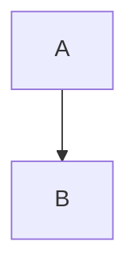
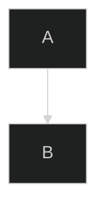

# 03 — Extensions and dialects

> **Scope.** Everything that is **not** in CommonMark 0.31.2. For each item:
> the syntax, who defines it, whether it is CommonMark-valid, how widely it
> appears in real files, and whether a Markdown **viewer** should support it.
>
> `→` = TAB · `␣` = one SPACE · `␤` = LINE FEED · `␃` = BACKTICK. Real backticks appear only as code-span delimiters. See [README §2.0](README.md#20-the-visible-glyph-convention).
>
> **Provenance tags** (see [README §3](README.md#3-the-symbol-legend)):
> **CORE** / **GFM** / **EXTENSION** / **DIALECT** / **NONSTANDARD**.

---

## 1. The taxonomy, and why the boundary matters

| Tag | Count here | Defining authority | Conformance test exists? |
|-----|-----------:|--------------------|------------------------|
| **GFM** | 5 items | One published spec (0.29-gfm, 2019) | **Yes** — 24 extension examples |
| **EXTENSION** | 14 items | A widely-used implementation's docs | **No** — we must invent the fixtures |
| **DIALECT** | 4 items | A project's own manual | **No** |
| **NONSTANDARD** | 8 items | One product's help pages | **No**, and it can change |

**The single most important consequence:** only 5 of these constructs have an
objective conformance test. The other 26 are engineering judgement. That is why
[05-test-fixture-strategy.md](05-test-fixture-strategy.md) exists — we have to
*be* the conformance authority for our own extensions.

---

## 2. GitHub Flavored Markdown — the five extensions

GFM is *"a strict superset of CommonMark"*. Measured conformance on 2026-10-06,
`markdown-it@15.0.2` scored **12 / 24 = 50 %** of GFM's extension examples even
with its GFM-ish options on. Read that number as a warning: **these extensions
are less settled than CommonMark itself.**

### 2.1 Tables with alignment (GFM §4.10) — **GFM**

Full rule and 8 fixtures: [01 §15](01-block-elements.md#15-tables--gfm-extension-gfm-410-examples-198205).

```markdown
| Function name | Description                    |
| ------------- | ------------------------------ |
| `help()`      | Display the help window.       |
```

| Aspect | Value |
|--------|-------|
| CommonMark-valid? | **No** — CommonMark has no tables |
| Coverage in the wild | **Very high.** Every README on GitHub, every docs site, Jekyll/Hugo/MkDocs/Docusaurus |
| Should a viewer support it? | **Yes, default-on, non-negotiable.** Omitting it breaks a large fraction of real documents |
| Footguns | (a) `\|` needed for a literal pipe; (b) `\|` inside a wikilink alias breaks the cell; (c) a body row is not required to match the header width; (d) `align=` vs `style=` serialisation differs per engine |
| Interaction | Fenced code cannot appear in a cell; a blank line ends the table; tables cannot be interrupted by a paragraph |

### 2.2 Task list items (GFM §5.3) — **GFM**

```text
RULE (GFM §5.3)

  A TASK LIST ITEM is a LIST ITEM where the first block in it is a PARAGRAPH
  which BEGINS WITH a task list item marker and AT LEAST ONE WHITESPACE
  CHARACTER before any other content.

  A TASK LIST ITEM MARKER consists of:
    an optional number of spaces,
    a left bracket [,
    either a whitespace character or the letter x in either lowercase or
      uppercase,
    and then a right bracket ].

  Rendered as a semantic checkbox element (<input type="checkbox"> in HTML).
  If the character between the brackets is a whitespace character the checkbox
  is unchecked. Otherwise checked.
```

| GFM Ex. | Markdown | GFM HTML |
|---------|----------|----------|
| 279 | `- [ ] foo` / `- [x] bar` | `<ul><li><input disabled="" type="checkbox"> foo</li><li><input checked="" disabled="" type="checkbox"> bar</li></ul>` |
| 280 | nested `- [x] foo` / `  - [ ] bar` | arbitrarily nested |

| Aspect | Value |
|--------|-------|
| CommonMark-valid? | **No** |
| Coverage in the wild | **Very high** — README checklists, GitHub Projects, all AI-generated READMEs since 2023 |
| Should a viewer support it? | **Yes, default-on** |
| Footguns | (a) `[ ]` is a *link label*, so it must be detected at the **start of the item's first paragraph**, not as inline syntax; (b) `[xX]` checked, `[ ]` and `[\t]` unchecked; (c) **everything after `[x]` must have whitespace before it** — `- [x]foo` is not a task; (d) `disabled` is in GFM's expected output but is a *product* decision for us |
| Measured | `markdown-it@15.0.2` **default preset: 0 / 2**. There is no task-list rule in the core; `markdown-it-task-lists` is a separate plugin |

### 2.3 Strikethrough (GFM §6.5) — **GFM**

```text
RULE (GFM §6.5)

  Strikethrough text is any text wrapped in a MATCHING PAIR of ONE OR TWO
  TILDES (~).
```

| GFM Ex. | Markdown | HTML |
|---------|----------|------|
| 491 | `~~Hi~~ Hello, ~there~ world!` | `<p><del>Hi</del> Hello, <del>there</del> world!</p>` |
| 492 | `This ~~has a` / blank / `new paragraph~~.` | `<p>This ~~has a</p>` + `<p>new paragraph~~.</p>` |
| 493 | `This will ~~~not~~~ strike.` | `<p>This will ~~~not~~~ strike.</p>` |

| Aspect | Value |
|--------|-------|
| CommonMark-valid? | **No** |
| Coverage in the wild | **Very high** |
| Should a viewer support it? | **Yes, default-on** — but see the conflict below |
| Footguns | (a) **three or more tildes do NOT strike**; (b) the span **does not cross a paragraph boundary**; (c) `~~x~~` inside a **tilde-fenced** code block is code; (d) `~~~` on its own line is a **code fence**, not a strike |
| Measured | `markdown-it@15.0.2` renders **`<s>`**, not `<del>`. Semantically equivalent; both are valid HTML. Serialisation difference only |
| **Conflict** | In **pandoc**, `~x~` is `subscript` and `~~x~~` is `strikeout`; in **GFM**, both are strikethrough. In **Pandoc mode**, `~x~` must mean subscript. These are mutually exclusive and must be a mode switch, not a merge |

### 2.4 Autolink literals (GFM §6.9) — **GFM**

Full rule and 12 fixtures: [02 §8.1](02-inline-elements.md#81-gfm-autolink-literals-gfm-69-examples-622633).

| Aspect | Value |
|--------|-------|
| CommonMark-valid? | **No** — CM §6.5 Examples 611–612 require plain text |
| Coverage in the wild | **Medium-high.** Bare `www.` and bare emails are extremely common in prose; often *desired* but frequently surprising |
| Should a viewer support it? | **Yes, default-on, but make it toggleable.** In a technical viewer, linkifying `foo.bar.baz` or `2.10.0` inside prose is actively harmful |
| Footguns | (a) must be at BOL, after whitespace, or after `*`, `_`, `~`, `(`; (b) trailing `? ! . , : * _ ~` excluded; (c) paren balancing when the link ends in `)`; (d) `&hl;` entity-lookalike exclusion; (e) `<` ends the link; (f) **must not run inside code spans or code blocks** |
| Measured | `markdown-it@15.0.2` with `linkify: true`: **3 / 11** GFM extension examples. `www.` is not linkified at all. Any GFM §6.9 support we ship must be our own rule engine |

### 2.5 Disallowed raw HTML / `tagfilter` (GFM §6.11) — **GFM**

```text
RULE (GFM §6.11)

  The following HTML tags will be FILTERED when rendering HTML output:
    <title>  <textarea>  <style>  <xmp>  <iframe>
    <noembed>  <noframes>  <script>  <plaintext>

  Filtering is done by replacing the LEADING < with the entity &lt;.
  All other HTML tags are left untouched.
```

| GFM Ex. 657 | Markdown | HTML |
|-------------|----------|------|
| | `<strong> <title> <style> <em>` | `<p><strong> &lt;title> &lt;style> <em></p>` |
| | `<blockquote>` / `  <xmp> is disallowed.  <XMP> is also disallowed.` / `</blockquote>` | `&lt;xmp> … &lt;XMP> …` |

| Aspect | Value |
|--------|-------|
| CommonMark-valid? | **No** — CommonMark passes all nine through |
| Coverage in the wild | Every GitHub-rendered document |
| Should a viewer support it? | **Yes — as the *floor*.** But see below |
| **Critical caveat** | `tagfilter` is a **nine-tag deny-list**. It does **not** stop ``, `<a href="javascript:…">`, `<div style="…">`, or `<form>`. RFC 7764 §3.2 states that for GFM *"Only some HTML allowed; **sanitization is integral to the format**"*. GitHub runs a separate real sanitiser on top. **We need a real sanitiser, not just `tagfilter`** → [11-security](../11-security/) |
| Measured | `markdown-it@15.0.2`: **1 / 1** — but only because our harness normalised nothing meaningful; markdown-it does not implement `tagfilter` |

---

## 3. PHP Markdown Extra — **DIALECT**

Source: <https://michelf.ca/projects/php-markdown/extra/> (Michel Fortin).
Registered in IANA as identifier **`Extra`**. Re-implemented in pandoc as
`-f markdown_phpextra`.

### 3.1 Footnotes — **EXTENSION** (de-facto standardised by this dialect)

```markdown
That's some text with a footnote.[^1]

[^1]: And that's the footnote.

    That's the second paragraph.
```

```markdown
[^1]:
    And that's the footnote.

    That's the second paragraph.
```

Default HTML output (from the Extra docs):

```html
<p>That's some text with a footnote.
   <sup id="fnref:1"><a href="#fn:1" class="footnote-ref" role="doc-noteref">1</a></sup></p>

<div class="footnotes" role="doc-endnotes">
<hr />
<ol>

<li id="fn:1" role="doc-endnote">
<p>And that's the footnote.
   <a href="#fnref:1" class="footnote-backref" role="doc-backlink">&#8617;</a></p>
</li>

</ol>
</div>
```

Rules:

| Rule | Value |
|------|-------|
| Reference | `[^label]` anywhere in a paragraph |
| Definition | `[^label]:` at the start of a line, like a reference link definition |
| Ordering | Footnotes are listed **in the order they are linked to in the text**, not in definition order |
| Naming | Each footnote must have a distinct name; the name has **no effect on numbering**. Names may contain anything valid in an HTML `id` |
| Blocks | A footnote may contain multiple paragraphs, lists, block quotes — indent continuation by 4 spaces, exactly like a list item |
| Empty first line | Allowed: `[^1]:` alone then indented content |

| Aspect | Value |
|--------|-------|
| CommonMark-valid? | **No** |
| Coverage in the wild | **Extremely high.** It is *the* footnote syntax. Obsidian, Typora, MarkText, pandoc, `markdown-it-footnote`, `remark-footnotes`, `micromark-extension-footnotes`, Hugo, Jekyll (via kramdown), Docusaurus, Slate, ProseMirror, GitHub, VS Code (via extension), Zettlr, Foam all use `[^label]` |
| Should a viewer support it? | **Yes, default-on. Highest-value EXTENSION item in this document.** |
| Footguns | (a) label normalisation is **implementation-specific** — we should follow link-label normalisation (case fold, whitespace collapse) and cap at 999 chars; (b) a `[^x]` reference with no definition must render as **literal text**, not disappear; (c) numbering must follow first-reference order, so it is a *two-pass* inline operation; (d) nested footnotes must be rejected or handled explicitly |
| Sanitiser note | The footnote `id` becomes a DOM id ⇒ **sanitise the label**, do not emit it raw |

### 3.2 Definition lists — **EXTENSION**

```markdown
Apple
:   Pomaceous fruit of plants of the genus Malus in 
    the family Rosaceae.

Orange
:   The fruit of an evergreen tree of the genus Citrus.
```

```html
<dl>
<dt>Apple</dt>
<dd>Pomaceous fruit of plants of the genus Malus in 
the family Rosaceae.</dd>

<dt>Orange</dt>
<dd>The fruit of an evergreen tree of the genus Citrus.</dd>
</dl>
```

Rules:

| Rule | Value |
|------|-------|
| Term | One or more consecutive lines forming the term(s), then a line starting with `:` |
| Colon | Typically at the left margin, may be indented up to 3 spaces, must be followed by **one or more spaces or a tab** |
| Lazy definitions | Definitions **may** span lines without indentation and still work |
| Multiple definitions per term | Yes — repeat the `:` line |
| Multiple terms per definition | Yes — several term lines then one `:` line |
| Blank line before a definition | Wraps the definition in `<p>` tags |
| Nesting | Definitions may contain paragraphs, block quotes, code blocks, lists, and **other definition lists** |

Alternative compact form (from `markdown-it-deflist`):

```markdown
_Compact style:_

Term 1
 ~ Definition 1
```

| Aspect | Value |
|--------|-------|
| CommonMark-valid? | **No** |
| Coverage in the wild | **Low-medium.** Common in academic and technical writing, and in pandoc/MultiMarkdown/kramdown output. Rare in README-style docs |
| Should a viewer support it? | **Yes, default-on but low priority.** Cost is low (it is a container block); the ambiguity risk is the `:` line — a paragraph starting with `: ` is otherwise ordinary text |
| Footguns | (a) `:` at the start of a line inside a list item or block quote must still work; (b) a term line that is itself a list item creates ambiguity; (c) pandoc adds `~` as a second marker — that is pandoc-only and must be flag-gated |
| Extra escape needed | Markdown Extra **extends the escapable set** to include `:` and `\|`, so `\:` and `\|` can be used to opt out |

### 3.3 Abbreviations — **EXTENSION**

```markdown
The HTML specification is maintained by the W3C.

*[HTML]: Hyper Text Markup Language
*[W3C]:  World Wide Web Consortium
```

renders

```html
<p>The <abbr title="Hyper Text Markup Language">HTML</abbr> specification
is maintained by the <abbr title="World Wide Web Consortium">W3C</abbr>.</p>
```

Rules:

| Rule | Value |
|------|-------|
| Definition | `*[ABBR]:` expansion, anywhere in the document; **stripped from the output** |
| Matching | **Case-sensitive**, and may span multiple words |
| Empty expansion | Legal; `<abbr>` is emitted without a `title` |
| Partial matches | Not matched — `xxxHTMLyyy` stays intact (verified in `markdown-it-abbr` docs) |

| Aspect | Value |
|--------|-------|
| CommonMark-valid? | **No** |
| Coverage in the wild | **Low.** Largely a PHP-Markdown-Extra idiom; pandoc has it behind `-f markdown_phpextra`, not in `gfm` or `commonmark` |
| Should a viewer support it? | **Yes, cheap, low-risk.** A one-pass longest-match over text nodes |
| Footguns | (a) must not match inside code spans, code blocks, raw HTML, or link destinations/alt text; (b) a whole-word boundary is required — `markdown-it-abbr` explicitly keeps `xxxHTMLyyy` intact; (c) overlapping abbreviations need longest-match-first |

### 3.4 Attribute blocks / special attributes — **EXTENSION**

```markdown
Header 1            {#header1}
========

## Header 2 ##      {#header2}

## The Site ##    {.main}

## Le Site ##    {lang=fr}

## Le Site ##    {.main .shine #the-site lang=fr}

[link](url){#id .class}  
{#id .class}

[linkref]: url "optional title" {#id .class}
```

| Rule | Value |
|------|-------|
| Placement | End of the line, after the heading, fenced code fence, or link/image |
| Form | `{#id}` `.class` `key=value` — combined in one brace group; `key=value` values **may not contain spaces** |
| Applies to | headers, fenced code blocks, links, images |
| Default output | Attributes land on the generated HTML element |

| Aspect | Value |
|--------|-------|
| CommonMark-valid? | **No** |
| Coverage in the wild | **Low** as explicit `{...}`, **but its use is high** — heading anchors, `cssclasses`, and table alignment all serve the same purpose |
| Should a viewer support it? | **Partially.** The *capability* we need is "attach ids/classes to elements"; the *syntax* is one option. Recommendation: support `{...}` because it is cheap and unambiguous, but **sanitise class names and never allow `on*` or `style`** |
| Footguns | (a) the `{...}` must not be confused with the *inline-attribute* form `key=value` inside the braces (kramdown has both); (b) on a heading, `# Header {#id}` — the trailing `#` closing sequence and the `{#id}` must both be handled, in that order; (c) on a fenced code fence it goes **after the fence**: ```` ␃␃␃ {.html #ex-1} ```` |

### 3.5 Other Markdown Extra deltas worth knowing

| Feature | Extra's rule | Divergence from CommonMark |
|---------|--------------|----------------------------|
| `markdown="1"` on an HTML block | `<div markdown="1">` — the attribute is stripped and the **contents are parsed as Markdown** | CommonMark §4.6 has no such attribute; contents of a type-6/7 HTML block are **not** parsed. Also `markdown="block"` to force block-level constructs inside e.g. `<td>` |
| Block HTML indentation | Opening tag must be indented ≤ 3 spaces | Same as CommonMark §4.6 |
| Fenced code blocks | **Tilde-only**, 3+ tildes, "ends with the first line with the **same number** of tildes". CommonMark requires the closer to be **≥** the opener | Extra's stricter rule is a subset of CommonMark's |
| Fenced code indent | Not indented; **can start and end with blank lines** | CommonMark §4.5 Example 129 shows all-blank-line content |
| Fenced code info | Class name at the end of the opening fence: `~~~~ .html ` or `~~~~ {.html #id} ` | Same goal as CommonMark's info string, different delimiter |
| Ordered list start | "If an ordered list starts with a number different than 1, Markdown Extra will honor that" | Matches CommonMark §5.3 (start number is honoured). Gruber's original Markdown did **not** |
| Emphasis | "underscores in the middle of a word are now treated as literal characters. Underscore emphasis only works for whole words." | **Identical outcome to CommonMark §6.2 rules 2/4/6/8**, arrived at independently in 1999/2004 |
| Backslash escapes | Extended to include `:` and `\|` | CommonMark's set is exactly ASCII punctuation, which already includes both |

---

## 4. Whatwg — there is **no** WHATWG Markdown

**Verified 2026-10-06:** there is no WHATWG Markdown specification and no
`whatwg/markdown` repository. The WHATWG maintains only HTML (plus Living
Standards for URL, XML, and others). A proposal to standardise Markdown inside
the WHATWG was discussed in the CommonMark community but never landed as a
published standard.

What *does* exist and is the closest thing:

| Artefact | Status | URL |
|----------|--------|-----|
| `text/markdown` media type | Registered by RFC 7763 (2016-03) | <https://www.iana.org/assignments/media-types/text/markdown> |
| `variant=` media-type parameter | RFC 7763, names registered by RFC 7764 | same |
| IANA *Markdown Variants* registry | Live, **last updated 2026-09-24** | <https://www.iana.org/assignments/markdown-variants> |
| CommonMark | The de-facto normative standard | <https://spec.commonmark.org/> |

The IANA registry currently holds thirteen identifiers:

```text
Original          Markdown (the original, RFC 7763)
MultiMarkdown     MultiMarkdown                    [RFC 7764]
GFM               GitHub Flavored Markdown         [RFC 7764]
pandoc            Pandoc                           [RFC 7764]
Fountain          Fountain                         [RFC 7764]
CommonMark        CommonMark                       [RFC 7764]
kramdown-rfc2629  Markdown for RFCs                [RFC 7764]
rfc7328           Pandoc2rfc                       [RFC 7764]
Extra             Markdown Extra                   [RFC 7764]
SSW               Markdown for SSW
quarto            Quarto
myst              MyST Markdown                    [spec.myst-tools.org]
mdc               Markdown Checklists (MDC)        [mdcspec.dev/spec/v0.1]   ← registered 2026-09-24
```

**Note the three names are reserved:** `Standard`, `Common`, and `Markdown`
cannot be registered.

**Actionable takeaway.** If we ever want a file to declare its own dialect, the
right key is a front-matter list of these identifiers, ordered by priority. A
proposal to standardise exactly this (`flavors:` / `extensions:` key in front
matter) is open on the CommonMark tracker as
[commonmark-spec#830](https://github.com/commonmark/commonmark-spec/issues/830)
(2026-05-22) and is **not yet standardised**. We should support reading such a
key, and write it ourselves, but not depend on it.

---

## 5. Pandoc — **DIALECT**

Source: <https://pandoc.org/MANUAL.html>. pandoc is modular: `-f FORMAT+EXT-EXT`
and `--list-extensions`. Relevant input formats: `markdown` (pandoc's own),
`markdown_phpextra`, `markdown_mmd`, `markdown_strict`, `commonmark`,
`commonmark_x`, `gfm`, `markdown_github` (deprecated).

### 5.1 The pandoc extension names that matter to us

| Extension | Effect | Conflicts with |
|-----------|--------|----------------|
| `fenced_code_blocks` | Already CommonMark | — |
| `strikeout` | `~~x~~` → strikeout | Same as GFM — compatible |
| `subscript` | `H~2~O` → subscript | **GFM reads `~x~` as strikethrough** |
| `superscript` | `29^th^` | New syntax, no GFM conflict |
| `smallcaps` | `H~2~o` with "smallcaps" | with `subscript` |
| `tex_math_dollars` | `$…$` / `$$…$$` | New syntax |
| `tex_math_single_backslash` | `\(`…`\)` | |
| `tex_math_double_backslash` | `\\(`…`\\)` | |
| `raw_tex` | `$`, `\`, or environment-named passthrough to TeX | |
| `footnotes` | `[^x]` and `[^^x]` inline footnotes | Same syntax as Extra |
| `inline_notes` | `^[inline note]` | |
| `definition_lists` | `:` definitions | Same as Extra |
| `example_lists` | `@.` / `@)` ordered markers | New syntax |
| `task_lists` | `- [x]` | Same as GFM |
| `pipe_tables` | GFM tables plus captions and multi-line cells | superset of GFM |
| `grid_tables` | `+---+---+` tables | completely different |
| `multiline_tables` | rows continue with `>` | |
| `yaml_metadata_block` | `---` … `---` or `...` front matter | Same as Jekyll |
| `toml_metadata_block` | `+++` … `+++` | |
| `shortcut_syntax` | `*em*`, `_em_`, `**strong**`, `` ␃code␃ `` without a space after the opener | **Directly conflicts with CommonMark §4.2 Ex. 64 (`#hashtag`)** |
| `auto_identifiers` | Heading ids from text | |
| `implicit_figures` | Standalone image/table becomes a figure | |
| `link_attributes` | `{...}` after links — same as Extra | |
| `header_attributes` | `{...}` after headings — same as Extra | |
| `attributes` | `key=value` inline attributes | kramdown-compatible |
| `bracketed_spans` | `[text]{.class}` | |
| `smart` | Typographic quotes, `--` → en dash, `...` → ellipsis | **Rewrites text** |
| `raw_html` | Pass HTML through | Same as CommonMark |
| `native_divs` / `native_spans` | `.class{…}` wrappers | |
| `fancy_lists` | `(1)` numbered markers | |
| `all_symbols_escapable` | `\` before **any** ASCII symbol | **Conflicts with CommonMark §2.4** |
| `blank_before_blockquote` / `blank_before_header` | Require blank lines | **Conflicts with CommonMark §4.2/§5.1** |
| `hard_line_breaks` | Every newline → `<br>` | Conflicts with CM §6.8 |
| `emoji` | `:smile:` | |
| `wikilinks_title_after_pipe` | Obsidian-style `[[a\|b]]` | Nonstandard |
| `wikilinks_title_before_pipe` | `[[a\|b]]` where the title comes first | |
| `attributes` | | |

### 5.2 The pandoc syntaxes that are genuinely new

```markdown
(1) first          → ordered list with parens
@. first           → example list
@) first
X^2^               → superscript
H~2~O              → subscript  (conflict with GFM strikethrough)
[inline note]^[…]  → inline footnote
{.class #id}       → inline attributes, and after headings/links
[bracketed]{.c}    → bracketed span
```

| Aspect | Value |
|--------|-------|
| CommonMark-valid? | **No**, and in five cases pandoc *disagrees with CommonMark on purpose* (`shortcut_syntax`, `all_symbols_escapable`, `blank_before_*`, `hard_line_breaks`, `subscript`) |
| Coverage in the wild | **Medium.** pandoc dominates academic/scientific and book production; Hugo, Quarto, and most `.qmd`/`.md` in academia |
| Should a viewer support it? | **Pandoc mode as a single opt-in toggle**, applying a fixed set of extension flags. Do **not** merge pandoc extensions into the default profile — they change CORE behaviour |

---

## 6. MultiMarkdown — **DIALECT**

Source: <https://fletcher.github.io/MultiMarkdown-6/syntax/>. Upstream project
(<https://github.com/fletcher/MultiMarkdown>) is **archived/deprecated**; MMD 6
and 7 are maintained separately. Registered in IANA as `MultiMarkdown`.
Note that **Typora's footnotes are the MultiMarkdown flavour** (Typora's docs
cite MultiMarkdown explicitly).

| Feature | Syntax |
|---------|--------|
| Footnotes | `[^label]` + `[^label]: definition` (continuation indented by one tab) |
| Tables | **Compatible with PHP Markdown Extra's**, plus: separator may use `-` or `=`; `+` at the end of a column enables LaTeX wrapping; captions are a `[Caption]` line immediately after the table |
| Definition lists | Same `:` syntax as Extra |
| Citations | `This is a claim[Doe:2006].` + `[#Doe:2006]: John Doe. *Title*. Publisher, 2006.` — a `#` before the key. With `BibTeX` metadata it emits a real bibliography |
| Abbreviations | `*[HTML]: Hyper Text Markup Language` (same as Extra) |
| Metadata | `Title: …` / `Author: …` lines at the very top, optionally wrapped in `---`…`---` or `---`…`...` |
| Math | `$…$`, `$$…$$`; also `^{2}` superscript, `~2~` subscript |
| Cross-references | `[X][]` style plus `\r`/`\c` forms |
| Glossaries | Term + `: definition` blocks collected into a glossary section |
| Transclusion | `{{file.md}}` — **include another file at parse time** |
| Smart typography | Enabled by default: curly quotes, en/em dashes, ellipses |
| WikiLinks | **Deprecated** in MMD; `[[Wiki Word]]` with `WikiLinks` metadata |
| Link/image attributes | `{: #id .class}` — same goal as Extra's `{#id .class}` |

| Aspect | Value |
|--------|-------|
| CommonMark-valid? | **No** |
| Coverage in the wild | **Low.** Largely historical (2004–2015). But Typora inherited its footnote flavour and its metadata block, so real files exist |
| Should a viewer support it? | **No, except for footnotes** — which we get for free from Markdown Extra's identical syntax. MMD's transclusion (`{{…}}`) is a **security hazard** in a viewer (arbitrary file inclusion) and must not be implemented |

---

## 7. Obsidian — **NONSTANDARD** (on top of CORE + GFM)

Source: `obsidianmd/obsidian-help`, `master`, retrieved 2026-10-06.
Obsidian's own words: *"Obsidian supports CommonMark, GitHub Flavored
Markdown, and LaTeX."*

### 7.1 Internal links / wikilinks

| Syntax | Meaning |
|--------|---------|
| `[[Note]]` | Link to a note |
| `[[Note.md]]` | Same |
| `[[Folder/Note]]` | Folder paths start at the vault root and use `/` **even on Windows** |
| `[[Note\|Alias]]` | Custom display text |
| `[[Note#Heading]]` | Link to a heading |
| `[[Note#Heading#Subheading]]` | Multiple hash symbols for subheadings |
| `[[#Heading in same note]]` | Same-note heading link |
| `[[Note#^blockid]]` | Link to a block |
| `[[^^block]]` | Search across the vault for blocks |
| `[[##header]]` | Search headers across the vault |
| `[[Note\|Alias\|Extra]]` | Obsidian also allows a **second** `\|` for extra suffixes |

Obsidian's documented restrictions: *"A string which contains the following
characters may not work as a link: `# | ^ : %% [[ ]]`"* and *"the file
destination must be [URL encoded] when using the Markdown format"*.

**Wikilink vs Markdown link.** Obsidian generates `[[Wiki]]` by default and can
be switched to `[text](path.md)` via Settings → Files & Links. Both resolve to
the same note. This means real vaults contain **both**.

### 7.2 Embeds

| Syntax | Meaning |
|--------|---------|
| `![[Note]]` | Embed a whole note |
| `![[Note#Heading]]` | Embed a section |
| `![[Note#^blockid]]` | Embed one block |
| `![[image.png]]` | Embed an image |
| `![[image.png\|100]]` | Image with width 100 (proportional height) |
| `![[image.png\|100x145]]` | Explicit dimensions |
| `![[document.pdf#page=3]]` | PDF at page 3 |
| `![[document.pdf#height=400]]` | PDF viewer height |
| `![[My canvas.canvas]]` | Embed a canvas |

### 7.3 Block references

| Placement | Rule |
|-----------|------|
| Simple paragraph | `…text. ^blockid` at end of line, after a space |
| Structured block (list, quote, callout, table) | The identifier on its **own line**, with blank lines before and after |
| Specific list item | On the bullet itself: `- item ^blockid` |
| Identifier charset | Human-readable ids may contain **only Latin letters, numbers, and dashes** |
| Not supported | Links into specific parts of quotations, callouts, and tables |

Obsidian's own words: *"Block references are specific to Obsidian and not part
of the standard Markdown format. Links containing block references won't work
outside of Obsidian."*

### 7.4 Tags

```text
#meeting
#inbox/to-read
#camelCase  #PascalCase  #snake_case  #kebab-case
```

| Rule | Value |
|------|-------|
| Allowed | letters, numbers, `_`, `-`, `/` for nesting, "commonly accepted Unicode characters, including emojis and other symbols" |
| Minimum | at least one **non-numerical** character — `#1984` is **not** a tag, `#y1984` is |
| Case | **Case-insensitive** (`#tag` ≡ `#TAG`); display keeps the first-seen casing |
| Spaces | Not allowed |
| In YAML | Always a list: `tags:\n  - recipe\n  - cooking` |

### 7.5 Callouts / GitHub-style alerts

```markdown
> [!info] Here's a callout title
> Here's a callout block.
> It supports **Markdown**, [[Wikilinks]], and ![[embeds]]!

> [!tip] Callouts can have custom titles
> Like this one.

> [!faq]- Are callouts foldable?
> Yes!

> [!question] Can callouts be nested?
> > [!todo] Yes!, they can.
> > > [!example]  You can even use multiple layers of nesting.
```

| Rule | Value |
|------|-------|
| Trigger | `[!type]` on the **first line of a block quote** |
| Custom title | Text after the type identifier |
| Title-only | Body may be omitted |
| Folding | `+` (expanded) or `-` (collapsed) immediately after the type identifier |
| Nesting | Unlimited |
| Type charset | Case-insensitive; unsupported types default to `note`; custom types allowed via CSS |
| Theming | `--callout-color`, `--callout-icon` CSS custom properties; `data-callout` attribute |

**Overlap with GitHub alerts.** GitHub added `> [!NOTE]`-style alerts in 2023
with the same shape. Typora added *"Callouts / Github Style Alerts"*, and VS Code
has `markdown.supportAlertSyntax` in its core `markdownRenderer.ts`. So
`> [!TYPE]` is now a **cross-tool de-facto standard**, not merely Obsidian-isms.

### 7.6 Comments

```text
%%This is a comment and will not be rendered.%%
```

| Aspect | Value |
|--------|-------|
| CommonMark-valid? | **No** |
| Coverage | Obsidian only, but common in public Obsidian vaults and in AI-generated notes |
| Should a viewer support it? | **Yes** — cheap, and `%%` is already used for "escape the percent sign" and inside Mermaid directives (`%%{init}%%`), so the scanner must be careful |

### 7.7 Highlight

```text
==highlighted==
```

Implemented by `markdown-it-mark` and Typora's "Highlight" feature. **No
specification.** Obsidian renders it; GitHub does not; pandoc does not.

### 7.8 LaTeX math

````markdown
Inline: $e^{i\pi} + 1 = 0$

$$
\begin{vmatrix}a & b\\
c & d
\end{vmatrix}=ad-bc
$$
````

Obsidian renders with MathJax.

### 7.9 Properties (Obsidian's name for front matter)

Obsidian's docs list aliases including `front matter`, `metadata`,
`property`, `frontmatter`, and `YAML front matter`. It is YAML, introduced by
typing `---` at the very beginning of the file. Property types: **Text, List,
Number, Checkbox, Date, Date & time, Tags**. Defaults: `tags`, `cssclasses`,
`aliases`.

Documented limitations: **nested properties** not viewable, **bulk editing** not
supported, and **Markdown in properties** not supported *"as properties are meant
to be small, atomic bits of information"*.

### 7.10 Obsidian's explicit non-features

These are as important as the features:

| Non-feature | Consequence for a viewer |
|-------------|---------------------------|
| **Markdown inside HTML is NOT rendered.** *"Obsidian does not render Markdown syntax inside HTML elements. This is an intentional design choice for performance optimization."* | A file that relies on `markdown="1"` (Markdown Extra) will look different in Obsidian. We must pick one behaviour; recommend **CommonMark's** (no Markdown inside raw HTML) because it is the standard |
| Block refs into quotes/callouts/tables | Render the link, note that it cannot resolve |
| Markdown in property values | Our front-matter renderer must escape, not parse, property values |

---

## 8. Logseq — **NONSTANDARD**

Source: <https://github.com/logseq/docs>, retrieved 2026-10-06.

| Construct | Syntax |
|-----------|--------|
| Page reference | `[[Page Name]]` — creates the page if it does not exist |
| Block reference | `((63f528da-284a-45d1-ac9c-5d6a7435f6b4))` — a UUID |
| Labeled reference | `[label]([[Page]])` or `[label](((uuid)))` |
| Page embed | `{{embed [[Page]]}}` |
| Block embed | `{{embed ((uuid))}}` |
| Property | `key:: value`, on a `*` list item |
| Page property | `* key:: value` at the top of the file |
| Block property | a `key:: value` item nested under its block |
| Multi-word tag | `#[[Page with multiple words]]` |
| Markdown export of properties | Logseq's own export writes properties as `* key:: [[Page value]]` list items (`docs/logseq-markdown-syntax.md`, commit 2026-05-08) |

Logseq's documented quirks:

* *"Properties with no value are not visible or queryable, e.g. `property:: `"*
* *"a property value can't have newlines"* — values are newline-delimited
* *"`tags:: motor, steering wheel` — `motor` and `steering wheel` are
  automatically treated as page references"* (comma-separated property values
  create page references, configurable)
* *"To prevent a property value from having any links, wrap it within quotes"*

| Aspect | Value |
|--------|-------|
| CommonMark-valid? | **No** |
| Coverage in the wild | **Medium.** Logseq is widely used for PKM; exported files are plain Markdown with Logseq syntax |
| Should a viewer support it? | **Wikilinks yes** (shared with Obsidian). **Block UUID refs yes** — cheap, `((uuid))` is unambiguous. **`{{embed …}}` no** — transclusion implies reading another file, which is a filesystem-access decision, not a syntax decision |

---

## 9. LaTeX math — **EXTENSION**

| Syntax | Form | Defined by |
|--------|------|-------------|
| Inline | `$…$` | pandoc `tex_math_dollars`, Obsidian, Typora, MarkText, `markdown-it-katex`, `remark-math`, `micromark-extension-math` |
| Display | `$$…$$` | same |
| Inline alt | `\(…\)` | pandoc `tex_math_single_backslash`; **Typora added `\(...\)` / `\[…\]`** in a recent stable release |
| Display alt | `\[…\]` | same |
| Asciimath | `` ␃…␃ `` | Typora's Math page documents an Asciimath-compatible inline form |

| Aspect | Value |
|--------|-------|
| CommonMark-valid? | **No.** `$` is plain text in CommonMark. CM §6.9 Example 650 explicitly tests `hello $.;'there` → plain text |
| Coverage in the wild | **Very high** — academia, READMEs with formulae, docs sites |
| Should a viewer support it? | **Yes, default-on**, with a toggle |

### 9.1 The delimiter rule — this is the whole spec

Pandoc's rule (Typora calls it *"Pandoc-style rules"* and makes it the default):

> the opening `$` must not be followed by spaces or tabs; the closing `$` must
> not be preceded by spaces or tabs (and the last character before `$` must not
> be a backslash); and the closing `$` must not be immediately followed by a
> digit (so currency like `$2` stays text).

Typora also offers a *"legacy inline math parsing (compatible mode)"* which is
just *"a pair of `$` characters where the character before the closing `$` is
not a backslash"* — much looser, and it mis-parses `$5 and $6`.

| Input | Pandoc rule | Legacy rule | Why it matters |
|-------|-------------|-------------|----------------|
| `$5 and $6` | plain text (closing `$` followed by `6`) | `$5 and <math>6</math>` | **Currency is the #1 false positive.** `~$100 and $200` must stay text |
| ` $x$ ` | plain text (opening `$` followed by space) | math | |
| `$x $` | plain text (closing `$` preceded by space) | math | |
| `$x\$` | plain text | math | |
| Cost: `$5` / `$10` | safe | **broken** | Our default must be the pandoc rule |

### 9.2 Rendering and safety

| Concern | Position |
|---------|----------|
| Engine | **KaTeX** (fast, no layout shift, matches MarkText and VS Code) vs **MathJax** (fuller TeX, matches Obsidian and Typora) |
| `\href`, `\url`, `\htmlClass`, `\includegraphics` in TeX | **Disable or escape.** KaTeX has a `trust` option and an `htmlExtension` off-switch; MathJax's `Safe` extension does the same. An untrusted `.md` file can otherwise smuggle HTML through TeX |
| `$$` spanning a paragraph break | Should **not** be treated as display math; Typora's release notes say LaTeX line breaks (`\\`) are now supported by default |
| Interaction with `$` in shell snippets | Users must write `` ␃$HOME␃ `` (code span) — our inline precedence must put code spans above math |

---

## 10. Mermaid and other diagram fences — **EXTENSION**

| Info string | Renderer | Notes |
|-------------|----------|-------|
| `mermaid` | Mermaid.js | The de-facto standard |
| `vega-lite` | Vega-Lite | MarkText |
| `vega` | Vega | MarkText |
| `flowchart` | flowchart.js | MarkText, Typora diagrams |
| `sequence` | js-sequence-diagrams | MarkText |
| `plantuml` | PlantUML | MarkText, Typora (C4) |
| `dot` / `graphviz` | Graphviz | Various |

Full syntax, using a **three-backtick fence with an info string**:

````markdown

````

Mermaid configuration inside a fence (Obsidian, Typora):

````markdown

````

| Aspect | Value |
|--------|-------|
| CommonMark-valid? | **No** — but **it *is* valid CommonMark**: a fenced code block with info string `mermaid`. CommonMark §4.5 mandates **nothing** about the info string beyond the first word becoming a class. This is the rare extension that requires **zero parser changes** |
| Coverage in the wild | **High and growing.** Mermaid 12.1.0 released 2026-10-02 |
| Should a viewer support it? | **Yes.** Detect the info string, lazy-load Mermaid, render into a container with `overflow:auto`, and **render on `DOMContentLoaded` inside the viewer, never inline** |
| Security | Mermaid renders arbitrary user content to SVG and can embed HTML labels. Render into a **sandboxed iframe** or at minimum into an isolated container with a strict CSP. Do **not** let Mermaid write into the main document |
| Version pinning | Mermaid 12.x changed default themes and layout. Pin a version per theme, expose it in settings |

Typora is explicit that diagrams are *"not supported by standard Markdown,
CommonMark or GFM"*, and recommends inserting an image instead — but we should
render, because the user's files say `mermaid`.

---

## 11. Admonitions, alerts, and rST-style callouts — **EXTENSION**

| Family | Syntax | Who |
|--------|--------|-----|
| **GitHub alerts** | `> [!NOTE]` / `> [!TIP]` / `> [!IMPORTANT]` / `> [!WARNING]` / `> [!CAUTION]` | GitHub, Oct 2023 |
| **Obsidian callouts** | `> [!note]` … any custom type | Obsidian |
| **rST directives** | `.. note::` / `.. warning::` + indented body | reStructuredText |
| **python-markdown admonition** | `!!! note "Title"` + indented body | Python-Markdown |
| **markdown-it-admonition** | `!!! note` | `markdown-it-admonition@1.0.4` (last release 2018) |
| **Docusaurus admonitions** | `:::note[Title]` … `:::` | Docusaurus |
| **Asciidoctor** | `[NOTE]\n====` | AsciiDoc |

There are **at least six** mutually incompatible designs. Only the *first* two
share syntax.

| Aspect | Value |
|--------|-------|
| CommonMark-valid? | **No.** `> [!note] x` is a perfectly ordinary block quote containing `[!note] x` |
| Coverage in the wild | **Medium**, and rising because of GitHub alerts |
| Should a viewer support it? | **Yes — the GitHub/Obsidian `> [!TYPE]` family only**, and only these types: `note`, `tip`, `important`, `warning`, `caution`, plus Obsidian's longer list (`info`, `question`, `example`, `success`, `failure`, `danger`, `bug`, `todo`, `abstract`, `summary`, `tldr`, `quote`). Supporting the `!!!` and `:::` families is a **separate, lower-priority toggle** |
| Footguns | (a) `> [!note]` **must** be on the first line of the quote to qualify; (b) an unknown type must fall back to `note`, not render as literal text (Obsidian's rule); (c) case-insensitive; (d) `[!note]` elsewhere in a quote is ordinary text |

---

## 12. Front matter variants — **EXTENSION**

Covered in full in [01 §14](01-block-elements.md#14-front-matter-conventions).
Summary table:

| Format | Fence | Consumers | Support |
|--------|-------|-----------|---------|
| YAML | `---` … `---` (or `…`) | Jekyll, Hugo, Astro, Obsidian, MkDocs, Docusaurus, Gatsby, Hexo, 11ty, pandoc, VS Code, MarkText, Typora | **Default-on** |
| TOML | `+++` … `+++` | Hugo, Zola, MarkText | **Default-on** |
| JSON | `{` … `}` at column 0, or `;;;` … `;;;` | Astro, MarkText | **Default-on** |
| MultiMarkdown metadata | `Title: …` lines, optional `---`/`...` fence | MMD, Typora | Off by default |
| Pandoc title block | `Title:`/`Author:` lines + `---` | pandoc | Off by default |

| Aspect | Value |
|--------|-------|
| Should a viewer support it? | **YAML, TOML, JSON — yes, default-on.** They are invisible when mishandled and load-bearing when honoured (Obsidian `cssclasses` restyles the note; `aliases` resolve wikilinks) |
| Security | `cssclasses` injects CSS classes into our document root ⇒ **sanitise against an allow-list**. Never eval front-matter values. Never use a front-matter value as a file path without canonicalisation |
| Conflict | `---` is also a thematic break and a setext underline ⇒ **pre-pass, never in-parser** |

---

## 13. `==highlight==`, `^superscript^`, `~subscript~`, `%%comment%%` — **NONSTANDARD**

| Syntax | HTML | Ecosystem | Distribution (npm) |
|--------|------|-----------|--------------------|
| `==mark==` | `<mark>mark</mark>` | Obsidian, Typora ("Highlight"), `markdown-it-mark@4.0.0` | Live |
| `++insert++` | `<ins>insert</ins>` | `markdown-it-ins@4.0.0` | Live |
| `x^2^` | `<sup>2</sup>` | Typora ("Superscript"), MarkText (`superSubScript`, **off by default**), pandoc `superscript`, `markdown-it-sup@2.0.0` | Live |
| `H~2~O` | `<sub>2</sub>` | Typora ("Subscript"), MarkText (`superSubScript`, off by default), pandoc `subscript`, `markdown-it-sub@2.0.0` | Live |
| `%%comment%%` | *(nothing)* | Obsidian | — |
| `#kbd[[Ctrl]]` | `<kbd>Ctrl</kbd>` | GitHub, MarkText | — |

| Construct | Should a viewer support it? | Why / why not |
|-----------|------------------------------|---------------|
| `==mark==` | **Yes, default-on** | `=` is not otherwise significant in CommonMark inline syntax, so the cost is only "a document that meant `==x==` literally". Cheap and unambiguous |
| `^sup^` | **Yes, default-on** | `^` is otherwise plain text. Pandoc and Typora both use it. Risk: version strings like `1.2.3^4` |
| `~sub~` | **Yes, default-on, BUT this collides with GFM strikethrough** | GFM §6.5 says *"any text wrapped in a matching pair of one or two tildes"* is strikethrough. So `~x~` is **already** strikethrough in our GFM default. **Decision: `~sub~` is pandoc-mode-only.** Document it loudly |
| `%%comment%%` | **Yes, default-on** | Must not be recognised inside code spans/blocks, inside Mermaid fences, or as an unmatched `%%` |
| `++ins++` | **Off by default** | Rarest of the set; no major editor ships it outside `markdown-it-ins` |
| `#kbd[[…]]` | **Off by default** | GitHub- and MarkText-specific; the `#` conflicts with heading and tag syntax |

---

## 14. Compatibility matrix

**Legend.** ✅ native / specified · ➕ available via a plugin, option, or non-default mode · ❌ not supported · ⚠️ partial or divergent

Values were read from each project's own documentation on **2026-10-06**
except where marked *(measured)*, which means we ran the tool against the
official test suite. Treat the ✅/➕/❌ column as **documentation-derived, high
confidence**; if a cell matters to a decision, verify it against that tool
before shipping.

| Construct | CommonMark | GFM | marked | markdown-it | GitHub | Obsidian | pandoc | VS Code | Typora | MarkText |
|-----------|:----------:|:---:|:------:|:-----------:|:------:|:--------:|:------:|:-------:|:------:|:--------:|
| Core CommonMark | ✅ | ✅ | ⚠️ *(meas. 85 %)* | ✅ *(meas. 100 %)* | ✅ | ✅ | ✅ | ✅ | ⚠️ | ✅ |
| Tables | ❌ | ✅ | ✅ | ✅ | ✅ | ✅ | ➕ `pipe_tables` | ✅ | ✅ | ✅ |
| Table alignment `:` | ❌ | ✅ | ✅ | ✅ (`style=`) | ✅ | ✅ | ➕ | ✅ | ✅ | ✅ |
| Task lists | ❌ | ✅ | ✅ | ➕ | ✅ | ✅ | ➕ | ✅ | ✅ | ✅ |
| Strikethrough `~~` | ❌ | ✅ | ✅ | ✅ (`<s>`) | ✅ | ✅ | ➕ `strikeout` | ✅ | ✅ | ✅ |
| Bare-URL autolinks | ❌ | ✅ | ✅ | ➕ `linkify` *(meas. 3/11)* | ✅ | ✅ | ➕ | ✅ | ✅ | ✅ |
| `tagfilter` | ❌ | ✅ | ❌ | ❌ | ✅ | ❌ | ❌ | ⚠️ sanitised | ⚠️ | ⚠️ |
| Footnotes `[^x]` | ❌ | ❌ | ➕ | ➕ | ➕ | ✅ | ➕ `footnotes` | ➕ | ✅ | ➕ *(off by default)* |
| Definition lists `:` | ❌ | ❌ | ❌ | ➕ | ❌ | ❌ | ➕ | ➕ | ❌ | ❌ |
| Abbreviations `*[X]:` | ❌ | ❌ | ❌ | ➕ | ❌ | ❌ | ➕ *(phpextra)* | ➕ | ❌ | ❌ |
| Attribute blocks `{#id}` | ❌ | ❌ | ❌ | ➕ | ❌ | ❌ | ➕ | ➕ | ❌ | ❌ |
| `markdown="1"` in HTML | ❌ | ❌ | ❌ | ❌ | ❌ | ❌ *(explicitly NOT rendered)* | ➕ *(phpextra)* | ❌ | ❌ | ❌ |
| YAML front matter | ❌ | ❌ | ➕ | ➕ | ✅ | ✅ | ➕ | ✅ | ✅ | ✅ |
| TOML front matter | ❌ | ❌ | ➕ | ➕ | ❌ | ✅ | ➕ | ❌ | ❌ | ✅ |
| JSON front matter | ❌ | ❌ | ➕ | ➕ | ❌ | ❌ | ❌ | ❌ | ❌ | ✅ |
| Math `$…$` | ❌ | ❌ | ❌ | ➕ `markdown-it-katex` | ➕ | ✅ | ➕ | ✅ (KaTeX) | ✅ (MathJax) | ✅ (KaTeX) |
| Math `$$…$$` | ❌ | ❌ | ❌ | ➕ | ➕ | ✅ | ➕ | ✅ | ✅ | ✅ |
| Math `\(…\)` | ❌ | ❌ | ❌ | ➕ | ❌ | ⚠️ | ➕ | ❌ | ✅ *(recent)* | ⚠️ GitLab style |
| Mermaid fence | ❌ *(valid CM code block)* | ❌ | ❌ | ❌ *(valid)* | ✅ | ✅ | ➕ | ✅ *(built-in since 1.121, 2026-05-20)* | ✅ | ✅ |
| PlantUML / Vega / flowchart | ❌ | ❌ | ❌ | ❌ | ❌ | ➕ | ❌ | ➕ | ✅ | ✅ |
| Wikilinks `[[…]]` | ❌ | ❌ | ❌ | ➕ | ❌ | ✅ | ➕ (flag) | ➕ | ✅ "Internal Links" | ⚠️ import only |
| Embeds `![[…]]` | ❌ | ❌ | ❌ | ➕ | ⚠️ `` | ✅ | ❌ | ❌ | ✅ "Embed Contents" | ❌ |
| Block refs `#^id` | ❌ | ❌ | ❌ | ➕ | ❌ | ✅ | ❌ | ❌ | ❌ | ❌ |
| Logseq block refs `((uuid))` | ❌ | ❌ | ❌ | ➕ | ❌ | ❌ | ❌ | ❌ | ❌ | ❌ |
| Transclusion `{{file}}` | ❌ | ❌ | ❌ | ❌ | ❌ | ⚠️ | ❌ | ❌ | ⚠️ | ❌ |
| Callouts `> [!type]` | ❌ | ➕ *(GitHub alerts)* | ❌ | ➕ | ✅ | ✅ | ❌ | ✅ `supportAlertSyntax` | ✅ | ⚠️ |
| `!!! note` / `:::note` | ❌ | ❌ | ❌ | ➕ | ❌ | ❌ | ❌ | ➕ | ❌ | ⚠️ |
| Comments `%%…%%` | ❌ | ❌ | ❌ | ➕ | ❌ | ✅ | ❌ | ➕ | ❌ | ❌ |
| Highlight `==x==` | ❌ | ❌ | ❌ | ➕ | ❌ | ✅ | ❌ | ➕ | ✅ | ➕ |
| Superscript `x^2^` | ❌ | ❌ | ❌ | ➕ | ❌ | ❌ | ➕ | ➕ | ✅ | ➕ *(off)* |
| Subscript `H~2~O` | ❌ | ⚠️ *(reads as strike)* | ⚠️ | ⚠️ | ⚠️ | ⚠️ | ➕ `subscript` | ➕ | ✅ | ➕ *(off)* |
| Emoji `:smile:` | ❌ | ➕ *(not in the spec text)* | ➕ | ➕ | ✅ | ➕ | ➕ `emoji` | ➕ | ✅ | ✅ |
| `#tag` | ❌ | ❌ *(GitHub issue refs)* | ❌ | ❌ | ⚠️ issue refs | ✅ | ❌ | ❌ | ❌ | ❌ |
| `#kbd[[Ctrl]]` | ❌ | ✅ *(as an extension)* | ❌ | ➕ | ✅ | ❌ | ➕ | ➕ | ❌ | ✅ |
| Smart typography | ❌ | ❌ | ❌ | ➕ `typographer` | ❌ | ❌ | ➕ `smart` | ❌ | ❌ | ❌ |
| Hard line breaks everywhere | ❌ | ❌ | ➕ `breaks` | ❌ | ❌ | ➕ toggle | ➕ `hard_line_breaks` | ➕ | ➕ toggle | ➕ `breaks` |

---

## 15. Our recommendation matrix

**Legend.** **ON** = default on · **TOGGLE** = on by default, user can turn off ·
**FLAG** = off by default, per-document or per-profile opt-in · **NO** = do not implement

| Construct | Decision | Rationale | Risk if wrong |
|-----------|----------|-----------|---------------|
| Core CommonMark (652 fixtures) | **ON** | Floor | — |
| GFM tables | **ON** | Ubiquitous | Very high cost |
| GFM task lists | **ON** | Ubiquitous | High cost |
| GFM strikethrough `~~x~~` | **ON** | Ubiquitous | High cost |
| GFM bare-URL autolinks | **TOGGLE** | Ubiquitous *and* frequently wrong (`2.10.0`, `foo.bar.baz`) | Medium |
| GFM `tagfilter` | **ON** | Floor for any HTML passthrough | High |
| A **real HTML sanitiser** beyond `tagfilter` | **ON** | `tagfilter` does not stop `onerror=` or `javascript:` | **Critical** — RCE-adjacent |
| Front matter: YAML / TOML / JSON | **ON** | Invisible when mishandled, load-bearing when honoured | Medium |
| Footnotes `[^x]` | **ON** | The single most widespread non-GFM extension | High |
| Math `$…$` `$$…$$` (pandoc delimiter rule) | **ON** | Very high real-world usage | Medium |
| Math `\(…\)` `\[…\]` | **TOGGLE** | Added by Typora and GitLab-ish tools | Low |
| Mermaid fence | **ON** | Free — already valid CommonMark | Low |
| PlantUML / Vega / flowchart fences | **FLAG** | Narrower audience | Low |
| Wikilinks `[[…]]` incl. `#heading`, `#^block`, `\|alias` | **ON** | Obsidian + Logseq + pandoc all use it | High |
| Embeds `![[…]]` incl. `\|100x145`, `#page=3` | **ON** | Same audience | High |
| Block refs `^blockid` | **ON** | Cheap; `^` otherwise means nothing | Low |
| Logseq `((uuid))` refs | **ON** | Cheap, unambiguous | Low |
| Callouts `> [!type]` | **ON** | GitHub alerts + Obsidian | Medium |
| `!!! note` / `:::note` families | **FLAG** | Six competing designs | Low |
| Comments `%%…%%` | **ON** | Cheap | Low |
| Highlight `==x==` | **ON** | `=` is otherwise free | Low |
| Superscript `x^2^` | **ON** | Pandoc + Typora | Low |
| **Subscript `H~2~O`** | **FLAG, pandoc mode only** | **Direct conflict with GFM strikethrough** | Medium |
| Abbreviations `*[X]:` | **TOGGLE** | Cheap, low prevalence | Low |
| Definition lists `:` | **TOGGLE** | Cheap container block | Low |
| Attribute blocks `{#id .cls}` | **TOGGLE**, sanitised | Needed for heading anchors; CSS is a risk | Low |
| `markdown="1"` in raw HTML | **NO** | Obsidian explicitly refuses it; CommonMark has no such concept; it makes raw HTML a *parser* problem | Medium |
| Emoji `:smile:` | **TOGGLE** | Popular, and trivially regex-able | Low |
| Smart typography | **FLAG** | **Rewrites the author's text.** Never a default | Medium |
| Hard line breaks everywhere | **TOGGLE** | Obsidian's "Strict line breaks" analogue; CM is the default | Low |
| MMD transclusion `{{file}}` | **NO — security** | Arbitrary file inclusion from an untrusted document | **Critical** |
| Pandoc `shortcut_syntax`, `all_symbols_escapable`, `blank_before_*` | **FLAG, pandoc-mode bundle only** | Each one **breaks** a CORE fixture | High if merged |
| Djot | **NO for now** | Real alternative, but a separate parser; revisit in `03-specifications/` | Low |

### 15.1 The mode model

Because pandoc extensions *break* CommonMark, extensions must be a **profile**,
not a pile of booleans:

```text
Profile "commonmark"      → CORE only.                       For spec work.
Profile "gfm"       (default) → CORE + GFM + our ON/TOGGLE set.  For users.
Profile "pandoc"          → GFM + pandoc extension bundle.   Opt-in.
```

Every profile must be **separately conformance-tested**. The CI matrix is:

| Profile | Required pass rate |
|---------|-------------------:|
| `commonmark` | 652 / 652 semantic |
| `gfm` | 652 / 652 semantic **on the CommonMark suite**, plus the GFM extension examples we can match, plus our own extension fixtures |
| `pandoc` | 652 / 652 semantic on the CommonMark suite **minus the pandoc profile's documented exclusions**, each exclusion cited to a pandoc manual anchor |

---

## 16. Extension-fixture checklist

Every extension we claim to support needs at least **four** fixtures: a positive
case, a negative case (the syntax must stay literal), an interaction case with
CORE, and a conflict case.

| Extension | Positive | Negative | CORE interaction | Conflict |
|-----------|----------|----------|------------------|----------|
| Tables | GFM Ex. 198 | `\| a \| b \|` with no delimiter row | Table after a paragraph (must **not** be a table) | `\|` inside a wikilink alias |
| Task lists | GFM Ex. 279 | `- [x]foo` (no space) | `- [ ]` at the start of a paragraph, not a list | `[ ]` used as a real link label |
| Strikethrough | GFM Ex. 491 | `~~~` (three tildes) | `~~~` as a code fence | `~x~` in pandoc mode |
| Autolinks | GFM Ex. 629 | `$5 and $6`-style false positives | Bare URL inside a code span | URL inside a wikilink |
| Footnotes | Extra example | `[^x]` with no definition | `[^x]` inside a code span | Two footnotes, same label |
| Wikilinks | `[[a\|b]]` | `[[unclosed` | `![[img.png\|100]]` | `\|` inside a table cell |
| Block refs | `^my-id` | `^` alone | Block id after a list bullet | `^` inside `x^2^` |
| Callouts | `> [!tip]+ x` | `> [!unknown]` in a non-first line | Nested callouts | `> [!x]` inside a list item |
| Math | `$x$`, `$$x$$` | `$5 and $6`, `$ x $`, `$x $` | `` ␃$x$␃ `` in a code span | `$` in a shell snippet |
| Front matter | YAML / TOML / JSON | `---` with no closing fence | `---` as a thematic break in the body | `+++` as a paragraph |
| Highlight | `==x==` | `==` | `==` in a setext underline | — |
| Comments | `%%c%%` | `%%` | `%%` in a code span | `%%{init}%%` in Mermaid |
| Subscript | `H~2~O` (pandoc profile) | `~x~` (gfm profile ⇒ strike) | — | **Direct GFM conflict** |

---

**Next:** [04-edge-cases-and-traps.md](04-edge-cases-and-traps.md) — the inputs
that break naive parsers, with measured timings for the dangerous ones.
