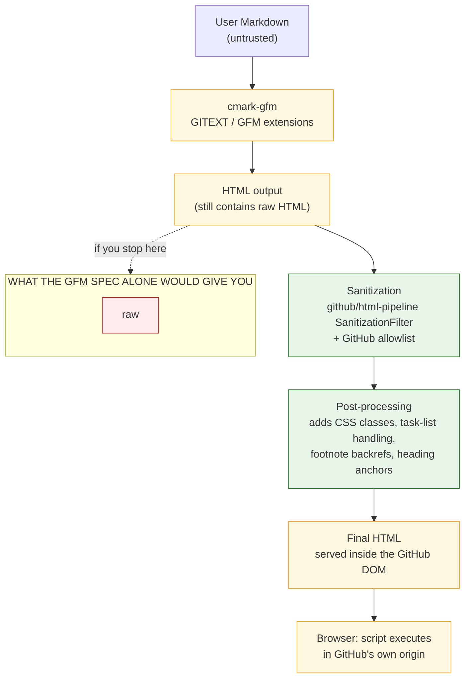

# 02 — GitHub Flavored Markdown in depth

> **Scope.** What GFM adds to CommonMark, what its version history actually is,
> why "the GFM spec" and "how GitHub renders Markdown" are two different
> things, and what we must therefore implement ourselves.

---

## 1. What GFM is

From the GFM spec's own introduction, §1.1
(<https://github.github.com/gfm/>):

> GitHub Flavored Markdown, often shortened as GFM, is the dialect of Markdown
> that is currently supported for user content on GitHub.com and GitHub
> Enterprise.
>
> This formal specification, based on the CommonMark Spec, defines the syntax
> and semantics of this dialect.
>
> GFM is a strict superset of CommonMark. All the features which are supported
> in GitHub user content and that are not specified on the original CommonMark
> Spec are hence known as **extensions**, and highlighted as such.
>
> While GFM supports a wide range of inputs, it's worth noting that GitHub.com
> and GitHub Enterprise perform additional post-processing and sanitization
> after GFM is converted to HTML to ensure security and consistency of the
> website.

That last paragraph is the most important sentence in the document for our
purposes, and it is the thesis of §4 below.

| Property | Value (verified 2026-10-06) |
|----------|------------------------------|
| Spec URL | <https://github.github.com/gfm/> |
| Spec version | **0.29-gfm**, dated **2019-04-06** |
| Base | CommonMark **0.29** (2019-04-06) |
| Reference implementation | `cmark-gfm` (fork of `cmark`), <https://github.com/github/cmark-gfm> |
| Executable examples | **672** total, of which only **24** are extension examples |
| Licence | CC-BY-SA 4.0 |
| Extensions | 5 (tables, tasklist, strikethrough, autolink, tagfilter) |

---

## 2. Version history — the surprising part

### 2.1 The *specification* has been frozen since 2019

| Date | Spec version | Base CommonMark |
|------|--------------|-----------------|
| 2015 | GFM spec 1.0.0 era | CommonMark 0.27/0.28 era, plus GitHub's own constructs |
| 2016-07-15 | — | CommonMark 0.26 |
| 2018-06-27 | GFM based on CommonMark 0.28 | 0.28 |
| **2019-04-06** | **0.29-gfm** | **0.29** |
| 2021-06-19 | *(unchanged)* | CommonMark 0.30 released — GFM not updated |
| 2024-01-28 | *(unchanged)* | CommonMark 0.31.2 released — GFM not updated |

The GFM spec's front matter still reads `version: 0.29 / date: 2019-04-06`
(<https://raw.githubusercontent.com/github/cmark-gfm/master/test/spec.txt>).
Seven years and two CommonMark releases later, it has not moved.

This has a concrete, checkable consequence. Compare the HTML-block type 6 tag
list in the two documents:

| Document | Type-6 block tag list |
|----------|----------------------|
| CommonMark **0.30** (2021) | `… nav, noframes, ol, optgroup, option, p, param, section, **source**, summary, table, …` |
| CommonMark **0.31.2** (2024) | `… nav, noframes, ol, optgroup, option, p, param, search, section, summary, table, …` |
| GFM **0.29-gfm** (2019) | `… nav, noframes, ol, optgroup, option, p, param, section, **source**, summary, table, …` |

So GFM-the-spec has `source` and lacks `search`. The `cmark-gfm`
*implementation* has already made the 0.31 change — release `0.29.0.gfm.4`
(2022-05-31) reads:

> Remove `source` from list of HTML block elements per
> <https://github.com/commonmark/commonmark-spec/pull/710>

**The implementation has diverged from the specification.** That is unusual,
worth knowing, and it means "GFM 0.29-gfm" is not a single well-defined thing.

### 2.2 `cmark-gfm` release history and the CVE record

`cmark-gfm` has been shipping security fixes at a steady clip. This is the most
useful single argument that Markdown parsing is a security-critical activity,
and it is the empirical basis for our pathological-input testing in
`04-parsing-internals/05-performance-and-limits.md`.

| Release | Date | Notable content |
|---------|------|-----------------|
| 0.29.0.gfm.13 | 2023-07-21 | Docs/normalisation only |
| 0.29.0.gfm.12 | 2023-07-13 | **Fixed polynomial time complexity issues** — [GHSA-w4qg-3vf7-m9x5](https://github.com/github/cmark-gfm/security/advisories/GHSA-w4qg-3vf7-m9x5); added CodeQL |
| 0.29.0.gfm.11 | 2023-04-06 | Re-release; more **polynomial time complexity** fixes — GHSA-w4qg-3vf7-m9x5 |
| 0.29.0.gfm.10 | 2023-03-31 | **Polynomial time complexity** fixes — [GHSA-r8vr-c48j-fcc5](https://github.com/github/cmark-gfm/security/advisories/GHSA-r8vr-c48j-fcc5) |
| 0.29.0.gfm.8 | 2023-01-25 | Quadratic-complexity work; API deprecation |
| 0.29.0.gfm.7 | 2023-01-23 | **Fixed CVE-2023-22486**, a polynomial-time DoS in `cmark-gfm` — [GHSA-r572-jvj2-3m8p](https://github.com/github/cmark-gfm/security/advisories/GHSA-r572-jvj2-3m8p) |
| 0.29.0.gfm.6 | 2022-09-15 | **Polynomial-time DoS in the autolink extension** — [GHSA-cgh3-p57x-9q7q](https://github.com/github/cmark-gfm/security/advisories/GHSA-cgh3-p57x-9q7q) |
| 0.29.0.gfm.5 | 2022-08-25 | `xmpp:` and `mailto:` in the autolink extension |
| 0.29.0.gfm.4 | 2022-05-31 | Removed `source` from HTML block elements |
| 0.29.0.gfm.3 | 2022-03-03 | **Heap memory corruption via integer overflow** — [GHSA-mc3g-88wq-6f4x](https://github.com/github/cmark-gfm/security/advisories/GHSA-mc3g-88wq-6f4x) |
| 0.29.0.gfm.1 | 2021-09-14 | **DoS in the table extension** — [GHSA-7gc6-9qr5-hc85](https://github.com/github/cmark-gfm/security/advisories/GHSA-7gc6-9qr5-hc85) |
| 0.29.0.gfm.0 | 2019-04-08 | "Update to 0.29.0 base." |
| 0.28.3.gfm.19/18 | 2018-10-17 | Out-of-bounds read in strikethrough matcher; recursion limit in autolink extension; **match strikethrough more strictly**; default to safe operation |
| 0.28.3.gfm.13 | 2018-08-10 | **Fix pathological nested list parsing** (Phil Turnbull) |
| 0.28.3.gfm.10/9 | 2018-08-10 | **DoS parsing references**; **DoS parsing nested links** |
| 0.28.3.gfm.7 | 2018-08-10 | "Strikethrough characters do not disturb regular emphasis processing" |

Read that table as a whole and a clear theme emerges: **every extension added to
a Markdown parser introduced a new DoS class.** Tables → GHSA-7gc6-9qr5-hc85.
Autolinks → GHSA-cgh3-p57x-9q7q. Strikethrough → out-of-bounds read.
Nested lists → pathological parse. This is not cmark's fault; it is the nature
of the problem.

### 2.3 "GFM is now a W3C Community Group spec" — verified and **rejected**

This claim circulates. We checked it. **It is false as of 2026-10-06.**

Evidence gathered:

1. `https://www.w3.org/community/gfm/` returns **HTTP 404** ("Page not found |
   Community and Business Groups").
2. The W3C Community Group directory, `https://www.w3.org/community/groups/`,
   lists **194 current Community Groups**. We extracted every `data-title`
   attribute. **Zero** of them match `/gfm|markdown|flavored/i`. The full list
   runs from "WebAssembly Community Group" to "Course extension Community Group"
   and contains no GFM group.
3. The W3C CG reports directory, `https://www.w3.org/community/reports/`,
   contains **zero** occurrences of the substrings `gfm` or `markdown`.
4. `https://www.w3.org/TR/gfm/` returns 404.
5. The Wayback Machine availability API reports **no archived snapshots** for
   either `w3.org/community/gfm/` or `github.com/w3c/gfm`.
6. `github.com/w3c/gfm` returns 404, and a GitHub repository search for `gfm`
   scoped to `org:w3c` returns `total_count: 0`.

**Conclusion:** there is no W3C GFM Community Group, and there never was one at
that URL. GFM's governance is entirely GitHub's, through the `github/cmark-gfm`
repository and the `github.github.com/gfm` site.

There is a related, *true* claim worth recording, because it explains the
freeze. In February 2025, in the arguments for calling CommonMark 1.0, a
participant wrote that GitHub "has abandoned staying in sync with CommonMark"
and footnoted it with "They have abandoned their CommonMark-based GFM spec"
(<https://github.com/commonmark/commonmark-spec/issues/788>). Independently,
the same issue notes that GitHub's supported syntax "for repository `.md` files,
for Issue descriptions/comments, and as implemented by their REST API, differ."
**GFM is not one dialect even inside GitHub.** See §5.

---

## 3. The five extensions, in detail

Counting the executable examples in each extension section of `spec.txt`
(verified 2026-10-06):

| Extension | Section | Examples |
|-----------|---------|----------|
| Tables | §4.10 Tables (extension) | **8** |
| Task list items | §5.3 Task list items (extension) | **2** |
| Strikethrough | §6.5 Strikethrough (extension) | **2** |
| Autolinks (literal) | §6.9 Autolinks (extension) | **11** |
| Disallowed Raw HTML (tagfilter) | §6.11 Disallowed Raw HTML (extension) | **1** |
| **Total** | | **24** |

**24 examples.** That is 3.6% of the GFM suite. For comparison, the CommonMark
`Emphasis and strong emphasis` section has 132 examples *by itself*. Whatever
you think of GFM, its extension surface is barely specified by test.

### 3.1 Tables

GFM enables the `table` extension, adding a new leaf block. Normative content
(paraphrased from §4.10):

- A table is a header row, a **delimiter row**, and zero or more data rows.
- Cells contain arbitrary text in which **inlines are parsed**, separated by
  pipes (`|`). Leading/trailing pipes are optional. Spaces around pipes and cell
  content are trimmed.
- **Block-level elements cannot be inserted in a table.**
- The delimiter row's cells contain only hyphens, optionally with a leading
  and/or trailing colon, indicating left / right / center alignment.
- Cells in one column need not match length.
- A pipe inside a cell must be escaped as `\|`, *including inside other inline
  spans*.
- The table is broken at the first empty line, or the start of another
  block-level structure.

```markdown
| foo | bar |
| --- | --- |
| baz | bim |
```

```html
<table>
<thead>
<tr>
<th>foo</th>
<th>bar</th>
</tr>
</thead>
<tbody>
<tr>
<td>baz</td>
<td>bim</td>
</tr>
</tbody>
</table>
```

Alignment variant:

```markdown
| abc | defghi |
:-: | -----------:
bar | baz
```

```html
<table>
<thead>
<tr>
<th align="center">abc</th>
<th align="right">defghi</th>
</tr>
</thead>
<tbody>
<tr>
<td align="center">bar</td>
<td align="right">baz</td>
</tr>
</tbody>
</table>
```

Three engineering notes:

1. **`align` is deprecated HTML.** `<th align="center">` still works everywhere
   but is presentational. We should render alignment via CSS classes on our own
   markup while accepting `align` when validating. The GFM spec permits
   `CMARK_OPT_TABLE_PREFER_STYLE_ATTRIBUTES` (release `0.28.3.gfm.13`) as a
   `cmark-gfm` extension toggle for preferring CSS — evidence that even GitHub
   found this unsatisfactory.
2. **The `\|` escape rule is a CommonMark change, not an addition.** It is the
   exact conflict jgm described in the extension thread: in the two-phase model,
   the block phase cannot know whether a `|` inside `` `a|b` `` is a separator.
   GFM's answer is that `\|` is the only separator. This makes GFM tables
   incompatible with CommonMark code spans containing pipes.
3. **Cells are leaf content, not blocks.** A cell cannot contain a list or a
   nested table. This is a hard constraint and it is what makes the extension
   tractable.

### 3.2 Task list items

GFM §5.3 defines a task list item as a list item whose first block is a
paragraph beginning with a task list item marker and at least one whitespace
character before other content.

A **task list item marker** is: an optional number of spaces, `[`, either a
whitespace character or `x`/`X`, and `]`.

- Whitespace inside the brackets ⇒ unchecked; `x`/`X` ⇒ checked.
- Rendered as a semantic checkbox element — in HTML, `<input type="checkbox">`.
- The spec explicitly declines to define interaction: implementors are free to
  render them disabled or immutable, or to wire up dynamic checking.
- The reference output uses `disabled`:
  `<input disabled="" type="checkbox">` and
  `<input checked="" disabled="" type="checkbox">`.

```markdown
- [ ] foo
- [x] bar
```

```html
<ul>
<li><input disabled="" type="checkbox"> foo</li>
<li><input checked="" disabled="" type="checkbox"> bar</li>
</ul>
```

**Only 2 examples in the entire spec section.** Yet task lists are arguably the
most-used GFM extension in the wild (every issue tracker, every README).

**Security note for a viewer:** the reference output is `<input type="checkbox">`.
If we render interactive checkboxes inside a document, we are creating form
controls in a document view. They must be `disabled` by default and must be
rendered by us, not passed through raw HTML. See `research/11-security/`.

### 3.3 Strikethrough

GFM §6.5: strikethrough is text wrapped in two tildes, producing `<del>`.

```markdown
~~Hi~~ Hello, world!
```

```html
<p><del>Hi</del> Hello, world!</p>
```

And like emphasis, a new paragraph stops it:

```markdown
This ~~has a

new paragraph~~.
```

```html
<p>This ~~has a</p>
<p>new paragraph~~.</p>
```

Only **2 examples**. The interesting engineering is invisible in the spec:
`cmark-gfm` release `0.28.3.gfm.7` records "Strikethrough characters do not
disturb regular emphasis processing", and `0.28.3.gfm.18` records "Match
strikethrough more strictly". This means `~` is a **third delimiter type in the
CommonMark delimiter stack**, participating in `openers_bottom` indexing — which
is why the spec text can be so short. See
[`../04-parsing-internals/03-inline-parsing.md` §7](../04-parsing-internals/03-inline-parsing.md).

Note the historical wart: `cmark-gfm` release `0.28.3.gfm.13` added
`CMARK_OPT_STRIKETHROUGH_DOUBLE_TILDE` "for redcarpet compatibility", because
early GitHub *did* allow single-tilde strikethrough. The published spec says
two tildes. We follow the spec.

### 3.4 Autolinks (extension)

GFM §6.9 recognises autolinks without `<` `>`, "although they will be recognized
under a smaller set of circumstances". Full normative content:

- **Preconditions.** All such autolinks can only come at the beginning of a
  line, after whitespace, or after any of the delimiting characters `*`, `_`,
  `~`, `(`.
- **Extended www autolink.** Recognised when the text `www.` is followed by a
  valid domain. A valid domain consists of segments of alphanumerics,
  underscores (`_`) and hyphens (`-`) separated by periods. There must be at
  least one period, and **no underscores may be present in the last two
  segments**. The scheme `http` is inserted automatically.
- **Path.** After a valid domain, zero or more non-space, non-`<` characters may
  follow.
- **Trailing punctuation.** `?`, `!`, `.`, `,`, `:`, `*`, `_`, `~` are not part of
  the autolink, though they may appear in its interior.
- **Parentheses.** When an autolink ends in `)`, scan the entire autolink for the
  total number of parentheses; if there are more closers than openers, the
  unmatched trailing parentheses are not part of the autolink.

Plus a **URL and email autolink** form (the `cmark-gfm` 0.29.0.gfm.5 release
notes "Added `xmpp:` and `mailto:` support to the autolink extension").

```markdown
Visit www.commonmark.org.

Visit www.commonmark.org/a.b.
```

```html
<p>Visit <a href="http://www.commonmark.org">www.commonmark.org</a>.</p>
<p>Visit <a href="http://www.commonmark.org/a.b">www.commonmark.org/a.b</a>.</p>
```

This extension is the single most expensive one to get right. It has been the
subject of two separate DoS advisories in `cmark-gfm`
(GHSA-cgh3-p57x-9q7q, and the "limit recursion in autolink extension" change in
`0.28.3.gfm.19`). **Design implication:** implement autolink-literal detection
as a bounded, single-pass scan with a hard character budget, never as a
backtracking regex.

### 3.5 Disallowed Raw HTML (tagfilter)

GFM §6.11, the `tagfilter` extension. The following nine tags are filtered when
rendering HTML output:

```html
<title>  <textarea>  <style>  <xmp>  <iframe>
<noembed>  <noframes>  <script>  <plaintext>
```

Filtering is done by **replacing the leading `<` with the entity `&lt;`**.
All other tags are left untouched.

The spec gives the rationale: these tags "change how HTML is interpreted in a way
unique to them (i.e. nested HTML is interpreted differently), and this is usually
undesireable in the context of other rendered Markdown content."

```markdown
<strong> <title> <style> <em>
```

```html
<p><strong> &lt;title> &lt;style> <em></p>
```

**One example. Nine tags.** This is the single most security-relevant extension
in the entire Markdown ecosystem, and it has one test case.

**This is not sanitisation.** It is nine string replacements. It does not stop
``, `<a href="javascript:alert(1)">`, `<form>`,
`<object>`, `<embed>`, `style` attributes, or any of the other several hundred
vectors in the OWASP XSS filter evasion cheat sheet. §4 explains what GitHub
actually does on top of this.

---

## 4. GFM-the-spec vs GitHub-in-production

This is the most important section in this document for our project.

### 4.1 The layering of GitHub's rendering pipeline



The GFM spec itself warns about this (§1.1, quoted in §1 above): GitHub
"perform[s] additional post-processing and sanitization after GFM is converted
to HTML."

### 4.2 What GitHub's sanitiser actually is

GitHub renders Markdown through [`github/markup`](https://github.com/github/markup)
into an HTML AST, then runs it through
[`github/html-pipeline`](https://github.com/github/html-pipeline)'s
`SanitizationFilter`. The security model is **allowlist**, not blocklist:

- **Tags:** a fixed allowlist of elements. Everything else is *dropped or
  unwrapped*, not escaped-and-passed-through.
- **Attributes:** per-tag allowlists. `class` is permitted on a small set of
  elements; `style` is not permitted at all in most contexts; all `on*` handlers
  are removed.
- **URLs:** a protocol allowlist. `javascript:`, `data:` (with exceptions),
  `vbscript:` are rejected on `href`/`src`.
- **Comments:** removed.

The difference in kind:

| | GFM `tagfilter` | GitHub's sanitiser | What a viewer needs |
|---|---|---|---|
| Model | 9-element blocklist | Allowlist of tags + attrs + protocols | Allowlist |
| Unknown tag | **Passed through** | Dropped | Dropped |
| `onerror=`, `onclick=` | Passed through | Removed | Removed |
| `href="javascript:…"` | Passed through | Rejected | Rejected |
| `style="…"` | Passed through | Removed | Removed |
| `<!-- … -->` | Passed through | Removed | Dropped |
| Effect of bypass | Full XSS | — | — |

**A viewer that implements "GFM" as "CommonMark + the 5 extensions" and nothing
else is trivially exploitable.** The `tagfilter` extension will not save you. It
escapes `<script>` and does nothing else. This is the single most important
security fact in this entire research folder, and it is why
`docs/adr/0005-security-baseline-xss-sanitization.md` cannot be deferred.

### 4.3 What GitHub adds on top (presentation layer)

Beyond sanitisation, GitHub's pipeline post-processes the HTML. Observed and
documented behaviours:

| Behaviour | Detail | Relevance to us |
|-----------|--------|------------------|
| **Heading anchors** | Every heading gets an `id` (a slug) and an anchor link, so `](#my-heading)` resolves. | **Essential.** CommonMark emits no `id`; this is the #1 "broken on my viewer" complaint. See §7. |
| **Blob permalinks** | Code blocks in repository files get a permalink: a line-number link anchored per line (e.g. `https://github.com/o/r/blob/sha/path#L12`), injected as attributes/`<a>` wrappers on each `<td>`/line. | Only relevant if we ever implement a GitHub-repository view mode. Not in MVP. |
| **Task-list CSS classes** | `<li class="task-list-item">` plus `<input class="task-list-item-checkbox">`. | We should use semantic markup (`<input type="checkbox">` inside a labelled `<li>`), not GitHub's class names. |
| **Footnote backrefs** | GitHub footnotes (which are *not* GFM-spec) render with `↩` backreference links. | N/A — footnotes are not in the GFM spec either. See `03-extension-standards.md`. |
| **Anchored `<a>` wrapper on headings** | `<h2><a id="x" class="anchor" aria-hidden="true" href="#x">…</a></h2>` | We need the `id`; we don't need the wrapper `<a>`. |
| **Emoji substitution** | `:smile:` → image. | Rendering, not parsing. Optional profile extension. |

### 4.4 A note on CSS class names

Anything GitHub does that is *presentational* via class name
(`.task-list-item`, `.anchor`, `.markdown-body`) is **implementation detail, not
spec**. If a Markdown file in the wild contains raw HTML referencing GitHub's
classes, that file is GitHub-specific, not GFM. We should detect and report
those as dialect usage rather than try to emulate them.

---

## 5. GFM is not one dialect, even on GitHub

From issue #788's footnotes (Feb 2025):

> The supported syntax for repository `.md` files, for Issue descriptions/
> comments, and as implemented by their REST API, differ.

So at minimum:

| Surface | Syntax |
|---------|--------|
| Repository `.md` files | CommonMark + GFM extensions, rendered as `.md` |
| Issue / PR bodies | GFM + GitHub-specific **custom HTML tags** in a comment syntax (`<!-- begin-issue ... -->`, `<!-- capture ... -->`, `<!-- ghcomment ... -->`), plus `<!-- octicon -->` |
| Issue / PR comments | A *different*, cross-implementation "**GitHub Comments**" syntax (also used by GitLab and Codeberg), which is **not GFM at all** |
| REST `POST /markdown` | GFM via `cmark-gfm`, with an option for `gfm`, `comment` (`GFM comment`), or `markdown` (plain) modes |
| Wiki | Historically its own dialect; moved to GFM |

This is a real hazard for a viewer: a file copied out of an issue comment will
**not** render the same way. Our profile must have a mode for this.

---

## 6. The W3C question, restated precisely

For the record, so we do not repeat a false claim in our own docs:

> **There is no W3C Community Group for GitHub Flavored Markdown.**
>
> GFM is specified by GitHub, published at <https://github.github.com/gfm/>,
> version 0.29-gfm dated 2019-04-06, implemented in `cmark-gfm`. It has no
> external governance, no W3C incubation, and no stability commitment beyond
> GitHub's.

If GFM were to move under W3C incubation, the resulting Community Group Report
would still carry **no W3C Recommendation**, no normative standing, and no
forward-compatibility guarantee. Community Group output is explicitly
"informative" work produced outside the W3C Process. This is a governance
detail, not a technical one — but it belongs in the record, because "it's being
standardised at the W3C" is a claim we have seen repeated.

### 6.1 A W3C Markdown group *did* exist, and why that is the actual history

The statement above is easy to misread as "the W3C never had anything to do
with Markdown". It did. The real history is more useful to us, because it
explains *why* the community ended up with CommonMark rather than a W3C
specification:

| Date | Event |
|---|---|
| 2012-10-25 | Jeff Atwood publishes *The Future of Markdown*, calling for standardisation |
| 2012-10-26 | **Markdown Community Group is formed at W3C** — Dave Pawson, acting on Atwood's post |
| 2012-11-19 | The group states it is working towards a W3C Note |
| 2019-08-13 | **The group is closed**, redirecting to CommonMark |

The group's own page now reads, verbatim:

> This group was closed on 2019-08-13.
>
> This group is closed - see the [CommonMark](https://commonmark.org/) instead.

Source: <https://www.w3.org/community/markdown/>

So the correct story is: **the W3C attempt to standardise Markdown ran for seven
years and was abandoned in favour of CommonMark, which is a community project
outside the W3C Process.** GFM never had a group because the slot had already
been filled and then vacated.

Why this matters for us: it establishes that CommonMark's governance-by-omission
is not an oversight but a deliberate outcome, and it is the strongest possible
evidence for the position taken in
[`03-extension-standards.md`](03-extension-standards.md) — that no amount of
waiting will produce a post-CommonMark standard, and a project that needs
declared extension behaviour has to publish its own profile.

---

## 7. What GFM still does not give you (and must be our own decision)

GFM is *not* a superset of "what people write in Markdown". These constructs
are extremely common in the wild and are **outside** GFM:

| Construct | Example | Common where | GFM? |
|-----------|---------|--------------|------|
| **Heading IDs** | `# Title {#custom-id}` | Pandoc, Jekyll/Hugo, many static site generators | No |
| **Implicit heading slugs** | `[x](#title)` resolving to `#title` | Every renderer in practice | No (GitHub adds it) |
| **Footnotes** | `text[^1]` + `[^1]: note` | Pandoc, GitHub, Kramdown, MultiMarkdown | No |
| **Math** | `$x^2$`, `$$…$$` | Jupyter, GitHub (as an app), pandoc, Typora | No |
| **Wikilinks** | `[[Page]]`, `[[Page\|Alias]]` | Obsidian, Logseq, Foam, Dendron | No |
| **Front matter** | `---\ntitle: …\n---` | Jekyll, Hugo, Hugo, Obsidian, most SSGs | No |
| **YAML/TOML metadata blocks** | `---yaml … ---` | Pandoc | No |
| **Admonitions / callouts** | `> [!NOTE]` | GitHub Alerts, Obsidian, mkdocs-material | No (GitHub-specific) |
| **Definition lists** | `Term\n: Definition` | Pandoc, PHP Markdown Extra, Kramdown | No |
| **Line blocks** | `\| line` | Pandoc | No |
| **Highlight** | `==marked==` | Obsidian, some Jekyll | No |
| **Abbreviation definitions** | `*[HTML]: HyperText Markup Language` | Pandoc, MultiMarkdown | No |
| **Citation keys** | `[@doe2020]` | Pandoc, Quarto, Zotero | No |
| **Span attributes / fenced divs** | `::: {.note}` | Pandoc | No |
| **Emphasis as `++ins++`** | | Some | No |
| **Single-tilde strikethrough** | `~x~` | Old GitHub, PHP Markdown Extra | No (spec says `~~`) |
| **Markdown Extra** constructs | `{: .class}`, `^superscript^`, `==mark==` | Jekyll/Kramdown | No |

Anything we support from this table is a **profile extension**, and must be
labelled as such. See `03-extension-standards.md`.

---

## 8. Implementing GFM in our profile: the decision list

| Extension | Ship? | Notes |
|-----------|-------|-------|
| Tables (GFM pipes) | **REQUIRED** | Match GFM exactly, including `\|` and "no block-level content in cells". |
| Task list items | **REQUIRED** | Render `disabled` checkboxes by default; make them interactive only if we add edit mode. |
| Strikethrough (`~~`) | **REQUIRED** | As a third delimiter type in the delimiter stack. |
| Autolink literals | **REQUIRED, bounded** | Implement per §3.4 with a hard character budget and no backtracking. Consider `http` vs `https` — GFM says `http`. |
| Disallowed Raw HTML (`tagfilter`) | **REQUIRED but insufficient** | Ship it *plus* a real allowlist sanitiser. The tagfilter is a defence-in-depth layer, not the defence. |
| GFM footnotes | **OPTIONAL profile extension** | Not in the spec; widely needed. GitHub's `remark-gfm` extension covers it (`micromark-extension-gfm-footnote`). Declare it as an extension. |
| Emoji shortcodes | **OPTIONAL** | Rendering concern. Off by default if it slows first paint. |
| GitHub alert callouts | **OPTIONAL** | `> [!NOTE]` blocks. Nice-to-have; declare as extension. |

---

## 9. GFM conformance, measured

We re-ran the **CommonMark 0.31.2** suite against GFM-oriented configurations
to quantify what the extensions cost:

| Configuration | CommonMark 0.31.2 | Pass rate |
|---------------|-------------------|-----------|
| `markdown-it` `'commonmark'` preset (extensions **off**) | 649/652 | 99.54% |
| `markdown-it` default preset (tables, strikethrough, etc. **on**) | 519/652 | 79.60% |
| `marked` 18 with `gfm: true` | 498/652 | 76.38% |

Interpretation, and it is the central argument of `04-conformance-testing.md`:

- **Extensions do not add conformance; they remove it.** Every GFM extension
  introduces syntax that CommonMark interprets differently. A "GFM-conformant"
  parser *cannot* be CommonMark-conformant.
- Therefore our test suite must run **both** suites and both must be reported,
  never collapsed into a single "conformance" number.
- `markdown-it` is the model to follow: it ships a `'commonmark'` preset that is
  ~99.5% clean, and a default preset that is not. Our profile should offer the
  same explicit switch.

### 9.1 How to test GFM specifically

The GFM spec's own `spec.txt` (672 examples) can be extracted with the same
mechanism as CommonMark's. `cmark-gfm`'s `test/CMakeLists.txt` wires it into
CTest as `spectest_executable`:

```bash
python test/spec_tests.py --no-normalize --spec test/spec.txt --program src/cmark-gfm
```

Note the `--no-normalize` flag: the GFM suite is normalised *during* generation
into HTML, and additional suites exist for the parts a single HTML comparison
cannot express:

```bash
add_test(spectest_executable ...)          # the 672 examples
add_test(smartpuncttest_executable ...)    # smart punctuation
add_test(roundtriptest_library ...)        # parse -> render -> parse stability
add_test(entity_library ...)               # entity reference table
add_test(pathological_tests_library ...)   # quadratic-behaviour inputs
```

**We should replicate this structure**, especially roundtrip and pathological.
See `04-conformance-testing.md` §6.

---

## 10. Practical guidance for the viewer

1. **Target CommonMark 0.31.2 as the floor and GFM 0.29-gfm as the practical
   target.** They disagree about `source` vs `search`; choose CommonMark's newer
   list and note the divergence, because real-world files are far more likely to
   contain `<source>` inside a fenced code block than as a live tag.
2. **Never treat the GFM spec as a security model.** Nine tags is not a
   sanitiser.
3. **Always sanitise, with an allowlist.** See `research/11-security/`.
4. **Add heading slugs.** Not in the spec, required by reality.
5. **Do not implement GitHub's class names or permalink markup.** They are
   implementation detail.
6. **Be honest in the About box**: "CommonMark 0.31.2 + GFM 0.29-gfm + Siyana
   profile 1.0". Not "Markdown".

---

## Sources

All fetched 2026-10-06.

- GFM spec (0.29-gfm, 2019-04-06): <https://github.github.com/gfm/>
- GFM spec source (used for all counts above): <https://raw.githubusercontent.com/github/cmark-gfm/master/test/spec.txt>
- `cmark-gfm` README: <https://raw.githubusercontent.com/github/cmark-gfm/master/README.md>
- `cmark-gfm` releases (incl. all CVE/GHSA links): <https://github.com/github/cmark-gfm/releases>
- `cmark-gfm` CTest wiring (spec/smartpunct/roundtrip/entity/pathological suites): <https://raw.githubusercontent.com/github/cmark-gfm/master/test/CMakeLists.txt>
- `github/markup` (GitHub's Markdown rendering entry point): <https://github.com/github/markup>
- `github/html-pipeline` SanitizationFilter: <https://github.com/github/html-pipeline>
- CommonMark 0.31.2 spec: <https://spec.commonmark.org/0.31.2/>
- CommonMark 0.30 → 0.31.2 diff (`source` → `search`): <https://spec.commonmark.org/0.31.2/changes.html>
- Issue #788 (GFM abandoned sync; GitHub's dialects differ): <https://github.com/commonmark/commonmark-spec/issues/788>
- `remark-gfm` / `micromark-extension-gfm`: <https://github.com/micromark/micromark-extension-gfm>
- W3C CG directory (194 groups, no GFM): <https://www.w3.org/community/groups/>
- W3C CG reports (no GFM): <https://www.w3.org/community/reports/>
- W3C CG 404 evidence: <https://www.w3.org/community/gfm/> → HTTP 404
- Our conformance measurements: harness at `D:\Dev\Temp\opencode\mdbench\conform.js`,
  Node 24.14.1, `commonmark@0.31.2`, `markdown-it@15.0.2`, `marked@18.1.0`.
