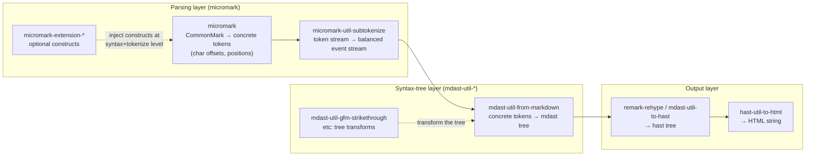

# 03 — Extension standards: is there anything past GFM?

> **Short answer: no.** There is no post-GFM standard. There is no "Extended
> CommonMark". There is no W3C activity. There is a half-dozen de-facto
> extension ecosystems and one very large outlier (Pandoc). This document
> surveys all of them, documents the failed attempts to standardise, and
> proposes the *Siyana Markdown Profile* concept that replaces the missing
> standard for our purposes.

---

## 1. The state of the world, stated plainly

| Layer | Governing body | Live in 2026? |
|-------|----------------|---------------|
| Markdown (2004) | John Gruber, prose | Yes (frozen, unofficial) |
| CommonMark | John MacFarlane, `commonmark-spec` + `talk.commonmark.org` | Yes, **0.31.2, 2024-01-28** |
| GFM | GitHub (`github/cmark-gfm`) | Yes, but **spec frozen at 0.29-gfm (2019-04-06)** |
| Post-GFM standard | — | **Does not exist** |
| Extended CommonMark proposal | — | **Does not exist** (repeatedly discussed, never produced) |
| W3C GFM CG | — | **Does not exist** (verified; see `02-gfm.md` §2.3) |

Everything else is vendor extension or vendor dialect.

### 1.1 The structural reason there is no post-GFM standard

Three independent reasons, each verifiable:

1. **Extension space is not laminar.** Two extensions frequently conflict on the
   same characters. `|` is a GFM table separator; it is also Pandoc's table
   separator *and* Pandoc's plain-text line break; it is `~` in subscript
   extensions. `` ` `` is a code span delimiter everywhere. Any standardisation
   body has to pick winners for an unbounded conflict set.
2. **The two-phase model punishes block extensions.** GFM's own table extension
   already forced a CommonMark change (`\|` must be escaped). jgm explained this
   directly in the extension thread (<https://talk.commonmark.org/t/how-to-move-ahead-with-extending-commonmark/3706>):
   the model requires block structure to be discerned independently of inline
   structure, so a block extension must decide whether a character is structural
   *before* inlines are parsed. Table pipes inside code spans are unresolvable
   at block time, hence the escape requirement.
3. **No governance willing to break things.** Per the "Beyond Markdown" thread
   (jgm, 2018-04-17): being faithful to Gruber is what makes CommonMark
   adoptable, and changing it again would create a third dialect rather than
   convergence. A post-GFM standard would have to either break CommonMark
   compatibility or accept a permanently-ambiguous subset. Standards bodies
   decline both.

**Design implication.** We cannot wait for a standard and we cannot inherit one.
We must *declare* our superset. That declaration is the deliverable of this
document.

---

## 2. Attempted standardisation efforts (and their outcomes)

### 2.1 CommonMark-discuss extension proposals — a documented history of non-progress

| Thread | Date | Posts | Outcome |
|--------|------|-------|---------|
| "Extension spec as part of the CommonMark spec" | 2017-05-07 | **1** | Proposed rules an extension spec should satisfy: documented, togglable, able to render under plain CommonMark unless it explicitly breaks compatibility, and declaring which CommonMark syntax it changes. **No response. Dead.** <https://talk.commonmark.org/t/extension-spec-as-part-of-the-commonmark-spec/2437> |
| "Beyond Markdown" | 2018-04-17 | **64** | jgm sketches a "CommonMark 2" that could be partially backwards-incompatible. Thread participants note CommonMark's ubiquity makes a successor non-starter. **No spec produced.** <https://talk.commonmark.org/t/beyond-markdown/2787> |
| "How to move ahead with extending CommonMark" | 2020-11-26 | **13** | Chris Alley restates the problem. jgm explains the two-phase obstacle and endorses GFM-compatible table extensions as a starting point. Crissov calls for terminology and rules for extensions. **No spec produced.** <https://talk.commonmark.org/t/how-to-move-ahead-with-extending-commonmark/3706> |
| "Extension terminology and rules" / "Extensions" / "Guide for syntax extensions" | referenced from the 2020 thread | — | Referenced as prior art; still no published extension-spec document on the CommonMark site. |
| "Beyond Markdown" — post-1.0 debate | 2018 → 2025 | — | Deferred to a possible v2-alpha, per issue #788. |

**What we can extract from the failure.** The 2017 one-post proposal is
remarkably close to what a real profile specification needs, and every item on
it is adoptable:

| Proposed rule (paraphrased) | We adopt it? |
|-----------------------------|--------------|
| It should have proper documentation | **Yes** — `research/03-specifications/` is that documentation. |
| It should be togglable | **Yes** — profile conformance levels, `03-extension-standards.md` §5. |
| It should be able to render in CommonMark even if ugly, unless explicitly stated to break compatibility | **Yes** — REQUIRED extensions must degrade to CommonMark; BREAKS-COMMONMARK extensions must say so. |
| It should describe which CommonMark syntax it changes | **Yes** — this is the "Declared conflict" column in our table. |

### 2.2 Does an "Extended CommonMark" exist?

**No.** There is no proposal, draft, or design document by that name anywhere in
the CommonMark project, at the W3C, or in any standards body. The closest things
are:

- **`commonmark-spec` issue #788** (open, 2025-02-03), which argues only for
  renaming 0.31.2 to 1.0, not for adding features.
- **jgm's "CommonMark 2" sketch** inside the 2018 "Beyond Markdown" post, which
  is an argument for *simplifying* existing rules rather than adding features.
  Its 64-post thread contains no adopted proposal.

We checked for and did not find: `extended-commonmark`, `commonmark-extensions`,
`ecm`, or any W3C/ISO/IEEE work item on Markdown beyond GFM.

---

## 3. The de-facto extension ecosystems

Three ecosystems have become the de-facto "extension registries". None is a
standard; all three are de-facto standards *within their language*.

### 3.1 markdown-it plugins

Repository: <https://github.com/markdown-it/markdown-it>. The plugin model is
`md.use(plugin[, options])`, where a plugin is `function (md, …)` that mutates
two rule chains:

- **Block rules** (`md.block.ruler`) — a chain of block open/close/tokenize
  functions.
- **Inline rules** (`md.inline.ruler` plus `md.inline.ruler2`) — the second
  chain handles `link`, `image`, `newline`, `escape`, `entity`, plus a fallback
  text rule.

This maps almost exactly onto CommonMark's two-phase model, which is why
markdown-it's `'commonmark'` preset scores 649/652 in our measurement.

Representative plugins relevant to us:

| Plugin | Provides | Notes |
|--------|----------|-------|
| `markdown-it-footnote` | `[^1]` footnotes | The de-facto footnote syntax |
| `markdown-it-task-lists` | `- [ ]` | Frontend-specific checkbox handling |
| `markdown-it-front-matter` | YAML front matter | Uses its own block rule; must run first |
| `markdown-it-emoji` | `:smile:` | Rendering-level |
| `markdown-it-anchor` | heading `id`s + permalinks | We need this; do it ourselves |
| `markdown-it-sub`, `-sup` | `~sub~`, `^sup^` | **Conflicts with GFM `~~strike~~`** |
| `markdown-it-ins` | `++ins++` | |
| `markdown-it-mark` | `==mark==` | |
| `markdown-it-multimd` | MultiMarkdown syntax | |
| `markdown-it-wiki-link` | `[[wikilinks]]` | |
| `markdown-it-kramdown-*` | kramdown compatibility | |
| `markdown-it-deflist` | definition lists | |
| `markdown-it-abbr` | `*[HTML]: HyperText` | |
| `markdown-it-mermaid`, `-plantuml`, `-dot` | diagram fences | Rendering |

**Assessment for us.** The plugin *architecture* is excellent and worth copying
(it's essentially the spec's two-phase model with a hook at each start/continue
/close point). The plugin *catalogue* is a mess of conflicts — `markdown-it-sub`
and GFM strikethrough both want `~`. Any project that enables a broad set of
these ends up with an unmaintainable, undocumented dialect. **We take the
mechanism, not the catalogue.**

### 3.2 remark / micromark and the `micromark-extension-*` family

Two-layer architecture from the `unified` collective:



This is the most principled extension model available today: extensions hook
into the **tokenizer** (syntax + tokenize), producing tokens that the tree
builder then understands. That is strictly more powerful than markdown-it's
block/inline rule chains, and it is why remark's GFM support is a first-class
`micromark-extension-gfm` rather than a plugin stack.

Verified inventory of the `micromark-extension-*` topic (23 public repos,
<https://github.com/topics/micromark-extension>, 2026-10-06), the first-party
ones:

| Package | Starred | Purpose |
|---------|---------|---------|
| `micromark-extension-gfm` | 40 | Umbrella: table, autolink literal, task list, strikethrough, footnote, tagfilter |
| `micromark-extension-directive` | 39 | Generic directives (`:cite[smith04]`) — the attempt at a *unified* extension syntax |
| `micromark-extension-math` | 30 | `$C_L$` math |
| `micromark-extension-frontmatter` | 26 | YAML/TOML front matter |
| `micromark-extension-mdxjs-esm` | 16 | MDX import/export |
| `micromark-extension-mdx-expression` | 13 | MDX `{}` expressions |
| `micromark-extension-gfm-footnote` | 11 | GFM footnotes |
| `micromark-extension-mdx-jsx` | 10 | MDX JSX |
| `micromark-extension-mdxjs` | 10 | MDX |
| `micromark-extension-gfm-autolink-literal` | 9 | Bare autolinks |
| `micromark-extension-gfm-task-list-item` | 7 | Task lists |
| `micromark-extension-gfm-table` | 7 | Tables |
| `micromark-extension-mdx` | 7 | MDX |
| `micromark-extension-gfm-strikethrough` | 3 | `~~strike~~` |
| `micromark-extension-gfm-tagfilter` | 3 | GFM's 9-tag filter |
|| plus `mdast-util-noddity`, `micromark-extension-gemoji`, `micromark-extension-gridtables` (adobe), `micromark-extension-mdx-md`, `micromark-extension-mdx-*` ||

**Note `micromark-extension-directive`.** `remark-directive` is the closest
thing the ecosystem has to a *general* extension mechanism: a generic
`:name[content]{attrs}` syntax that individual extensions register handlers for.
It exists precisely because there is no standard extension syntax. It is
actively used (Quarto is built on it) but it is emphatically not Markdown.

**Assessment for us.** The token-level architecture is the right model and is
covered in `../04-parsing-internals/04-parser-architectures.md` §6(d). The
concrete-token level (byte offsets per token) is enormously valuable for a
viewer, because it enables source mapping, virtual scrolling, and precise error
reporting without a second pass.

### 3.3 Pandoc's Markdown

Pandoc is the outlier: it is a *document converter* whose Markdown dialect is
the most capable in existence, and its manual is effectively the largest
de-facto Markdown extension catalogue ever written.

Source: <https://raw.githubusercontent.com/jgm/pandoc/main/MANUAL.txt>
(manual dated 2026-09-26). We extracted every `### Extension: \`name\`` heading:
**91 distinct extension names** (some duplicated across reader/writer contexts).

Pandoc's stated philosophy (§"Pandoc's Markdown"):

> Markdown is designed to be easy to write, and, even more importantly, easy to
> read: "A Markdown-formatted document should be publishable as-is, as plain
> text, without looking like it's been marked up with tags or formatting
> instructions." — John Gruber
>
> This principle has guided pandoc's decisions in finding syntax for tables,
> footnotes, and other extensions.
>
> There is, however, one respect in which pandoc's aims are different from the
> original aims of Markdown. Whereas Markdown was originally designed with HTML
> generation in mind, pandoc is designed for multiple output formats. Thus,
> while pandoc allows the embedding of raw HTML, it discourages it, and provides
> other, non-HTMLish ways of representing important document elements like
> definition lists, tables, mathematics, and footnotes.

Representative extension list (abridged, 91 total):

| Category | Extensions |
|----------|-----------|
| Structure | `fenced_code_blocks`, `backtick_code_blocks`, `fenced_code_attributes`, `line_blocks`, `fenced_divs`, `native_divs`, `native_spans`, `bracketed_spans`, `markdown_in_html_blocks`, `four_space_rule` |
| Lists | `fancy_lists`, `task_lists`, `definition_lists`, `example_lists`, `startnum`, `lists_without_preceding_blankline` |
| Tables | `simple_tables`, `pipe_tables`, `multiline_tables`, `grid_tables`, `table_captions`, `table_attributes` |
| Headings | `auto_identifiers`, `ascii_identifiers`, `gfm_auto_identifiers`, `header_attributes`, `blank_before_header`, `space_in_atx_header`, `implicit_header_references`, `mmd_header_identifiers` |
| Inline | `strikeout`, `superscript`, `short_subsuperscripts`, `mark`, `emoji`, `smart`, `tex_math_dollars`, `tex_math_gfm`, `tex_math_single_backslash`, `tex_math_double_backslash` |
| Links | `implicit_figures`, `link_attributes`, `mmd_link_attributes`, `autolink_bare_uris`, `wikilinks_title_after_pipe`, `spaced_reference_links`, `shortcut_reference_links` |
| References | `citations`, `footnotes`, `inline_notes`, `abbreviations` |
| Metadata | `yaml_metadata_block`, `pandoc_title_block`, `mmd_title_block`, `raw_markdown` |
| Attributes | `raw_attribute`, `attributes`, `tagging`, `styles`, `header_attributes` |
| Behaviour | `raw_html`, `raw_tex`, `latex_macros`, `all_symbols_escapable`, `intraword_underscores`, `angle_brackets_escapable`, `old_dashes`, `hard_line_breaks`, `ignore_line_breaks`, `east_asian_line_breaks`, `literal_media`, `sourcepos`, `native_numbering`, `xrefs_name`, `xrefs_number`, `amuse`, `ntb`, `gutenberg`, `alerts`, `literate_haskell`, `empty_paragraphs`, `escaped_line_breaks`, `blank_before_blockquote`, `implicit_header_references` |

Pandoc also supports four *reader modes*: `markdown` (default, all extensions),
`markdown_strict` (suppress most differences), `markdown_mmd` (MultiMarkdown
compat), and `commonmark`/`commonmark_x` (CommonMark-conformant).

**Assessment for us.** Pandoc is the best available *catalogue* of what people
actually want from Markdown, and `markdown_strict` vs `markdown` is a good model
for our profile levels. It is a terrible *default* for a viewer: 91 extensions
guarantee conflicts and unpredictable output. We borrow the catalogue (to
prioritise), reject the breadth (to stay maintainable).

### 3.4 Other dialects worth knowing

| Dialect | Distinguishing choices | Relevance |
|---------|------------------------|-----------|
| **GitHub Comments** | Cross-implementation (GitHub, GitLab, Codeberg). `> [!NOTE]` alerts, `<!-- -->`. **Not GFM.** | High — issue threads get pasted into notes. |
| **MultiMarkdown** | Tables, footnotes, citations, abbreviations, metadata. Compatible-ish with Pandoc. | Medium. |
| **PHP Markdown Extra** | `{: .class}`, abbreviations, footnotes, definition lists, `^super^` = mark. | Medium — Jekyll heritage. |
| **Kramdown** (Jekyll's default) | `{: .class}` attributes, ALD, footnotes, `==mark==`, definition lists, header `{#id}`. | Medium — Jekyll sites. |
| **Reddit / Discord / Slack** | Reddit: subreddit/wikilink syntax, superscript. Discord: `` `` `` spoilers, `> ` quotes. Slack mrkdwn: `<http://…>` only, no `[]()` headers. | Low, but Discord's `` `!` `` spoiler is worth noting. |
| **AsciiDoc / reStructuredText** | Not Markdown. Different philosophy (explicit continuation markers). | Only as a reminder that Markdown's readability-first choice is contested. |
| **DocFX / DFM** (Microsoft) | Metadata blocks, xref, alerts. Built on markdig; documented as a GFM superset. | Medium — MS docs. |

---

## 4. Conflicts: why "just enable everything" cannot work

The following conflicts are all real and all break at least one pair. This table
is the concrete justification for a profile rather than a pile of plugins.

| Construct | Conflict A | Conflict B | CommonMark 0.31.2 says |
|-----------|-----------|-----------|--------------------------|
| `~text~` | `markdown-it-sub` subscript | GFM strikethrough uses `~~text~~` | Neither; `~` is plain text |
| `^text^` | `markdown-it-sup` superscript | Nothing | Plain text |
| `\|` | GFM: escaped pipe = literal | Pandoc grid tables: `\|` at line end = line break inside a cell | Plain text |
| `---` at document start | Front matter (`---\nyaml\n---`) | Setext `h2` underline / thematic break | Setext/thematic break (CommonMark never sees front matter) |
| `=` at document start | TOML front matter | Setex `h1` underline | Setext underline |
| `[text](url)` | CommonMark inline link | Pandoc/MultiMarkdown citation / attributes | Inline link |
| `[foo]: /url` | CommonMark reference definition | Pandoc metadata (YAML block) | Reference definition |
| `<https://x>` | CommonMark URI autolink | `<` `>` in HTML if not a valid URI | Autolink |
| `http://x` bare | CommonMark: plain text | GFM autolink literal | Plain text |
| `#` heading + `{#id}` | CommonMark ATX | Pandoc/Jekyll/Kramdown attribute | `{#id}` is heading text |
| `~~~` | CommonMark tilde code fence | Some extensions use tilde fences for anything | Tilde code fence |
| `<!-- -->` | CommonMark HTML block type 2 | Blank-line hack to separate lists | HTML comment block |
| `*text*` intraword | CommonMark: `*` allowed intraword, `_` not | Pandoc `intraword_underscores` changes `_` | `*` yes, `_` no |
| `- [ ]` | GFM task list | Obsidian/dirty checkbox variants | Plain list item |
| `\ ` escapes | CommonMark escapes ASCII punctuation | Pandoc `all_symbols_escapable` | ASCII punctuation only |

**The front-matter row deserves emphasis.** YAML front matter is not an
extension; it is a *precondition* for the document, and it collides with the two
most common Markdown constructs (`---` and `=` underlining). Every tool that
supports it must special-case the first N lines before block parsing begins. This
is exactly the kind of thing a profile must call out as
**BREAKS-COMMONMARK**.

---

## 5. The Siyana Markdown Profile

> **This is our proposal.** It replaces the standard that does not exist. It is a
> *declaration*, not a *discovery*: the viewer says up front exactly which
> constructs it implements, at what level, and what it does with the ones it
> does not.

### 5.1 Definition

A **Siyana Markdown Profile** is a named, versioned superset of CommonMark
0.31.2 that declares, for every construct:

1. Whether it is present,
2. At which conformance **level**,
3. Which **CommonMark sections** it modifies or conflicts with,
4. What it **degrades to** under CommonMark-only mode.

Naming: `SMP 1.0` (Siyana Markdown Profile 1.0), machine-readable as
`"siyana-profile": "1.0"` in a `.siyana-profile` JSON sidecar or a
`<!-- siyana-profile: 1.0 -->` HTML comment at the top of the file. *(Design
proposal — not yet implemented.)*

### 5.2 Conformance levels

| Level | Definition | Test |
|-------|-----------|------|
| **REQUIRED** | Must be implemented. Absence is a release blocker. Absence is a *bug*. | Covered by the profile conformance suite; counted in CI. |
| **OPTIONAL** | May be implemented behind a user setting, off by default. Absence is not a bug. | Feature-detected; UI reports which are active. |
| **UNSUPPORTED** | Deliberately not implemented. The viewer must **detect** the construct and **report** it, never silently mis-render. | Detection test suite asserts the report fires. |
| **BREAKS-COMMONMARK** | Implemented, and its presence necessarily means the document is *not* CommonMark-conformant. Must be reported when active. | Suite shows the CommonMark pass-rate delta when on. |
| **CONFLICT** | Cannot coexist with another extension in the same profile. Selecting both is a configuration error, surfaced at startup. | Profile config validation test. |

The 2017 forum proposal asked for "togglable" and "declares which CommonMark
syntax it changes". Levels REQUIRED/OPTIONAL cover "togglable"; BREAKS-
COMMONMARK covers "declares which syntax it changes".

### 5.3 Profile 1.0 candidate contents

```markdown
| ID  | Construct                        | Level              | CommonMark § touched | Degrades to      |
|-----|----------------------------------|--------------------|----------------------|------------------|
| CM  | All of CommonMark 0.31.2         | REQUIRED           | all                  | itself          |
| G1  | GFM tables (pipes + alignment)   | REQUIRED           | §4 (new leaf block)  | paragraph       |
| G2  | GFM task list items `- [x]`      | REQUIRED           | §5.2 (post-process)  | plain list item |
| G3  | GFM strikethrough `~~x~~`        | REQUIRED           | §6.2 (3rd delimiter) | plain text      |
| G4  | GFM autolink literals            | REQUIRED (bounded) | §6.5 (adds forms)    | plain text      |
| G5  | GFM tagfilter (9 tags)           | REQUIRED           | §4.6, §6.6           | — (security)    |
| P1  | Heading slugs (`# Title` → id)   | REQUIRED           | §4.2 (output only)   | no id           |
| P2  | Heading `{#custom-id}` attributes| OPTIONAL           | §4.2, §4.3          | literal text    |
| P3  | YAML / TOML front matter         | BREAKS-COMMONMARK  | §4.1, §4.3           | `---` becomes   |
|     |                                  |                    |                      | thematic break  |
| P4  | Footnotes `[^1]` / `[^1]: note`  | OPTIONAL           | §6.3 (new link kind)| literal text    |
| P5  | Math `$…$` / `$$…$$`             | OPTIONAL           | §6.1 (like code span)| literal text   |
| P6  | Wikilinks `[[Page]]`             | OPTIONAL           | §6.3 (new link kind)| literal text    |
| P7  | `==highlight==`                  | OPTIONAL           | §6.2 (4th delimiter) | literal text    |
| P8  | GitHub alerts `> [!NOTE]`        | OPTIONAL           | §5.1 (leaf block)    | block quote     |
| P9  | Definition lists `: definition`  | OPTIONAL           | §5.2 (new container) | paragraph       |
| P10 | Emoji shortcodes `:smile:`       | OPTIONAL           | §6.9 (render only)   | literal text    |
| X1  | Subscript `~x~`                  | CONFLICT w/ G3     | —                    | —               |
| X2  | Superscript `^x^`                | UNSUPPORTED        | —                    | literal text    |
| X3  | Attribute blocks `{: .class}`    | UNSUPPORTED        | —                    | literal text    |
| X4  | Smart punctuation                | UNSUPPORTED (opt.) | §6.9                 | literal         |
| X5  | Line blocks `\| line`            | UNSUPPORTED        | —                    | literal text    |
| X6  | Raw HTML *beyond* our allowlist  | UNSUPPORTED        | §4.6, §6.6           | dropped/escaped |
```

Every row is defensible and every row is traceable to a citation in
`02-gfm.md` §7, `§3.3` above, or the Pandoc manual.

### 5.4 What "UNSUPPORTED" means operationally — and why it is the important one

An UNSUPPORTED construct **must be detected and reported**, not silently
mis-rendered. This is the difference between a viewer that is honest and one
that produces confidently wrong output.

Concrete mechanism (design proposal):

1. During block parsing, the parser records any construct it deliberately does
   not implement into a `Notice[]` on the parse result:
   ```ts
   interface ParseNotice {
     kind: 'unsupported-construct';
     feature: 'superscript' | 'attribute-block' | 'line-block' | 'raw-html-blocked' | ...;
     span: SourceSpan;          // byte offsets, from concrete tokens
     line: number; column: number;
     context: string;           // ~40 chars of surrounding source
     suggestion: string;        // human-readable: "install/enable X" or "we render this as literal text"
   }
   ```
2. The viewer surfaces these in a **document diagnostics** panel and, optionally,
   as inline markers in a "strict" render mode.
3. The diagnostics are **not** warnings about the author's file. They are
   statements about *our* capabilities. The wording must make that clear.

This is a genuinely differentiated feature. No mainstream Markdown viewer tells
you "this file uses `^superscript^`, which we do not implement." They just render
`H~2~O` and move on.

### 5.5 What "BREAKS-COMMONMARK" means operationally

Front matter (P3) is the clearest example. Under CommonMark-only mode:

```markdown
---
title: My Note
---
```

`---` is a thematic break. So the file renders as:

```html
<hr />
<h2>title: My Note</h2>
<hr />
```

That is *correct CommonMark*. It is also obviously not what the author meant.
Front matter must therefore be: (a) clearly a profile behaviour, not a CommonMark
one; (b) detectable, so the viewer can say "this file has front matter; SMP 1.0
with front matter is OFF, rendering per CommonMark 0.31.2"; and (c) never
silently "helpful".

**Rule:** a BREAKS-COMMONMARK extension that is OFF must produce byte-identical
output to a CommonMark-only parser. We test this explicitly.

### 5.6 Mode switching

Three modes, exposed in Settings and recorded in the About box:

| Mode | Meaning |
|------|---------|
| **CommonMark 0.31.2** | All REQUIRED extensions *that do not break CommonMark* (G1–G5, P1) still apply, because they are part of what "Markdown" means in 2026. Add a "CommonMark-strict" sub-mode that disables even those, for people who need the pure 652/652. |
| **Siyana Markdown Profile 1.0** | Everything REQUIRED, OPTIONAL extensions per user settings. The default. |
| **Lenient** | Everything on, UNSUPPORTED constructs rendered as closely as we can guess, and a notice logged rather than shown. For "just show me the file" mode. |

**Recommendation:** ship two modes, `CommonMark` and `Profile 1.0`, and
defer `Lenient` to post-MVP. The important behaviour is that switching modes is
**visible and reversible**, with a live notice when a file's rendering changes.

### 5.7 Profile versioning

- Patch (`1.0.1`): bug fixes; no rendering change for conforming input.
- Minor (`1.1`): new OPTIONAL extension, or a BREAKS-COMMONMARK extension
  promoted to OPTIONAL. Existing documents render identically unless the user
  enables the new feature.
- Major (`2.0`): a rendering change for input that was previously valid under
  the old profile. Requires a changelog entry naming every affected construct.

The profile version is embedded in the rendered output (a `data-profile`
attribute on the root element and an HTTP-equivalent header in the Web build)
so that a screenshot or a saved HTML fragment is self-describing.

---

## 6. Extension-ordering and precedence

When two extensions want the same characters, the profile must define a total
order. Our order, highest priority first:

1. **Raw HTML blocks** (CommonMark §4.6) — because block structure wins
   absolutely.
2. **Front matter** (P3) — only at the very start of the document, before any
   block parsing.
3. **Fenced code** — an unterminated fence swallows everything, so the fence
   opener must be recognised before anything inside it.
4. **Other block starts** (thematic break, ATX, tables, alerts).
5. **Backslash escapes** — but *not* inside code spans, fenced code, HTML
   blocks, link destinations, link titles, or info strings (CommonMark §2.2 is
   explicit that escapes work "in all other contexts").
6. **Code spans** — bind more tightly than emphasis and links (CommonMark §6.2
   rule 17).
7. **Autolinks and raw inline HTML**.
8. **Links and images** — then emphasis.
9. **Remaining delimiters** — strikethrough, highlight, math.

This is essentially CommonMark's own rule 17 plus the extension slots. Documenting
it prevents the class of bug where a table swallows a code span containing a
pipe, which is exactly the GFM-vs-CommonMark conflict from §1.1.

---

## 7. Adoption guidance

| We are… | Then you want… |
|---------|---------------|
| writing notes for yourself | SMP 1.0, all defaults. |
| syncing with Obsidian users | add P6 wikilinks; add a `[[Page\|Alias]]` reader; warn on `==highlight==` if P7 off. |
| consuming README files | GFM only is enough. Disable footnotes/math/wikilinks to avoid false positives. |
| publishing docs to a website | Profile with P2 (heading attributes), P9 (definition lists) on. |
| reviewing a GitHub PR / issue | Enable the GitHub-alerts profile (P8) and the GitHub-Comments reader. Expect `>` quotes to be block quotes, not quotes. |
| auditing an untrusted file | CommonMark mode + full sanitiser + all limits at minimum. |

---

## 8. Open questions for `research/15-open-questions/`

1. Do we ship OPTIONAL extensions as separate packages, or one binary with
   runtime flags? Trade-off: startup cost vs. maintainability.
2. Is front matter worth a BREAKS-COMMONMARK slot? (Most notes tools assume it;
   it is also the most damaging collision.)
3. Do we want a "Markdown compatibility" report per file (which profile features
   the file uses)? This is the strongest differentiator and the most work.
4. Should `~~strikethrough~~` and `~subscript~` both be supported via a
   disambiguation rule? We say CONFLICT; is there a rule that works?
   (Candidate: single `~` requires non-space, non-alphanumeric neighbours —
   exactly GFM's "match more strictly" change. **Untested.**)

---

## Sources

All fetched 2026-10-06 unless noted.

- CommonMark discussion forum: <https://talk.commonmark.org/>
- "Extension spec as part of the CommonMark spec" (2017, 1 post): <https://talk.commonmark.org/t/extension-spec-as-part-of-the-commonmark-spec/2437>
- "Beyond Markdown" (2018, 64 posts): <https://talk.commonmark.org/t/beyond-markdown/2787>
- "How to move ahead with extending CommonMark" (2020, 13 posts): <https://talk.commonmark.org/t/how-to-move-ahead-with-extending-commonmark/3706>
- commonmark-spec issue #788: <https://github.com/commonmark/commonmark-spec/issues/788>
- CommonMark 0.31.2: <https://spec.commonmark.org/0.31.2/>
- GFM 0.29-gfm: <https://github.github.com/gfm/>
- markdown-it plugin model: <https://github.com/markdown-it/markdown-it>
- micromark: <https://github.com/micromark/micromark> (v4.0.3)
- `micromark-extension-*` inventory (23 repos, counted): <https://github.com/topics/micromark-extension>
- `remark-directive`: <https://github.com/remarkjs/remark-directive>
- Pandoc manual (dated 2026-09-26; 91 `### Extension:` headings counted): <https://raw.githubusercontent.com/jgm/pandoc/main/MANUAL.txt>
- `cmark-gfm` releases / security advisories: <https://github.com/github/cmark-gfm/releases>
- Babelmark 3: <https://babelmark.github.io/>
- **Negative results** (documented as such): no `extended-commonmark`,
  `commonmark-extensions`, or W3C Markdown work item found. W3C CG directory
  (194 groups) contains no GFM group: <https://www.w3.org/community/groups/>
