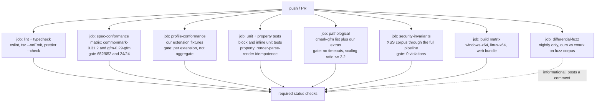

# 04 — Conformance testing

> How you actually *prove* a Markdown parser is correct: the test suites that
> exist, what pass rates realistically look like, what babelmark can and cannot
> tell you, and the CI job design we should adopt.

---

## 1. The primary artefact: `spec.json`

### 1.1 Which URL we used, and why it matters

Two canonical sources exist. **For this research we fetched and used:**

> <https://spec.commonmark.org/0.31.2/spec.json>

Reasons we prefer the `spec.commonmark.org` URL over the GitHub raw URL:

| Criterion | `spec.commonmark.org/0.31.2/spec.json` | `raw.githubusercontent.com/.../0.31.2/spec.json` |
|-----------|---------------------------------------|-----------------------------------------------------|
| Version pinning | **Explicit in the URL** — cannot drift | Implicit in the git ref; a tag move would change content under us |
| Provenance | Exactly the artefact the spec's own test runner is documented against | Same bytes in principle, but the release is what was actually tested |
| Parsing reliability | Parsed cleanly on every attempt | **`JSON.parse` failed with `Unexpected identifier "d"` while the spec.commonmark.org response parsed cleanly, with identical declared length (~140 KB)** |

That last row is a real observation from this research pass, not a hypothetical.
**A fetch-and-parse CI step must validate the shape after parsing**
(`Array.isArray(x) && typeof x[0]?.markdown === 'string'`) and fail loudly rather
than silently testing zero examples.

### 1.2 Shape of the file

```json
[
  {
    "markdown": "\tfoo\tbaz\t\tbim\n",
    "html": "<pre><code>foo\tbaz\t\tbim\n</code></pre>\n",
    "example": 1,
    "start_line": 355,
    "end_line": 360,
    "section": "Tabs"
  },
  // ... 651 more
]
```

| Field | Type | Use |
|-------|------|-----|
| `markdown` | string | Input. Feed to the parser. |
| `html` | string | Expected output, **normalised HTML**. |
| `example` | int | 1-based, contiguous. The spec's own numbering. Cite this in bug reports. |
| `start_line` / `end_line` | int | Line range in `spec.txt`. Lets us link to the exact prose. |
| `section` | string | Section name. Lets us report per-section pass rates. |

**652 examples in 0.31.2** (counted).

Per-section counts (counted, 2026-10-06):

| Section | Examples | Section | Examples |
|---------|----------|---------|----------|
| Tabs | 11 | Inlines | 1 |
| Backslash escapes | 13 | Code spans | 22 |
| Entity and numeric character references | 17 | **Emphasis and strong emphasis** | **132** |
| Precedence | 1 | **Links** | **90** |
| Thematic breaks | 19 | Images | 22 |
| ATX headings | 18 | Autolinks | 19 |
| Setext headings | 27 | Raw HTML | 20 |
| Indented code blocks | 12 | Hard line breaks | 15 |
| Fenced code blocks | 29 | Soft line breaks | 2 |
| **HTML blocks** | **44** | Textual content | 3 |
| Link reference definitions | 27 | Paragraphs | 8 |
| Blank lines | 1 | Block quotes | 25 |
| **List items** | **48** | Lists | 26 |
| | | | |
| **Total** | **652** | | |

### 1.3 HTML normalisation is part of the spec

Because §1.4 of the spec explicitly declines to mandate certain renderings
(percent-encoding of non-ASCII URLs being the named example), a runner must
**normalise** before comparing. The reference `test/normalize.py` (shipped in the
`commonmark-spec` repo) implements the rules. The commonly-implemented subset:

```python
# Behaviourally equivalent to the reference normalize.py for our purposes.
# 1. Normalise line endings.
s = s.replace('\r\n', '\n').replace('\r', '\n')
# 2. Collapse whitespace before '>' and after '<' in *tags* only
#    (NOT inside text or inside <code>/<pre> content).
# 3. Strip leading/trailing whitespace of the whole document.
# 4. Ensure block-level tags are on their own lines.
# 5. Collapse runs of blank lines to a single newline.
```

The three `markdown-it` mismatches we observed (examples 218, 239, 240) were
purely `<blockquote></blockquote>` versus `<blockquote>\n</blockquote>` — a
normalisation artifact, not a parse error. **Our CI must use the reference
normaliser, and our local loop must use the same one**, or we will chase ghosts.

---

## 2. Running the suite against a parser

### 2.1 The canonical runner: `spec_tests.py`

The spec itself documents the invocation:

```bash
python test/spec_tests.py --spec spec.txt --program PROGRAM
```

`spec_tests.py` parses `spec.txt`, extracts the example fences into `spec.json`,
normalises both sides, and runs the program once per example. Useful flags
(have varied by version — verify against the copy in the repo you pin):

| Flag | Effect |
|------|--------|
| `--spec PATH` | Path to `spec.txt` (source of truth). |
| `--program CMD` | The program to test. Called once per example with the Markdown on stdin. |
| `--library-dir DIR` | Use `libcmark` via FFI instead of a subprocess (much faster). |
| `--no-normalize` | Skip normalisation. Use **only** when your renderer already matches the spec's normalisation exactly. |

### 2.2 Per-parser harnesses

| Parser | Language | Install | How to run the suite |
|--------|----------|---------|----------------------|
| **commonmark.js** | JS (WASM/C) | `npm i commonmark` | In-process. `new Parser().parse(md)` -> `new HtmlRenderer().render(doc)`. Reference impl; passes 652/652. |
| **cmark** | C | `brew install cmark` / build | `cmark spec.json` is not a thing; use `spec_tests.py --program cmark`. Reference impl. |
| **cmark-gfm** | C | <https://github.com/github/cmark-gfm> | `python test/spec_tests.py --no-normalize --spec test/spec.txt --program src/cmark-gfm` |
| **markdown-it** | JS | `npm i markdown-it` | Use `markdown-it-tester`, or a 40-line in-process runner. `'commonmark'` preset for the pure suite. |
| **markdown-it-tester** | JS | `npm i markdown-it-tester` | Has a `--spec` mode and CI reporters. Good starting point; its normalisation may differ from the reference — verify. |
| **marked** | JS | `npm i marked` | No first-class spec runner; write a 30-line loop (we did). Set `gfm` explicitly per mode. |
| **Python `commonmark`** | Python | `pip install commonmark` | Reference port of cmark. |
| **Rust `comrak`** | Rust | `cargo add comrak` | `cargo test` runs the built-in spec suite. README badges claim CommonMark 652/652, GFM 670/670. |
| **Rust `pulldown-cmark`** | Rust | `cargo add pulldown-cmark` | Built-in spec tests; SAX/pull-style, no AST by default. |
| **Go `goldmark`** | Go | `go get github.com/yuin/goldmark` | Has `-test` integration with `spec.json`. README claims compliance with CommonMark 0.31.2. |

**For our project the recommendation is simple: write one in-process runner in
TypeScript, ~60 lines, no dependency.** We own an AST; we should test our own
renderer. A subprocess-per-example harness would add ~652 process spawns per run
for no benefit.

Our harness (used to produce the numbers in this folder):

```ts
// packages/core/test/spec.ts
import { readFileSync, writeFileSync } from 'node:fs';
import { parse } from '../src/parse.js';       // -> AST
import { render } from '../src/render.js';     // AST -> HTML
import { normalizeHtml } from './normalize.js';

interface SpecExample {
  markdown: string; html: string;
  example: number; start_line: number; end_line: number; section: string;
}

const spec: SpecExample[] = JSON.parse(
  readFileSync(new URL('./fixtures/commonmark-0.31.2/spec.json', import.meta.url), 'utf8')
);

// Defensive: never "pass" by testing zero examples.
if (!Array.isArray(spec) || typeof spec[0]?.markdown !== 'string') {
  throw new Error('spec.json did not parse to the expected shape');
}

const results = new Map<string, { pass: number; fail: number; failed: number[] }>();
const failing: { example: number; section: string; markdown: string; expected: string; actual: string }[] = [];

for (const t of spec) {
  const section = results.get(t.section) ?? { pass: 0, fail: 0, failed: [] };
  const actual = normalizeHtml(render(parse(t.markdown, { profile: 'commonmark' })));
  if (actual === normalizeHtml(t.html)) {
    section.pass++;
  } else {
    section.fail++;
    section.failed.push(t.example);
    failing.push({ example: t.example, section: t.section, markdown: t.markdown, expected: t.html, actual });
  }
  results.set(t.section, section);
}

const totalPass = [...results.values()].reduce((a, s) => a + s.pass, 0);
const total = spec.length;
console.log(`CommonMark 0.31.2: ${totalPass}/${total} (${(100 * totalPass / total).toFixed(2)}%)`);
if (totalPass !== total) {
  writeFileSync('spec-failures.json', JSON.stringify(failing, null, 2));
  process.exitCode = 1;
}
```

### 2.3 Running against other parsers for differential testing

Differential testing is the highest-value thing we can do that no spec suite
covers. Run **our** parser and **one reference** (`commonmark` npm, or `cmark`)
over:

- the whole CommonMark suite,
- the GFM suite,
- our own corpus,
- and a **fuzz corpus** (see §6).

```ts
const reference = new CommonmarkParser();
const ours = new SiyanaParser();
for (const md of corpus) {
  const a = reference.render(md);
  const b = ours.render(md);
  if (normalize(a) !== normalize(b)) report(md, a, b);
}
```

This catches normalisation disagreements, which are the single largest source of
noise in spec testing.

---

## 3. GFM conformance

### 3.1 Where the GFM suite lives

The GFM spec is a single `spec.txt` inside the reference implementation repo:

> <https://raw.githubusercontent.com/github/cmark-gfm/master/test/spec.txt>

Front matter reads `version: 0.29 / date: 2019-04-06`. There is **no published
`spec.json` for GFM** — that file 404s. You generate it by running `makespec.py`
against `spec.txt`, exactly as for CommonMark.

### 3.2 What we counted in it

We parsed the GFM `spec.txt` example fences directly (2026-10-06):

| Metric | Value |
|--------|-------|
| Total examples | **672** |
| CommonMark-derived | 648 |
| **Extension examples** | **24** |

Per extension:

| Extension | § | Examples |
|-----------|---|----------|
| Tables | 4.10 | **8** |
| Autolinks (literal) | 6.9 | **11** |
| Task list items | 5.3 | **2** |
| Strikethrough | 6.5 | **2** |
| Disallowed Raw HTML (tagfilter) | 6.11 | **1** |

**This is the single most important number in this document.** GFM's entire
extension surface — tables, autolinks, task lists, strikethrough, tag filtering —
is validated by **24 examples**. CommonMark's emphasis section alone has 132.

Consequences for our testing strategy:

1. **We cannot rely on the GFM suite for our extensions.** We must write our own
   tests, derived from the spec prose, not the examples.
2. **We should expect silent divergence.** Every GFM-conformant parser will
   disagree with every other on `www.` autolink edge cases, because 11 examples
   cannot cover the trailing-punctuation and parenthesis rules.
3. **Our "GFM conformance" claim should be worded as:** "implements GFM
   0.29-gfm §4.10, §5.3, §6.5, §6.9, §6.11 as specified; passes all 24
   extension examples; the remaining ambiguities are resolved as documented in
   our profile."

### 3.3 The `cmark-gfm` test suite structure — worth copying

From `cmark-gfm`'s `test/CMakeLists.txt`:

```cmake
add_test(spectest_executable ...)        # the 672 examples
add_test(smartpuncttest_executable ...)  # smart punctuation
add_test(roundtriptest_library ...)      # parse -> render -> parse stability
add_test(entity_library ...)             # entity reference table
add_test(pathological_tests_library ...) # quadratic-behaviour inputs
add_test(html_normalization ...)         # normaliser self-test (doctest)
```

**Copy all six.** In particular:

- **Roundtrip stability** — render to HTML, re-parse, render again, assert
  byte-identical. This catches non-idempotent constructs (a real class of bug in
  fenced-code indentation stripping and in link-reference definitions).
- **Entity table** — assert against the WHATWG
  `https://html.spec.whatwg.org/entities.json`, which the spec names as
  authoritative. Do not hard-code a subset; do not hand-roll a table.
- **Pathological inputs** — see §6.

---

## 4. Babelmark: what it is and what it is not

### 4.1 What it actually is

Babelmark 3 (<https://babelmark.github.io/>) is a **live differential
comparison tool**, not a conformance report. From its own FAQ (text copied from
the original Babelmark 2 FAQ written by John MacFarlane):

> This is a tool for comparing the output of various implementations of John
> Gruber's markdown syntax for plain text documents. The official markdown
> syntax documentation is silent or vague on many issues, and implementations
> have diverged in their interpretations of the syntax. Even when the
> interpretation of the syntax spec is not in question, implementations may have
> bugs. So it is useful to be able to see at a glance how implementations differ
> on various inputs. The hope is that this tool will promote discussion of how
> and whether certain vague aspects of the markdown spec should be clarified.

Mechanically: you POST up to 1000 characters of Markdown to a backend
(`babelmark-proxy`, a .NET app hosted on Azure, per the FAQ), which forwards it
to a registry of self-hosted conversion servers and returns each
implementation's HTML output for side-by-side comparison, optionally normalised
server-side with NUglify. The FAQ notes the 1000-character input limit and that
the implementation list is a registry of volunteer-run servers.

### 4.2 What it is not

- **It is not a pass-rate report.** There is no "this implementation passes
  X% of the spec" page. Output is compared against *other implementations*, not
  against a spec.
- **Results are not reproducible.** The set of online servers changes; the
  normaliser is applied or not depending on the checkbox; server versions change
  without notice.
- **It is not a conformance signal for us.** We cannot submit "Siyana Markdown
  Viewer" as a Babelmark server without running a public HTTP service.

### 4.3 How we should use it anyway

Three genuinely useful applications:

1. **Design-time divergence discovery.** Before writing an extension
   implementation, paste the construct into Babelmark and see how `commonmark`,
   `markdown-it`, `marked`, `cmark-gfm`, and `pandoc` differ. Every surprise is a
   place we need an explicit profile decision.
2. **Differential fixtures.** Its FAQ links curated divergence cases (sublists
   and the four-space rule, negative sublist indentation, right-aligned ordered
   list numbers, heterogeneous lists, partially tight lists, spaces in URLs,
   brackets in emphasis, `%0A%0A` in reference links). These are excellent
   regression fixtures. We should transcribe them into our own corpus with
   attribution.
3. **Sanity check before publishing a profile decision.** If our reading of a
   rule matches the reference implementations, we are probably right.

**Do not** put a Babelmark-derived pass rate in our docs. We do not have one.

---

## 5. Realistic pass rates

### 5.1 What we measured

Harness: `D:\Dev\Temp\opencode\mdbench\conform.js`, Node 24.14.1, against
`https://spec.commonmark.org/0.31.2/spec.json` (652 examples), normalising line
endings and blank-line runs.

| Parser / configuration | Pass | Fail | Pass rate |
|------------------------|------|------|-----------|
| `commonmark@0.31.2` (js reference port, default options) | 652 | 0 | **100.00%** |
| `commonmark@0.31.2` (js, `{ commonmark: true }`) | 652 | 0 | **100.00%** |
| `markdown-it@15.0.2`, preset `'commonmark'` | 649 | 3 | **99.54%** |
| `markdown-it@15.0.2`, default preset (extensions on) | 519 | 133 | **79.60%** |
| `marked@18.1.0`, `{ gfm: true }` | 498 | 154 | **76.38%** |

Caveats, stated honestly:

- These are **JavaScript** implementations. Native parsers (`cmark`, `comrak`,
  `goldmark`, `pulldown-cmark`) generally score higher on the CommonMark suite
  because the suite is derived from the C reference behaviour. `comrak`'s README
  badges claim 652/652 and GFM 670/670.
- Our normaliser is **simpler than the reference `normalize.py`**. It accounts for
  the `markdown-it` 3-failure gap by inspection, but a stricter normaliser would
  change the numbers.
- These numbers reflect versions current at 2026-10-06. Pin them.

### 5.2 What pass rates look like across the ecosystem

| Parser | Language | CommonMark 0.31.x | Notes |
|--------|----------|-------------------|-------|
| `cmark` / `commonmark.js` | C / JS | **100%** | The reference implementations. By construction. |
| `comrak` | Rust | 100% (claimed, README badge) | CommonMark-strict mode is a config flag, not a separate build. |
| `goldmark` | Go | 100% (claimed, README) | Has an explicit `WithUnsafe()` for raw HTML — a security switch built into the API. |
| `md4c` | C | High; not 100% historically | Martin Mitáš has posted detailed benchmark and conformance numbers on `talk.commonmark.org`. |
| `markdown-it` | JS | 99.5% (`commonmark` preset) | The three gaps are normalisation, verified. |
| `micromark` | JS | High, CommonMark by construction | Conformance asserted in CI. |
| `marked` | JS | **76.38% measured** | Deliberately non-conformant by default; has a `gfm`/`pedantic` split. |
| `showdown` | JS | Low by design | Not aiming for CommonMark. |
| `remark`/`unified` | JS | CommonMark via `micromark` | Conformance inherited. |

**Realistic targets for our project:**

| Milestone | CommonMark 0.31.2 pass rate |
|-----------|------------------------------|
| First working parser | 40-60% (blocks only; inline phases unimplemented) |
| Blocks complete, inlines untouched | ~55–65% (132 emphasis + 90 links = 222 examples) |
| Inlines complete, no extensions | **>= 99%** |
| Release candidate | **652/652 = 100%**, gated in CI |
| Post-release | 100% permanently; any regression is a release blocker |

Note the trap: **"blocks complete" is only ~59% of the suite.** 393 of 652
examples involve inline constructs. A team that ships a "working Markdown
viewer" at 60% conformance has a correct block parser and a broken link parser.
Reporting a single number hides this; **always report per-section pass rates.**

### 5.3 The number that actually matters

A parser can pass 652/652 CommonMark examples and still be wrong for a human.
The spec suite tests *interpretation*, not *intent*. Complementary metrics we
should also track:

| Metric | What it catches | How |
|--------|-----------------|-----|
| **Roundtrip stability** | Non-idempotent constructs | render -> parse -> render, assert identical |
| **Idempotence of re-render** | Output that re-parses differently | render twice through the pipeline |
| **Differential vs `cmark`** | Normalisation & renderer disagreements | Fuzz corpus, compare normalised HTML |
| **Pathological timing** | DoS regressions | The `cmark-gfm` pathological list |
| **Sanitiser invariants** | XSS | Fuzz corpus + XSS payload corpus through the *full* pipeline including sanitiser |
| **AST-vs-render agreement** | Renderer bugs | Parse -> render -> parse -> compare ASTs |

The most dramatic example: **`commonmark@0.31.2` passes 652/652 and takes 51
seconds on a 100 KB file of repeated unclosed links.** Conformance and
robustness are independent. See
[`../04-parsing-internals/05-performance-and-limits.md`](../04-parsing-internals/05-performance-and-limits.md) §3.3.

---

## 6. Pathological and fuzz testing

### 6.1 The canonical corpus

`cmark-gfm`'s `test/pathological_tests.py` is the reference corpus. Its shapes,
with the sizes the reference uses:

| Shape | Input construction | Size |
|-------|--------------------|------|
| nested strong emph | `("*a **a " * 65000) + "b" + (" a** a*" * 65000)` | ~1.3 MB |
| many emph closers with no openers | `"a_ " * 65000` | 195 KB |
| many emph openers with no closers | `"_a " * 65000` | 195 KB |
| many link closers with no openers | `"a]" * 65000` | 130 KB |
| many link openers with no closers | `"[a" * 65000` | 130 KB |
| mismatched openers and closers | `"*a_ " * 50000` | 200 KB |
| openers and closers multiple of 3 | `"a**b" + ("c* " * 50000)` | 200 KB |
| link openers and emph closers | `"[ a_" * 50000` | 200 KB |
| pattern `[ (](` repeated | `"[ (](" * 80000` | 320 KB |
| pattern `` repeated | `"" * 160000` | 800 KB |
| hard link/emph case | `"**x [a*b**c*](d)"` | 15 B |
| nested brackets | `"[" * 50000 + "a" + "]" * 50000` | 100 KB |
| nested block quotes | `("> " * 50000) + "a"` | 100 KB |
| **deeply nested lists** | `("  " * i + "* a\n")` for i in 0..999 | ~1 MB |
| U+0000 in input | `"abc\0de\0"` | 7 B |
| backticks | `"e" + "`" * x` for x in 1..4999 | ~12 MB |
| unclosed links A | `"[a](<b" * 30000` | 150 KB |
| unclosed links B | `"[a](b" * 30000` | 120 KB |
| unclosed `<!--` | `"</" + "<!--" * 300000` | 1.5 MB |
| tables | `"aaa\rbbb\n-\v\n" * 30000` | 390 KB |
| reference collisions | hash-collision construction, 50 000 refs | ~1 MB |

**The reference harness runs each case in a subprocess with `TIMEOUT = 5`
seconds** and fails the build if it exceeds the timeout. `many references` is in
an `allowed_failures` set.

**Our version must include every one of these**, because our empirical
measurement shows real parsers *do* regress on them. We found
`commonmark@0.31.2` taking **51 seconds on 100 KB** of `"[a](b"` repeated, and
taking **4 592 ms at 1 000 levels of nested lists** (vs 12.4 ms for
`markdown-it`). Full data in
[`../04-parsing-internals/05-performance-and-limits.md`](../04-parsing-internals/05-performance-and-limits.md) §3.

**Scaling-factor testing is better than absolute thresholds**, because it catches
complexity regressions rather than environment-dependent slowdowns. Our harness:

```ts
// For each pathological shape, build at k and 2k and compare.
const ratio = timeAt(2 * k) / timeAt(k);
// ratio <= 3.2 => ~linear. ratio > 3.2 => super-linear: fail.
```

One trap we hit ourselves: a shape whose base measurement is under ~2 ms
produces a spurious "super-linear" verdict from timer noise. **Refuse to classify
shapes below a minimum base measurement.**

### 6.2 Fuzzing

Spec suites cover the cases the spec author thought of. Fuzzing covers the rest.

**Structure-aware fuzzing (recommended):**

```text
pickBlockType := thematicBreak | atx | setext | fence | indentedCode
               | htmlBlock | linkRefDef | paragraph | blockQuote | listItem
emitBlock(n)   := pickBlockType() + repeat(0..3, emitBlock) + randomPunctuation()
```

Constraints that matter: bound recursion depth (e.g. 12), bound total output
(e.g. 64 KB) so a finding is reproducible, **seed every case** and store the seed
in the failure report, and prefer an AST+HTML structural comparison over golden
files so intentional rendering changes do not break every test.

**Security fuzzing** is a separate corpus with a separate invariant:

> For every input, `sanitize(render(parse(input)))` contains no `script`, no
> `on*=` handler, no `javascript:` URL, no `style` attribute, and no tag outside
> the allowlist.

This must be checked on the **serialised DOM**, not with a regex over the string,
because HTML parsing is where the real bypasses live.

---

## 7. CI job design

### 7.1 The jobs



### 7.2 Required vs informational

**Required (block merge):**

| Job | Gate | Rationale |
|-----|------|-----------|
| `lint` | eslint + `tsc --noEmit` clean | |
| `spec-conformance` | CommonMark **652/652** | The claim "CommonMark-conformant" must be mechanically true. |
| `gfm-conformance` | All **24/24** extension examples | Our GFM claim is narrow; hold it precisely. |
| `profile-conformance` | Every REQUIRED extension fixture passes, reported **per extension** | An aggregate count hides which extension broke. |
| `pathological` | No timeouts; no scaling ratio > 3.2 | DoS regressions are release blockers. |
| `security-invariants` | Zero sanitiser violations | Non-negotiable for a viewer. |
| `build` | Windows + Linux + web all build | |

**Nightly, informational (never blocks, always posts a comment):**

| Job | Purpose |
|-----|---------|
| `differential-fuzz` | Ours vs `cmark` on a fresh fuzz corpus. Surfaces disagreements for triage. |
| `spec-upstream-watch` | Polls `https://spec.commonmark.org/` for a version newer than our pinned one. Posts "CommonMark 0.32 exists; review required". **This is how we avoid silently falling behind.** |
| `gfm-upstream-watch` | Polls the `gfm` spec's `version:`/`date:` front matter in `github/cmark-gfm`. |
| `deps-audit` | `npm audit` + `cargo audit` + OSV scan. |
| `perf-regression` | Throughput on a fixed 10 MiB corpus; posts a delta. Non-blocking, but trended. |

### 7.3 Version pinning, and the fixtures problem

The spec suite must be **vendored**, not fetched at test time. A test that
depends on the network is a test that fails for the wrong reason.

```text
packages/test-fixtures/
├─ commonmark-0.31.2/
│  ├─ spec.json          <- vendored byte-for-byte, with a SHA-256 in the README
│  └─ LICENSE            <- CC-BY-SA 4.0, attribution required
├─ gfm-0.29-gfm/
│  ├─ spec.json          <- generated from test/spec.txt, committed
│  └─ LICENSE
├─ profile-1.0/
│  ├─ required/*.md      <- markdown / expected.html pairs, one file per feature
│  ├─ optional/*.md
│  └─ unsupported/*.md   <- must produce a ParseNotice
└─ pathological/
   └─ cases.json         <- name to generator params, plus absolute-size budgets
```

**Licence note, and it is not optional:** the CommonMark spec is
**CC-BY-SA 4.0**. Vendoring its examples into our repository requires (a)
attribution and (b) share-alike on the adapted material. The cleanest
interpretation, and what we should do: keep `spec.json` **unmodified and
unadapted** in `packages/test-fixtures/`, with a `LICENSE` file containing the
CC-BY-SA notice and a `README.md` recording the exact source URL, version, date,
and SHA-256. Do **not** merge the examples into our own fixture files. This keeps
the share-alike obligation trivially satisfied and keeps the examples updatable by
re-vendoring.

### 7.4 Conformance reporting

CI output, and the same numbers in our docs, generated from the same source:

```text
CommonMark 0.31.2   652/652  100.00%   (v0.31.2, 2024-01-28, sha256:...)
├─ Tabs                              11/11
├─ Backslash escapes                 13/13
├─ Emphasis and strong emphasis     132/132
├─ Links                             90/90
└─ ...

GFM 0.29-gfm        648/648  100.00%   (base)
├─ Tables (extension)                 8/8
├─ Autolinks (extension)            11/11
├─ Task list items (extension)       2/2
├─ Strikethrough (extension)         2/2
└─ Disallowed Raw HTML (extension)   1/1

Siyana Markdown Profile 1.0
├─ REQUIRED    7/7 features, N/N fixtures
├─ OPTIONAL    3 enabled, 4 off (reported, not tested)
└─ UNSUPPORTED 6/6 detectors fire
```

### 7.5 A gate that will actually hold people to the spec

The failure mode of conformance suites is that they get ignored. Three
countermeasures:

1. **Gate on the exact number, not a threshold.** `if (passed !== 652) fail`. A
   ">= 99%" gate is a ratchet that silently permits 6 known failures forever.
2. **Fail loudly on fixture drift.** Hash `spec.json` in CI; if the hash differs
   from the vendored one, the job fails with "you re-vendored; update the
   recorded version, date, and hash, and read the changelog."
3. **Report per-section, prominently.** When the suite goes red, the PR comment
   shows the section, the example number, the input, the expected and actual
   output, and a deep link to the spec prose by `start_line`. A developer should
   be able to go from CI failure to spec text in one click:

   ```markdown
   x example 402 [Emphasis and strong emphasis]
     spec.txt:6372-6380
     in:  *foo**bar**baz*
     exp: <p><em>foo</em><em>bar</em><em>baz</em></p>
     got: <p><em>foo<strong>bar</strong>baz</em></p>
   ```

---

## 8. Metrics we should publish

| Metric | Where |
|--------|-------|
| CommonMark 0.31.2 pass rate | README badge, About box, release notes |
| GFM 0.29-gfm pass rate | README, release notes |
| Profile conformance, per feature | Release notes only (too granular for a badge) |
| Pathological-test pass rate | Internal dashboard |
| Throughput, MiB/s on a 10 MiB corpus | Release notes, perf dashboard |
| Pinned spec versions | README, ADR-0004 |

And an explicit statement of what conformance **does not** mean:

> CommonMark conformance is a claim about parsing, not about safety, not about
> intent, and not about the constructs CommonMark does not define. A
> CommonMark-conformant parser will render `](#my-heading)` as a broken link,
> render `^superscript^` as literal text, and pass `<script>alert(1)</script>`
> straight through to the renderer.

---

## Sources

All fetched 2026-10-06.

- CommonMark spec index: <https://spec.commonmark.org/>
- **Test suite used** (`spec.json`, 652 examples): <https://spec.commonmark.org/0.31.2/spec.json>
- CommonMark 0.31.2 spec source: <https://raw.githubusercontent.com/commonmark/commonmark-spec/0.31.2/spec.txt>
- 0.30 -> 0.31.2 diff: <https://spec.commonmark.org/0.31.2/changes.html>
- `commonmark-spec` repository (contains `test/spec_tests.py`, `test/normalize.py`,
  `test/makespec.py`): <https://github.com/commonmark/commonmark-spec>
- CommonMark reference implementations: <https://github.com/commonmark/cmark>, <https://github.com/commonmark/commonmark.js>
- GFM spec (0.29-gfm, 2019-04-06): <https://github.github.com/gfm/>
- GFM spec source (672 examples; 24 extension examples, our count):
  <https://raw.githubusercontent.com/github/cmark-gfm/master/test/spec.txt>
- `cmark-gfm` test wiring (spec/smartpunct/roundtrip/entity/pathological/normalisation):
  <https://raw.githubusercontent.com/github/cmark-gfm/master/test/CMakeLists.txt>
- `cmark-gfm` pathological corpus and 5-second timeout harness:
  <https://raw.githubusercontent.com/github/cmark-gfm/master/test/pathological_tests.py>
- `cmark-gfm` releases / security advisories: <https://github.com/github/cmark-gfm/releases>
- `comrak` README badges (CommonMark 652/652, GFM 670/670): <https://github.com/kivikakk/comrak>
- `goldmark` README (CommonMark 0.31.2 compliance): <https://github.com/yuin/goldmark>
- `pulldown-cmark` README (100% CommonMark goal): <https://github.com/pulldown-cmark/pulldown-cmark>
- Babelmark 3: <https://babelmark.github.io/> - FAQ: <https://babelmark.github.io/faq>
- markdown-it: <https://github.com/markdown-it/markdown-it> - markdown-it-tester: <https://github.com/markdown-it/markdown-it-tester>
- marked: <https://github.com/markedjs/marked>
- md4c: <https://github.com/mity/md4c> (benchmark/conformance discussion at <https://talk.commonmark.org/>)
- micromark: <https://github.com/micromark/micromark>
- WHATWG entity list named by the spec: <https://html.spec.whatwg.org/entities.json>
- Our own measurements: `D:\Dev\Temp\opencode\mdbench\conform.js` (pass rates),
  `bench2.js` (throughput), `mem.js` (heap), `scaling.js` / `scaling2.js`
  (scaling ratios), `unclosed.js` (DoS), `depth.js` (nesting). Node 24.14.1,
  `commonmark@0.31.2`, `markdown-it@15.0.2`, `marked@18.1.0`.
