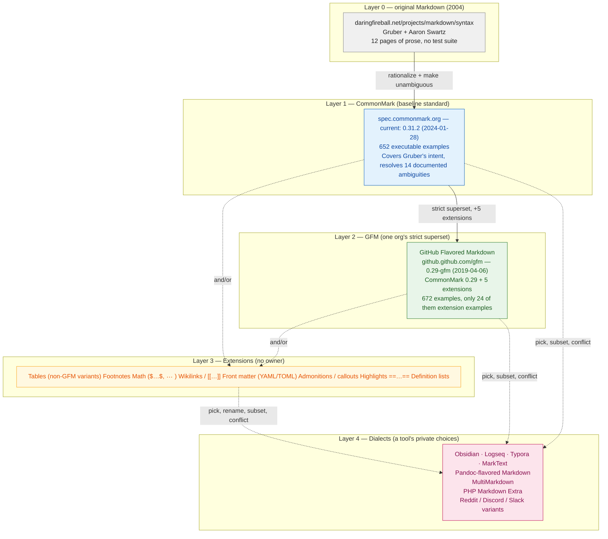
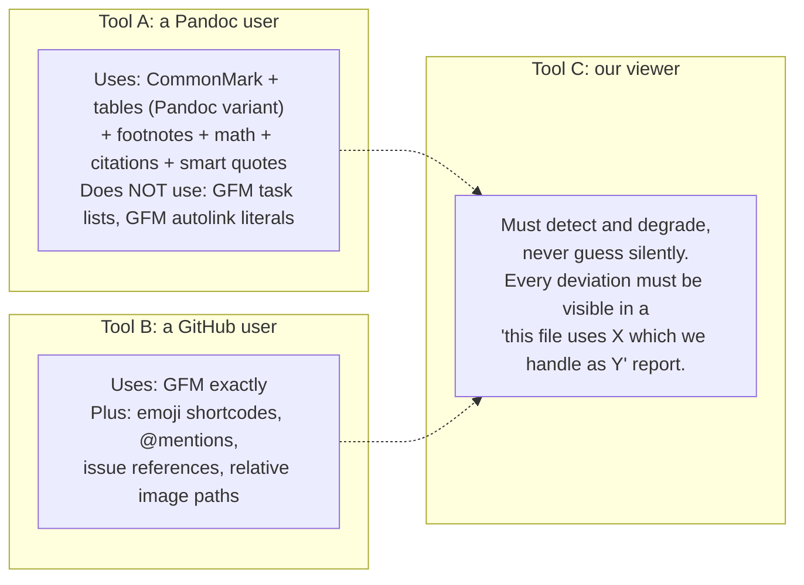

# 03 — Specifications

> Where the line is drawn between *the Markdown standard*, *GitHub's superset*,
> *everybody's extensions*, and *one tool's private dialect* — and how this
> project will declare which of those it implements.

## What this folder answers

| Doc | Question it answers |
|-----|--------------------|
| [`01-commonmark.md`](01-commonmark.md) | What does the CommonMark spec actually say, what does it deliberately leave out, and how do you *claim* to conform to it? |
| [`02-gfm.md`](02-gfm.md) | What does GitHub Flavored Markdown add, and why is "GFM as a spec" materially different from "GFM as GitHub renders it"? |
| [`03-extension-standards.md`](03-extension-standards.md) | Is there a standard past GFM? (Short answer: no.) What are the de-facto extension ecosystems, and what is a *Siyana Markdown Profile*? |
| [`04-conformance-testing.md`](04-conformance-testing.md) | How do you actually prove conformance? The spec suite, GFM section coverage, babelmark, and a CI design. |

## The layering

Markdown is not one thing. It is a stack of nested, mostly-unofficial layers, and
almost every "why does this render differently?" question is really "which layer
did each tool stop at?"

### Layer 0 — original Markdown

John Gruber released Markdown in April 2004 as *two things*: a prose syntax
description and a Perl script, `Markdown.pl`. It is quoted verbatim at the top of
the CommonMark spec's introduction. There is **no test suite** and **no normative
language**. Gruber himself has said the description is not a specification.

CommonMark's own "Why is a spec needed?" section enumerates 14 concrete
ambiguities in Gruber's text (sublist indentation, blank lines before block
quotes, list tightness, marker changes, emphasis precedence, and so on). That
list is worth reading in full — it is the best single argument for why a layered
view of Markdown is necessary.

### Layer 1 — CommonMark

A complete, unambiguous, testable specification of Markdown's *baseline*
constructs. It is the **only** layer with a real conformance story: 652 examples
in `spec.json`, all of them executable, with an official runner
(`test/spec_tests.py`) and two reference implementations (C `cmark`, JS
`commonmark.js`) that pass 100%.

CommonMark is the floor, not the ceiling. A document that is valid under any
other layer is usually *also* valid CommonMark — because, per §2.1,
"any sequence of characters is a valid CommonMark document." CommonMark never
rejects input; it only decides how to interpret it.

### Layer 2 — GFM

GitHub's strict superset of CommonMark, adding exactly five things: tables
(with alignment), task list items, strikethrough, autolink literals, and a
tag-filter ("Disallowed Raw HTML") that neutralises nine dangerous tags.

Two facts that surprise people, both verified in this research:

1. **The published GFM spec is frozen at CommonMark 0.29 (2019-04-06).** It has
   not been updated for CommonMark 0.30 (2021) or 0.31.2 (2024).
2. **GFM adds only 24 executable examples** beyond CommonMark's set. The GFM
   extension surface is barely tested.

GFM-the-spec is also not what GitHub renders — see [`02-gfm.md`](02-gfm.md).

### Layer 3 — Extensions

There is no standards body here. Table *variants* alone (GFM pipes, Pandoc
grid/pipe/multiline/simplest, PHP Markdown Extra, Multimarkdown, AsciiDoc-flavoured)
are mutually incompatible. Everything in this layer is opt-in, per-tool, and
frequently buggy. See [`03-extension-standards.md`](03-extension-standards.md).

### Layer 4 — Dialects

A *dialect* is what you get when one product takes a subset of layers 1–3,
renames constructs, and adds private syntax. Obsidian's `[[wikilinks]]` and
`==highlights==` are not "Markdown"; they are Obsidian. This layer has no
interoperability story at all, which is exactly why a viewer that opens
*arbitrary files from arbitrary people* must not assume it.

## The layering is not a stack — it is a Venn diagram in practice

The diagram above implies a clean containment, and that is a lie. Real-world
behaviour:

**Design implication.** A viewer has no single "Markdown mode" that is correct
for everybody. It needs (a) a *declared baseline*, (b) a *detection pass*, and
(c) an *honest report* when the file uses constructs outside the baseline. See
the profile concept in
[`03-extension-standards.md` §5](03-extension-standards.md#5-the-siyana-markdown-profile).

## Normative language: a caveat before you cite anything

CommonMark 0.31.2 does **not** use RFC 2119 keywords. It has no `MUST` /
`SHOULD` / `MAY` convention, no "Conformance" section, and no notion of
conformance *levels*. The word "must" appears throughout, but in ordinary
lowercase English ("The opening `#` character may be indented 0-3 spaces";
"An indented code block cannot interrupt a paragraph").

Two consequences that matter for this project:

1. **"MUST" in our docs means our own policy, not the spec's.** When we write
   "a viewer MUST sanitize", that is an RFC 2119 statement *we* are making, and
   we should say so explicitly and adopt RFC 2119 in our own docs.
2. **Conformance is binary, not tiered.** An implementation either produces the
   specified HTML for all 652 examples or it is not CommonMark. There is no
   "mostly CommonMark". Anything above CommonMark is an *extension*, and must be
   declared as one. See [`04-conformance-testing.md`](04-conformance-testing.md).

## A quick conformance cheat sheet

| Layer | Has normative spec? | Has executable tests? | Version we should target |
|-------|--------------------|-----------------------|--------------------------|
| Original Markdown | Prose only | No | n/a |
| CommonMark | Yes | Yes, 652 examples | **0.31.2** (2024-01-28) |
| GFM | Yes, but frozen at CM 0.29 | Yes, 24 extension examples | `0.29-gfm` |
| Extensions | No single owner | Only per-tool | Declare per extension |
| Dialects | No | No | **Do not implement.** Degrade gracefully. |

## Sources

- CommonMark spec index (version list, dates): <https://spec.commonmark.org/>
- CommonMark 0.31.2 spec source: <https://raw.githubusercontent.com/commonmark/commonmark-spec/0.31.2/spec.txt>
- CommonMark 0.31.2 test suite (652 examples): <https://spec.commonmark.org/0.31.2/spec.json>
- CommonMark 0.30 → 0.31.2 diff: <https://spec.commonmark.org/0.31.2/changes.html>
- CommonMark discussion forum: <https://talk.commonmark.org/>
- "Beyond Markdown" (jgm on why CommonMark stayed conservative), 64 posts, 2018-04-17: <https://talk.commonmark.org/t/beyond-markdown/2787>
- "How to move ahead with extending CommonMark", 13 posts, 2020-11-26: <https://talk.commonmark.org/t/how-to-move-ahead-with-extending-commonmark/3706>
- "The case for calling it Version 1.0" (commonmark-spec issue #788, open as of 2025-02): <https://github.com/commonmark/commonmark-spec/issues/788>
- Version 0.31.2 release announcement (jgm, 2024-01-29): <https://talk.commonmark.org/t/version-0-31-2-of-the-commonmark-spec-has-been-released/4591>
- GFM spec (0.29-gfm, 2019-04-06): <https://github.github.com/gfm/>
- GFM spec source: <https://raw.githubusercontent.com/github/cmark-gfm/master/test/spec.txt>
- `cmark-gfm` release notes (incl. CVE list): <https://github.com/github/cmark-gfm/releases>
- Babelmark 3: <https://babelmark.github.io/> and <https://babelmark.github.io/faq>

## Facts verified vs inferred

Everything above was fetched during this research pass (2026-10-06). Where a
claim rests on counting rather than reading, it is stated as a count. Where we
reason rather than observe, it is labelled *inference* or *design implication*.
The one place we actively contradicted a common assumption is
[`02-gfm.md`](02-gfm.md#23-gfm-is-now-a-w3c-community-group-spec-verified-and-rejected):
**there is no W3C GFM Community Group.** See that doc for the negative evidence.
