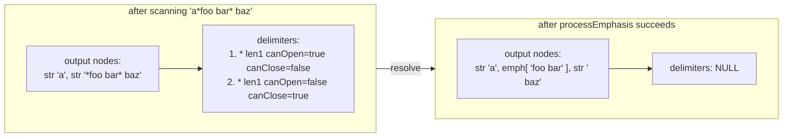

# 03 — Inline parsing deep dive

> The delimiter stack, `openers_bottom`, link resolution, the emphasis
> closer-matching algorithm, and where backslash escapes and character
> references actually resolve. With the spec's own algorithm text cited and
> pseudocode you can transcribe.

---

## 1. Why inlines are the hard half

From the measurement in
[`../03-specifications/01-commonmark.md`](../03-specifications/01-commonmark.md)
§2.5: **222 of the 652 CommonMark examples (34%) are emphasis or links.** The
entire block grammar — every container, every leaf, every precedence rule — is
the other 66%.

If you get blocks perfect and inlines wrong, you have a parser that renders
headings correctly and mangles every second sentence. And unlike block parsing,
inline parsing is where **ambiguity is intrinsic**: `*foo *bar* baz*` has three
defensible readings and the spec spends 17 rules and 132 examples resolving
them.

## 2. What the inline phase receives

Per the spec appendix, phase 2 receives the **post-definition-stripped raw text**
of each leaf block that has inline content:

| Block | Inline-parsed? |
|-------|----------------|
| `paragraph` | yes |
| `atx_heading` | yes (its stripped content) |
| `setext_heading` | yes (its accumulated text) |
| table cell (GFM) | yes |
| `fenced_code`, `indented_code`, `html_block`, `thematic_break` | **no** |
| `list_item` / `block_quote` / `list` / `document` | **no** (containers) |

And it receives, globally, the **link reference map** built in phase 1.

Two immediate consequences:

1. **Code spans, code blocks and raw HTML never see phase-2 processing.** The
   spec is explicit that entity references are "not recognized in code blocks and
   code spans" (§2.4).
2. **Inline parsing of one block cannot affect another.** This is the
   parallelisability guarantee, and the precondition for incremental reparse.

## 3. Precedence of inline constructs

Spec §6.2 rule 17 is the governing statement:

> 17. Inline code spans, links, images, and HTML tags group more tightly than
> emphasis. So, when there is a choice between an interpretation that contains
> one of these elements and one that does not, the former always wins. Thus, for
> example, `*[foo*](bar)` is parsed as `*<a href="bar">foo*</a>` rather than as
> `<em>[foo</em>](bar)`.

And §6.3 lists the rest:

> - Backtick code spans, autolinks, and raw HTML tags bind more tightly than
>   emphasis.
> - The brackets in link text bind more tightly than markers for emphasis.
> - Backslash escapes bind more tightly than everything else except inline code
>   spans and backtick strings.

**So the resolution order within a single scan position is:**

```text
1. backslash escape         (highest precedence, lowest cost — resolved during the scan)
2. character reference      (&amp; &#65; &#x41;) - same scan
3. backtick string / code span
4. autolink <...> / raw inline HTML <...>
5. '[' / '!['
6. '*' / '_' delimiter runs
7. everything else: literal text
```

Items 1–4 are **resolved eagerly during the left-to-right scan**; they never enter
the delimiter stack. Items 5–6 **do** enter the delimiter stack and are resolved
by the two procedures in §5 and §6.

This is a design decision with teeth, and it is what makes the algorithm linear:
the expensive ambiguous constructs (`*`, `_`, `[`, `!`) are pushed onto a stack
and matched afterwards; everything unambiguous is resolved in place.

## 4. Delimiter stack construction

### 4.1 What gets pushed

From the spec appendix (§A.4), paraphrased exactly:

> When we're parsing inlines and we hit either
> - a run of `*` or `_` characters, or
> - a `[` or `![`
>
> we insert a text node with these symbols as its literal content, and we add a
> pointer to this text node to the delimiter stack.
>
> The delimiter stack is a doubly linked list. Each element contains a pointer to
> a text node, plus information about
> - the type of delimiter (`[`, `![`, `*`, `_`)
> - the number of delimiters,
> - whether the delimiter is "active" (all are active to start), and
> - whether the delimiter is a potential opener, a potential closer, or both
> (which depends on what sort of characters precede and follow the delimiters).

**Crucial: runs, not characters.** A delimiter entry has a `length` (the size of
the run). `***foo***` pushes exactly one `*` entry with `length: 3`.

### 4.2 The fields

```ts
type DelimChar = '[' | '!' | '*' | '_' | '~';   // '~' for our GFM profile

interface Delimiter {
  readonly node: InlineTextNode;   // the AST text node whose text we mutate
  readonly char: DelimChar;
  length: number;                 // REMAINING length of the run
  originalLength: number;         // run length at push time; needed by the modulo-3 rule
  active: boolean;                // false => this '[' can no longer open a link
  canOpen: boolean;               // precomputed from flankingness (§4.3)
  canClose: boolean;              // precomputed from flankingness (§4.3)
  readonly prev: Delimiter | null; // doubly linked, per the appendix
  next: Delimiter | null;
}
```

Both `length` and `originalLength` are needed: `length` is decremented as
delimiters are consumed, and `originalLength` is what the modulo-3 rule in §6.3
of the spec refers to ("the delimiter **runs** containing the opening and closing
delimiters").

### 4.3 Flankingness, precomputed

Spec §6.2 defines the three predicates. Paraphrased, precisely:

A **delimiter run** is a sequence of one or more `*` (or `_`) characters that is
not preceded or followed by a non-backslash-escaped character of the same kind.

A run is **left-flanking** if it is

1. not followed by Unicode whitespace, **and** either
2a. not followed by Unicode punctuation, **or**
2b. followed by Unicode punctuation **and** preceded by Unicode whitespace or
    Unicode punctuation.

A run is **right-flanking** if it is

1. not preceded by Unicode whitespace, **and** either
2a. not preceded by Unicode punctuation, **or**
2b. preceded by Unicode punctuation **and** followed by Unicode whitespace or
    Unicode punctuation.

"For purposes of this definition, the beginning and the end of the line count as
Unicode whitespace."

Then the eight open/close rules (§6.2 rules 1–8), which collapse to:

| Char | can open | can close |
|------|----------|-----------|
| `*` | left-flanking | right-flanking |
| `_` | left-flanking AND (not right-flanking OR preceded by punctuation) | right-flanking AND (not left-flanking OR followed by punctuation) |

The `_` asymmetry exists to stop `foo_bar_baz` being emphasised. The spec notes
that many implementations "have also restricted intraword emphasis to the `*`
forms, to avoid unwanted emphasis in words containing internal underscores."
GFM inherits this unchanged.

**In 0.31.2, `Unicode punctuation character` includes general category `S`.** That
is why `*$alpha*` is not emphasis (the `$` is punctuation) but was in 0.30 — one
of the three substantive changes in the 0.31 release, per jgm's announcement at
<https://talk.commonmark.org/t/version-0-31-2-of-the-commonmark-spec-has-been-released/4591>.

Implementation note: classify each character **once** into
`Whitespace | Punctuation | Other` with a lookup table, and cache it. The
flankingness test is then pure comparisons on the previous/next character class.

### 4.4 The scan

```ts
interface InlineParserState {
  output: InlineNode[];                  // the nodes produced so far
  delimiters: Delimiter | null;          // head of the doubly linked stack
  linkRefs: Map<string, LinkRefDef>;
  refs: ActiveReference[];               // link label -> text node mapping
}

function parseInlines(raw: string, state: ParseState): InlineNode[] {
  const s: InlineParserState = {
    output: [], delimiters: null, linkRefs: state.linkRefs, refs: []
  };
  let pos = 0;

  while (pos < raw.length) {
    const ch = raw[pos];

    switch (ch) {
      // ---- 1. backslash escape (highest precedence) ----------------------
      case '\\': {
        const next = raw[pos + 1];
        if (next !== undefined && isAsciiPunctuation(next)) {   // §2.3
          appendText(s, next);                                 // the escape vanishes
          pos += 2;
        } else if (next === '\n') {
          appendNode(s, hardBreakNode());                       // §6.7
          pos += 2;
        } else {
          appendText(s, '\\');                                  // literal backslash
          pos += 1;
        }
        break;
      }

      // ---- 2. character reference ----------------------------------------
      case '&': {
        const m = matchCharRef(raw, pos);                        // §2.4
        if (m) {
          appendText(s, decodeCharRef(m));                       // §10
          pos = m.end;
        } else { appendText(s, '&'); pos += 1; }
        break;
      }

      // ---- 3. backtick string / code span --------------------------------
      case '`': {
        const run = countRun(raw, pos, '`');                     // a "backtick string"
        const close = findClosingBacktickRun(raw, pos + run, run);
        if (close !== -1) {
          appendNode(s, codeSpanNode(normaliseCodeSpan(raw.slice(pos + run, close))));
          pos = close + run;
        } else {
          appendText(s, '`'.repeat(run));                        // literal backticks
          pos += run;
        }
        break;
      }

      // ---- 4. autolink / raw inline HTML ---------------------------------
      case '<': {
        const m = matchAutolink(raw, pos) ?? matchInlineHtml(raw, pos);  // §6.5, §6.6
        if (m) { appendNode(s, m.node); pos = m.end; }
        else { appendText(s, '<'); pos += 1; }
        break;
      }

      // ---- 5. link/image openers -----------------------------------------
      case '!':
        if (raw[pos + 1] === '[') {
          appendText(s, '![');
          pushDelim(s, { char: '!', length: 1, canOpen: true, canClose: false });
          pos += 2;
        } else { appendText(s, '!'); pos += 1; }
        break;
      case '[':
        appendText(s, '[');
        pushDelim(s, { char: '[', length: 1, canOpen: true, canClose: false });
        pos += 1;
        break;

      // ---- 6. emphasis delimiter runs ------------------------------------
      case '*':
      case '_': {
        const run = countUnescapedRun(raw, pos, ch);
        const { before, after } = neighbourClasses(raw, pos, pos + run);
        const leftFlank  = isLeftFlanking(before, after);
        const rightFlank = isRightFlanking(before, after);
        const canOpen  = ch === '*' ? leftFlank
          : (leftFlank && (!rightFlank || before === Punctuation));
        const canClose = ch === '*' ? rightFlank
          : (rightFlank && (!leftFlank || after === Punctuation));
        appendText(s, ch.repeat(run));
        pushDelim(s, { char: ch, length: run, canOpen, canClose });
        pos += run;
        break;
      }

      // ---- our profile extension: '~~' strikethrough ----------------------
      case '~': { /* same shape, third delimiter type; see §7 */ break; }

      // ---- 7. line ending ------------------------------------------------
      case '\n':
        appendNode(s, softBreakNode());     // §6.8. Hard breaks resolved in §10.1.
        pos += 1;
        break;

      // ---- 8. literal ----------------------------------------------------
      default:
        appendText(s, ch);
        pos += 1;
    }
  }

  // §A.4: "When we hit the end of the input, we call the process emphasis
  //        procedure (see below), with stack_bottom = NULL."
  processEmphasis(s, null);
  return s.output;
}
```

### 4.5 The one detail that is easy to get wrong

The backtick string must be scanned as a **run**, and the closing run must be of
**exactly equal length**:

Spec §6.1: "A backtick string is a string of one or more backtick characters that
is neither preceded nor followed by a backtick. A code span begins with a
backtick string and ends with a backtick string of equal length."

Example: `` `foo``bar`` `` → `` `foo<code>bar</code> `` `` — the opening single
backtick is literal because no run of length 1 closes it.

And "When a backtick string is not closed by a matching backtick string, we just
have literal backticks" — which is why the `cmark-gfm` pathological case
`"e" + "`" * x` for x in 1..4999 must produce a single literal paragraph with
4999 backticks. This is the case that must be handled **without** O(n²)
backtracking: maintain a map from run-length → sorted list of positions, or
index runs once. Our own measurement shows a naive implementation of this shape
going quadratic — 531 ms at k=1000, 4193 ms at k=2000 (×7.90).

## 5. The delimiter stack: structure

**Doubly linked, because** the algorithm walks it backwards looking for openers
*and* forwards looking for closers, and needs to unlink arbitrary elements in
O(1) when matched. An array with indices works too, but then deletion is O(n) and
you lose the `openers_bottom` constant-time bound.



## 6. The two procedures

### 6.1 `lookForLinkOrImage`

From the spec appendix, paraphrased in full and with the branches numbered:

> Starting at the top of the delimiter stack, we look backwards through the stack
> for an opening `[` or `![` delimiter.
>
> - If we don't find one, we return a literal text node `]`.
> - If we do find one, but it's not *active*, we remove the inactive delimiter
>   from the stack, and return a literal text node `]`.
> - If we find one and it's active, then we parse ahead to see if we have an
>   inline link/image, reference link/image, collapsed reference link/image, or
>   shortcut reference link/image.
>   + If we don't, then we remove the opening delimiter from the delimiter stack
>     and return a literal text node `]`.
>   + If we do, then
>     * We return a link or image node whose children are the inlines after the
>       text node pointed to by the opening delimiter.
>     * We run *process emphasis* on these inlines, with the `[` opener as
>       `stack_bottom`.
>     * We remove the opening delimiter.
>     * If we have a link (and not an image), we also set all `[` delimiters
>       before the opening delimiter to *inactive*. (This will prevent us from
>       getting links within links.)

Note the ordering constraint this encodes: **link resolution happens before
emphasis resolution inside the link text**, because `process_emphasis` is called
with the `[` as `stack_bottom`, bounding the emphasis search to the link's
interior.

Note also the "inactive" propagation. This is what makes
`[foo [bar](/url)](/url2)` produce a link whose *text* contains a plain `[bar]`,
not nested links. Spec §6.3 states the rule directly:

> Links may not contain other links, at any level of nesting.

Pseudocode:

```ts
function lookForLinkOrImage(s: InlineParserState, closerPos: number): void {
  // Walk BACKWARD from the top of the stack looking for an opener.
  let opener = s.delimiters;
  while (opener && opener.char !== '[' && opener.char !== '!') opener = opener.prev;

  if (!opener) {
    appendText(s, ']');                                       // branch 1
    return;
  }
  if (!opener.active) {
    unlink(s, opener);                                        // branch 2
    appendText(s, ']');
    return;
  }

  const isImage = opener.char === '!';
  const tail = tryParseLinkTail(s.raw, closerPos + 1);        // §6.2
  if (!tail) {
    unlink(s, opener);                                        // branch 3
    appendText(s, ']');
    return;
  }

  // ---- branch 4: we have a link ----
  const kids = nodesBetween(s.output, opener.node, s.output.length);
  processEmphasis(s, opener);            // <-- bounded to the link's interior

  const node = isImage
    ? imageNode(tail.dest, tail.title, kids)
    : linkNode(tail.dest, tail.title, kids);

  truncateOutputTo(s.output, opener.node);
  appendNode(s, node);
  opener.node.text = opener.node.text.replace(isImage ? '![' : '[', '');

  // "If we have a link (and not an image), we also set all '[' delimiters
  //  before the opening delimiter to inactive."
  if (!isImage) {
    for (let d = s.delimiters; d && d !== opener; d = d.prev) {
      if (d.char === '[') d.active = false;
    }
  }
  unlink(s, opener);

  if (tail.isCollapsed || tail.isShortcut) {
    s.refs.push({ label: linkTextOf(kids), node });
  }
}
```

### 6.2 The link tail — four forms, tried in order

Spec §6.3 defines the forms. Tried in this order (this order is what the appendix
means by "we parse ahead to see if we have an inline link/image, reference
link/image, collapsed reference link/image, or shortcut reference link/image"):

| # | Form | Example | Notes |
|---|------|---------|-------|
| 1 | **Inline link** | `[text](/url "title")` | The tail may span lines; `(` and `)` inside the destination must be balanced or escaped |
| 2 | **Full reference** | `[text][label]` | Label must match after normalisation (§4.7) |
| 3 | **Collapsed reference** | `[text][]` | "equivalent to `[text][text]`" |
| 4 | **Shortcut reference** | `[text]` | Only if `text` matches a definition |
| — | **Image** | `![…]` | Same four forms, with the alt-text rules in §6.4 |

Constraint from §6.3:

> The link text may contain balanced brackets, but not unbalanced ones.

which is why `[foo [bar]](/url)` works (balanced) and `[foo [bar](/url)` does not.

Constraint from §6.3 for destinations — quoted, because it is the spec
**explicitly authorising a limit**:

> Implementations may impose limits on parentheses nesting to avoid performance
> issues with pathological cases like `[a]((((((((((((((…`.

That is our safe-limits row **L8**, set to 32.

And the label-length limit, from §4.7 — also spec-mandated:

> A link label can have at most 999 characters inside the square brackets.

That is our row **L16**.

### 6.3 Images (§6.4)

Images use the same machinery. Three differences:

| Aspect | Link | Image |
|--------|------|-------|
| Opener | `[` | `![` |
| Link text becomes | the anchor's children | the `alt` attribute (plain text) |
| Nesting | "may not contain other links at any level" | **an image description may contain links** (§6.4) |

That last row is why the "deactivate earlier `[` openers" step is conditioned on
"and not an image". An image's alt text may legally contain a link; a link's text
may not.

## 7. Adding a delimiter type: the checklist

Our profile adds `~` (GFM strikethrough). Adding a delimiter type to this machine
is a well-defined operation:

1. Add the char to `DelimChar`.
2. Add flanking computation. GFM §6.5 says only "wrapped in two tildes"; the
   `cmark-gfm` release notes record "Match strikethrough more strictly"
   (`0.28.3.gfm.18`). **Our rule:** `run === 2 && (leftFlank !== rightFlank)` —
   exactly one side flanking, never both. (Documented as an inference; the spec
   does not define it.)
3. Add a slot to `openers_bottom` for the new char.
4. Ensure the modulo-3 check in `processEmphasis` includes it.
5. Add a renderer case.
6. **Verify it does not disturb `*`/`_` processing.** `cmark-gfm` release
   `0.28.3.gfm.7` exists precisely because this was a bug: "Strikethrough
   characters do not disturb regular emphasis processing."

Step 6 is the one people skip. Our test suite must include a case where `~`
delimiters and `*` delimiters interleave.

## 8. `processEmphasis` — the core algorithm

This is the most important 40 lines in all of Markdown parsing.

### 8.1 The appendix's text (paraphrased, section by section)

> **Parameter `stack_bottom` sets a lower bound to how far we descend in the
> delimiter stack.** If it is NULL, we can go all the way to the bottom.
> Otherwise, we stop before visiting `stack_bottom`.
>
> Let `current_position` point to the element on the delimiter stack just above
> `stack_bottom` (or the first element if `stack_bottom` is NULL).
>
> **We keep track of the `openers_bottom` for each delimiter type (`*`, `_`),
> indexed to the length of the closing delimiter run (modulo 3) and to whether
> the closing delimiter can also be an opener. Initialize this to `stack_bottom`.**
>
> Then we repeat the following until we run out of potential closers:
>
> - Move `current_position` forward in the delimiter stack (if needed) until we
>   find the first potential closer with delimiter `*` or `_`. (This will be the
>   potential closer closest to the beginning of the input — the first one in
>   parse order.)
>
> - **Now, look back in the stack** (staying above `stack_bottom` and the
>   `openers_bottom` for this delimiter type) for the first matching potential
>   opener ("matching" means same delimiter).
>
> - If one is found:
>   + Figure out whether we have emphasis or strong emphasis: if both closer and
>     opener spans have length >= 2, we have strong, otherwise regular.
>   + Insert an emph or strong emph node accordingly, after the text node
>     corresponding to the opener.
>   + **Remove any delimiters between the opener and closer from the delimiter
>     stack.**
>   + Remove 1 (for regular emph) or 2 (for strong emph) delimiters from the
>     opening and closing text nodes. If they become empty as a result, remove
>     them and remove the corresponding element of the delimiter stack. If the
>     closing node is removed, reset `current_position` to the next element in
>     the stack.
>
> - If none is found:
>   + **Set `openers_bottom` to the element before `current_position`.** (We know
>     that there are no openers for this kind of closer up to and including this
>     point, so this puts a lower bound on future searches.)
>   + If the closer at `current_position` is not a potential opener, remove it
>     from the delimiter stack (since we know it can't be a closer either).
>   + Advance `current_position` to the next element in the stack.
>
> **After we're done, we remove all delimiters above `stack_bottom` from the
> delimiter stack.**

Every bolded sentence above is load-bearing. In particular the last one: when
`processEmphasis` is called with a non-NULL `stack_bottom` (after a link is
built), it must clean up the delimiters it created inside the link, or they leak
into the enclosing scope and produce emphasis outside the link.

### 8.2 Pseudocode

```ts
function processEmphasis(s: InlineParserState, stackBottom: Delimiter | null): void {
  // openers_bottom[delimChar][closerLength % 3][closerCanOpen ? 1 : 0]
  // initialised to stack_bottom for every slot -- NOT to the bottom of the stack.
  const openersBottom = new Map<DelimChar, (Delimiter | null)[]>();
  for (const c of ['*', '_', '~']) {
    openersBottom.set(c, [stackBottom, stackBottom, stackBottom,
                          stackBottom, stackBottom, stackBottom]);
  }

  // "the element just above stack_bottom (or the first element if NULL)"
  let current: Delimiter | null =
    stackBottom === null ? s.delimiters : stackBottom.next;

  // "Then we repeat the following until we run out of potential closers"
  while (current !== null) {
    // ---- find the first potential closer ------------------------------
    if (!(current.canClose &&
          (current.char === '*' || current.char === '_' || current.char === '~'))) {
      current = current.next;
      continue;
    }

    // Index: length mod 3, and "can this closer also open?"
    const slot = (current.length % 3) + (current.canOpen ? 0 : 3);
    const bottom = openersBottom.get(current.char)![slot];

    // ---- look BACK for a matching opener ------------------------------
    let opener: Delimiter | null = current.prev;
    while (opener !== null && opener !== stackBottom && opener !== bottom) {
      if (opener.char === current.char && opener.canOpen) break;
      opener = opener.prev;
    }

    if (opener !== null && opener !== stackBottom && opener !== bottom) {
      // ---- MODULO-3 TEST (spec §6.2 rules 9-10) ------------------------
      const sumMod3 = (opener.originalLength + current.originalLength) % 3;
      const rejectMatch =
        (opener.canClose || current.canOpen)
        && sumMod3 === 0
        && !(opener.originalLength % 3 === 0 && current.originalLength % 3 === 0);

      if (!rejectMatch) {
        // "if both closer and opener spans have length >= 2, we have strong"
        const use = (opener.length >= 2 && current.length >= 2) ? 2 : 1;
        const emph = use === 2 ? strongEmphNode() : emphNode();

        const kids = nodesBetween(s.output, opener.node, current.node);
        trimDelimsFromNodes(kids, opener.node, current.node, use);
        emph.children = kids;

        // "Insert an emph or strong emph node, after the text node corresponding
        //  to the opener."
        insertAfter(s.output, opener.node, emph);

        // "Remove any delimiters between the opener and closer from the stack."
        for (let d = opener.next; d && d !== current; ) {
          const next = d.next; unlink(s, d); d = next;
        }

        // "Remove 1 (for regular emph) or 2 (for strong emph) delimiters."
        opener.length -= use;
        current.length -= use;
        if (opener.length === 0) removeTextNode(s, opener);
        if (current.length === 0) {
          unlink(s, current);
          current = current.next;   // "reset current_position to the next element"
        }
        // NOTE: `current` is NOT advanced. `***foo***` needs two passes over the
        // same closer run. Advancing here produces `<strong>*foo*</strong>`.
        continue;
      }
    }

    // ---- NO MATCH ------------------------------------------------------
    // "Set openers_bottom to the element before current_position."
    openersBottom.get(current.char)![slot] = current.prev;

    // "If the closer at current_position is not a potential opener, remove it
    //  from the delimiter stack (since we know it can't be a closer either)."
    if (!current.canOpen) unlink(s, current);

    // "Advance current_position to the next element in the stack."
    current = current.next;
  }

  // "After we're done, we remove all delimiters above stack_bottom."
  if (stackBottom === null) {
    s.delimiters = null;
  } else {
    for (let d = stackBottom.next; d !== null; ) { const n = d.next; unlink(s, d); d = n; }
    stackBottom.next = null;
  }
}
```

### 8.3 Reading the modulo-3 rule correctly

Spec §6.2 rules 9 and 10:

> Emphasis begins with a delimiter that can open emphasis and ends with a
> delimiter that can close emphasis, and that uses the same character (`_` or
> `*`) as the opening delimiter. The opening and closing delimiters must belong
> to **separate delimiter runs**. If one of the delimiters can both open and
> close emphasis, then the sum of the lengths of the delimiter runs containing
> the opening and closing delimiters **must not be a multiple of 3 unless both
> lengths are multiples of 3**.

The condition for *rejecting* a match is therefore exactly:

```ts
rejectMatch =
  (opener.canClose || current.canOpen)          // one of them is both
  && (opener.originalLength + current.originalLength) % 3 === 0
  && !(opener.originalLength % 3 === 0 && current.originalLength % 3 === 0);
```

Equivalently: if either length is itself a multiple of 3, the sum rule does not
apply. So `***foo***` (3+3, both multiples of 3) matches; a 1 and 2 pair sums to
3, and if one of them can both open and close, that match is rejected.

**This rule exists solely to make the algorithm's choices deterministic without
backtracking.** It is a "which of the equally-valid parses do we pick" rule, not a
readability rule.

### 8.4 Why `***foo***` needs the "don't advance" branch

Trace `***foo***`:

| Iteration | Stack | Action |
|-----------|-------|--------|
| push | `*` len 3, canOpen | |
| push | `*` len 3, canClose | |
| find closer | current = closer (len 3), slot 0+3 (canOpen false) | |
| look back | opener, len 3 >= 2 -> **strong** | consume 2 from each -> both len 1 |
| `current` not advanced (len 1 != 0) | loop again with same current | |
| find opener | opener len 1 < 2 -> **regular emph** | consume 1 from each -> both len 0 |
| remove both | | |

Result: `<strong><em>foo</em></strong>`. If we had advanced `current` after the
strong match, the second pass would have found no opener and emitted
`<strong>*foo*</strong>`, which is wrong. **The "don't advance" behaviour is
required.**

### 8.5 The `openers_bottom` index, precisely

The appendix indexes by `(delimiter type, length mod 3, can-this-also-open)`.
My pseudocode uses a 6-slot array (`mod 3` + 3 when `canOpen` is false). Either
encoding is fine; what matters is:

1. **Separate slot per `(mod 3, canOpen)` combination.** Required for
   correctness, because the modulo-3 rule makes behaviour differ by `mod 3`.
2. **Separate entry per delimiter char** (`*`, `_`, and our `~`).
3. **Initialised to `stack_bottom`, not to the bottom of the stack.** Otherwise a
   link's `processEmphasis` pass would corrupt the outer document's bound.
4. **Updated only on a failed match**, to `current.prev`.

Why `canOpen` is part of the key: a delimiter that is both opener and closer is
*not* removed on a failed match, so a failed search past it does not establish a
permanent lower bound. Separating the two cases keeps the bound valid.

### 8.6 Worked example: why the optimisation exists

Input `"a_ " * 65000` — the `cmark-gfm` pathological case "many emph closers with
no openers" (~195 KB).

- Every `_` is right-flanking (preceded by `a`, followed by space: not preceded by
  whitespace, not preceded by punctuation) and **not** left-flanking (followed by
  whitespace). So `canOpen = false`, `canClose = true`.
- Each is pushed as a delimiter with `canOpen: false`.
- `processEmphasis` walks them one by one. Each looks back for a `_` opener,
  finds only other `_` delimiters with `canOpen: false`, reaches the bottom,
  fails.
- **Without `openers_bottom`:** each of the 65 000 closers scans back over all
  preceding ones -> ~2.1 x 10^9 comparisons.
- **With `openers_bottom`:** the first closer sets
  `openersBottom['_'][0+3] = current.prev`. The next closer's backward scan
  terminates at that bound immediately -> O(1) per closer -> O(n).

Expected output: `(a_ ){64999}a_` as literal text, per the reference regex.

Measured: `commonmark.js` x1.79, `markdown-it` x1.80 for a 2x size increase —
both near linear, so **both implementations have the optimisation**. See
[`05-performance-and-limits.md` §3.2](05-performance-and-limits.md).

## 9. Backslash escapes, precisely

Spec §2.3, paraphrased:

> Any ASCII punctuation character may be backslash-escaped: [the full set
> `!"#$%&'()*+,-./:;<=>?@[\]^_`{|}~`]

Two hard constraints:

1. **Only ASCII punctuation.** `\a` is a backslash followed by `a`. `\→` is a
   backslash followed by an arrow. Both render with the backslash visible.
2. **Escapes work everywhere EXCEPT** (§2.2 and §2.3 contextually):
   - inside code spans and code blocks,
   - inside HTML blocks and inline raw HTML,
   - inside link destinations,
   - inside link titles,
   - inside link reference definitions' destinations/titles,
   - inside fenced code block **info strings**.

   The spec's note in §2.2 lists exactly these as places they do NOT work — a
   list in an otherwise terse document. Getting this backwards is a classic bug.
3. **Escaped characters are regular characters.** §2.3: "Escaped characters are
   treated as regular characters and do not have their usual Markdown meanings."
   So `\*not emphasized*` -> `<p>*not emphasized*</p>` — the leading `\*` is
   literal and the trailing `*` has no opener to match.
4. **Escapes resolve during the scan, not afterwards.** Once resolved, the
   character must not re-enter the delimiter machinery. This is why precedence
   puts escapes first (§3 of this document).
5. **Backslash before a newline is a hard line break** (§6.7). Note this is the
   *only* case where the backslash itself disappears without consuming a
   punctuation character.

## 10. Character references, precisely

Spec §2.4, with the exceptions stated verbatim:

> Valid HTML entity references and numeric character references can be used in
> place of the corresponding Unicode character, with the following exceptions:
> - Entity and character references are not recognized in code blocks and code
>   spans.
> - **Entity and character references cannot stand in place of special characters
>   that define structural elements in CommonMark.** For example, although `&#42;`
>   can be used in place of a literal `*` character, `&#42;` cannot replace `*` in
>   emphasis delimiters, bullet list markers, or thematic breaks.

That second bullet is the one that catches people. `&#42;` produces a literal `*`
in the output text; it is *not* a delimiter and never enters the stack. Same for
`&#91;` (`[`) and `&#35;` (`#`).

**Resolution timing.** Because of that rule, character references must be resolved
**during** the inline scan, and their output must go into the same literal text
stream as ordinary characters — **but they must not be re-scanned for delimiter
characters.** In the pseudocode, `appendText(s, decodeCharRef(m))` writes the
decoded character into a text node that is already past the scanner's cursor, so
it can never be reinterpreted.

### 10.1 Decoding rules

| Form | Grammar | Notes |
|------|---------|-------|
| Entity | `&` + a valid HTML5 entity name + `;` | The authoritative list is <https://html.spec.whatwg.org/entities.json>, **named by the spec itself** |
| Decimal | `&#` + 1–7 arabic digits + `;` | |
| Hex | `&#` + `X` or `x` + 1–6 hex digits + `;` | |

Invalid code points -> `U+FFFD`. `U+0000` -> `U+FFFD` (§2.3, "For security
reasons"). `&#0;` therefore renders as the replacement character.

```markdown
&#35; &#1234; &#992; &#0;
```

-> `<p># Ӓ Ϡ �</p>`

Note `&#1234;` is only 4 digits and valid; `&#0;` is 1 digit and valid but maps to
a forbidden code point.

**Implementation requirement:** fetch and vendor
`https://html.spec.whatwg.org/entities.json` and build the table at **build time**,
not at runtime. There are ~2 125 named entities and the file is ~500 KB of JSON.
`cmark-gfm` has a dedicated `entity_tests.py` suite for exactly this reason.

## 11. Hard line breaks (§6.7)

A hard break is created when a line ending is preceded by **two or more spaces**
or by a **backslash**. Two places to handle it, and both are needed:

| Location | Handling |
|----------|----------|
| During the scan | A backslash immediately before `\n` -> hard break (§9 rule 5). |
| At paragraph finalisation | Trailing spaces/tabs before a `\n` -> hard break. The spec **exempts** a trailing backslash from this rule, because the backslash case is already handled. |

The reference implementations resolve trailing whitespace at paragraph-finalise
time, not during the scan, because trailing spaces are only knowable at the end of
the line's content. §6.8 also notes that a soft break may be rendered as a
newline **or as a space** — that is a renderer choice, and ours is
`white-space: pre-wrap` in CSS, not a node type.

## 12. The full inline pseudocode, assembled

```ts
function parseInlineContent(raw: string, state: ParseState): InlineNode[] {
  const s: InlineParserState = {
    output: [], delimiters: null, linkRefs: state.linkRefs, refs: []
  };
  let pos = 0;

  while (pos < raw.length) {
    const ch = raw[pos];

    // (1) escape -- §2.3
    if (ch === '\\') {
      const next = raw[pos + 1];
      if (next === '\n')                    { appendNode(s, hardBreak()); pos += 2; }
      else if (next !== undefined && isAsciiPunct(next)) { appendText(s, next); pos += 2; }
      else { appendText(s, '\\'); pos += 1; }
      continue;
    }

    // (2) character reference -- §2.4. Decoded output is NOT re-scanned.
    if (ch === '&') {
      const m = matchCharRef(raw, pos);
      if (m) { appendText(s, decodeCharRef(m)); pos = m.end; }
      else { appendText(s, '&'); pos += 1; }
      continue;
    }

    // (3) code span -- §6.1
    if (ch === '`') {
      const run = countRun(raw, pos, '`');
      const close = findClosingRun(raw, pos + run, run);
      if (close !== -1) {
        appendNode(s, codeSpan(normaliseCodeSpan(raw.slice(pos + run, close))));
        pos = close + run;
      } else { appendText(s, '`'.repeat(run)); pos += run; }
      continue;
    }

    // (4) autolink or raw inline HTML -- §6.5, §6.6
    if (ch === '<') {
      const m = matchAutolink(raw, pos) ?? matchInlineHtml(raw, pos);
      if (m) { appendNode(s, m.node); pos = m.end; }
      else { appendText(s, '<'); pos += 1; }
      continue;
    }

    // (5) link / image openers -- §6.3, §6.4
    if (ch === '!' && raw[pos + 1] === '[') {
      appendText(s, '![');
      pushDelim(s, { char: '!', length: 1, canOpen: true, canClose: false });
      pos += 2; continue;
    }
    if (ch === '[') {
      appendText(s, '[');
      pushDelim(s, { char: '[', length: 1, canOpen: true, canClose: false });
      pos += 1; continue;
    }

    // (6) emphasis delimiter runs -- §6.2
    if (ch === '*' || ch === '_' || (ch === '~' && s.profile.strikethrough)) {
      const run = countUnescapedRun(raw, pos, ch);
      const { before, after } = neighbourClasses(raw, pos, pos + run);
      const lf = isLeftFlanking(before, after);
      const rf = isRightFlanking(before, after);
      let canOpen: boolean, canClose: boolean;
      if (ch === '~') {
        canOpen = canClose = (run === 2) && (lf !== rf);   // see §7
      } else if (ch === '*') {
        canOpen = lf; canClose = rf;
      } else {                      // '_'
        canOpen = lf && (!rf || before === Punct);
        canClose = rf && (!lf || after === Punct);
      }
      appendText(s, ch.repeat(run));
      pushDelim(s, { char: ch, length: run, canOpen, canClose });
      pos += run; continue;
    }

    // (7) line ending -- §6.7, §6.8
    if (ch === '\n') { appendNode(s, softBreak()); pos += 1; continue; }

    // (8) literal
    appendText(s, ch);
    pos += 1;
  }

  // §A.4: "When we hit the end of the input, we call the process emphasis
  //        procedure (see below), with stack_bottom = NULL."
  processEmphasis(s, null);
  return s.output;
}
```

## 13. Complexity

| Construct | Time | Space | Reasoning |
|-----------|------|-------|-----------|
| Scan | **O(n)** | O(1) + text nodes | Every byte examined a constant number of times |
| Pushing delimiters | O(1) each | O(k) total | Amortised append to a linked list |
| `processEmphasis`, matched case | O(1) amortised | — | Each matched pair is consumed; intermediate delimiters unlinked once |
| `processEmphasis`, **unmatched** case | O(1) amortised **with `openers_bottom`** | O(1) extra | The bound is set once and reused |
| Same, **without** `openers_bottom` | **O(n²)** | — | Every closer scans back over all earlier delimiters of its type |
| `lookForLinkOrImage` | O(d) worst per `]` | — | Walks back to the nearest `[`. Total O(n·d). Bounded in practice by "links may not nest", which deactivates earlier `[` openers — **but not bounded in the pathological case.** |
| Link destination paren matching | O(p) | O(depth) | Must be **bounded** (safe limit L8) |
| Code span backtick search | O(n) with a run-length index, O(n·m) without | O(runs) | Without an index, the `cmark-gfm` "backticks" case goes quadratic (measured ×7.90) |

**The three super-linear traps, and where each lives:**

1. `"a_ " * 65000` — `openers_bottom` missing. Covered by the spec appendix.
2. `"e" + "`" * x` for x=1..N — code-span scanning that retries from each
   candidate opener. **Not** covered by `openers_bottom`. Fix with a run-length
   index.
3. `"[a](b" * 30000` — `lookForLinkOrImage` unbounded backward walk.
   **Not** covered by `openers_bottom`. Measured: `commonmark.js` takes 51
   seconds on 100 KB. Fix with safe limit **L7** (max delimiter stack entries).

**A design rule that follows:** the spec appendix optimises the *emphasis*
procedure. The *link* procedure and the *code span* search are unoptimised by
anyone, and those are where the remaining quadratic behaviours live.

## 14. Test vectors specific to this document

**Delimiter runs and flankingness**
- [ ] `*abc` / `_abc` / `**"abc"` / `_"abc` -> left-flanking only
- [ ] `abc***` / `abc_` / `"abc"**` / `"abc"_` -> right-flanking only
- [ ] `abc***def` / `"abc"_"def"` -> both
- [ ] `abc *** def` / `a _ b` -> neither
- [ ] `foo*bar*baz` -> emphasis (intraword `*` allowed)
- [ ] `foo_bar_baz` -> no emphasis (intraword `_` forbidden)
- [ ] `5*6*78` -> emphasis
- [ ] `*$alpha*`, `*£*bravo.`, `*€*charlie.` -> **no** emphasis (0.31: `S` is punctuation)

**Emphasis rules 13–17**
- [ ] `**foo *bar** baz*` -> prefer `<strong>`
- [ ] `*foo **bar** baz*` -> `<em><strong>bar</strong>baz</em>`
- [ ] `*foo _bar* baz_` -> `<em>foo _bar</em> baz_` (rule 15, first span wins)
- [ ] `**foo **bar baz**` -> `**foo <strong>bar baz</strong>` (rule 16, shorter wins)
- [ ] `*[foo*](bar)` -> `*<a href="bar">foo*</a>` (rule 17)

**Modulo-3**
- [ ] `***foo***` -> `<strong><em>foo</em></strong>`
- [ ] `*foo **bar***` -> `<em>foo <strong>bar</strong></em>`
- [ ] `*foo**bar**baz*`
- [ ] `*foo**bar*`
- [ ] `**foo*bar*baz**`
- [ ] `foo***bar***baz`
- [ ] `foo******bar*********baz`
- [ ] `*foo **bar *baz* bim** bop*` (the classic)

**Links**
- [ ] `[foo *bar](baz*)` -> link with emphasis inside
- [ ] `[foo](bar (baz))` -> balanced parens in destination
- [ ] `[link](foo\)\:)` -> escaped paren
- [ ] `[link](foo%20b&auml;)` -> entity in destination
- [ ] `[link](/url "title \"&quot;")` -> title with quotes
- [ ] `[link]()`, `[link](<>)`, `[link](/url '')`
- [ ] `[foo [bar](/url)](/url2)` -> outer link, inner `[bar]` literal
- [ ] `[foo `](/url)` -> code span wins over link
- [ ] `![[foo]](/url)` -> image whose alt contains a link
- [ ] `[foo][]` collapsed; `[foo]` shortcut; `[foo][bar]` full
- [ ] `[Foo][bar]` with `[bar]: /url` -> case-insensitive label match

**Precedence and escapes**
- [ ] `` `*` `` -> code span containing `*`
- [ ] `*a `*` *` -> code span wins
- [ ] `<http://foo.bar.`baz>` -> autolink; percent-encode the backtick
- [ ] `\<http://foo.bar.`baz>` -> not an autolink
- [ ] `\`not code`` -> literal backtick
- [ ] `&ouml;` -> `o` with diaeresis; `\*&ouml;*` -> `*&ouml;*` (escape inhibits the entity)
- [ ] `&#42;` -> literal `*`, not a delimiter
- [ ] `&#42;foo&#42;` -> `<p>*foo*</p>`
- [ ] `&amp;` inside a link destination is decoded but the `&` is not an entity delimiter

**Code spans**
- [ ] `` ` ``, ` `` `, ` ``` ` -> literal backticks
- [ ] `` `` foo ` bar `` `` -> strip one space each side
- [ ] `` ` `` ` `` -> `` `` ``
- [ ] `` `  ``  ` `` -> strip only ONE space
- [ ] `` `foo\nbar` `` -> newline becomes a space

**Line breaks**
- [ ] `foo  \nbar` -> hard break
- [ ] `foo\\\nbar` -> hard break
- [ ] `foo \nbar` -> soft break
- [ ] `foo\\\nbar` with trailing spaces -> **soft** break (§6.7 exemption)

---

## Sources

- CommonMark 0.31.2 spec: <https://spec.commonmark.org/0.31.2/>
- Source: <https://raw.githubusercontent.com/commonmark/commonmark-spec/0.31.2/spec.txt>
- §2.3 Backslash escapes — lines 485–525 · §2.4 Entity and numeric character
  references — 623–824
- §4.7 Link reference definitions — 3159–3513 (normalisation rule; 999-char label
  limit at line 7972 in the rendered numbering)
- §6.1 Code spans — 5865–6097
- **§6.2 Emphasis and strong emphasis — 6098–7458** (132 examples, 17 rules)
- §6.3 Links — 7459–8528 (90 examples; includes at line 7500 the explicit
  authorisation of a paren-nesting limit)
- §6.4 Images — 8529–8755 · §6.5 Autolinks — 8756–8942 · §6.6 Raw HTML — 8943–9204
- §6.7 Hard line breaks — 9205–9354 · §6.8 Soft line breaks — 9355–9389
- **Appendix A.4 "An algorithm for parsing nested emphasis and links" —
  9636–9757** (the `look for link or image` and `process emphasis` procedures)
- The HTML entity list the spec names as authoritative:
  <https://html.spec.whatwg.org/entities.json>
- GFM §6.5 Strikethrough (extension) — the `~` delimiter type: <https://github.github.com/gfm/>
- `cmark-gfm` release `0.28.3.gfm.18` "Match strikethrough more strictly" and
  `0.28.3.gfm.7` "Strikethrough characters do not disturb regular emphasis
  processing": <https://github.com/github/cmark-gfm/releases>
- `cmark-gfm` pathological corpus (emphasis/link O(n²) shapes):
  <https://raw.githubusercontent.com/github/cmark-gfm/master/test/pathological_tests.py>
- `cmark` entity tests: <https://github.com/github/cmark-gfm/tree/master/test>
- markdown-it's `state_inline.mjs` — the most readable `processEmphasis`
  implementation to compare against: <https://github.com/markdown-it/markdown-it>
- Our measurements of the unclosed-link and backtick-run super-linear shapes:
  `D:\Dev\Temp\opencode\mdbench\unclosed.js`, `scaling.js`, `scaling2.js`, 2026-10-06
