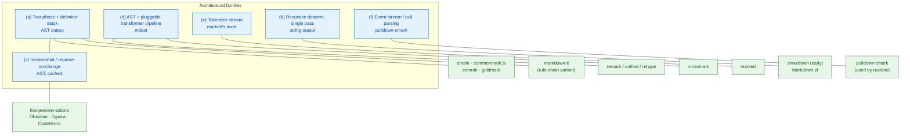
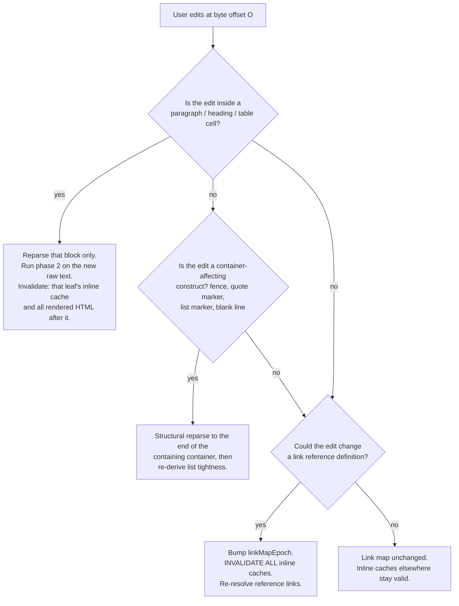
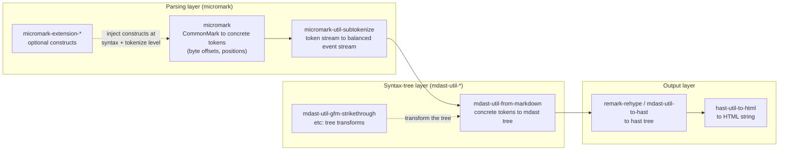
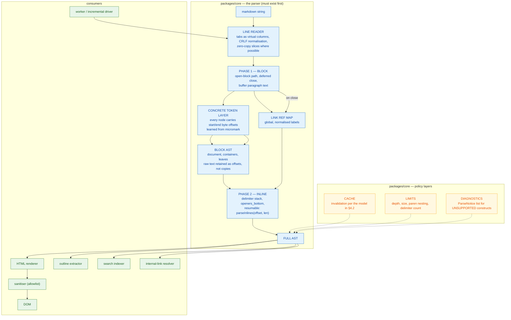

# 04 — Parser architectures, compared

> Six families of Markdown parser architecture. How each works, where each
> breaks, who uses it today, what we measured, and which one we should build.

---

## 1. The taxonomy

Architectures differ along two axes that are independent of each other:

**Axis 1 — output shape.** What does the parser hand you?

| Shape | Description |
|-------|-------------|
| **String** | HTML, built by string concatenation |
| **Token stream** | A flat or nested sequence of typed tokens |
| **Event stream (SAX / pull)** | `Start(tag) … End(tag)` with no tree structure |
| **Tree (AST)** | A materialised node tree |

**Axis 2 — phase structure.** How is the work divided?

| Structure | Description |
|-----------|-------------|
| **Single-pass** | One traversal, block and inline interleaved |
| **Two-phase** | All blocks, then all inlines |
| **Chunked / streaming** | Input is processed incrementally as it arrives |

Composing these gives the six families that matter in practice:



Note that (a) and (c) are **not** alternatives — (c) is (a) plus a cache and a
scheduling policy. We make this explicit in §9.

---

## 2. Family (a): two-phase with a delimiter stack

### 2.1 How it works

Exactly what
[`01-reference-parsing-strategy.md`](01-reference-parsing-strategy.md) describes:

1. **Block phase**: stream lines, maintain an open-block path, close deferred
   blocks, open new ones, buffer raw text into leaves.
2. **Paragraph finalisation**: strip link reference definitions into a global map.
3. **Inline phase**: walk the tree; for each leaf with raw text, run a
   left-to-right scan that pushes `*`, `_`, `[`, `!` onto a doubly linked
   delimiter stack; resolve at `]` and at end-of-input with
   `lookForLinkOrImage` and `processEmphasis` (with `openers_bottom`).
4. **Render**: a separate tree walk.

### 2.2 Who uses it

| Implementation | Language | Stated/measured conformance |
|----------------|----------|----------------------------|
| `cmark` | C | **The** reference implementation. Descendant of Sundown. |
| `commonmark.js` | JS/WASM | **652/652 measured by us**, 2026-10-06 |
| `comrak` | Rust | README badges: **CommonMark 652/652, GFM 670/670** |
| `goldmark` | Go | README: "goldmark is compliant with CommonMark 0.31.2". AST-based, preserves source positions. |
| `markdown-it` | JS | **649/652 measured by us** in the `'commonmark'` preset; its `processEmphasis` is the most readable implementation in existence. |
| `micromark` | JS | CommonMark by construction; produces **concrete tokens with byte offsets**. |
| `markdown-rs` and others | Rust | Same design. |

### 2.3 Failure modes

| Failure mode | Cause | Mitigable? |
|--------------|-------|-----------|
| **Quadratic inline resolution** if `openers_bottom` omitted | backward scan per closer | Yes — implement it |
| **Quadratic code-span scanning** | retrying the backtick search from each opener | Yes — index run lengths. Measured ×7.90 per doubling when omitted. |
| **Quadratic link-tail scanning** | unbounded backward walk in `lookForLinkOrImage` | Yes — safe limit L7 (max delimiter stack entries) |
| **Deep nesting -> O(n·d)** | open path walked per line | Partly — depth limits |
| **Memory: whole AST in RAM** | materialised tree | Yes — offset-based nodes; or family (f) |
| **No early output** | phase 2 needs the whole document | Inherent to the spec; accept for file viewing |
| **Two traversals cost ~55% overhead** | measured, see `05-performance-and-limits.md` §1.4 | Inherent |

### 2.4 Measured throughput

From our benchmark (`D:\Dev\Temp\opencode\mdbench\`, Node 24.14.1, median of 5,
2026-10-06):

**10 MiB prose-heavy corpus** (CommonMark constructs only, no extensions):

| Implementation | Parse (AST) | Render (HTML) | Parse+render | Throughput |
|----------------|-------------|---------------|--------------|------------|
| `commonmark.js` 0.31.2 | 984 ms | 220 ms | **1 291 ms** | **7.74 MiB/s** |
| `marked` 18 (`gfm`) | — | — | 2 177 ms | 4.59 MiB/s |
| `markdown-it` 15 `'commonmark'` | 3 044 ms (core) | — | 2 989 ms | 3.35 MiB/s |
| `markdown-it` 15 default | — | — | 2 935 ms | 3.41 MiB/s |

**10 MiB extension-heavy corpus** (tables, task lists, strikethrough, autolinks,
block quotes, fenced code, headings — 407 323 lines):

| Implementation | Throughput (parse+render) |
|----------------|---------------------------|
| `commonmark.js` 0.31.2 | **3.89 MiB/s** |
| `markdown-it` 15 `'commonmark'` | 1.81 MiB/s |
| `marked` 18 (`gfm`) | 1.26 MiB/s |
| `markdown-it` 15 default | 1.06 MiB/s |

Note the ~2× slowdown from prose-heavy to extension-heavy. Tables and autolinks
are expensive; that is consistent with the GFM CVE history
(`../03-specifications/02-gfm.md` §2.2).

**Peak heap for the same 10 MiB inputs** (`mem.js`, `--expose-gc`):

| Implementation | Prose corpus AST/tokens | Extension corpus |
|----------------|-------------------------|------------------|
| `commonmark.js` (AST retained) | **165 MiB** (15.7× source) | **364 MiB** (34.7×) |
| `markdown-it` (core token stream) | 124 MiB (11.8×) | 314 MiB (29.9×) |
| Rendered HTML (output size) | 11.3 MiB | 14.5 MiB |

`cmark` in C is reported by its own README as rendering *War and Peace*
(~3.2 MB of text) in **127 ms on a ten-year-old laptop**, and as "10 000 times
faster than the original `Markdown.pl`". Extrapolating: **~25 MiB/s**. That is a
useful order-of-magnitude target for a native implementation and is the basis of
our parse budget in `05-performance-and-limits.md` §2.

### 2.5 The decisive weakness

**No incremental update.** Reparsing a 10 MB file after a one-character edit
costs the full 1.3–4.5 seconds even though only one paragraph changed. For a
read-only viewer that is acceptable at the low end. For a live-preview editor it
is not. That is what family (c) fixes.

### 2.6 The measured robustness hole

`commonmark@0.31.2` passes 652/652 **and** has severe super-linear behaviour on
several pathological shapes — most dramatically repeated unclosed links:

| Repetitions | Input size | `commonmark.js` parse | `markdown-it` |
|-------------|-----------|------------------------|---------------|
| 5 000 | 25 KB | **2 351 ms** | 13.7 ms |
| 10 000 | 50 KB | **10 126 ms** | 24.9 ms |
| 20 000 | 100 KB | **51 394 ms** | 35.1 ms |

**100 KB takes 51 seconds.** Worse than quadratic (x4.3 and x5.1 per doubling).
This is why we do not adopt `commonmark.js` as a runtime dependency, and why
conformance and robustness must be tested as separate properties. Full data in
[`05-performance-and-limits.md` §3.3](05-performance-and-limits.md).

---

## 3. Family (b): recursive descent, single pass

### 3.1 How it works

The classic recursive-descent shape:

```text
parseDocument(lines) -> nodes
  for each line:
    parseBlock(currentLine, remainingLines) -> node
```

`parseBlock` dispatches on the first characters and **recurses** into container
content. Inline parsing happens immediately, inside the leaf, using regular
expressions or greedy scans.

This is how `Markdown.pl` worked, how early `showdown` worked, and how a large
number of tutorial-grade parsers work.

### 3.2 Who uses it today

| Implementation | Status |
|----------------|--------|
| `Markdown.pl` (Gruber, 2004) | Historical; the spec exists because it was buggy |
| `showdown` (early versions) | Still ships a regex-driven converter; not CommonMark-conformant |
| Most hand-rolled "mini markdown" | Ubiquitous; ubiquitous and wrong |

### 3.3 Failure modes

| Failure mode | Example | Why |
|--------------|---------|-----|
| **Block/inline precedence violated** | `` - `one\n- two` `` rendered as one list item with a code span | The code span is matched before the block structure is known |
| **Need for global knowledge** | `[ref]` before `[ref]: /url` | Resolution happens too early |
| **Exponential backtracking** | Nested emphasis/brackets | Trying alternatives requires re-parsing |
| **Greedy regex, catastrophic** | `*`, `[`, `(`, `\` all interact | Nested quantifiers on ambiguous classes |
| **Correct but fragile** | Works on all the common cases | Fails on exactly the 652 spec examples, most of which exist because of a real-world bug |

This family is not salvageable. The 652 examples are, in effect, a list of the
ways single-pass parsing fails. Choosing this architecture means choosing a
specific subset of those failures.

### 3.4 The one place it survives

**Very small, very simple inputs.** A preview pane that only ever renders a
one-paragraph comment has no block-inlining conflict. If we ever ship a "render
just this line" mode for a comment box, a simple implementation would be fine.
That is a real but small carve-out.

---

## 4. Family (c): incremental / reparse-on-change

### 4.1 How it works

Not a different algorithm — **family (a) plus three policies**:

1. **Structural cache.** Keep the block tree from the previous parse. On edit,
   find the smallest affected region and reparse only that.
2. **Inline-phase memoisation.** Phase 2 is per-leaf and pure, so cache
   `leafRawText -> InlineNode[]` keyed by `(text, profileVersion, linkMapEpoch)`.
3. **Debounce + incremental scheduling.** Reparse on an idle callback, not on
   every keystroke; measure and adapt.

### 4.2 The correct invalidation model

This is the part that is usually wrong, so it is worth stating precisely.



**The two hard cases:**

| Case | Why it is hard | Correct handling |
|------|----------------|------------------|
| **A setext underline** | `Foo\n---` -> the paragraph becomes a heading. Changing the `---` line restructures everything above it in the paragraph. | Reparse the paragraph *and* its container. Do not trust a cached paragraph. |
| **A link reference definition** | Editing `[ref]: /url` changes the resolution of every `[ref]` in the document. | Invalidate the whole inline cache, or maintain a reverse index `label -> uses[]`. |

The reverse index is cheap and worth it: `linkMap: Map<label, def>` plus
`uses: Map<label, InlineNode[]>` means a definition edit re-resolves exactly the
nodes that reference it.

### 4.3 Who uses it

Every serious Markdown *editor*, because none can afford a full reparse per
keystroke:

| Product | Observable behaviour |
|---------|----------------------|
| Obsidian | Incremental rendering; live preview with per-block reparse |
| Typora | Incremental; re-renders the visible region |
| VS Code Markdown preview | Debounced full reparse with virtualisation |
| CodeMirror 6 markdown mode | Incremental, with explicit affected-region computation |
| mdBook / mdBook-live | Debounced reparse |

We could not find a published description of any of these internals, so treat the
table as "these products behave as if they do X" — **inference from behaviour,
not documented fact.**

### 4.4 Failure modes

| Failure mode | Symptom | Fix |
|--------------|---------|-----|
| **Stale inline cache** | `[ref]` renders as literal text after you fix a definition | The reverse-index invalidation above |
| **Stale structure** | Editing `>` on line 3 doesn't move the block quote | Invalidate the container, not the line |
| **Tightness not recomputed** | Adding a blank line doesn't add `<p>` tags | Tightness is a list-close computation; recompute on any structural change |
| **Cache thrash** | Typing at the top of a 10 MB file reparses everything | Debounce + structural boundary detection |
| **Cache memory** | Caching every leaf's inline tree doubles memory | Bound the cache (LRU) or only cache what is visible |

### 4.5 Complexity

| Operation | Cost |
|-----------|------|
| Reparse one paragraph | O(paragraph size) |
| Reparse one container | O(container size) |
| Reparse the file | O(n) — the fallback |
| Definition edit | O(#uses of that label) with the reverse index, else O(n) |

---

## 5. Family (d): AST plus a pluggable transformer pipeline

### 5.1 How it works

The `unified`/`remark` architecture splits parsing from transformation from
serialisation into replaceable stages:



The key innovation is that extensions hook at **two different levels**:

| Level | Hook | Example | Power |
|-------|------|---------|-------|
| **Syntax / tokenize** | register constructs with the micromark parser | `micromark-extension-gfm-table` adds a new *leaf block* recogniser | Can create new block/inline structure. Requires re-implementing parsing. |
| **Tree transform** | a `remark` plugin that walks and edits mdast | `mdast-util-gfm-strikethrough` turns `delete` nodes into `~~` text | Easy, but **post-hoc**: it cannot change how the text was tokenised |

That split is the honest answer to "how do you extend a parser", and it is
strictly better than markdown-it's single rule-chain model.

### 5.2 Who uses it

| Package | Role |
|---------|------|
| `unified` | The processor (plugin orchestration, `process()`) |
| `remark-parse` | markdown -> mdast |
| `remark-gfm` | GFM (tables, task lists, strikethrough, autolink literals, footnotes) |
| `micromark` | The actual CommonMark tokeniser (v4.0.3 as of this research) |
| `micromark-extension-*` | 23 packages, 15 first-party (see `../03-specifications/03-extension-standards.md` §3.2) |
| `remark-directive` | Generic `:name[content]{attrs}` extension syntax |
| `mdast-util-from-markdown`, `mdast-util-to-hast` | The two tree builders |
| `rehype-*` | HTML-level transforms (this is where sanitisation goes: `rehype-sanitize`) |

Consumers: MDX (all of it), Astro's Markdown pipeline, VitePress, many static
site generators, Quarto (via `remark-directive`).

### 5.3 The concrete tokens are the killer feature

`micromark` produces tokens with **byte offsets and positions** for every
construct. This is exactly what a viewer needs and what family (a) parsers
usually do not provide: precise source mapping for scroll-sync, syntax
highlighting offsets, "reveal the source of this rendered element", and
diagnostics.

If we build our own parser, **we should emit concrete tokens with offsets from
phase 1, and build the AST from them.** That is the single best idea to steal
from this family, and it is orthogonal to the two-phase design. It is also
available from `cmark` itself via `CMARK_OPT_SOURCEPOS`
(`cmark_node_get_start_line` / `get_start_column`), which is why it does not
constrain the build-vs-adopt decision (see §9.4).

### 5.4 Failure modes

| Failure mode | Symptom |
|--------------|---------|
| **Layer confusion** | A plugin that only works at the tree level cannot fix a tokenisation bug |
| **Plugin ordering is observable** | Transform order changes output; two plugins can silently conflict |
| **Async everywhere** | `unified` processors are async by contract, which complicates hot paths and worker usage |
| **Huge dependency surface** | 23+ `micromark-extension-*` + 30+ `mdast-util-*` + `unist-util-*` |
| **Two ASTs to learn** | mdast for transforms, hast for HTML |
| **Token/tree memory** | Both representations live simultaneously |

### 5.5 Complexity

| Stage | Time | Space |
|-------|------|-------|
| Tokenise | O(n) | O(n) tokens |
| Tokens -> mdast | O(n) | O(n) nodes |
| Transform | O(n) per plugin | O(n) |
| mdast -> hast -> HTML | O(n) | O(n) |

Each additional plugin is another O(n) pass. Three plugins on a 10 MB file is
three more traversals.

---

## 6. Family (e): the tokenizer stream

### 6.1 How it works

`marked`'s architecture, and the shape most JS Markdown libraries converged on:

```text
source
  |  Lexer.lex()        -> Token[]        (block-level, flat)
  v
Token[]
  |  Lexer.blockTokens() -> Token[][]     (nested by block structure)
  v
block token tree
  |  Lexer.inlineTokens() -> Token[]      (per inline-capable block)
  v
inline tokens
  |  Parser.parse()     -> Token[]        (transformed, inline nodes spliced in)
  v
Renderer.render()      -> HTML string
```

The lexer has **rules** with `token` and `continuation` functions, evaluated in
order, each returning a token plus how much of the line it consumed. The
continuation functions are, structurally, the `tryContinue` methods of
[`02-block-parsing.md` §11.1](02-block-parsing.md).

### 6.2 Who uses it

`marked` is one of the most-installed Markdown libraries on npm. It is also
**not CommonMark-conformant** — our measurement: **498/652 (76.38%)** with
`gfm: true`. It documents itself as such and offers a `pedantic` mode.

### 6.3 Failure modes

| Failure mode | Cause |
|--------------|-------|
| **Rules compete** | A token rule that matches too eagerly shadows a later one; the order *is* the semantics |
| **The `[ ]` vs `[x]` distinction** | Requires knowing whether a `[` starts a link, which needs the whole document |
| **No clean AST** | Tokens are mutable and spliced in place; transforming them is stringly-typed |
| **Extension via monkey-patching** | The renderer and rules are globals; extensions mutate shared state |
| **Measured throughput is the worst of the group** | 1.26 MiB/s on our extension-heavy 10 MiB corpus, 4.59 MiB/s on prose |

### 6.4 Assessment

This family is **architecturally sound but semantically under-specified**. Its
rule-chain model maps cleanly onto the spec's two phases, which is why markdown-it
is a clean (a)-family implementation even though it also uses rules. The problem
is not the architecture; it is that `marked` deliberately targets Gruber's
Markdown rather than CommonMark, and gets 76% of the spec.

**Design implication for us: the rule-chain mechanism is good; the rule *set* must
come from the spec, not from intuition.**

---

## 7. Family (f): event stream / pull parsing

Included because it is a genuinely different point on the design space and one
implementation argues for it at length.

### 7.1 How it works

`pulldown-cmark` yields `Event`s as it parses:

```rust
Event::Start(Tag::Paragraph)
Event::Text(CowStr::from("hello "))
Event::Text(CowStr::from("world"))
Event::End(Tag::Paragraph)
```

No tree is built. The consumer drives the iterator. Because the events are already
balanced, building an AST on top is trivial (`into_offset_iter()` gives
`(Event, Range)` pairs).

From its own README (`Why a pull parser?`, paraphrased):

> It uses dramatically less memory than constructing a document tree, but is much
> easier to use than push parsers. Push parsers are notoriously difficult to use,
> and also often error-prone because of the need for user to delicately juggle
> state in a series of callbacks.
>
> … another advantage is that source-map information […] is readily available;
> you can call `into_offset_iter()` to create an iterator that yields
> `(Event, Range)` pairs.

### 7.2 Who uses it

`pulldown-cmark` is the Markdown parser inside **`rustdoc`**, the Rust standard
library documentation tool — arguably the highest-scale Markdown deployment in
existence, and a strong signal that the memory characteristics pay off. Its
README states the goal is 100% CommonMark compliance and notes optional support
for footnotes, GFM tables, task lists, strikethrough, and markdown-it-style
`==highlight==`.

### 7.3 Why it might be right for us

| Property | Value to a viewer |
|----------|-------------------|
| **No AST** | A 10 MB file does not require a 10 MB AST (and our measurement says the AST is 15–35× the source). |
| **`Range` per event** | Free source mapping: scroll-sync, highlight offsets, diagnostics. |
| **Transform by `Iterator::map`** | Three lines, no plugin framework |
| **Composable** | Build an AST from it when you need one; skip the AST when you don't |

### 7.4 Why it might be wrong for us

| Problem | Consequence |
|---------|-------------|
| **Rendering needs the tree** | Outline extraction, heading slugs, `](#anchor)` resolution, search indexing, virtual scrolling, internal-link rewriting all need random access to the finished structure |
| **The inline phase is not naturally streamable** | The delimiter stack must close before a block's inlines are final |
| **Reversibility is awkward** | Turning an event stream back into Markdown (round-trip editing) requires a real AST |
| **Less battle-tested in JS/TS** | It is a Rust crate; porting it is a project, not a dependency |

---

## 8. Side-by-side comparison

| Dimension | (a) two-pass | (b) recursive descent | (c) incremental | (d) AST pipeline | (e) token stream | (f) event stream |
|-----------|--------------|----------------------|-----------------|------------------|-----------------|------------------|
| CommonMark 0.31.2 achievable | **yes (652/652 proven)** | effectively no | yes (it is (a)) | yes (it is (a)) | **76% measured** | **yes (claimed 100%)** |
| Speculative parsing / backtracking | none | **required** | none | none | some | none |
| Worst-case time | O(n·d) | **exponential** | O(n·d) worst, O(edited region) typical | O(n·p) for p passes | O(n) | O(n) |
| Memory | O(AST) = 15–35× source | O(depth) | O(AST) + cache | O(tokens + tree) | O(tokens) | **O(depth)** |
| Source maps | usually absent | absent | inherited | **excellent (built in)** | partial | **excellent (built in)** |
| Incremental editing | no | no | **yes** | possible | awkward | awkward |
| Extensibility | rule chains | ad hoc | inherits (a) | **best (two hook levels)** | monkey-patch | iterator adapters |
| Round-trip to Markdown | easy | easy | inherited | easy | awkward | awkward |
| Implementation risk | **low** (reference exists) | n/a | **low** | medium | low | high (port) |
| Ecosystem precedent | very high | ~nil | high | high | high | low |

---

## 9. Our recommendation

### 9.1 The choice

> **Family (a) as the core algorithm, with family (d)'s concrete-token layer
> bolted onto phase 1, and family (c)'s invalidation policy on top.**
>
> In short: **two-phase, delimiter-stack, AST-producing, offset-carrying,
> incrementally invalidated.**



### 9.2 Justification, against each alternative

**Against (b) recursive descent.** Not a contest. The 652 examples are a list of
its failure modes. We have measured, in this very research pass, a shipping
implementation in family (a) take **51 seconds on 100 KB**; family (b) is worse
in the worst case by orders of magnitude. Rejected.

**Against (d) AST pipeline as *our* architecture.** We take its *ideas* and
reject its *framework*:

| Take | Reject | Why |
|-----|--------|-----|
| Concrete tokens with byte offsets in phase 1 | The `unified` processor framework | We need offsets; we do not need an async plugin runtime for a viewer that parses one file |
| Two hook levels (syntax vs transform) for extensions | The separate mdast **and** hast trees | Two ASTs double the memory for no viewer benefit; we can render hast-shaped HTML directly from our AST |
| Tree transforms for post-hoc features (emoji, highlight) | ~50 packages of dependency | A viewer needs maybe 8 features, all of which we control |
| Byte offsets from the tokeniser | — | **The single most valuable idea in family (d).** |

**Against (f) event stream.** The memory argument is real and `rustdoc`'s use of
`pulldown-cmark` is compelling. But a *viewer* specifically needs the tree:
outline extraction, heading-slug generation for `](#anchor)` resolution, search
indexing, virtual scrolling, and internal-link rewriting all require random
access to the finished document. An event stream we immediately convert to a tree
saves nothing. **Verdict: not for the viewer.** Revisit if we ever ship a
headless PDF/export path where memory is the binding constraint and random access
is not.

**For (c) incremental.** Non-optional for a live-preview mode, and cheap once (a)
exists, because phase 2 is already a pure per-leaf function. The invalidation
model in §4.2 is the design.

### 9.3 Concrete commitments

1. **Phase 1 emits concrete tokens with `(startOffset, endOffset)` on every
   node.** Not an afterthought; not `null` for "no position". Without this the
   viewer cannot scroll-sync, highlight, or report diagnostics.
2. **Raw inline content is stored as offsets into the source string**, not as
   copied strings. Memory for a 10 MB file should be ~10 MB of source plus the
   token/offset structures, not 10 MB plus a second copy of every paragraph.
   (Exception: the paragraph buffer must be materialised when link reference
   definitions are stripped. Design that buffer as an index list, not a string
   copy.)
3. **`parseInlines` is a pure function of `(source, start, end, linkMap)`.** It
   must be callable on a single paragraph without touching the rest of the
   document. This is the precondition for parallelism, memoisation, and
   incremental reparse.
4. **Phase 2 runs in a worker** with a transferable AST (or a shared index
   buffer). See [`../10-performance/`](../10-performance/).
5. **Limits are enforced in the parser, not the renderer.** Depth, input size,
   paren nesting, delimiter count. See
   [`05-performance-and-limits.md` §6](05-performance-and-limits.md).
6. **No architecture decision may add backtracking.** Any proposal that requires
   re-parsing a region on failure is rejected at design time, and the
   pathological test suite (`../03-specifications/04-conformance-testing.md` §6)
   is the gate.
7. **The renderer is separate from the parser** and is written against our AST,
   not against the spec's HTML. It must pass the 652 examples through the
   normalisation layer, which §1.4 of the spec explicitly permits.
8. **The render walk is iterative, not recursive.** A 100 000-deep block quote is
   legal and must not blow the stack.

### 9.4 Build vs adopt, stated precisely

This document specifies *the contract*, and that contract is implementable by a
WASM `comrak` just as well as by hand. Three facts decide it:

1. **`cmark`/`comrak` emit source positions** (`CMARK_OPT_SOURCEPOS`, or
   `cmark_node_get_start_line`/`get_start_column` in the C API). Our
   offset-carrying requirement is satisfiable.
2. **`cmark`'s measured C throughput is ~25 MiB/s**, versus our 6.7 MiB/s
   budget. Adopting gives us 4× headroom instead of parity.
3. **But no library gives us the `ParseNotice[]` diagnostics layer** — the
   UNSUPPORTED-construct reporting and limit-breach reporting that
   `../03-specifications/03-extension-standards.md` §5.4 makes our key
   differentiator. That has to be ours regardless.

The full build-vs-adopt analysis belongs in
[`../06-libraries/`](../06-libraries/) and ADR-0004. The point here is that the
**architecture is a contract, not a mandate to hand-write it**, and the contract
is deliberately small enough that either choice satisfies it.

### 9.5 What would change our mind

| Trigger | Alternative we would switch to |
|---------|-------------------------------|
| We ship headless PDF export for 100 MB files and OOM on 16 GB | (f) event stream for the export path only |
| A major customer requires MDX | (d) — adopt `remark` wholesale |
| Our own (a) implementation cannot reach 652/652 within 18 months | Use `comrak` via WASM for the core and spend the time on rendering and UX |
| Measured throughput of a hand-written (a) falls below 4 MiB/s on the 10 MiB corpus | Re-evaluate (f) or adopt native |

---

## Sources

- CommonMark 0.31.2 spec (incl. Appendix: A parsing strategy): <https://spec.commonmark.org/0.31.2/>
- `cmark` (C reference): <https://github.com/commonmark/cmark> — README performance
  claim (127 ms for *War and Peace*, 10 000x faster than `Markdown.pl`),
  "extensively fuzz-tested using american fuzzy lop"
- `comrak` (Rust) README badges — CommonMark 652/652, GFM 670/670: <https://github.com/kivikakk/comrak>
- `goldmark` (Go) README — "compliant with CommonMark 0.31.2", AST-based with
  source positions: <https://github.com/yuin/goldmark>
- `pulldown-cmark` (Rust, pull parser) README, "Why a pull parser?": <https://github.com/pulldown-cmark/pulldown-cmark>
- `markdown-it` (JS) README + source: <https://github.com/markdown-it/markdown-it>
- `marked` (JS) source and lexer design: <https://github.com/markedjs/marked>
- `micromark` (JS) v4.0.3 — concrete tokens with positions: <https://github.com/micromark/micromark>
- `unified` / `remark` architecture: <https://github.com/remarkjs>, <https://github.com/unifiedjs/unified>
- `cmark-gfm` CTest wiring (`-DSPEC_TESTS`, source positions): <https://raw.githubusercontent.com/github/cmark-gfm/master/test/CMakeLists.txt>
- `cmark-gfm` pathological corpus and security advisories: <https://github.com/github/cmark-gfm/releases>
- Our measurements, all 2026-10-06 on Node 24.14.1: `D:\Dev\Temp\opencode\mdbench\`
  — `bench2.js` (throughput), `mem.js` (heap), `micro.js` (per-construct),
  `conform.js` (CommonMark pass rates), `depth.js` (nesting), `scaling.js`,
  `scaling2.js` (scaling ratios), `unclosed.js` (unclosed-link DoS).
