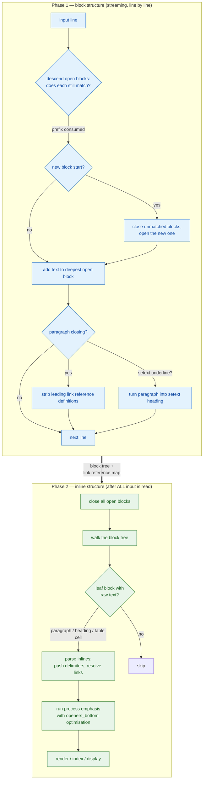

# 04 — Parsing internals

> How Markdown parsers actually work. This folder is the deepest technical
> material in our research: it is the reference an engineer will implement from.

---

## 1. Read this folder in order

| Doc | Question it answers |
|-----|--------------------|
| [`01-reference-parsing-strategy.md`](01-reference-parsing-strategy.md) | What is the canonical algorithm? Why does block parsing have to finish before inline parsing starts? |
| [`02-block-parsing.md`](02-block-parsing.md) | Line classification, container/leaf split, the disambiguation precedence rules, HTML block state machine, list-item indent computation, list tightness. **With pseudocode for the block-parser loop.** |
| [`03-inline-parsing.md`](03-inline-parsing.md) | The delimiter stack, `openers_bottom`, link resolution, the emphasis closer-matching algorithm, where escapes and character references resolve. **With pseudocode and the spec's own algorithm text cited.** |
| [`04-parser-architectures.md`](04-parser-architectures.md) | Six architectural families compared, with failure modes and a recommendation for us. |
| [`05-performance-and-limits.md`](05-performance-and-limits.md) | Complexity theory, the pathological cases, **measured** throughput/memory/depth data, and the **safe limits table**. |

Sibling folders: the *rules* live in [`../02-syntax/`](../02-syntax/), the
*libraries* live in [`../06-libraries/`](../06-libraries/), the *security*
consequences live in [`../11-security/`](../11-security/), and the *rendering*
output lives in [`../05-rendering/`](../05-rendering/). This folder is the middle:
the algorithms and the complexity arguments.

## 2. The one-paragraph version

Markdown is parsed in **two phases**. Phase 1 consumes the input **one line at
a time**, building a tree of *blocks*, and never interprets inline syntax.
Phase 2 walks the finished tree and parses the raw text inside paragraphs,
headings and table cells into *inlines*. Every serious parser — `cmark`,
`commonmark.js`, `markdown-it`, `comrak`, `goldmark`, `micromark` — does this,
because the specification's own precedence rule requires it and because no
single-pass design can satisfy it without backtracking.

## 3. Why every serious parser has two phases

The CommonMark specification states the reason in §3.1 (Precedence). Paraphrased
exactly:

> Indicators of block structure always take precedence over indicators of inline
> structure.

And then, in the same section, it makes the architectural consequence explicit:

> This means that parsing can proceed in two steps: first, the block structure of
> the document can be discerned; second, text lines inside paragraphs, headings,
> and other block constructs can be parsed for inline structure. The second step
> requires information about link reference definitions that will be available
> only at the end of the first step. Note that the first step requires processing
> lines in sequence, but the second can be parallelized, since the inline
> parsing of one block element does not affect the inline parsing of any other.

Three claims are packed into that paragraph, and each one is load-bearing.

### 3.1 Claim 1 — the block structure is knowable without inline knowledge

Consider the canonical example the spec uses to make this point:

```markdown
- `one
- two`
```

Rendered as CommonMark, this is:

```html
<ul>
<li>`one</li>
<li>two`</li>
</ul>
```

Two items, **not** one item containing a code span. A parser that tried to
interpret backticks as it went would see `` `one\n- two` `` as a single code span
and produce one list item. The `-` on line 2 is *block* structure and wins.

There are more such cases, and they interact:

```markdown
> `one
> two`
```

```markdown
1. `a
2. b`
```

```markdown
* `a long code span can contain a hyphen like this
  - and it can screw things up`
```

(In the third case — one of the 14 ambiguities the spec lists in §1.3 — the
CommonMark result is two list items.)

### 3.2 Claim 2 — inline parsing needs a global table

Reference links are resolved against a document-wide map of link reference
definitions:

```markdown
See [the docs][ref].

[ref]: https://example.com/docs
```

The *definition* is at the bottom of the document; the *use* is at the top. A
single-pass parser that resolves `[ref]` when it encounters it has not seen the
definition yet.

More subtly, a link reference definition is not a block construct at all. Per the
spec appendix, **link reference definitions are detected when a paragraph is
closed** — by re-examining the accumulated raw lines. If they don't parse as
definitions, the remainder becomes a normal paragraph. So:

```markdown
[foo]: /url1
[foo]: /url2

[foo][]
```

resolves to `/url1` (first definition wins), *and* the two definition lines
disappear entirely from the output.

There is no way to do this without having seen the whole document first.

### 3.3 Claim 3 — phase 2 is embarrassingly parallel

This is the free lunch. Once the block tree exists and the link reference map is
complete, parsing the inlines inside block *A* cannot affect the inlines inside
block *B*. That means:

- Phase 2 can run in **parallel** (worker threads / processes).
- Phase 2 can run in a **worker**, off the UI thread, while phase 1 streams.
- Phase 2 can be **memoised**: re-render only the blocks whose raw text changed.
- A **live preview** can reparse incrementally: phase 1 is streaming, phase 2
  is per-block and cacheable.

None of this is possible if you parse blocks and inlines interleaved.

### 3.4 What the two-phase model costs

Two-phase parsing is not free. The costs, which are the reason the spec's
appendix is careful about *streaming* phase 1:

| Cost | Cause | Mitigation in the spec / our design |
|------|-------|----------------------------------------|
| **Deferred decisions** | Setext headings and link reference definitions are only resolved at *close* time, so you must buffer paragraph lines. | Buffer per open paragraph. Memory is O(paragraph length), not O(document length). |
| **No early output** | You cannot emit HTML for line 1 until the whole document is read (a link reference at the bottom can change line 1's rendering). | Accept it for files. For a streaming viewer, render in two passes over a memory-mapped file. |
| **Two traversals** | Every byte is read twice: once for lines, once for inline content. | Measured at ~55% of total parse time. See `05-performance-and-limits.md` §1.4. |
| **Structural overhead** | You build a full block tree even if you only want to render. | Unavoidable, and it's what enables the outline, virtual scrolling, and internal links. |

### 3.5 The one-pass alternative, and why it fails

A single-pass parser tries to interpret each line as both block structure and
inline content. It hits three walls:

1. **Unknown future.** `[ref]` at line 1 needs `[ref]: /url` at line 40.
2. **Deferred block types.** `Foo\n---` is a setext heading; the same two lines
   followed by `- bar` is a paragraph plus a list. You cannot decide line 1's
   fate at line 1.
3. **Ordering conflicts.** `` - `one\n- two` `` needs line 2's `-` to win over
   line 1's backtick, which requires knowing line 2 is block structure before
   deciding that line 1's backtick is *not* inline.

The classic workaround is **backtracking**: try one interpretation, and if it
fails, try the other. Backtracking on a language with unbounded nesting is
exponential in the worst case. This is not theoretical — see
`05-performance-and-limits.md` §3 for measured super-linear behaviour in shipping
parsers, including the *official reference implementation*.

The reference implementations avoid backtracking by **deferring** instead:
buffer the paragraph, decide at close time, never retry. That is the single most
important design idea to steal.

## 4. The block/inline classification, at a glance



## 5. The block tree, and "open" versus "closed"

The spec appendix defines the document model. Paraphrased:

> At each point in processing, the document is represented as a tree of **blocks**.
> The root of the tree is a `document` block. The document may have any number of
> other blocks as **children**. These children may, in turn, have other blocks as
> children. The **last child of a block is normally considered open**, meaning
> that subsequent lines of input can alter its contents. (Blocks that are not
> open are **closed**.)

Here is the worked example from the appendix, showing the tree with open blocks
marked by `->`:

```tree
-> document
  -> block_quote
       paragraph
         "Lorem ipsum dolor\nsit amet."
    -> list (type=bullet tight=true bullet_char=-)
         list_item
           paragraph
             "Qui *quodsi iracundia*"
      -> list_item
        -> paragraph
             "aliquando id"
```

produced from four lines:

```markdown
> Lorem ipsum dolor
sit amet.
> - Qui *quodsi iracundia*
> - aliquando id
```

Walk it:

| Line | Effect | Open-block path after |
|------|--------|-----------------------|
| `> Lorem ipsum dolor` | opens `block_quote`, opens `paragraph`, adds text | `document > block_quote > paragraph` |
| `sit amet.` | **lazy continuation** — no `>`, but the paragraph stays open, so the text is appended anyway | unchanged |
| `> - Qui *quodsi iracundia*` | `paragraph` closed; opens `list`, `list_item`, `paragraph` | `document > block_quote > list > list_item > paragraph` |
| `> - aliquando id` | `list_item` + its `paragraph` closed; new `list_item` + `paragraph` opened | `document > block_quote > list > list_item > paragraph` |

Note in the tree that `list (type=bullet tight=true bullet_char=-)` already
knows its **tightness** (`tight=true`) — but tightness is a property of the whole
list and depends on blank lines that may appear later. In practice, tightness is
computed **when the list closes**, then propagated downward. See
[`02-block-parsing.md` §8](02-block-parsing.md).

After all input, phase 2 produces:

```tree
document
  block_quote
    paragraph
      str "Lorem ipsum dolor"
      softbreak
      str "sit amet."
    list (type=bullet tight=true bullet_char=-)
      list_item
        paragraph
          str "Qui "
          emph
            str "quodsi iracundia"
      list_item
        paragraph
          str "aliquando id"
```

Observe the transformations: the line ending became a `softbreak` node, and
`*quodsi iracundia*` became an `emph` node. **Neither was decided in phase 1.**

## 6. Complexity, in one paragraph

| Phase | Time | Space | Why |
|-------|------|-------|-----|
| Block, best case | **O(n)** in bytes | O(depth + open-paragraph buffer) | Each line is visited once; container prefix stripping advances a cursor monotonically. |
| Block, pathological | **O(n·d)** where d = container nesting depth | same | Deeply nested lists require re-walking the open-block chain per line. Measured super-linear in practice (`05-performance-and-limits.md` §3.2). |
| Inline, best case | **O(n)** | O(d) delimiter stack + AST | Each byte is scanned once; delimiter runs are matched with a bounded backward scan. |
| Inline, worst case without `openers_bottom` | **O(n²)** | — | `*a ` repeated n times: every closer scans back over every earlier opener. |
| Inline, with `openers_bottom` | **O(n)** amortised | O(1) extra per delimiter type | The optimisation from the spec appendix. |
| Render | **O(n)** | O(AST) | Single tree walk. |

The `openers_bottom` optimisation deserves emphasis: **it is the difference
between O(n²) and O(n) on the single most common pathological shape**, and it is
easy to omit. Any implementation that does not have it will be found by the
`"many emph closers with no openers"` case in `cmark-gfm`'s pathological suite.

## 7. What is in scope for this folder, and what is not

| In scope (this folder) | Out of scope (elsewhere) |
|------------------------|-------------------------|
| Block grammar and precedence | HTML/CSS output and theming → [`../05-rendering/`](../05-rendering/) |
| Inline delimiter algorithm | Sanitisation and CSP → [`../11-security/`](../11-security/) |
| Parser architecture families | Library selection → [`../06-libraries/`](../06-libraries/) |
| Complexity, limits, DoS | Virtual scrolling, workers → [`../10-performance/`](../10-performance/) |
| Incremental reparse design | Editor integration → [`../07-editor-internals/`](../07-editor-internals/) |
| Every construct's grammar | Every construct's worked examples → [`../02-syntax/`](../02-syntax/) |

## 8. Reading the spec while reading these docs

The canonical source is `spec.txt` 0.31.2, 9 757 lines. It is worth having open
alongside this folder. Two things make it much easier to navigate:

- **`spec.json` gives `start_line`/`end_line`/`section` for every example.** If a
  doc here says "see §6.2 rule 9", you can find the matching example and jump
  straight to the prose.
- **The appendix is at lines 9420–9757** and is short. It is the entire
  normative algorithm. Read it; it is ~200 lines and it answers most questions.

Fetch it with:

```bash
curl -o spec.txt https://raw.githubusercontent.com/commonmark/commonmark-spec/0.31.2/spec.txt
curl -o spec.json https://spec.commonmark.org/0.31.2/spec.json
```

## 9. A standing warning

The reference implementations are **not** a description of the specification;
they are an implementation *of* it. Where our research quotes them (e.g. for
performance behaviour), it is citing an observation about one program, not a
requirement. Conversely, where a construct is normative but no reference
implementation agrees on it, that is a bug report, not a licence to deviate.

The `commonmark@0.31.2` npm package — the JavaScript port of `cmark` — passes
652/652 but has **measured super-linear behaviour on several pathological inputs**
(51 seconds on 100 KB of `"[a](b"` repeated; see
`05-performance-and-limits.md` §3.3). **Conformance and robustness are
independent properties.** Test for both, separately, forever.

---

## Sources

- CommonMark 0.31.2 spec: <https://spec.commonmark.org/0.31.2/>
- Spec source (9757 lines; appendix at 9420–9757):
  <https://raw.githubusercontent.com/commonmark/commonmark-spec/0.31.2/spec.txt>
- Test suite: <https://spec.commonmark.org/0.31.2/spec.json>
- GFM spec (contains the identical parsing-strategy appendix): <https://github.github.com/gfm/>
- Reference implementation (C): <https://github.com/commonmark/cmark>
- Reference implementation (JS): <https://github.com/commonmark/commonmark.js>
- `cmark-gfm` pathological corpus: <https://raw.githubusercontent.com/github/cmark-gfm/master/test/pathological_tests.py>
- markdown-it: <https://github.com/markdown-it/markdown-it>
- comrak (Rust): <https://github.com/kivikakk/comrak>
- goldmark (Go): <https://github.com/yuin/goldmark>
- pulldown-cmark (pull/event parser): <https://github.com/pulldown-cmark/pulldown-cmark>
- micromark (JS): <https://github.com/micromark/micromark>
- Our measurements: `D:\Dev\Temp\opencode\mdbench\` — Node 24.14.1,
  `commonmark@0.31.2`, `markdown-it@15.0.2`, `marked@18.1.0`, 2026-10-06
