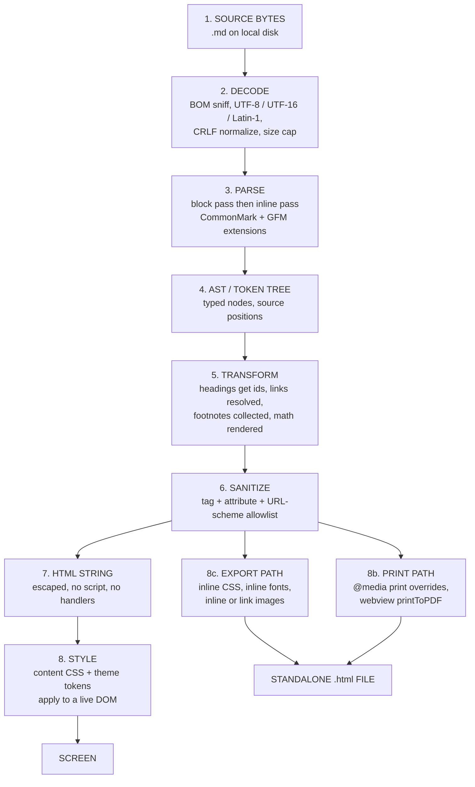

# 05 — Rendering

> How bytes on disk become pixels on a screen — and every place that
> transformation can be attacked.

## What this folder answers

| Doc | Question |
|-----|----------|
| [01-ast-to-html.md](./01-ast-to-html.md) | Given an AST, what exact HTML do we emit? Which wrapper element, which attributes, which escaping, which `id`s? |
| [02-sanitization.md](./02-sanitization.md) | Why is sanitization a *rendering stage* and not an afterthought? Allowlist vs blocklist, URL schemes, DOMPurify's threat model, a worked XSS payload torn apart layer by layer. |
| [03-styling-and-themes.md](./03-styling-and-themes.md) | How do we make a document readable? Reset, typography, measure, themes as data, syntax highlighting, print CSS. |
| [04-media-and-images.md](./04-media-and-images.md) | Where does `` point, and who is allowed to load it? Base URLs, SVG, data URIs, remote images, caching. |
| [05-export-and-print.md](./05-export-and-print.md) | Print-to-PDF, single-file HTML export, other formats, and what must be inlined for a file to stand alone. |

## The pipeline at a high level

There are **seven** stages. Each one is a trust boundary. Data changes
representation at every arrow, and each arrow is a place where a bug becomes a
security bug.



Stage 1 is documented in
[11-security/03-filesystem-safety.md](../11-security/03-filesystem-safety.md).
Stage 6 is the security keystone of the whole application and is treated as
such in [02-sanitization.md](./02-sanitization.md) and the entire
[11-security](../11-security/) folder.

## The three output paths share one trusted core

This is the single most important architectural decision in rendering, so it
gets its own section.

```text
        ┌──────────────────────────────────────────┐
        │  bytes → decode → parse → AST → transform │   ← shared, untrusted input side
        └───────────────────┬──────────────────────┘
                            │
                   ┌────────▼────────┐
                   │   SANITIZE      │   ← the only trust boundary
                   │ (allowlist)     │
                   └────────┬────────┘
              ┌─────────────┼─────────────┐
              │             │             │
        ┌─────▼─────┐ ┌─────▼─────┐ ┌─────▼─────┐
        │  SCREEN   │ │  PRINT    │ │  EXPORT   │   ← all three are pure functions
        │ (webview) │ │ (PDF)     │ │ (HTML/MD) │      of sanitized HTML + CSS
        └───────────┘ └───────────┘ └───────────┘
```

**Rule:** anything past the sanitizer is *already safe for HTML insertion*, and
the three consumers must not re-parse, re-serialize, or post-process it in a way
that changes its parsing context. DOMPurify's own threat model is explicit that
sanitized output is *context-bound* — feeding it into a different markup context
(`<template>`, `<textarea>`, an SVG subtree, a second template engine) voids the
sanitization. See
[02-sanitization.md §6](./02-sanitization.md#6-why-context-changes-everything).

The corollary is a design rule we should write into the ADR:

> The renderer API takes a `Document`/`Fragment` or a sanitized string and
> nothing else. There is no code path from a `.md` file to the screen, the
> print dialog, or an export buffer that skips the sanitizer. If such a path is
> ever needed, it is a security bug, not a feature flag.

## Why the sanitizer sits *after* transform and *before* HTML

Before sanitize: the data is a structured tree. Sanitizers operating on a tree
can reason about parent/child, namespace, and element identity. A string
sanitizer cannot.

After sanitize: the data is HTML, and HTML is the format every downstream
consumer already needs — the webview, the print engine, the export writer, and
any future web build.

If we sanitized *before* transform, our own transform code would be the
untrusted-input handler for `href`, `id`, `class`, and `style` — every attribute
we synthesize. Sanitizing after transform means the allowlist has the final
word on *all* attributes, including the ones we generated. That is why heading
anchors, task-list checkboxes, and table alignment all have to be
sanitizer-compatible rather than "trusted because we made them."

## What each stage must never do

| Stage | Forbidden |
|-------|-----------|
| decode | assume UTF-8; strip a BOM silently without telling anyone; read a 4 GB file into memory |
| parse | emit raw HTML that reaches the DOM without passing stage 6; run user-influenced regexes unbounded (ReDoS) |
| transform | synthesize an attribute value from document text without escaping; emit `id`/`name` that can be used for DOM clobbering |
| sanitize | widen the tag allowlist for a document that "needs" a tag; fall back to `DOMPurify.removed` heuristics; sanitize a string then modify the string |
| HTML string | be produced by string concatenation of unescaped text |
| style | accept `style` from untrusted content; load remote fonts/CSS by default |
| screen | assign unsanitized text to `innerHTML`, `outerHTML`, `insertAdjacentHTML`, or `document.write` |

OWASP's framing for the last row: refactor to `textContent` wherever possible and
treat `innerHTML` as a sink that only ever receives sanitizer output. From the
[OWASP XSS Prevention Cheat Sheet](https://cheatsheetseries.owasp.org/cheatsheets/Cross_Site_Scripting_Prevention_Cheat_Sheet.html):

> "Sanitize your HTML **before** inserting it into the DOM. … If you sanitize
> content and then modify it afterwards, you can easily void your security
> efforts."
>
> "It is easy to make mistakes with the implementation so [CSP] should not be
> your primary defense mechanism. Use a CSP as an additional layer of defense."

## Rendering as the attack surface, in one table

| Stage | Attacker-controlled | Worst realistic outcome |
|-------|---------------------|--------------------------|
| decode | byte sequences, file size | memory exhaustion, mojibake-driven UI confusion |
| parse | every construct, including pathological nesting | ReDoS CPU exhaustion (see [CVE-2022-21680](https://nvd.nist.gov/vuln/detail/CVE-2022-21680), [CVE-2022-21681](https://nvd.nist.gov/vuln/detail/CVE-2022-21681) in `marked`) |
| transform | heading text → `id`; link text → `title`/`aria-label` | DOM clobbering, attribute injection |
| sanitize | the whole document | XSS → RCE in an Electron/Tauri app |
| HTML string | attribute values, text nodes | entity-escaping bugs |
| style | `style` attr, external CSS | CSS exfiltration, `position: fixed` clickjacking |
| media | `src` URLs, SVG content | local file read, script execution inside SVG, tracking beacons |
| export | anything inlined | a single `.html` file that is itself a weapon when opened elsewhere |

## Reading order

If you are implementing rendering, read [01](./01-ast-to-html.md) then
[02](./02-sanitization.md) — everything else is presentation. If you are
reviewing for security, read [02](./02-sanitization.md) then
[11-security/01-threat-model.md](../11-security/01-threat-model.md).

## Open questions carried forward

Recorded in [15-open-questions](../15-open-questions/) when that folder exists.
For now, tracked here:

1. **Sanitizer placement for the core package.** `packages/core` should be able
   to render to HTML in a *server* context (web build, tests) and in a
   *browser* context (desktop). One sanitizer, or two?
2. **Print path.** Does print-to-PDF re-serialize and re-parse the DOM? If so,
   does it preserve the sanitizer's guarantees?
3. **Export.** Single-file HTML export necessarily *widens* trust: the output is
   opened by an unknown future renderer. Does the exported file keep the same
   CSP?
