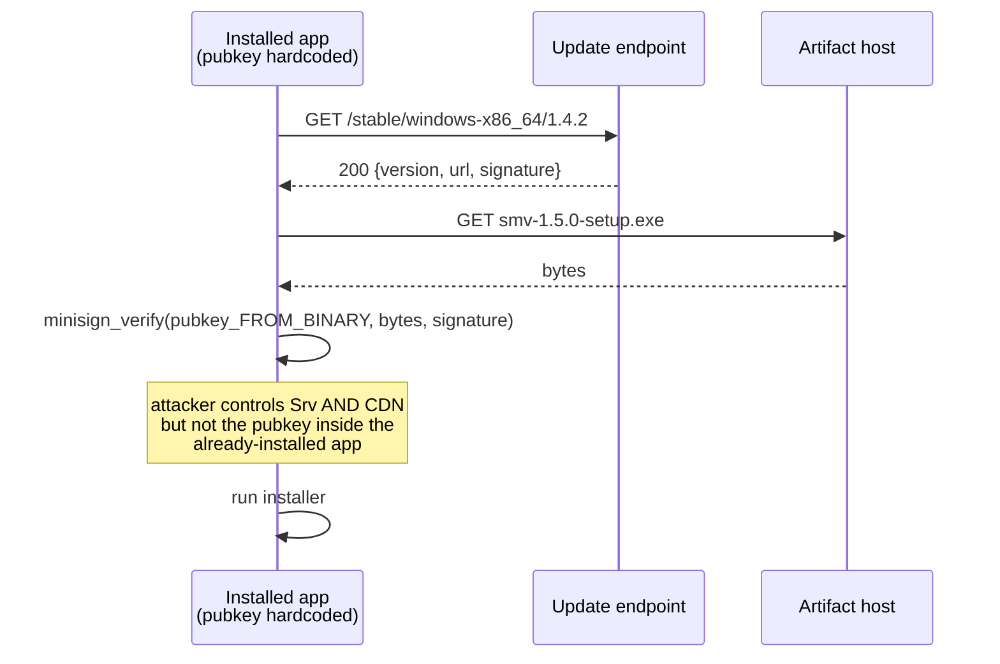
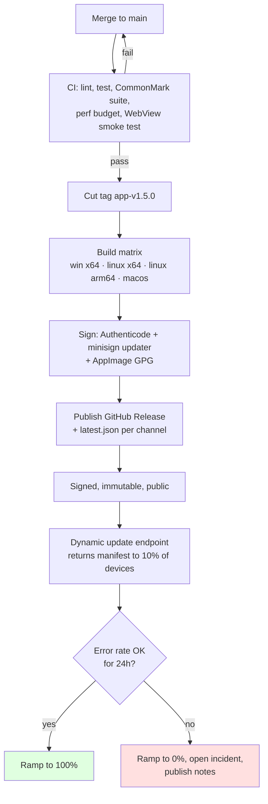

# 03 — Distribution and Updates

> "Ship it" is the step where an app stops being a repository and starts being
> other people's software on other people's machines. Every shortcut taken here
> is a support ticket later.

Legend: ✅ **VERIFIED** (primary source linked) · 🟡 **UNVERIFIED** (community
report / our inference) · 🔧 **RECOMMENDED** (our decision)

---

## 1. Build pipelines

### 1.1 The matrix

| Job | Runner | Produces | Notes |
|-----|--------|----------|-------|
| `windows-x64` | `windows-latest` | NSIS `-setup.exe`, portable `.zip`, `.msix` (later) | Needs the cert import step. **VBSCRIPT must be on** (it is, on GH runners). |
| `windows-arm64` | `windows-latest` | as above, arm64 | 🟡 Decide later; x64 emulates fine on Arm for a viewer. |
| `linux-x64` | **container: `debian:12`** / `ubuntu-22.04` | AppImage, `.deb`, `.rpm` | 🔧 Pin the base. See §1.3. |
| `linux-arm64` | `ubuntu-22.04-arm` (public repos) | as above | ✅ Public ARM runners exist (Aug 2025). |
| `macos-*` | `macos-latest` | `.app.tar.gz`, `.dmg` | Deferred, but keep the job in the file from day one. |

🔴 **Do not build Linux on `ubuntu-latest`.** ✅ **VERIFIED** — *"Core libraries
such as glibc frequently break compatibility with older systems. For this reason,
you must build your Tauri application using the oldest base system you intend to
support"* ([Tauri — AppImage, Limitations](https://v2.tauri.app/distribute/appimage/)). When `ubuntu-latest` moves to 26.04, an AppImage built on it will carry a newer glibc symbol requirement and fail on Ubuntu 22.04 with
`/usr/lib/libc.so.6: version 'GLIBC_2.33' not found`. Pin `ubuntu-22.04` or use
`debian:12`.

### 1.2 The real Tauri release workflow

✅ **VERIFIED** — this is the official `tauri-action` example, current as of the
docs page (last updated 2026-05-17)
([Tauri — Pipelines: GitHub](https://v2.tauri.app/distribute/pipelines/github/),
[tauri-action README](https://github.com/tauri-apps/tauri-action)):

```yaml
name: 'publish'

on:
  workflow_dispatch:
  push:
    branches:
      - release

jobs:
  publish-tauri:
    permissions:
      contents: write
    strategy:
      fail-fast: false
      matrix:
        include:
          - platform: 'macos-latest'          # Arm macs (M1+)
            args: '--target aarch64-apple-darwin'
          - platform: 'macos-latest'          # Intel macs
            args: '--target x86_64-apple-darwin'
          - platform: 'ubuntu-22.04'          # pinned: glibc baseline
            args: ''
          - platform: 'ubuntu-22.04-arm'      # public repos only
            args: ''
          - platform: 'windows-latest'
            args: ''

    runs-on: ${{ matrix.platform }}

    steps:
      - uses: actions/checkout@v4

      - name: install dependencies (ubuntu only)
        if: matrix.platform == 'ubuntu-22.04' || matrix.platform == 'ubuntu-22.04-arm'
        run: |
          sudo apt-get update
          sudo apt-get install -y \
            libwebkit2gtk-4.1-dev libayatana-appindicator3-dev \
            libxdo-dev librsvg2-dev libssl-dev \
            patchelf xdg-utils file

      - name: setup node
        uses: actions/setup-node@v4
        with:
          node-version: lts/*
          cache: 'npm'

      - name: install Rust stable
        uses: dtolnay/rust-toolchain@stable

      - name: Rust cache
        uses: swatinem/rust-cache@v2
        with:
          workspaces: './src-tauri -> target'

      - name: install frontend dependencies
        run: npm ci

      # --- Tauri updater signing keys (see §5) -------------------------
      - name: Import Tauri signing key (unix)
        if: runner.os != 'Windows'
        env:
          TAURI_SIGNING_PRIVATE_KEY: ${{ secrets.TAURI_SIGNING_PRIVATE_KEY }}
          TAURI_SIGNING_PRIVATE_KEY_PASSWORD: ${{ secrets.TAURI_SIGNING_PRIVATE_KEY_PASSWORD }}
        run: |
          echo 'skip: key is passed via env to tauri build'

      - name: Import Tauri signing key (windows)
        if: runner.os == 'Windows'
        shell: pwsh
        env:
          TAURI_SIGNING_PRIVATE_KEY: ${{ secrets.TAURI_SIGNING_PRIVATE_KEY }}
          TAURI_SIGNING_PRIVATE_KEY_PASSWORD: ${{ secrets.TAURI_SIGNING_PRIVATE_KEY_PASSWORD }}
        run: |
          [Environment]::SetEnvironmentVariable('TAURI_SIGNING_PRIVATE_KEY', $env:TAURI_SIGNING_PRIVATE_KEY, 'User')
          [Environment]::SetEnvironmentVariable('TAURI_SIGNING_PRIVATE_KEY_PASSWORD', $env:TAURI_SIGNING_PRIVATE_KEY_PASSWORD, 'User')

      # --- Windows Authenticode ------------------------------------------
      - name: Import Authenticode certificate
        if: runner.os == 'Windows'
        shell: pwsh
        run: |
          $bytes = [Convert]::FromBase64String("${{ secrets.WINDOWS_CERTIFICATE }}")
          [IO.File]::WriteAllBytes("$env:RUNNER_TEMP\cert.pfx", $bytes)
          $pw = ConvertTo-SecureString "${{ secrets.WINDOWS_CERTIFICATE_PASSWORD }}" -AsPlainText -Force
          Import-PfxCertificate -FilePath "$env:RUNNER_TEMP\cert.pfx" `
            -CertStoreLocation Cert:\CurrentUser\My -Password $pw
          Remove-Item "$env:RUNNER_TEMP\cert.pfx"

      - uses: tauri-apps/tauri-action@v1
        env:
          GITHUB_TOKEN: ${{ secrets.GITHUB_TOKEN }}
          # `latest.json` is generated ONLY when the Tauri signing key is present.
          TAURI_SIGNING_PRIVATE_KEY: ${{ secrets.TAURI_SIGNING_PRIVATE_KEY }}
          TAURI_SIGNING_PRIVATE_KEY_PASSWORD: ${{ secrets.TAURI_SIGNING_PRIVATE_KEY_PASSWORD }}
        with:
          tagName: app-v__VERSION__       # __VERSION__ is substituted from tauri.conf.json
          releaseName: 'Siyana Markdown Viewer v__VERSION__'
          releaseBody: 'See the assets to download this version and install.'
          releaseDraft: true
          prerelease: false
          args: ${{ matrix.args }}
```

Notes that matter:

- ✅ **VERIFIED** — `tauri signer generate -w ~/.tauri/myapp.key` creates the
  keypair; the **public key** goes into `tauri.conf.json` and *"cannot be a file
  path"*, it must be the key **content**.
- ✅ **VERIFIED** — `TAURI_SIGNING_PRIVATE_KEY` and
  `TAURI_SIGNING_PRIVATE_KEY_PASSWORD` are read from the **environment**.
  *"`.env` files do **not** work!"*
- ✅ **VERIFIED** — `bundle.createUpdaterArtifacts: true` must be set, otherwise
  no `.sig` files and no `latest.json` are produced. (`"v1Compatible"` exists for
  migrations and *"will be removed in v3"*.)
- ✅ **VERIFIED** — the Windows cert can be stored base64-encoded in a secret
  (`certutil -encode certificate.pfx base64cert.txt`) and decoded in CI; the
  Tauri docs use `WINDOWS_CERTIFICATE` / `WINDOWS_CERTIFICATE_PASSWORD` as the
  secret names.
- ✅ **VERIFIED** — `tauri-action` generates a `latest.json` updater manifest by
  default (`uploadUpdaterJson: true`), and `updaterJsonPreferNsis` chooses NSIS
  over MSI when both exist.

### 1.3 🔧 Our additions to the official workflow

The official example is a *starting point*. Ours adds:

```yaml
      - name: Verify app manifest (DPI + long paths)
        if: runner.os == 'Windows'
        shell: pwsh
        run: |
          # §8 of 01-windows.md: fail the build if PerMonitorV2 is missing.
          mt.exe -inputresource:src-tauri\target\release\app.exe -out:$env:RUNNER_TEMP\dump.xml
          $x = Get-Content $env:RUNNER_TEMP\dump.xml -Raw
          if ($x -notmatch 'PerMonitorV2') { throw 'dpiAwareness=PerMonitorV2 missing' }
          if ($x -notmatch 'longPathAware')    { throw 'longPathAware missing' }

      - name: Smoke-test the AppImage on the oldest supported glibc
        if: matrix.platform == 'ubuntu-22.04'
        run: |
          sudo apt-get install -y libfuse2
          chmod +x src-tauri/target/release/bundle/appimage/*.AppImage
          timeout 20 ./src-tauri/target/release/bundle/appimage/*.AppImage --version

      - name: Assert updater artifacts exist
        run: |
          test -f latest.json || (echo 'latest.json missing' && exit 1)
          # every url in latest.json must have a sibling .sig on the release
```

The last two steps are the ones most projects skip and most regret skipping: the
first is a **runtime** failure only users would find, and the second is a silent
"updates stopped working three releases later" failure.

### 1.4 The Electron equivalent

🔧 **RECOMMENDED** — the Electron stack's shape is different (bundling
`node_modules` in `beforeBuildCommand`, signing inside `electron-builder`,
publishing with `--publish always`). This is our template, modelled on
electron-builder's documented CLI rather than quoted verbatim:

```yaml
name: publish

on:
  push:
    tags: ['app-v*']

jobs:
  build:
    strategy:
      fail-fast: false
      matrix:
        include:
          - os: windows-latest
            args: '--win --x64 --publish always'
          - os: macos-latest
            args: '--mac --universal --publish always'
          - os: ubuntu-22.04
            args: '--linux AppImage deb --publish always'
    runs-on: ${{ matrix.os }}

    steps:
      - uses: actions/checkout@v4
      - uses: actions/setup-node@v4
        with:
          node-version: lts/*
          cache: 'npm'

      # Install the system webview deps for a Linux build
      - name: install Linux deps
        if: runner.os == 'Linux'
        run: |
          sudo apt-get update
          sudo apt-get install -y libwebkit2gtk-4.1-dev libayatana-appindicator3-dev \
            libxdo-dev librsvg2-dev libssl-dev patchelf xdg-utils file

      - run: npm ci

      - name: import code-signing certificate
        uses: electron/actions/setup-code-signing@v3
        with:
          pfx-file-base64: ${{ secrets.WINDOWS_CERTIFICATE }}
          pfx-password: ${{ secrets.WINDOWS_CERTIFICATE_PASSWORD }}

      # electron-builder appends the config to the generated electron-builder.yml
      - run: npm run build

      - name: build & publish
        run: npx electron-builder ${{ matrix.args }}
        env:
          GH_TOKEN: ${{ secrets.GITHUB_TOKEN }}
          CSC_LINK: ${{ secrets.MAC_CERT_P12 }}       # macOS
          CSC_KEY_PASSWORD: ${{ secrets.MAC_CERT_PASSWORD }}
          # electron-builder reads these for Authenticode on Windows
          WIN_CSC_LINK: ${{ secrets.WINDOWS_CERTIFICATE }}
          WIN_CSC_KEY_PASSWORD: ${{ secrets.WINDOWS_CERTIFICATE_PASSWORD }}
```

The equivalent `electron-builder.yml` fragments:

```yaml
appId: dev.siyana.markdownviewer
productName: Siyana Markdown Viewer

directories:
  output: release
  buildResources: build

win:
  target:
    - target: nsis
      arch: [x64]
    - target: zip          # the portable escape hatch
      arch: [x64]
  artifactName: ${productName}-${version}-${arch}.${ext}

nsis:
  oneClick: false
  perMachine: false
  allowToChangeInstallationDirectory: true
  differentialPackage: true       # emit the .blockmap for delta updates
  createDesktopShortcut: always

publish:
  provider: github
  owner: <org>
  repo: <repo>

linux:
  target: [AppImage, deb]
  category: Utility;TextEditor
  desktop:
    entry:
      MimeType: text/markdown;text/x-markdown;
```

🔴 **Note the electron-builder/Electron split.** On Linux, **Electron does not
use WebKitGTK** — it bundles Chromium. So the `libwebkit2gtk-4.1-dev` line in the
Electron Linux job above is only needed if a native dependency links against GTK
(a file dialog, a portal integration). For a pure-JS Electron app you can drop it.
This is one of the concrete operational differences between the two stacks that
the [08-desktop-frameworks](../08-desktop-frameworks/) decision has to price in:
**same CI recipe does not transfer.**

---

## 2. Signing and notarization, per OS

| Platform | Mechanism | Enforced? | Tool |
|----------|-----------|-----------|------|
| **Windows** | Authenticode (PKCS#7 over the PE hash) + RFC 3161 timestamp | 🔴 Effectively yes — SmartScreen blocks | `signtool`, `Import-PfxCertificate`, `mt.exe` |
| **macOS** | Developer ID Application + **notarization** by Apple | 🔴 Yes — Gatekeeper quarantines | `codesign`, `xcrun notarytool`, `stapler` |
| **Linux deb/rpm** | GPG | Only if the repo config says `gpgcheck=1` / `Signed-By` | `dpkg-sig`, `rpm --addsign` |
| **Linux AppImage** | Embedded GPG signature | ❌ Never verified automatically | `appimagetool` + `SIGN=1` (§ [02](02-linux.md#41-appimage-signatures-the-closest-thing-linux-has-to-authenticode)) |
| **Linux Flatpak** | GPG-signed OSTree commits | ✅ By the Flatpak client | `flatpak build-export --gpg-sign` |
| **Linux Snap** | Store signing | ✅ By snapd | automatic |

### 2.1 Windows — the practical reality

✅ **VERIFIED** — code signing *"is required on Windows to allow your application
to be listed in the Microsoft Store and to prevent a SmartScreen warning"*, and
*"is not required to execute your application on Windows, as long as your end user
is okay with ignoring the SmartScreen warning"*
([Tauri — Windows Code Signing](https://v2.tauri.app/distribute/sign/windows/)).

✅ **VERIFIED** — **EV certificates no longer get instant SmartScreen reputation**
since Microsoft removed their special treatment from the Trusted Root Program in
2024. OV and EV now build reputation identically.

🔧 **RECOMMENDED** signing hygiene:

1. **Timestamp every signature** — `timestampUrl` in `tauri.conf.json`, or
   `signtool sign /tr <url> /td sha256`.
2. **Sign every artifact**, including the portable ZIP's inner `.exe` and any
   `.dll`/`.node` we ship.
3. **Sign the MSI and the NSIS installer**, not just the app exe.
4. 🔧 **Use a hardware-backed or Azure Trusted Signing key** where possible.
   🟡 The Forge MSIX guide notes Azure Trusted Signing "has no password at all",
   removing an entire class of CI-secret risk. Verify open-source eligibility.
5. 🔧 **Never print the certificate password in CI logs.** Mask the secret, and
   `set +x` around the import step.

### 2.2 macOS — even if we skip the platform

✅ **VERIFIED** — even an unsigned macOS build is a problem: the Tauri GitHub
pipeline guide advises configuring an **ad-hoc signing identity** so *"macOS
[treating] Apple Silicon builds downloaded from GitHub releases as damaged"*
doesn't happen ([Tauri — Pipelines: GitHub](https://v2.tauri.app/distribute/pipelines/github/)).

🔧 **RECOMMENDED** — when we do macOS, do the full sequence:

```bash
codesign --force --deep --options runtime \
         --timestamp --sign "Developer ID Application: <Org> (<TEAMID>)" \
         "Siyana Markdown Viewer.app"
xcrun notarytool submit "Siyana Markdown Viewer.dmg" \
     --apple-id "<appleid>" --team-id "<TEAMID>" \
     --password "<app-specific-password>" --wait
xcrun stapler staple "Siyana Markdown Viewer.dmg"
```

Notarization requires the `--options runtime` (hardened runtime) signature. Signing
without notarizing, or notarizing without stapling, both produce Gatekeeper
prompts. Do not add macOS to the matrix halfway.

### 2.3 Linux — see [02-linux.md §4](02-linux.md#4-code-signing-on-linux--the-honest-version)

Summary: sign the AppImage with GPG, publish the fingerprint over HTTPS, tell
users the verification is manual, and add a GPG-signed PPA when we have one.

---

## 3. Release channels

🔧 **RECOMMENDED** — three channels, defined by the update endpoint the app is
configured with, not by a build flag:

| Channel | Version format | Update endpoint | Who sees it |
|---------|----------------|-----------------|-------------|
| `stable` | `1.4.2` | `https://releases.siyana.md/stable/{{target}}/{{arch}}/{{current_version}}` | Everyone |
| `beta` | `1.5.0-beta.3` | `https://releases.siyana.md/beta/...` | Opt-in in Settings |
| `nightly` | `1.5.0-nightly.20261006` | `https://releases.siyana.md/nightly/...` | Opt-in + a visible "unstable" badge in the title bar |

✅ **VERIFIED** — Tauri supports this natively via dynamic endpoints, and its docs
show exactly this pattern:

```rust
use tauri_plugin_updater::UpdaterExt;
let channel = if beta { "beta" } else { "stable" };
let update_url = format!("https://{channel}.myserver.com/{{{{target}}}}-{{{{arch}}}}/{{{{current_version}}}}");
let update = app.updater_builder().endpoints(vec![update_url])?.build()?.check().await?;
```

Note the **doubled braces**: `format!` eats single braces, so `{{target}}` must be
written `{{{{target}}}}`.

🔴 **Semver discipline.** `1.5.0-beta.3 < 1.5.0`. If a nightly build
(`1.5.0-nightly.20261006`) ever leaks to a stable user, the default comparison
(`update.version > current`) makes it an *upgrade*. ✅ **VERIFIED** — Tauri lets
you override `version_comparator`, and its docs note overriding it is *"useful if
you need to roll back the app"*. Use it deliberately for the `nightly → stable`
transition rather than relying on luck.

---

## 4. Auto-update mechanisms, compared

| Stack | Mechanism | Signature | Linux | Delta | Rollback |
|-------|-----------|-----------|-------|-------|----------|
| **Tauri v2** | `tauri-plugin-updater` | ✅ **minisign**, mandatory, cannot be disabled | ✅ (AppImage) | ❌ full downloads | via `version_comparator` |
| **Electron** | `autoUpdater` + Squirrel | ✅ Windows code-signing gated; macOS requires signing | ❌ **no built-in Linux support** | ✅ `.blockmap` | ✅ publish an older version |
| **Electron + Sparkle** | Sparkle (macOS) | EdDSA (ed25519) | n/a | ✅ zip diff | manual |
| **AppImage (generic)** | `AppImageUpdate` / `zsync` | optional GPG | ✅ | ✅ **zsync delta** | download older file |
| **Flatpak** | `flatpak update`, **external-updater** | GPG-signed commits | ✅ | ✅ OSTree delta | ✅ `flatpak update --commit <ref>` |
| **Snap** | store auto-refresh | store-signed | ✅ | ✅ | ✅ snap revert |

### 4.1 Tauri updater — verified in detail

✅ **VERIFIED** — *"Tauri's updater needs a signature to verify that the update is
from a trusted source. **This cannot be disabled.**"*
([Tauri — Updater plugin](https://v2.tauri.app/plugin/updater/), last updated
2025-11-28).

✅ **VERIFIED at source level** — `plugins/updater/src/updater.rs` imports
`minisign_verify::{PublicKey, Signature}`. The signature is a **minisign**
(Ed25519) signature and the verification is a **cryptographic operation on the
downloaded bytes**, not a checksum comparison.

**Static JSON form** (works on GitHub Releases / S3 / anywhere):

```json
{
  "version": "1.5.0",
  "notes": "Fixed a scroll jank issue on very long documents.",
  "pub_date": "2026-10-06T12:00:00Z",
  "platforms": {
    "windows-x86_64": {
      "signature": "<contents of SiyanaMarkdownViewer_1.5.0_x64-setup.exe.sig>",
      "url": "https://github.com/<org>/<repo>/releases/download/app-v1.5.0/SiyanaMarkdownViewer_1.5.0_x64-setup.exe"
    },
    "linux-x86_64": {
      "signature": "<contents of the .AppImage.sig>",
      "url": "https://github.com/<org>/<repo>/releases/download/app-v1.5.0/SiyanaMarkdownViewer_1.5.0_amd64.AppImage"
    }
  }
}
```

✅ **VERIFIED** — required keys are `"version"`, `"platforms.[target].url"` and
`"platforms.[target].signature"`; `pub_date` must be RFC 3339; `"signature"` is
**the contents of the `.sig` file** and *"a path or URL does not work!"*; and
*"Tauri will validate the whole file before checking the version field, so make
sure all existing platform configurations are valid and complete."*

**Dynamic endpoint form** (a server we host, so we can do staged rollouts):

```json
{
  "version": "1.5.0",
  "pub_date": "2026-10-06T12:00:00Z",
  "url": "https://cdn.siyana.md/smv/1.5.0/setup-x64.exe",
  "signature": "<contents of the .sig>",
  "notes": "..."
}
```

✅ **VERIFIED** — endpoint URLs support `{{current_version}}`, `{{target}}`
(`linux` | `windows` | `darwin`) and `{{arch}}` (`x86_64` | `i686` | `aarch64` |
`armv7`). ✅ The server must return **`204 No Content`** when there is no update.
✅ TLS is enforced in production mode unless
`dangerousInsecureTransportProtocol` is set — which we will not set.

🔧 **RECOMMENDED**: use the **dynamic** form from day one. The static GitHub
Releases form cannot express "only 10% of users get this release" or "roll back
to 1.4.2" without editing a file that 100% of users read at once. The dynamic
form is the difference between a staged rollout and a panic button.

### 4.2 Electron updater — verified in detail

✅ **VERIFIED** — *"There is no built-in support for auto-updater on Linux, so it
is recommended to use a third-party module such as `electron-updater`"*
([Electron — autoUpdater](https://www.electronjs.org/docs/latest/api/autoUpdater)).

✅ **VERIFIED** — the two metadata formats
([Electron — Updating Applications](https://www.electronjs.org/docs/latest/tutorial/updates)):

macOS `releases.json`:

```json
{
  "currentRelease": "1.2.3",
  "releases": [
    {
      "version": "1.2.3",
      "updateTo": {
        "version": "1.2.3",
        "pub_date": "2024-09-18T12:29:53+01:00",
        "notes": "Release notes",
        "name": "1.2.3",
        "url": "https://mycompany.example.com/myapp/releases/myrelease3"
      }
    }
  ]
}
```

Windows `RELEASES` file (generated at build time, lists the `.nupkg` delta):

```console
B0892F3C7AC91D72A6271FF36905FEF8FE993520 electron-fiddle-0.36.3-full.nupkg 103298365
```

✅ **VERIFIED** — the recommended layout is
`my-app-updates/{darwin|win32}/{x64|arm64}/…` with platform+arch folders, and
Electron maintains a free service, **update.electronjs.org**, for apps that run
on macOS/Windows, have a **public GitHub repository**, publish to **GitHub
Releases**, and are **code-signed (macOS only)**.

🔴 **The Windows update path is gated on code signing.** 🟡 **UNVERIFIED as a
specific documented rule**, but universally observed in the field: Squirrel.Windows
refuses to apply an update whose signature chain differs from the installed app's.
Practically, this means: **the certificate that signed 1.0.0 must still be
available to sign 1.0.1, forever.** This is the same argument as Windows
SmartScreen reputation, arriving from a different direction.

### 4.3 AppImage self-update

🟡 **UNVERIFIED** but standard practice: AppImages can be updated in place via
`AppImageUpdate` (which uses **zsync** delta downloads) with the same signature
model as the AppImage's own embedded GPG signature. The zsync delta means a
100 MB AppImage that changed by 4 MB costs ~4 MB of download. 🔧 For us this is
worth wiring up on Linux because it is the only place we get deltas for free.

⚠️ Caveat: self-updating an AppImage rewrites the user's file. If it is on a
read-only mount or `noexec`, self-update must fall back to "download and tell the
user where it is."

### 4.4 Flatpak external-updater — the rollback story nobody talks about

✅ **VERIFIED** — *"If the specified REMOTE has a collection ID configured on it,
Flatpak will search the `sideload-repos` directories configured either with the
`--sideload-repo` option, or on a per-installation or system-wide basis"*
([Flatpak — Command Reference](https://docs.flatpak.org/en/latest/flatpak-command-reference.html)).

🔧 **RECOMMENDED** — this is the cleanest rollback of any mechanism on any
platform:

```bash
flatpak build-export --gpg-sign=KEYID ~/repo org.siyana.markdownviewer stable \
    build-dir generated-sources
# publish the older commit's ref and point the remote at it
flatpak update --commit <sha> org.siyana.markdownviewer//stable
```

Users can also do it themselves, which means **a Flatpak user with a bad update
does not need us to do anything.** That is worth a great deal.

### 4.5 🔧 The updater matrix we will actually ship

| Platform | Mechanism | Why |
|----------|-----------|-----|
| Windows (NSIS) | Tauri updater, dynamic endpoint, minisign | Same cert + same signer as the installer; full control |
| Windows (portable ZIP) | **No auto-update** | This is the escape hatch. It must be able to fail silently forever. |
| Linux (AppImage) | Tauri updater + `AppImageUpdate`/zsync | Deltas for free |
| Linux (deb/rpm) | **No self-update.** `apt upgrade` / `dnf upgrade` do it | Fighting the package manager is how you get users to disable your app |
| Linux (Flatpak) | `flatpak update` + external-updater | Rollback by the user, unaided |

---

## 5. Update integrity — this section is the one that matters

### 5.1 A checksum published next to the artifact is not a signature

This is the single most common mistake in update design, and it is worth being
blunt about.

```json
{ "version": "1.5.0",
  "sha256": "9f2c...e1a4",
  "url": "https://cdn.example/smv-1.5.0.exe" }
```

If the attacker who can replace `smv-1.5.0.exe` on the CDN **also** serves this
JSON, they replace both. The hash verifies that the file matches the manifest;
the manifest came from the same compromised channel. **The hash buys you nothing
against a CDN compromise, and nothing against a MITM if you fetched it over
HTTP.** It only protects against corruption.

What actually protects you is a signature whose **public key is pinned inside the
already-installed binary**:



✅ **VERIFIED** — this is exactly Tauri's model: the pubkey lives in
`tauri.conf.json` and is compiled into the binary, and *"this cannot be
disabled."*

### 5.2 Key management checklist

🔧 **RECOMMENDED**:

1. **The Tauri updater private key lives only in GitHub Actions secrets**, never
   on a developer machine, never in the repo. ✅ **VERIFIED** — Tauri's warning:
   *"if you lose this key you will NOT be able to publish new updates to the
   users that have the app already installed."*
2. **The Authenticode certificate's password lives only in CI secrets.**
3. 🔧 **Two maintainers hold the keys.** One person being unreachable, or one
   laptop being stolen, must not be able to permanently freeze users on an old
   version. Write this into `CONTRIBUTING.md`.
4. 🔧 **Document key rotation before you need it.** Tauri's updater lets you set
   the pubkey **at runtime** via `updater_builder().pubkey(...)`, which is
   *"useful to implement a key rotation logic"*. ✅ **VERIFIED**. The rotation
   protocol: ship release N with pubkeys `[old, new]`; once ≥90% are on N, ship
   N+1 with only `[new]`; then ship N+2 with only `[new]` again.
5. 🔧 **Announce the fingerprint** (Authenticode thumbprint, updater minisign
   pubkey, AppImage GPG key) on our HTTPS site and in the release notes. Users
   who want to verify have to be able to.
6. 🔧 **The updater must never install a version signed by an unknown key**, even
   if the manifest says so. If the signature check fails, the correct behaviour
   is: log it, tell the user "update verification failed", and do nothing.

### 5.3 Failure modes and our behaviour

| Failure | Detection | Our behaviour |
|---------|-----------|---------------|
| Endpoint unreachable | network error / timeout | Stay on the current version. **Never block startup on an update check.** 🔧 Update checks run after first paint, with a 30 s timeout, and at most once per 24 h. |
| Manifest malformed | parse error | Log, stay on current version. ✅ Tauri's "validate the whole file before checking the version field" already protects us here. |
| Download truncated | size mismatch / stream error | Discard the partial file, retry once with backoff, then give up silently. |
| Signature invalid | `minisign_verify` fails | 🔧 **Refuse. Show a clear message. Do not fall back to an unsigned install.** This is the single most important line of code in the updater. |
| New version is worse than current | crash-on-start after update | ✅ Tauri's `version_comparator` override lets us install a *lower* version. 🔧 Detect "crashed within N seconds of an update" and offer "go back to 1.4.2". |
| Update install fails mid-flight | installer error | Windows: 🔧 Tauri already quits the app before installing because of an installer limitation (`on_before_exit` hook exists). Ensure the previous version is still intact on disk. |
| User is offline forever | never | See §6. |

### 5.4 Staged rollout

🔧 **RECOMMENDED** — with a dynamic endpoint we can do this properly:

```rust
// Pseudo-Rust for the client; the real logic is server-side.
async fn check_for_update(channel: Channel) -> Result<Option<Update>> {
    if !settings.auto_update { return Ok(None) }
    // Randomly bucket on a *stable* per-device value so the user does not
    // flip between "has update" and "no update" on every check.
    let bucket = stable_bucket(&settings.installation_id) % 100;
    if bucket >= rollout_percentage(channel, current_version) {
        return Ok(None)   // act as if up to date
    }
    client.check().await
}
```

Server-side rules:

- `rollout_percentage` is per channel and per release: stable 100%, beta 100%,
  nightly 100%.
- For an **incident**, drop stable to 5%, then to 0%. Users already on the bad
  build keep it; nobody new gets it.
- The bucket must be **deterministic per device** (hash of installation ID), so
  a user doesn't see a nag that disappears and returns.

🟡 **Caveat we accept**: with a self-updater we cannot prevent a user from
finding the download URL and installing a bad version manually. We can only stop
the updater from serving it. This is normal.

### 5.5 Delta updates

| Channel | Delta mechanism | Our take |
|---------|-----------------|----------|
| Windows NSIS (Tauri) | ❌ none — full installer each time | 🟡 Installer is ~130 MB (offline WebView2). Acceptable on broadband; painful on metered. 🔧 Later: switch stable users to `embedBootstrapper` (~1.8 MB) after they've had WebView2 for a while? **No** — the WebView2 mode is decided at install time and switching modes is a reinstall. Accept the full download. |
| Electron NSIS | ✅ `.blockmap` + differential download | Real win. |
| AppImage | ✅ zsync | Real win. |
| Flatpak | ✅ OSTree | Best of all: only changed objects cross the wire. |

🔧 **RECOMMENDED** — don't build our own delta system. That is a research project,
not a feature. If deltas matter, the answer is Flatpak (for Linux) or Electron
(with `electron-updater`) for Windows.

---

## 6. The user who never connects to the internet

This is not a hypothetical. It is a large fraction of our actual audience:
people reading Markdown in air-gapped environments, on planes, on locked-down
corporate networks, or simply with the Wi-Fi off.

### 6.1 What has to work with zero network

| Capability | Must work offline? | Notes |
|------------|---------------------|-------|
| Install | 🔴 **Yes** | Hence `offlineInstaller` (~127 MB) on Windows, and a fully-bundled AppImage on Linux. ✅ **VERIFIED** — Tauri's `downloadBootstrapper` default *"Requires Internet Connection? Yes"*. |
| Open and render any document | 🔴 **Yes** | The whole point. No telemetry gate, no license check, no "check for updates first" splash. |
| Syntax highlighting | 🔴 **Yes** | Highlighter must be bundled. 🔧 Bundle the highlighter grammars **in the binary**, not fetched. |
| Themes and fonts | 🔴 **Yes** | Bundle the default themes and a default font stack. |
| Export to PDF/HTML | 🔴 **Yes** | This is a "get it out of my head and onto paper" feature; it is exactly what an offline user needs. |
| Search across a folder | 🔴 **Yes** | Purely local. |
| Update check | 🟢 No | Must be non-blocking and skippable. |
| Crash reporting | 🟢 No | Opt-in, and clearly marked as opt-in. |

### 6.2 The rules

🔧 **RECOMMENDED**:

1. **Zero network calls before first paint.** Not "fast network calls" — *zero*.
   The app must open a document with the network cable pulled. This is a CI
   testable property: run the app under a firewall that drops all outbound and
   assert the document renders.
2. **No telemetry opt-in dialog on first run.** A first-run modal asking about
   analytics is a first-run modal that blocks the thing the user came to do.
   Ask later, from Settings, unprompted by any nag.
3. **The updater runs after first paint**, on a timer, with a hard timeout, and
   its failure path is `Ok(None)`.
4. 🔧 **Ship a "portable / zip" build permanently**, not as a one-off. It is the
   artifact that works when the installer is blocked by policy, when SmartScreen
   blocks the download, when the updater's certificate expired, and when the
   user's IT department has never heard of us. It costs us one extra CI target.
5. 🔧 **The portable build must not auto-update.** A portable app that
   self-updates is no longer portable, and its whole value is that the user
   controls when it changes.

---

## 7. Rollback

🔧 **RECOMMENDED** — define rollback *before* the first release, because it is
the one procedure that cannot be improvised.

| Trigger | Action | Recovery time |
|---------|--------|---------------|
| Crash-on-start rate > 0.5% within 24 h of release | Set stable rollout to 0%; publish an announcement | minutes |
| Data-loss bug (file watcher wrote a truncated cache over a good one) | Yank the release, publish a "do not upgrade" notice in the README, push a hotfix | hours |
| Render regression (blank pages on WebKitGTK 2.36) | Cut a new patch release with the fix; do **not** roll back (rollback reintroduces the bug for new users) | hours |
| The updater itself is broken | Serve the **previous version's** manifest from the dynamic endpoint. Clients on the broken version compare `<` and stay put. ✅ **VERIFIED** — possible via the dynamic endpoint. | minutes |
||||| Signing key compromised | 🔧 **This is the disaster scenario.** Distribute a release signed by the new key immediately via every channel; rotate per §5.2. Because the pubkey is compiled in, a client that only trusts the old key will refuse the fix. 🔧 This is why key rotation (§5.2) must support `[old, new]` overlap **before** the key is ever needed for an emergency. |||||

🔧 **RECOMMENDED** — publish an `app-releases` channel in the repo and a
`RELEASES.md` that records, for every version: what broke, who reported it, and
what we did. This is the artifact that turns "we broke your install" into
"here is exactly what happened and here is the fix".

---

## 8. Release process, summarised



- **Every release is reproducible from the tag.** Pin dependencies with a
  lockfile; no floating `lts/*` in the release workflow.
- **Every release produces signed artifacts**, verified in CI by a post-build
  step that runs `signtool verify` / `minisign -V` and fails the job if the
  signature does not verify.
- **`releaseDraft: true`, publish manually.** A human presses the button after
  looking at the smoke test.

---

## Sources

- [Tauri — Updater plugin](https://v2.tauri.app/plugin/updater/) (last updated 2025-11-28); verified source: `plugins/updater/src/updater.rs` uses `minisign_verify::{PublicKey, Signature}`
- [Tauri — Pipelines: GitHub](https://v2.tauri.app/distribute/pipelines/github/) · [tauri-action](https://github.com/tauri-apps/tauri-action) · [Windows Installer](https://v2.tauri.app/distribute/windows-installer/) · [Windows Code Signing](https://v2.tauri.app/distribute/sign/windows/) · [AppImage](https://v2.tauri.app/distribute/appimage/) · [Linux Code Signing](https://v2.tauri.app/distribute/sign/linux/)
- [Electron — Updating Applications](https://www.electronjs.org/docs/latest/tutorial/updates) · [autoUpdater](https://www.electronjs.org/docs/latest/api/autoUpdater) · [Code Signing](https://www.electronjs.org/docs/latest/tutorial/code-signing) · [electron-builder MSI](https://www.electron.build/docs/msi)
- [Flatpak — Command Reference](https://docs.flatpak.org/en/latest/flatpak-command-reference.html) · [Sandbox Permissions](https://docs.flatpak.org/en/latest/sandbox-permissions.html) · [Available Runtimes](https://docs.flatpak.org/en/latest/available-runtimes.html)
- [Microsoft — SmartScreen reputation for Windows app developers](https://learn.microsoft.com/en-us/windows/security/application-security/application-control/smart-screen-reputation-for-windows-app-developers)
- [WebView2 Evergreen vs Fixed](https://learn.microsoft.com/en-us/microsoft-edge/webview2/concepts/evergreen-vs-fixed-version) · [Distribution](https://learn.microsoft.com/en-us/microsoft-edge/webview2/concepts/distribution)
- [crates.io — tauri-plugin-updater](https://crates.io/crates/tauri-plugin-updater) (2.13.1 stable, 2026-09-30)
