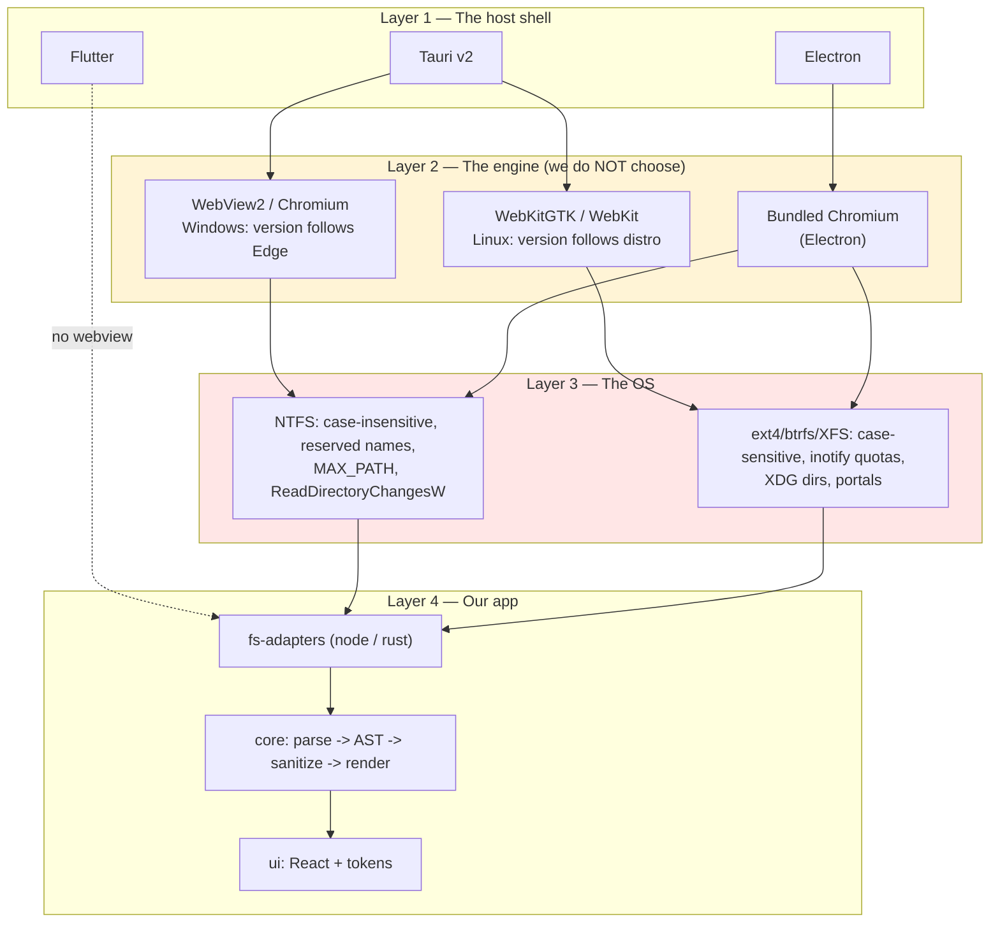

# 09 — Platform

> Desktop is not "the web with extra steps." It is the web **plus nine things the
> web deliberately refuses to give you**, nine of which are the entire product.

| # | Doc | What it answers |
|---|-----|-----------------|
| 01 | [windows.md](01-windows.md) | WebView2, MSIX/NSIS/MSI, Authenticode, `MAX_PATH`, `ReadDirectoryChangesW`, CRLF, DPI |
| 02 | [linux.md](02-linux.md) | The webview fragmentation problem, X11 vs Wayland, deb/rpm/AppImage/Snap/Flatpak/Nix, XDG, inotify, portals |
| 03 | [distribution-and-updates.md](03-distribution-and-updates.md) | CI matrices, signing per OS, auto-update mechanisms, channels, staged rollout, rollback, offline users |

---

## Why desktop is not the web

The reflexive framing — "we already have a web app, so wrap it" — is exactly the
framing that produces slow, large, crashy desktop apps. It assumes the browser is
the runtime. It isn't. On desktop the browser is **one process among several**,
and it is the *only* part of the system that knows nothing about the user's
actual files.

Here are the nine things the web platform does not give you, and why each one is
load-bearing for a Markdown viewer specifically.

### 1. A stable identity for a file

On the web, a document is a URL. Open it from a bookmark, from `localStorage`,
from a `<input type="file">` handle that dies when the tab closes. There is no
way to say "open `/home/ann/Documents/notes/2026-10-06.md`" and mean *that file
on that disk forever*.

A Markdown viewer's entire value proposition is **the file is the document**. It
has an inode, an mtime, a size, a rename history, a place on a synced drive, a
backup tool that knows about it, and a version-control system that diffs it.
Getting `content` and getting *the file* are different products.

**VERIFIED.** On Windows this identity is already awkward: NTFS is
case-insensitive but case-preserving, path lookup goes through 8.3 short-name
aliasing, and `MAX_PATH` is 260 characters unless two separate opt-ins are both
present ([Microsoft — Maximum Path Length Limitation](https://learn.microsoft.com/en-us/windows/win32/fileio/maximum-file-path-limitation)).
On Linux the path *is* the identity, and whether it is case-sensitive depends on
how the volume was mounted, not on the OS.

### 2. Change notification

The web has no primitive that tells you "this file changed on disk." There is
`StorageManager`, which is about *quota*, not mutation. The moment a viewer
becomes a live preview of the filesystem — the thing that makes a Markdown viewer
feel like a tool rather than a website — it must link against a platform API:

| Platform | API | Language binding we would use |
|----------|-----|-------------------------------|
| Windows | `ReadDirectoryChangesW` | Rust `notify` → `ReadDirectoryChangesWatcher`; Node `fs.watch` / `chokidar` |
| Linux | `inotify(7)` | Rust `notify` (inotify backend); Node `fs.watch` / `chokidar` |
| macOS | FSEvents | Rust `notify` (fsevent backend) |

Each has documented failure modes you must handle. On Windows the buffer
**silently discards** its contents on overflow and signals it only via
`lpBytesReturned == 0` ([Microsoft — ReadDirectoryChangesW](https://learn.microsoft.com/en-us/windows/win32/api/winbase/nf-winbase-readdirectorychangesw)).
On Linux, `inotify` has a hard per-user watch limit that defaults to 8192 and
that we do not control ([inotify(7)](https://man7.org/linux/man-pages/man7/inotify.7.html)).
Neither is "subscribe and be told."

### 3. A process lifecycle with a reliable end

Web pages do not get killed for using memory. They do not receive `WM_CLOSE`.
They cannot be restarted by the user without losing state. They do not get
low-memory callbacks, do not appear in the task switcher, do not have a window
that can be moved to another monitor.

Desktop apps must handle **cold start, warm start, suspend/resume, monitor
DPI change, display change, user logout, and forced termination.** Every one of
these has a web equivalent you can ignore and a desktop equivalent you cannot.

### 4. Filesystem permissions that are not "ask the browser"

Opening `file:///C:/Users/ann/notes.md` in a browser today mostly fails — modern
browsers have been progressively locking down local file access for security.
The result is that the "open a local Markdown file" flow requires either a
`File System Access API` prompt (Chromium-only, user-gesture gated, not available
in a webview host), or a native file picker. On Linux under Flatpak the user
picks a file through `xdg-desktop-portal`, and what you *receive* is a
document-portal path like `/run/user/1000/doc/Ab3kQ2p7/note.md` that is only
valid for that session ([Flatpak — Sandbox Permissions](https://docs.flatpak.org/en/latest/sandbox-permissions.html)).

This is not a detail. **It changes the design of the whole file-access layer.**

### 5. Installation, signing, and update as a first-class concern

A web app is deployed by being hosted. A desktop app is *delivered*, and delivery
means: an installer that may need elevation, a code signature that determines
whether SmartScreen screams at the user, an auto-updater with a signed manifest,
and a Store review cycle. See [03-distribution-and-updates.md](03-distribution-and-updates.md).

### 6. Offline as the default case, not an edge case

Our users have their documents on their disks. A Markdown viewer that requires a
network round-trip to be useful is a broken Markdown viewer. This has teeth:

- WebView2's default install mode **downloads a bootstrapper from Microsoft's CDN
  at install time**. Air-gapped machines cannot install that way.
- Tauri apps on Linux cannot bundle the system WebKit — they *depend* on the
  host providing `libwebkit2gtk-4.1`, and old distributions don't.

### 7. Native integration: file associations, "Open With", jump lists, protocol handlers

`myapp://open?path=...`, double-clicking a `.md` in Explorer/Nautilus, appearing
in the Windows "Open with" menu and the Linux `.desktop` `MimeType=` list, being
offered a re-open in "recent documents". All desktop-only. All expected.

### 8. The system webview, with a version you do not control

This is the single biggest platform trap. On Windows we get **WebView2** (a
Chromium fork delivered by Microsoft). On Linux we get **WebKitGTK** (delivered by
each distro, at whatever version that distro chose). Same HTML, same CSS, wildly
different versions and wildly different support for anything recent.

**VERIFIED.** `content-visibility` — the single most important CSS optimization
for long documents (see
[10-performance/01-large-files.md](../10-performance/01-large-files.md)) — shipped
in Chrome/Edge 85 and Firefox 125, and only reached Safari / WebKitGTK at 18
([MDN — content-visibility](https://developer.mozilla.org/en-US/docs/Web/CSS/Reference/Properties/content-visibility),
[web.dev](https://web.dev/articles/content-visibility)). On Ubuntu 22.04 the
system WebKitGTK is `2.36.0`. **We cannot use `content-visibility` there without
feature detection.**

### 9. A trust boundary we get to define

In a browser tab, the renderer shares a process pool with other sites and is
sandboxed by the browser vendor. In a desktop webview, the renderer is *our*
process and *our* responsibility. Untrusted Markdown — HTML in the file, a
`javascript:` link, a crafted image that triggers a decoder bug — is our bug.
That is research folder `11-security`, but it starts here: choosing a webview
host is choosing a sandbox model.

---

## The two platforms are not two dialects of one platform

The most common planning error in cross-platform desktop work is treating Windows
and Linux as "the same platform with different installers." They are not. They
disagree about almost everything that touches a file.

| Concern | Windows | Linux |
|---------|---------|-------|
| Rendering engine | WebView2 (Chromium), version follows Edge | WebKitGTK, version follows the distro |
| Engine cadence | ~2 weeks since v153 (Sept 2026) — [Microsoft](https://blogs.windows.com/msedgedev/2026/08/24/webview2-is-moving-to-a-2-week-release-cadence/) | ~6–9 months, batched into distro point releases |
| Baseline distro | Windows 10 1803+ | **Ubuntu 22.04 / Debian 12** for a `webkit2gtk-4.1` baseline |
| Path separator | `\` (and `/` mostly tolerated) | `/` |
| Path case sensitivity | Insensitive, preserving | Depends on mount (`casefold`, `nocase`, `vfat`) |
| Path length limit | 260 unless opt-in ×2 | `PATH_MAX` 4096 / `NAME_MAX` 255, effectively unbounded |
| Path identity rules | Reserved device names, illegal chars, trailing dot/space stripping | Almost none; only `/` and NUL |
| Change notification | `ReadDirectoryChangesW`, lossy buffer | `inotify`, hard watch quota |
| User config dir | `%APPDATA%` (roaming) or `%LOCALAPPDATA%` | `$XDG_CONFIG_HOME` |
| Runtime install | Signed MSI/NSIS/MSIX, elevation, SmartScreen | deb/rpm/AppImage/Snap/Flatpak, rarely signed |
| Update delivery | Our updater, or Store/App Installer | Our updater, or Snap/Flatpak store |
| Notarization | Not a concept | Not a concept |
| Code signing | **Mandatory for trust** | Effectively optional and rarely checked |
| DPI | Per-monitor v2, `WM_DPICHANGED` | HiDPI scaling compositor-side |

**RECOMMENDED.** Treat these as two implementations behind one interface. Our
`packages/fs-adapters` layer exists precisely so that `windows-adapter.ts` and
`linux-adapter.ts` can each own their platform's quirks, and so that the quirks
never leak upward into `packages/core`.

---

## What "desktop first" actually commits us to

Note the asymmetry that matters: choosing Tauri means **the engine version is the
OS vendor's problem on Windows and the distro's problem on Linux**, whereas
Electron bundles Chromium and therefore owns both. That is the real trade: a
70 MB AppImage and unpredictable Linux CSS support versus a 110 MB installer and
a uniform engine. [08-desktop-frameworks](../08-desktop-frameworks/) exists to
make that decision with data; this folder exists to make it with the platform's
opinions on the record.

---

## Platform policy (our position)

**RECOMMENDED**, recorded so we argue about it now rather than at implementation time:

1. **Windows 10 22H2 is supported for the entire life of v1.x.** Windows 10 left
   support on 2025-10-14 and the consumer ESU program now runs to 2027-10-12
   ([Microsoft — Consumer ESU](https://www.microsoft.com/en-us/windows/extended-security-updates)).
   A large fraction of note-taking users are on machines that will never see
   Windows 11. We do not get to decide that for them.
2. **Windows 11 and Windows 10 22H2 are the only supported Windows targets.**
   Windows 8.1 and below are out; Tauri itself lists "Windows 7 and later" as the
   floor for building but WebView2 + our CSS baseline makes anything pre-10-1803
   impractical.
3. **Linux baseline is Ubuntu 22.04 / Debian 12**, because that is where
   `libwebkit2gtk-4.1-dev` exists in the standard repositories and that is what
   determines the oldest glibc we can build against
   ([Tauri — AppImage limitations](https://v2.tauri.app/distribute/appimage/)).
4. **Every modern-CSS dependency is feature-detected, never assumed.** A CSS
   `@supports` guard is not optional decoration; it is the compatibility layer.
5. **We ship `AppImage` + `deb` + `rpm` on Linux, and we put Flatpak on Flathub
   once stable.** Rationale and the WebKit-version tension are worked through in
   [02-linux.md](02-linux.md#3-distribution-formats).
6. **We ship NSIS + portable ZIP on Windows, and MSIX later if Store distribution
   proves worth the review cycle.** Rationale in
   [01-windows.md](01-windows.md#3-packaging-msix-vs-nsis-vs-msi).
7. **Every release artifact is cryptographically signed, and the signature is
   over the artifact itself — never over a checksum published beside it.** See
   [03-distribution-and-updates.md §5](03-distribution-and-updates.md#5-update-integrity-this-section-is-the-one-that-matters).

---

## How to use this folder

Read [01-windows.md](01-windows.md) and [02-linux.md](02-linux.md) before
writing any filesystem code. Both are inventories of the ways a naive
implementation breaks: a reserved filename, a 261-character path, a silent watch
buffer overflow, a missing `webkit2gtk-4.1`, a Flatpak document-portal path that
disappears on logout.

Read [03-distribution-and-updates.md](03-distribution-and-updates.md) before
picking an installer format, because that choice constrains the updater, which
constrains the release process.

### Legend used throughout

| Marker | Meaning |
|--------|---------|
| ✅ **VERIFIED** | Stated by a primary source, linked inline |
| 🟡 **UNVERIFIED** | Community report or our own inference; treat as a lead, not a fact |
| 🔧 **RECOMMENDED** | Our judgement. Not a fact about the world; a decision we are making |
