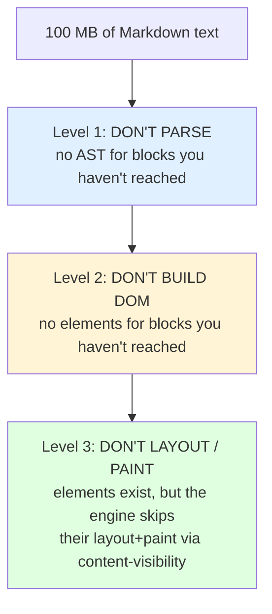

# 01 — Large Documents

> The failure mode is not "the app is slow." It is "the app shows a white window
> for four seconds and then says *this document is too large*." Users experience
> that as **the app doesn't work with my files.**

Legend: ✅ **VERIFIED** (cited) · 🟡 **UNVERIFIED** (community / inference) ·
🔧 **RECOMMENDED** (our judgement)

---

## 1. The size ladder

Every number below is an estimate with a stated basis, not a measurement of our
app. 🟡 They are planning figures. The mechanism descriptions are what matter;
the exact multiplier must be re-measured by the experiment in §8.

| Tier | Size | Example | Blocks (est.) | DOM elements (est.) | Strategy |
|------|------|---------|---------------|---------------------|----------|
| **T0 — trivial** | ~5 KB | A typical project `README.md` | 40–120 | 150–500 | Render everything. Nothing special. |
| **T1 — normal** | ~100 KB | A long technical design doc; a chapter | 1,500–4,000 | 5,000–15,000 | Render everything, but `content-visibility: auto` on top-level blocks |
| **T2 — book** | 2–10 MB | Project Gutenberg text; a vendored spec bundle; a huge generated API reference | 40,000–150,000 | 150,000–600,000 | `content-visibility` + **incremental parse** + block windowing for off-screen tails |
| **T3 — pathological** | ~100 MB | A concatenated log archive; a generated `all-transcripts.md`; a SQLite `.dump` renamed | 2M+ | 8M+ | **Never materialise.** Outline-only + on-demand chunk rendering, with an explicit, honest UI |

### Where the estimates come from

🟡 DOM element count is the load-bearing estimate, and the ratio is what matters:

- A paragraph of 80 words with inline emphasis: **1 `<p>` + ~1.3 `<em>`/`<code>`/
  `<a>` per 10 words + 1 text node per contiguous run** → roughly **1.3 elements
  per word** in inline-heavy prose, and closer to **0.4 elements per word** in
  plain prose.
- A fenced code block with highlighting: **1 `<pre>` + 1 `<code>` + ~1 `<span>`
  per token**. A 40-line block of dense code can be **400–900 elements**. This is
  the single worst element-density offender in Markdown, and it is why
  offscreen highlighting (§8) matters so much.
- A table: **1 `<table>` + row/cell wrappers ≈ 1.4 elements per cell**.

---

## 2. What breaks, tier by tier

### 2.1 Parsing

🟡 A conforming block/inline Markdown parser in JS runs somewhere in
**10–40 MB/s** of input. That gives, single-threaded:

| Size | Single-thread parse |
|------|---------------------|
| 100 KB | **3–10 ms** |
| 2 MB | **50–200 ms** |
| 10 MB | **250 ms–1 s** |
| 100 MB | **2.5–10 s** |

🔴 **Two consequences at the top of the range.**

1. At 10 MB a full parse is already **a visible hitch**, and on the
   WebKitGTK 2.36 baseline (Ubuntu 22.04) with a mid-range laptop it is worse.
   Anything over ~1 ms of main-thread work is a dropped frame; a 250 ms parse is
   15 dropped frames.
2. At 100 MB, a full parse is **between 2.5 and 10 seconds on the main thread.**
   No amount of rendering cleverness fixes that, because the parse must finish
   before *any* of the AST exists. This is why §6 exists.

🔧 **RECOMMENDED**: parse in a **Web Worker** from day one, and parse
**block-wise** so the first blocks are available in ~5 ms rather than ~10 s.

### 2.2 DOM construction

✅ **VERIFIED** — the reference thresholds everyone quotes come from Lighthouse:
*"a page's DOM size is excessive when it exceeds **1,400 nodes**. Lighthouse will
begin to throw warnings when a page's DOM exceeds **800 nodes**"*
([web.dev — How large DOM sizes affect interactivity](https://web.dev/articles/dom-size-and-interactivity)).

Read those numbers carefully, because they are widely mis-cited. They are
**Lighthouse audit thresholds for web pages**, chosen to flag accidental
bloating — a blog post with a nav, a hero, a comment widget. They are **not**
engine limits and they are **not** a statement that 1,500 nodes is "slow". A
document view legitimately exceeds them.

What ✅ **VERIFIED** *does* say about why size matters:

> 1. During the page's initial render — more time in layout, styling, compositing
>    and paint.
> 2. **When interactions modify the DOM** — *"the work necessary to render that
>    update can result in very costly layout, styling, compositing, and paint
>    work… If an interaction results in a change to the DOM, it can kick off a lot
>    of work that can contribute to a poor INP."*
> 3. When JavaScript queries the DOM — *"references to DOM elements are stored in
>    memory."*

That second point is the one that matters for a viewer. **Our hot path is not
initial render — it is scroll, find-in-page, click-a-heading-to-scroll, and
re-render-on-file-change. Every one of those is an interaction that mutates the
DOM in a large tree.**

### 2.3 Layout

Layout is superlinear in the number of boxes it must consider, and the constants
dominate at scale. For a block-flow document the incremental cost is mostly
linear (each block's layout depends on the previous block's position), but:

- Every block's **style recalculation** walks its subtree and re-evaluates every
  matching selector against it.
- **Shrink-to-fit, tables, and float-containing blocks break linearity**,
  because they require the layout engine to look ahead and behind.
- A `position: sticky` header, a `position: absolute` footnote, or a
  `background-attachment` on the scroll container invalidates far more than it
  should. See
  [02-rendering-pipeline-performance.md §5](02-rendering-pipeline-performance.md#5-the-cost-of-large-fixed-and-absolutely-positioned-elements).

🔴 **Markdown makes this worse than plain HTML** because blockquote nesting,
list nesting and table cells create deep trees. ✅ **VERIFIED** — web.dev's
remedy for a large DOM is to *"reduce DOM depth"*, and notes that component
frameworks make this easy to get wrong. 🔧 Our renderer must emit **flat**
structures: `<blockquote><p>…</p></blockquote>`, not `<blockquote><div><p>…`.

### 2.4 Memory

🟡 Budget-per-thing, for planning:

| Item | Bytes (est.) | 10 MB doc |
|------|--------------|-----------|
| Canonical text (`string`, UTF-16 in the DOM) | 2× bytes | 20 MB |
| Block AST (objects + strings + arrays) | 8–25× bytes | 80–250 MB |
| Serialised HTML string | 1.5–4× bytes | 15–40 MB |
| DOM (elements + style + layout objects) | 3–8× bytes of HTML | 45–320 MB |
| Total | | **160 MB – 630 MB** |

🔧 **The AST is the biggest single item and the easiest to fix.** It is pure heap
that is dead the moment the HTML is built. 🔧 Rule: **the block AST for
off-screen blocks must be reclaimable.** That is the entire argument for
block-wise parsing with per-block discard in §6.

### 2.5 Engine limits

🟡 **There is no hard DOM-node limit in any of our three engines.** Browsers do
not crash at 1M nodes; they get slow, then memory-hungry, then unusable. There
*is* a practical ceiling in the low millions of nodes on a 4 GB machine, but it is
a function of per-node cost and available RAM, not a documented constant.

🟡 **The limits that *are* real and documented** are elsewhere:

- **Web Workers**: Safari historically had a much lower per-worker memory cap than
  Chromium. 🟡 Verify the current cap before relying on a worker for a 100 MB
  document.
- **String length**: JS strings can be up to ~2^29 characters on 64-bit V8/Hermes
  and ~1 GB on 64-bit SpiderMonkey; 🟡 all are far above 100 MB, so a 100 MB
  document fits in one string. ✅ The real limit is the *DOM*, not the string.
- **`innerHTML` with very large strings**: parsing a 100 MB HTML string is
  memory-expensive and can hit the engine's HTML parser allocation limits. 🟡
  Feed the DOM in chunks.

🔧 **We should define our own limit and own it.** 🟡 Recommended:

| File size | Behaviour |
|-----------|-----------|
| ≤ 2 MB | Full parse, full render, `content-visibility` on all blocks |
| 2–20 MB | Incremental parse, block windowing, offscreen highlighting |
| 20–100 MB | Outline/skeleton immediately + "load more" as you scroll; warn once |
| > 100 MB | **Refuse to open, and say why.** Offer to open in outline mode. |

🔴 **"Refuse, and say why" is a feature, not a failure.** Every serious tool does
this — editors, PDF readers, log viewers. A tool that hangs is worse than a tool
that says "this is 100 MB; I will show you the structure and let you load
sections."

---

## 3. Three levels of "render only what's visible"

This is the mental model the rest of this document implements. There are **three**
distinct levels, and they are independent:



| Level | Saves | Costs | Mechanism |
|-------|-------|-------|-----------|
| **1. Don't parse** | CPU, AST memory | You cannot find, search, or navigate to what you haven't parsed | Block-wise parse + discard, or lazy per-block reparse from source offsets |
| **2. Don't build DOM** | DOM memory, style recalc scope, accessibility tree size | Same as level 1, plus `find-in-page` cannot see it | Block windowing / virtual scrolling |
| **3. Don't layout/paint** | **Layout, paint and composite time** — the expensive part | Almost nothing. DOM is intact; find-in-page, selection, focus and the a11y tree all work | **`content-visibility: auto` + `contain-intrinsic-size`** |

🔴 **Level 3 is free and level 1/2 are expensive.** Almost every team reaches for
virtual scrolling because virtual scrolling is what everyone talks about, and
skips `content-visibility` because they have never heard of it. **We do both, in
that order of value: level 3 everywhere, level 2 only above ~2 MB, level 1 only
above ~20 MB.**

---

## 4. `content-visibility` — the single biggest CSS win

### 4.1 What it does

✅ **VERIFIED** — *"An element that has `content-visibility: auto` gains `layout`,
`style` and `paint` containment. If the element is off-screen (and not otherwise
relevant to the user — relevant elements would be the ones that have focus or
selection in their subtree), it also gains `size` containment (and it stops
painting and hit-testing its contents)"*
([web.dev — content-visibility](https://web.dev/articles/content-visibility)).

✅ **VERIFIED** — the measured result, from the same article: *"In our article
demo, applying `content-visibility: auto` to chunked content areas gives a **7x**
rendering performance boost on initial load"*, and in the detailed example,
*"rendering times going from **232ms** to **30ms** on initial page load… That's a
**7x** performance boost"* on a travel-blog page.

✅ **VERIFIED** — the expected general shape: *"expected reduction of **50% or
more** from the rendering cost of loading."*

Note the important qualifier ✅ **VERIFIED** in the same article: *"The browser
is only able to skip rendering work if you are also careful not to call any DOM API
that forces some of rendering to occur on one of the skipped subtrees."* That is
a footnote with a trapdoor in it, and §5 covers it.

### 4.2 Browser support, and whether *we* have it

✅ **VERIFIED** — support: **Chrome 85, Edge 85, Firefox 125, Safari 18**.
web.dev notes it *"becomes Baseline Newly available as of September 15, 2025"*
([web.dev](https://web.dev/articles/content-visibility)); MDN labels it
**Baseline 2024 · Newly available**
([MDN — content-visibility](https://developer.mozilla.org/en-US/docs/Web/CSS/Reference/Properties/content-visibility)).

Mapping that to our three engines:

| Our platform | Engine | Has `content-visibility`? |
|---|---|---|
| Windows (WebView2) | Chromium, auto-updating | ✅ Chrome 85 = **2020**. Always yes. |
| macOS (WKWebView) | WebKit | ✅ Safari 18 = **Sept 2024** |
| Linux, modern distro (WebKitGTK 2.48+, e.g. Ubuntu 24.04's 2.52.6) | WebKit | ✅ **expected** |
| **Linux, Ubuntu 22.04 (WebKitGTK 2.36.0)** | WebKit, Jan 2023 | 🟡 **probably not** |

🟡 **UNVERIFIED:** the exact WebKitGTK version that picked up Safari 18's engine
changes. Safari 18 shipped 2024-09; WebKitGTK's release train typically tracks
Safari majors within a release or two, so 2.48/2.49 is the likely boundary —
**but we must verify against a real 2.36 build, not reason about it.**

🔴 Therefore:

```css
/* The feature is applied unconditionally. The @supports block is not a
   fallback for a different property — it is how we detect the ABSENCE of the
   optimisation so we can compensate in JS. */
.md-block {
  content-visibility: auto;
  contain-intrinsic-size: auto 640px;
}

/* If the engine does not support it, we fall back to level-2 windowing,
   which is strictly more work but is what makes a 10 MB book usable at all. */
@supports not (content-visibility: auto) {
  .md-block[data-virtualised] { display: none; }
}
```

```ts
export const hasContentVisibility =
  CSS.supports('content-visibility', 'auto') &&
  CSS.supports('contain-intrinsic-size', 'auto 100px');

/** Reported to the perf harness so our measurements are honest about which
 *  code path produced them. */
window.__perf.contentVisibility = hasContentVisibility;
```

🔧 **This is the pattern for every modern-CSS dependency in this project.** A CSS
feature is *used unconditionally*, *detected at runtime*, and *compensated in JS
when absent*. There is no version sniffing of the webview, because on Windows the
version changes every two weeks
([09-platform/01-windows.md §2](../09-platform/01-windows.md#2-webview2--what-it-actually-is)).

### 4.3 `contain-intrinsic-size`, and why `auto` matters

Without `contain-intrinsic-size`, a size-contained element with no specified
height **lays out as 0-height**, and the scrollbar collapses and grows as you
scroll. ✅ **VERIFIED** — `contain-intrinsic-size` *"effectively specifies the
natural size of the element if the element is affected by size containment"*.

✅ **VERIFIED** — the `auto` keyword *"causes the browser to remember the
last-rendered size, if any, and use that instead of the developer-provided
placeholder size"*, e.g. `contain-intrinsic-size: auto 300px` *"will start out
with a 300px intrinsic sizing in each dimension, but once the element's contents
are rendered, it will retain the rendered intrinsic size."* In practice this
means a block that has been scrolled past keeps its real height.

✅ **VERIFIED** — MDN's own long-document example uses exactly this:

```css
section {
  content-visibility: auto;
  contain-intrinsic-size: auto 500px;
}
```

🔧 **RECOMMENDED**: `contain-intrinsic-size: auto <estimate>` with a per-block-type
estimate, where the estimate is a function of the source text length so it starts
close:

```css
.md-block[data-kind="paragraph"] { contain-intrinsic-size: auto calc(var(--src-chars) * 0.55em); }
.md-block[data-kind="heading"]   { contain-intrinsic-size: auto 2.4em; }
.md-block[data-kind="code"]     { contain-intrinsic-size: auto calc(var(--src-lines) * 1.5em + 2em); }
.md-block[data-kind="table"]    { contain-intrinsic-size: auto calc(var(--src-rows) * 2.2em + 2em); }
```

We set `--src-chars`/`--src-lines` from the source offsets we already know from
the block-wise parse, at ~zero cost. **Better scrollbar stability than a flat
500 px, for free.**

### 4.4 The accessibility trap — read this twice

✅ **VERIFIED** — *"Off-screen content within a `content-visibility: auto`
property remains in the document object model and the accessibility tree. This
allows improving page performance with `content-visibility: auto` without
negatively impacting accessibility"*
([MDN](https://developer.mozilla.org/en-US/docs/Web/CSS/Reference/Properties/content-visibility)).

✅ **VERIFIED** — and the consequence that trips everyone up: *"Since styles for
off-screen content are not rendered, elements intentionally hidden with
`display: none` or `visibility: hidden` **will still appear in the accessibility
tree**."* The fix: *"use `aria-hidden="true`."*

🔴 **Two hard rules for us:**

1. **Never use `content-visibility: auto` as an accessibility or privacy
   mechanism.** It does not hide anything from AT, and it does not stop
   `find-in-page`.
2. **If we use `content-visibility: hidden` anywhere** (we might, for inactive
   panes), ✅ **VERIFIED** — its *"skipped contents must not be accessible to
   user-agent features, such as find-in-page, tab-order navigation, etc."* So it
   **breaks find-in-page and keyboard navigation**. For a document viewer that
   is disqualifying in most places.

### 4.5 The DOM-API trap

✅ **VERIFIED** — *"The browser is only able to skip rendering work if you are also
careful not to call any DOM API that forces some of rendering to occur on one of
the skipped subtrees."*

The classic offenders, all of which force style/layout on the subtree you touch:

```js
el.offsetHeight; el.offsetTop; el.offsetParent;   // layout
el.getBoundingClientRect(); el.getClientRects();  // layout
el.scrollHeight; el.scrollTop = n;                // layout + paint
window.getComputedStyle(el);                     // style recalc
el.focus();                                      // may force scroll-into-view
```

🔧 **RECOMMENDED**, three rules:

1. **Never measure an off-screen `.md-block`.** If we need a block's height (to
   implement find-in-page's hit-testing, or scroll-to-heading), we do it in this
   order:
   - use the cached measurement from when it was last rendered (`auto` in
     `contain-intrinsic-size` means the browser has it, but not exposed to us),
   - else use our **text-length-based estimate**,
   - else `scrollIntoView()` it first (which makes it *relevant to the user*,
     which by definition un-skips it) and *then* measure.
2. **Own the scroll position.** Our scroll container is ours. Do not read
   `scrollHeight` of the document in a hot loop; maintain a running total of
   block heights as they are measured.
3. **Audit in CI.** 🔧 Run the render scenario with
   `PerformanceObserver` for `long-animation-frame`, and grep our own source for
   `offsetTop`/`getBoundingClientRect` inside render paths. This is a lint rule
   we can write.

✅ **VERIFIED bonus** — MDN documents a dedicated event for exactly this state
change: **`contentvisibilityautostatechange`** *"fires on any element with
`content-visibility: auto` set on it when its rendering work starts or stops being
skipped"*. 🔧 Use it to trigger **offscreen syntax highlighting** (§8) precisely
when a block becomes relevant, with no scroll-handler heuristics at all. This is
the cleanest mechanism available and it is very underused.

---

## 5. `content-visibility` in our renderer — the shape

Our HTML for a block is flat, and each top-level block is its own containment
root:

```html
<article class="doc" data-doc-id="…">
  <section class="md-block" data-kind="heading" data-level="2" id="src-0142">
    <h2>Storage engine</h2>
  </section>
  <section class="md-block" data-kind="paragraph" data-src-start="151" data-src-end="612">
    <p>WebKitGTK ships two API generations: <code>webkit2gtk-4.0</code> and
    <code>webkit2gtk-6.0</code>…</p>
  </section>
  <section class="md-block" data-kind="code" data-src-start="613" data-src-end="1404"
           data-lang="rust">
    <pre><code class="language-rust">…</code></pre>
  </section>
</article>
```

```css
.md-block {
  content-visibility: auto;
  /* `auto` first so the browser remembers real sizes; the px is only the
     pre-render estimate and is refined by --src-* as shown in §4.3. */
  contain-intrinsic-size: auto 640px;
  /* Own containment so a block's internal layout can never invalidate
     the whole document's layout. */
  contain: layout style;
}

/* Nested content (list items inside a list block, cells inside a table) is NOT
   separately contained — a list block is one containment root. Over-chunking
   costs scrollbar stability and gains nothing. */
.md-block > .md-block { content-visibility: visible; }
```

🔴 **Chunk granularity is a real design decision, and "one section per top-level
block" is the right default.** Too coarse (the whole document is one block) and
level 3 does nothing. Too fine (every `<p>`) and you pay for thousands of
containment roots, get scrollbar jitter, and lose `find-in-page`'s ability to
reason about the text.

---

## 6. Incremental and block-wise parsing

### 6.1 The design

The block scanner's whole job is to find *top-level block boundaries* and their
source offsets. Once we have `(start, end, kind, level)` for every top-level
block — which is a **line-oriented scan**, not a full parse — we have everything:

- we can parse, render and measure any block **independently**;
- we can skip a block's inline parsing entirely and still know its byte range;
- we can re-parse one block on file change without touching the others;
- we can **discard** a block's AST after its HTML is built.

```ts
export interface BlockSpan {
  index: number;
  /** Byte offsets into the canonical (LF-normalised) text. */
  start: number;
  end: number;
  kind: 'heading' | 'paragraph' | 'list' | 'code' | 'table' | 'blockquote' | 'html' | 'hr';
  level?: number;       // heading depth, list nesting
  fenceLang?: string;   // for code blocks
}

/** Stage 1 — O(lines). Never O(n²). Never allocates per-inline-token. */
export function scanBlocks(text: string): BlockSpan[];

/** Stage 2 — parses one block's inlines and returns its HTML. */
export function renderBlock(text: string, span: BlockSpan): string;
```

### 6.2 The scheduler

🔧 **RECOMMENDED** — the critical property is that **the visible blocks are
parsed before anything else, on the main thread, immediately**, and everything
else is scheduled around user-visible work:

```ts
async function openDocument(doc: Doc) {
  performance.mark('doc:open:start');

  // 1. Text (IPC) — already canonical, already LF-normalised.
  const text = await doc.read();
  performance.mark('doc:text');

  // 2. Block scan. Cheap, synchronous, on the main thread: it is a line scan.
  //    For 100 MB this is still only tens of ms, and it is what unlocks
  //    everything else. If it ever becomes hot, move it to the worker and
  //    ship the first N spans over IPC — see the budget note below.
  const spans = scanBlocks(text);
  performance.mark('doc:scanned');

  // 3. Build a proportional spacer so the scrollbar is correct immediately.
  //    Cheap, no DOM per block, no layout of real content.
  const shell = renderEmptyShell(spans);        // <section> per block, empty
  article.replaceChildren(shell);
  performance.mark('doc:shell');

  // 4. Parse + render ONLY the blocks in the viewport, synchronously.
  const first = visibleRange(shell, viewportTop, viewportBottom, spans);
  for (const span of first) hydrate(span);        // text -> HTML -> DOM
  performance.mark('doc:first-visible');
  await afterPaint();

  // 5. Everything else, cooperatively, forever after.
  scheduleRest(article, spans, first);
  performance.mark('doc:open:done');
}
```

`scheduleRest` uses **`scheduler.yield()` when available** and falls back to a
`MessageChannel`/`setTimeout(0)` shim otherwise. Both yield to input and paint;
🟡 `scheduler.yield()` availability on WebKitGTK 2.36 is **unverified** and is
exactly the kind of thing the shim exists for. 🔧 Never use
`requestIdleCallback` alone — it is throttled to near-zero in background tabs and
never fires in some WebView configurations.

```ts
function scheduleRest(root: HTMLElement, spans: BlockSpan[], done: Set<number>) {
  const yield_ = (globalThis as any).scheduler?.yield
    ? () => (globalThis as any).scheduler.yield()
    : () => new Promise<void>(r => {
        const ch = new MessageChannel();
        ch.port1.onmessage = () => r();
        ch.port2.postMessage(0);
      });

  (async () => {
    const queue = spans.filter(s => !done.has(s.index));
    for (const span of queue) {
      await yield_();
      if (!document.contains(root)) return;        // user closed the document
      if (isNearViewport(span)) hydrate(span);     // prioritise what's visible
    }
  })();
}
```

🔧 **The worker question.** 🔴 For ≥ 20 MB, parse in a **Worker** and ship HTML
strings back. Two costs we must accept: (a) one structured-clone of the text per
document, and (b) the highlighter itself wants a worker anyway (§8), so we get
two workers and must pool them. 🔴 **Do not put the highlighter and the parser
in the same worker** — a 2000-line highlighted code block would starve the
parser and delay the paragraphs around it.

---

## 7. Virtual scrolling over block boundaries

### 7.1 When it is actually needed

| Tier | Level 3 (`content-visibility`) | Level 2 (windowing) | Level 1 (lazy parse) |
|------|-------------------------------|---------------------|----------------------|
| ≤ 2 MB | ✅ enough | ❌ | ❌ |
| 2–20 MB | ✅ helps a lot | ✅ needed for DOM memory | partial |
| 20–100 MB | ✅ helps a lot | ✅ needed | ✅ needed |
| > 100 MB | ✅ helps | ✅ | ✅ mandatory |

🟡 **Windowing is a real cost, not a free win.** What you give up:

- **`find-in-page`** (Ctrl+F) cannot find text that is not in the DOM. This is
  the killer. Users of a Markdown viewer search.
- **Select-all-and-copy** copies only the rendered window.
- **Browser "save page" / "print to PDF"** captures only the window.
- **Anchor navigation** (`#some-heading`) needs the target present.
- **Screen readers** virtualise strangely in some implementations.
- **Scrollbar fidelity** requires an accurate spacer height, which requires
  knowing every block's height, which is the thing you were avoiding measuring.

### 7.2 The design that keeps find-in-page working

🔧 **RECOMMENDED**: **window the DOM, not the text.** That is:

- The **full canonical text** stays in memory (it has to — it is the source of
  truth for the search index anyway).
- A **search index is built in the worker during the initial block-wise parse**,
  covering every block including the ones not yet in the DOM.
- When the user hits Ctrl+F:
  - we **intercept** it (`keydown`, `Ctrl/Cmd+F`), search our index, and present
    our own find UI with a match count and next/previous,
  - each selected match causes `scrollIntoView()` on its block, which — ✅
    **VERIFIED** — makes it *"relevant to the user"*, which un-skips it, which
    renders it, and only then do we measure it for hit-testing.

🔴 **The trade is honest and must be documented:** we replace the browser's
find bar with our own. That is more code and more work for us, and it is the only
way to have both a 100 MB document and Ctrl+F.

If we decide not to build our own find bar, then windowing is capped at 20 MB and
above that we are outline-only.

### 7.3 The spacer

🔧 Windowing needs a scrollbar that is stable and honest:

```html
<div class="doc-viewport" style="height: <total-estimate>px">
  <!-- absolutely positioned window of hydrated blocks, translated by offset -->
  <div class="doc-window" style="transform: translateY(<window-top>px)">…</div>
</div>
```

- The viewport height is `sum(block.measuredHeight ?? block.estimate)`.
- We **measure** a block's real height once, when it is first rendered, and cache
  it. With `contain-intrinsic-size: auto`, the *browser* also remembers it; we
  remember it too, in our own map, so we do not have to ask.
- When a measured height differs from the estimate by > 20%, we adjust the total
  **and** compensate by shifting the window's `translateY` so the content under
  the viewport does not jump.

---

## 8. Offscreen highlighting, and the experiment we must run

### 8.1 Why highlighting is the worst offender

🟡 A syntax-highlighted block emits **one `<span>` per token**. A 40-line
function in Rust with strings, comments and lifetimes can be 600–1000 elements.
🟡 For a 2 MB document that is 20% of which is code, that is **hundreds of
thousands of elements in `<span>`s alone** — and they are all *inside* blocks that
level 3 would otherwise have skipped laying out.

🔧 **Therefore: never highlight synchronously during render. Highlight on
`contentvisibilityautostatechange`.**

```ts
const pool = new HighlightPool({ size: Math.max(1, (navigator.hardwareConcurrency ?? 4) - 1) });
const cache = new LruCache<string, string>({ maxBytes: 32 * 1024 * 1024 }); // §03

document.addEventListener('contentvisibilityautostatechange', (e) => {
  const sec = (e.target as HTMLElement).closest('.md-block') as HTMLElement | null;
  if (!sec || sec.dataset.hydrated === '1') return;

  // Cheap gate: never highlight a block the user is not near.
  if (!isNearViewport(sec, 1.5)) return;

  const source = canonicalText.slice(+sec.dataset.srcStart!, +sec.dataset.srcEnd!);
  const lang = sec.dataset.lang ?? 'plaintext';
  const key = `${lang}\0${source}`;

  const hit = cache.get(key);
  if (hit) { applyHighlight(sec, hit); return; }

  sec.dataset.hydrated = 'pending';
  pool.run(lang, source)
    .then(html => { if (sec.isConnected) { cache.set(key, html); applyHighlight(sec, html); } })
    .catch(() => { if (sec.isConnected) applyPlain(sec); });
});
```

🔧 Notes on the design:

- **Cache key is the exact source slice**, not the block index. Two identical
  code blocks in a document must not highlight twice.
- **`isConnected` check before every DOM write.** A user who scrolls a 10 MB book
  fast will have discarded the block; writing to it is wasted work and a
  detached-node leak ([03](03-memory-and-startup.md#4-leak-hunting-in-a-long-lived-app)).
- **Byte-budgeted LRU, not count-bounded.** Highlighting HTML is variable-size;
  a 2000-entry count limit is a memory leak with extra steps.
- **`plaintext` gets no worker round-trip.** Untagged fences render as plain
  `<pre>` immediately; sending them to a worker is pure latency.
- 🟡 **Fallback:** if `contentvisibilityautostatechange` is unsupported (our
  WebKitGTK 2.36 floor), fall back to an `IntersectionObserver` with
  `rootMargin: '150% 0px'`. Functionally identical, slightly less precise.

### 8.2 The experiment

🟡 **We have a real measurement for `content-visibility` (232 ms → 30 ms, 7×) and
we do not have one for our app.** That is not acceptable for a project whose
central claim is performance. So: here is the experiment, written down so it
cannot be skipped.

**Fixtures** (`packages/test-fixtures/sizes/`, generated by a checked-in script so
they are byte-identical in CI and in a developer's tree):

| Fixture | Bytes | Composition |
|---------|-------|-------------|
| `t0-readme.md` | ~5 KB | Real-world `README.md` (Apache-2.0 or MIT) |
| `t1-tech.md` | ~100 KB | Assembled from this repository's own `docs/`, concatenated |
| `t2-book.md` | ~4 MB | A public-domain book from Project Gutenberg (`pg11.txt`, *Alice in Wonderland*) |
| `t2-book-code.md` | ~4 MB | The same, with 30% of lines wrapped in fenced `js`/`rust` blocks |
| `t3-pathological.md` | ~100 MB | Generated: 40,000 blocks of mixed prose/tables/code |

**Matrix** — 5 fixtures × 5 configurations × 3 engines:

| # | Configuration | Level 1 | Level 2 | Level 3 |
|---|---------------|---------|---------|---------|
| A | Naive: full parse, `innerHTML` for the whole document, no CSS | ✅ | ❌ | ❌ |
| B | A + flat DOM + one `content-visibility: auto` per top-level block | ✅ | ❌ | ✅ |
| C | B + incremental block-wise parse with discard | ✅ | ❌ | ✅ |
| D | C + block windowing above 2 MB (virtual scrolling) | ✅ | ✅ | ✅ |
| E | D + offscreen highlighting in a worker pool | ✅ | ✅ | ✅ |

**Engines**: WebView2 on Windows 11 and Windows 10 22H2; WebKitGTK 2.52.6
(Ubuntu 24.04) and 2.36.0 (Ubuntu 22.04). The Ubuntu 22.04 row is not optional —
it is the configuration where `content-visibility` is probably absent, and it
proves the `@supports` fallback works.

**What to record, per cell:**

```jsonc
{
  "fixture": "t2-book-code.md",
  "config": "E",
  "engine": "WebKitGTK 2.36.0",
  "contentVisibilitySupported": false,
  "marks": {                       // ms
    "doc:text": 31, "doc:scanned": 62, "doc:shell": 88,
    "doc:first-visible": 214, "doc:open:done": 3120
  },
  "dom": { "elements": 18422, "maxDepth": 11 },
  "jsHeapMiB": 214.5,
  "treeRssMiB": 612, "treePssMiB": 401,
  "scroll": { "fpsP50": 58, "fpsP1": 44, "longTasksDuringScroll": 3 },
  "findP95Ms": 41
}
```

**The three questions the experiment must answer, before we commit:**

1. **How much does each level actually buy on *our* document shape?** The 7× from
   web.dev was on a travel blog with photos. A book is 90% text; the ratio may be
   much better or much worse. 🔴 We do not know, and we will not guess.
2. **Does level 3 alone get a 4 MB book to 60 fps?** If yes, we may not need
   windowing until 20 MB, and we can defer the most complex code in this
   document. If no, windowing is v1 work, not v1.1 work.
3. **Is WebKitGTK 2.36 fast enough without `content-visibility`?** If Ubuntu 22.04
   users get a materially worse experience, that is a product decision (do we
   state a higher minimum, or do we ship Flatpak to them?) and it belongs in
   [15-open-questions](../15-open-questions/).

🔧 **Until the experiment runs, every strategy tier in §2.5 is a hypothesis.**
Write it down as one. That is what this folder is for.

---

## Sources

- [web.dev — content-visibility: the new CSS property that boosts your rendering performance](https://web.dev/articles/content-visibility) — 232 ms → 30 ms, 7×, containment semantics, `contain-intrinsic-size: auto`, `content-visibility: hidden` comparison, accessibility notes
- [MDN — content-visibility](https://developer.mozilla.org/en-US/docs/Web/CSS/Reference/Properties/content-visibility) — Baseline 2024 Newly available, Chrome 85 / Edge 85 / Firefox 125 / Safari 18, accessibility caveat about `display:none` appearing in the a11y tree, `contentvisibilityautostatechange`
- [web.dev — How large DOM sizes affect interactivity, and what you can do about it](https://web.dev/articles/dom-size-and-interactivity) — Lighthouse thresholds (800 warn / 1,400 fail), the three mechanisms by which DOM size costs, reducing DOM depth, `content-visibility` as a mitigation
- [MDN — contain-intrinsic-size](https://developer.mozilla.org/en-US/docs/Web/CSS/Reference/Properties/contain-intrinsic-size) · [CSS Containment](https://developer.mozilla.org/en-US/docs/Web/CSS/Guides/Containment)
- [urhoba — Measuring package size and memory usage, 2026-09-24](https://www.urhoba.net/en/post/measuring-package-size-and-memory-usage) — multi-process tree measurement methodology, RSS vs PSS
