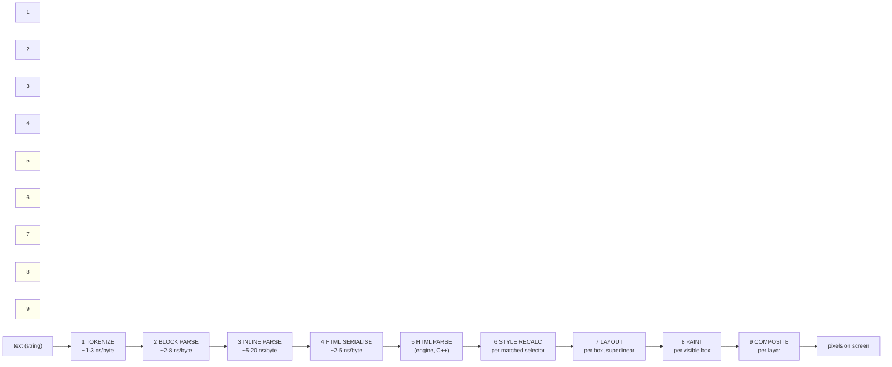

# 02 — Rendering Pipeline Performance

> "The parse is fast but the app is janky." That sentence almost always means the
> parse was never the problem. It means we did layout work on the main thread
> that the user could feel.

Legend: ✅ **VERIFIED** (cited) · 🟡 **UNVERIFIED** · 🔧 **RECOMMENDED**

---

## 1. The pipeline, and where each millisecond lives



Stages 1–4 are **ours** (JS, in a worker if we do it right). Stages 5–9 are
**the engine's** and we can only influence them via the HTML we emit and the CSS
we ship.

🔴 **The intuition that gets this wrong:** people assume rendering is expensive
because of "DOM insertion." Stage 5 (the engine's HTML parser) is fast — it is
C++ and it does nothing but build nodes. The expensive stages are 6–8, and they
are expensive **per box and per matched selector**, not per byte. That is why a
4 MB book of plain paragraphs is fine and a 400 KB book of highlighted code is
not.

### Stage cost table

🟡 All figures are planning estimates except where marked ✅. They exist to rank
the stages, not to be quoted.

| Stage | What determines cost | Cost driver for a Markdown doc | In our control? |
|-------|---------------------|----------------------------------|-----------------|
| 1 Tokenize | input length, regex vs hand-rolled | bytes | ✅ fully |
| 2 Block parse | line count, lookahead depth | lines + nesting depth | ✅ fully |
| 3 Inline parse | inline-token count, delimiter scanning | **emphasis/link/code density** | ✅ fully |
| 4 Serialise | string concatenation | bytes of HTML | ✅ fully |
| 5 HTML parse | engine HTML parser | DOM nodes | partially (we choose the markup) |
| 6 Style recalc | **selector count × element count × specificity** | 🔴 **our stylesheet's shape** | ✅ via CSS |
| 7 Layout | box count, layout mode, **containment** | 🔴 **our markup's depth** | ✅ via markup + `content-visibility` |
| 8 Paint | **visible** box count, raster area | images, box-shadows, borders | ✅ via CSS |
| 9 Composite | layer count, layer area | `position`, `will-change`, `transform` | ✅ via CSS |

🔴 **Stage 6 is the one everybody underestimates.** ✅ **VERIFIED** — *"When CSS
selectors increase in specificity, the CSSOM becomes more complex, and more time
is needed to run the necessary layout, styling, compositing, and paint work"*
([web.dev — DOM size and interactivity](https://web.dev/articles/dom-size-and-interactivity)).
And critically, ✅ **VERIFIED** — the same article's screenshot analysis: selecting
a *Recalculate Style* slice in DevTools reports **how many DOM elements were
affected**, and *"2,547 DOM elements were affected"* for a single interaction.

🔴 A stylesheet with 400 selectors, many descendant combinators, and high
specificity, applied to 150,000 elements, makes **every DOM mutation** expensive.
We can cut this by an order of magnitude with a flat class vocabulary, and it
costs nothing.

---

## 2. Stage 4→5: string building vs DOM insertion

This is the question "should I use `innerHTML`, `DocumentFragment`, or
`createElement`?" The answer is stable and slightly counter-intuitive:

| Method | Typical relative cost (🟡) | Why |
|--------|---------------------------|-----|
| `el.innerHTML = bigString` | **baseline** | One call into the engine's C++ HTML parser. Parsing is cheaper than constructing from JS because the parser is native and the string is already built. |
| `innerHTML` per block, many times | worse than one big `innerHTML` | N crossings of the JS↔engine boundary; each may trigger a microtask/style recalc |
| `template.innerHTML` then `cloneNode` | ≈ same as `innerHTML` | Extra copy |
| `document.createDocumentFragment()` + `appendChild` in a loop | 2–5× slower | Every node is constructed through the JS binding layer |
| `createElement` + `setAttribute` in a loop | **5–15× slower** | Per-property crossing; `setAttribute` stringifies |
| `el.insertAdjacentHTML('beforeend', s)` | ≈ `innerHTML` | Same parser |
| `Range.createContextualFragment` | ≈ `innerHTML` | Parses with the right context |

🔴 **Why the surprising answer.** The HTML parser is a highly optimised native
routine that walks bytes and emits nodes without any per-node JS↔engine
marshalling. `createElement` requires a call across the WebIDL boundary per
element, plus a JS object allocation per element on your side. For a
document-shaped workload the parser wins, and it wins by a lot.

🔴 **But `innerHTML` has a security cost** — it does not execute `<script>`, but
it *does* create `` and it *does* create `<iframe src>`. We
sanitise the HTML string **before** it ever reaches `innerHTML` — that is an
`11-security` requirement, not a performance one. 🔴 **Never** do
`container.innerHTML = untrustedString` and then sanitise the DOM; sanitize the
string.

### 🔧 Our choice

```ts
/** Stage 4→5, per block, inside the render path. */
export function hydrate(section: HTMLElement, html: string): void {
  // The string has ALREADY been through the sanitiser. See 11-security.
  section.innerHTML = html;
  section.dataset.hydrated = '1';
}
```

- **One `innerHTML` per block**, not per node, not per document. Per-block keeps
  the string small enough to be cheap, keeps a failure isolated to one block, and
  lets `content-visibility` skip work per block
  ([01-large-files.md §5](01-large-files.md#5-content-visibility-in-our-renderer--the-shape)).
- 🔴 **Never `innerHTML` the whole document at once above ~2 MB.** The engine's
  HTML parser allocates for the whole string and the whole tree; a chunked
  insertion keeps peak allocation bounded and lets the first block paint sooner.
- 🔴 **Never build DOM nodes with `createElement` in the render path.** The one
  place it wins is **event-handler attachment on a handful of chrome elements**
  (toolbar buttons), where we need listeners, not speed.

### When `createElement` *is* right

- Interactive chrome (buttons, menus, the outline sidebar) — a few dozen nodes
  with listeners, and we want framework-managed updates.
- Any node we need a **direct reference** to for imperative updates.
- Anywhere `innerHTML` is unavailable because we need to attach a listener
  without re-parsing.

---

## 3. Stage 6: style recalculation

### 3.1 Selector cost

✅ **VERIFIED** — *"When the browser parses selectors in your CSS, it has to
traverse the DOM tree to understand how — and if — those selectors apply to the
current layout. The more complex your selectors are, the more work the browser
has to do"* ([web.dev — DOM size and interactivity](https://web.dev/articles/dom-size-and-interactivity)).

Cost, roughly: a single class selector is cheapest; descendant combinators
multiply the work by the depth they must walk; `:not()`, `:is()`, attribute
substrings and `:has()` multiply further; **specificity matters because a
browser may have to keep multiple candidate declarations per element** until a
more specific one is proven to apply.

🔴 **The classic theming trap**: `.markdown-body h2 { … }` (0,1,1) beating a
user's `.theme-foo h2 { … }` (0,1,1) by source order, so users file bugs that
"my custom CSS does nothing". Then someone "fixes" it with `!important`, and now
every rule pays the `!important` cost.

🔧 **RECOMMENDED** — a flat, low-specificity vocabulary:

```css
/* Block kinds, not tag chains. */
.md-block[data-kind="heading"] > h2 { … }
.md-block[data-kind="code"] pre { … }

/* Never: .doc .content article .markdown h2:not(.no-style) { … } */
```

And:
- **Never use `!important` in our own stylesheet.** Expose customisability through
  CSS custom properties and a documented class, so users win by specificity
  without us arming a nuke.
- **Prefer custom properties over selector overrides.** `--md-code-bg` is one
  variable; `.md-block[data-kind=code] { background: var(--md-code-bg) }` means a
  theme is a variable block, not a selector fight.
- 🔴 **Keep the stylesheet small.** Ship one file, ~20–40 KB, minified, no
  framework reset, no utility library. Every rule we ship is a rule the engine
  must evaluate against every one of our elements.

### 3.2 Class-based invalidation beats subtree invalidation

🔧 DOM changes have different invalidation radii. From cheapest to most expensive:

```js
el.classList.toggle('is-open');        // only this element's style
el.setAttribute('aria-expanded', 'x'); // same
el.style.setProperty('--x', v);        // same (and can be compositor-only)
el.style.width = '10px';               // LAYOUT from this element down
el.className = 'md-block md-block--x'; // may widen the invalidation set
el.innerHTML = s;                      // subtree insert: style + layout + paint
document.body.append(...);            // worst
```

🔴 **Corollary for our outline sidebar**: if selecting a heading needs to
highlight it in the sidebar *and* scroll the document *and* update a
"3 of 87" counter, do the cheap ones (`classList`, a custom property) in the same
frame, and schedule the expensive one (scroll) inside the same `rAF` callback so
it costs one layout, not three.

---

## 4. Stages 6–7: layout thrashing

### 4.1 What it is

✅ **VERIFIED** — *"Shipping a frame to screen has this order: first the
JavaScript runs, then style calculations, then layout. It is, however, possible
to force a browser to perform layout earlier with JavaScript. This is called
forced synchronous layout (or sometimes forced reflow)"*
([web.dev — Avoid large, complex layouts and layout thrashing](https://web.dev/articles/avoid-large-complex-layouts-and-layout-thrashing),
last updated 2025-05-07).

The bad version — read/write interleaved in a loop:

```js
// ❌ N iterations × (style + layout) = O(N) forced layouts
for (const b of blocks) {
  b.style.height = contentHeightFor(b) + 'px';  // invalidate layout
  positions[b.id] = b.offsetTop;                  // ← forces layout NOW
}
```

The good version — ✅ **VERIFIED** — *"you should always batch your style reads
and do them first (where the browser can use the previous frame's layout values)
and then do any writes"*:

```js
// ✅ 1 read pass (free: uses the previous frame's layout) + 1 write pass
//    → 1 layout total, at the end of the frame
const measured = blocks.map(b => ({ b, top: b.getBoundingClientRect().top }));
for (const { b, top } of measured) b.style.transform = `translateY(${top}px)`;
```

✅ **VERIFIED** — and the numbers from that same page's DevTools walkthrough: in
their trace, *"over 28 milliseconds is spent inside layout for each frame, which,
when we have 16 milliseconds to get a frame on screen in an animation, is far too
high"*, with a tree of **1,618 elements** of which only **5** needed layout.

🟡 The interesting part of that: 5 elements in a 1,618-element tree cost 28 ms
of layout per frame. That is not "layout is linear in tree size" — that is
**layout complexity**, and Markdown produces layout complexity through **tables,
`shrink-to-fit` inline elements, floats, and deeply nested lists**.

### 4.2 🔴 The measurement trap we already know about

From [01-large-files.md §4.5](01-large-files.md#45-the-dom-api-trap): with
`content-visibility: auto`, a layout-forcing read on an off-screen block **defeats
the optimisation**. `b.getBoundingClientRect()` on a block that was skipped will
cause the engine to lay it out.

🔴 **This is a genuine conflict between two of our own strategies**: level-3
virtualisation wants us to *not* measure off-screen blocks; our block-height cache
wants us to measure everything. The resolution is in
[01-large-files.md §7.3](01-large-files.md#73-the-spacer): **measure only what was
actually rendered**, and use text-length estimates for everything else. If you
measure everything to "get accurate heights", you have built a 4 MB book's worth
of layout work that `content-visibility` was specifically designed to avoid.

### 4.3 Layout-forcing APIs — the banned list

🔴 **Banned inside the render path and inside scroll handlers:**

```
offsetHeight  offsetWidth  offsetTop  offsetLeft  offsetParent
clientHeight  clientWidth  clientTop  clientLeft
scrollHeight  scrollWidth  scrollTop (read)
getBoundingClientRect()  getClientRects()
getComputedStyle()  (for layout properties, not for colour/theme reads)
```

✅ **Allowed**, and preferred:

- **Cache everything at render time** in our own `Map`, keyed by block index.
- **Use custom properties** (no layout) for anything visual that changes.
- **`IntersectionObserver`** for visibility — it is computed off the main thread
  and does not force layout.
- **`ResizeObserver`** for size changes — same.
- **`scrollTo()`/`scrollBy()`** (writes, batched) instead of reading `scrollTop`
  in a loop.

### 4.4 A lint rule, because memory is not a control

🔧 **RECOMMENDED** — an ESLint rule banning layout-forcing property reads inside
files matching `render/**`, `scroll/**`, `hydrate/**`, and inside any function
named `render*`, `layout*`, `measure*`:

```ts
// eslint no-restricted-properties
const BANNED_IN_RENDER = new Set([
  'offsetHeight','offsetWidth','offsetTop','offsetLeft','offsetParent',
  'clientHeight','clientWidth','clientTop','clientLeft',
  'scrollHeight','scrollWidth',
]);
```

CI fails. The cost of the rule is one afternoon; the cost of not having it is one
reflow in a scroll handler that nobody can find.

---

## 5. The cost of large fixed and absolutely-positioned elements

🔴 **This is a top-three source of "my app is janky and I don't know why"** in
document-style UIs, and it is invisible in the profiler unless you look at
*composite* rather than *script*.

### 5.1 Why a big `position: absolute` element is expensive

- An absolutely-positioned element is often promoted to its own **compositor
  layer** (🟡 not always — Chrome promotes on several heuristics — but often).
- A layer must be **rasterised into a texture**. A `100vw × 100vh` element with a
  `box-shadow` and a `backdrop-filter` is a **full-screen texture**.
- Scrolling a page containing a full-screen texture forces the compositor to
  either **re-raster** (expensive) or **re-composite** (cheap, but memory-hungry
  if many layers).
- `backdrop-filter` in particular forces the compositor to read back everything
  painted beneath the element. On an `IntersectionObserver`-visible element that
  is fine; on a `position: fixed` element that spans the viewport, it is a
  readback every frame.

### 5.2 The Markdown-specific hazards

| CSS in our stylesheet | Why it hurts | 🔧 What we do instead |
|----------------------|--------------|------------------------|
| `.doc { position: relative }` + footnote `position: absolute` in a scroll container | Positioning context must be recomputed for the whole subtree on scroll in some engines | Position footnotes **in normal flow** as a rendered endnote list; only use absolute for **≤ 20** footnotes per document |
| Sticky TOC header `position: sticky; top: 0` | Cheap by itself; expensive if it has `box-shadow` or `backdrop-filter` and the page is 100,000 px tall | Keep the shadow, drop `backdrop-filter`, cap the header's height |
| `background-attachment: fixed` on the scroll container | Repaints on scroll in most engines | Never. Use a solid colour. |
| Full-bleed hero images `width: 100vw; height: auto` | Raster area = viewport × DPR × images | `content-visibility: auto` + `loading="lazy"` + `decoding="async"` + explicit `width`/`height` |
| `will-change: transform` on a list of many elements | Promotes **each** to a layer → texture memory blowup | `will-change` only on the two or three elements that are actually animating, and **remove it after the animation** |
| `box-shadow` on every `<pre>` code block | Raster cost per visible block | One shadow on the code *container*, none on individual blocks; or `box-shadow` only on `:hover` |

### 5.3 Image decoding is a first-class cost

🟡 Images in Markdown documents are common (``, ``, badges in
READMEs) and image decode is **asynchronous and off the main thread** but the
**upload** to the GPU and the **raster** are not free.

🔧 Four rules, all cheap:

1. **`width` and `height` attributes on every ``** (or `aspect-ratio` in
   CSS). Without them, every image insertion causes a layout of everything below
   it in the document — which for a 10 MB book is *everything*.
2. **`loading="lazy"`** plus **`decoding="async"`** on non-above-the-fold images.
3. **`content-visibility: auto` on the block that contains the image** — already
   in our per-block CSS, and ✅ **VERIFIED** that an off-screen
   `content-visibility: auto` subtree stops being painted and hit-tested.
4. 🔧 **Decode the visible images before first paint where we can.** 🟡
   `img.decode()` returns a promise that resolves when the image is decoded and
   ready to paint; awaiting it for the first screenful removes a class of
   "text appears, then everything jumps as images pop in" flicker. Verify
   behaviour on WebKitGTK 2.36.

---

## 6. The per-frame budget

### 6.1 The arithmetic

| Refresh | Frame budget | Notes |
|---------|--------------|-------|
| 60 Hz | **16.67 ms** | The number everyone quotes |
| 90 Hz | 11.11 ms | Common on recent Android/laptops |
| 120 Hz | **8.33 ms** | 🔴 High-refresh laptops and monitors are now common; a "60 fps" app looks *badly broken* on a 120 Hz screen because it drops every other frame |
| 30 Hz (battery saver, background) | 33.33 ms | |

🔧 **RECOMMENDED**: target **120 Hz** in our budget and treat 60 Hz as the
*achievable* case. Why: on a 120 Hz display, a 12 ms frame still looks smooth; on
a 60 Hz display, a 6 ms frame just uses more battery for nothing. Budgeting for
the harder target is free.

### 6.2 What we can afford

At **8.33 ms** per frame on a 120 Hz display, with a **hard main-thread JS
budget of 4 ms** (the rest is style/layout/paint/composite, which we do not fully
control):

| Our work | Budget | Notes |
|----------|--------|-------|
| Any single task in a scroll or input handler | **≤ 2 ms** | Above this, the next frame is late |
| All tasks in one frame, combined | **≤ 4 ms** | Hard ceiling |
| Style recalc caused by us | **≤ 1 ms** | Achieved by flat selectors and small DOM deltas |
| Layout caused by us | **≤ 1 ms** | Achieved by never measuring in the hot path, and by `content-visibility` |
| Paint/composite | the rest | Engine's; we influence it by keeping the visible box count and raster area low |
| **Long task (> 50 ms)** | **0** | Fail the CI budget if any |

🔴 **And the rule that follows from the table:** *any* single operation over
50 ms is a dropped-frame event, and any operation over 200 ms is a visible
freeze. ✅ **VERIFIED** — 200 ms is *"the designated 'good' threshold for INP"*
([web.dev — DOM size and interactivity](https://web.dev/articles/dom-size-and-interactivity)),
so anything above that is, by the industry's own measure, a bad interaction.

### 6.3 One parse is not one frame

🔴 **The most common mistake in a viewer**: "opening a document" is treated as one
operation, budgeted at 4 ms, and then actually takes 400 ms. Budget **operations**,
not events. Our open-document path is explicitly budgeted as a *sequence* of
frames ([01-large-files.md §6.2](01-large-files.md#62-the-scheduler)), with
per-frame budgets and a "yield" between chunks. The invariant:

> **At no point may any single main-thread task exceed 4 ms during scroll,
> typing, or file-change rendering.** Long work is chunked across frames or moved
> to a worker.

---

## 7. Smooth scrolling with heavy content

### 7.1 Do not attach a scroll handler that does work

🔴 `scroll` fires at frame rate or faster. Anything non-trivial in it is a frame
budget violation by definition.

```js
// ❌ Read scrollTop every scroll event and do arithmetic + DOM writes
viewport.addEventListener('scroll', () => {
  const t = viewport.scrollTop;                    // read
  updateOutlineHighlight(t);                        // write → next event forces layout
  updateProgressBar(t / viewport.scrollHeight);    // read scrollHeight → forced layout
}, { passive: true });                              // passive doesn't save you from your own writes
```

🔧 **Four correct patterns:**

```ts
// (a) Coalesce to one read per frame, with the read at the top.
let pending = false;
viewport.addEventListener('scroll', () => {
  if (pending) return;
  pending = true;
  requestAnimationFrame(() => {
    pending = false;
    onScrollFrame();          // all reads first, then all writes (§4.1)
  });
}, { passive: true });

// (b) Prefer IntersectionObserver — it never forces layout.
const io = new IntersectionObserver(onVisibility, {
  root: viewport,
  // A generous rootMargin pre-warms work before it is needed.
  rootMargin: '150% 0px 150% 0px',
  threshold: 0,
});
blocks.forEach(b => io.observe(b));

// (c) Prefer content-visibility's own signal.
document.addEventListener('contentvisibilityautostatechange', onRelevant);

// (d) CSS-only scrolling is always the cheapest scrolling.
viewport { scrollbar-gutter: stable; overflow-anchor: auto; }
```

🔴 **`overflow-anchor`** deserves a mention: ✅ it is the browser's built-in
scroll-anchoring that stops content jumping when things above the viewport change
size. In a virtualised document, our own height reconciliation (§7.3 of
[01](01-large-files.md)) changes heights *above* the viewport constantly.
Enabling `overflow-anchor: auto` on the scroller and, where we do our own
compensation, disabling it on the block we are adjusting, is much simpler than
rolling our own anchoring.

### 7.2 Composite-only scrolling

✅ **VERIFIED** — the reason `transform` is special: changing `transform` and
`opacity` does not require layout or paint, only composite
([web.dev — avoid large, complex layouts](https://web.dev/articles/avoid-large-complex-layouts-and-layout-thrashing):
*"Changes to 'geometric properties', such as `width`, `height`, `left`, or `top`
all require layout"*).

🔴 **The temptation**: put the whole document in a `transform: translate3d(...)`
"GPU layer" and translate it for virtual scrolling. ✅ **VERIFIED** — this is the
`will-change` trap: promoting a 100,000-element subtree to a layer means the
compositor must hold a texture of the whole thing. 🔧 **Never** promote the
document. Promote, at most, the virtual-scroll *window* (which is small by
construction) — and even then, only while a programmatic scroll is in flight.

### 7.3 The sticky-header trap

A `position: sticky` header is cheap. A `position: sticky` header with
`backdrop-filter: blur(8px)` forces the compositor to read back and blur
everything beneath it **on every frame the header moves**. 🔧 Use a solid
background, or a 1 px border with no blur. This is a 30-second CSS change that
removes a per-frame cost most people never find.

---

## 8. Syntax highlighting, and why it must be cached

### 8.1 The cost, and why it is not "just regex"

🟡 A highlighter for a code block does, per block: tokenise the source, build a
token array, then **serialise one `<span class="tok-*">` per token** and run it
through a **DOM/HTML sanitiser**. The span count is the dominant term, and it is
🔴 **1–3 elements per word of source code** for dense languages.

🟡 Rough order of magnitude: a 4 MB document that is 25% code (1 MB of source)
could emit **250,000–1,500,000 `<span>` elements**. Even at a generous 60 bytes of
heap each, that is **15–90 MB of DOM** — and every one of them is a candidate for
style recalculation and layout.

🔴 **Therefore: highlight lazily, off the main thread, and cache.**

### 8.2 The cache

🔧 **The cache is the whole optimisation.** The cost breakdown for a code block is
roughly:

| Step | Share of cost |
|------|---------------|
| Parse source → HTML | ~95% |
| `innerHTML` of that HTML into the DOM | ~3% |
| Style recalc + layout of the spans | ~2% (with `content-visibility: auto` on an off-screen block, near 0%) |

So if we can turn step 1 into a cache hit, the block becomes almost free.

```ts
/**
 * Byte-budgeted LRU. NOT count-bounded: highlighted HTML varies from 200 bytes
 * for an empty block to megabytes for a pathological one, so a count limit is
 * a memory leak with extra steps.
 */
export class LruCache<V> {
  #map = new Map<string, V>();
  #bytes = new Map<string, number>();
  #sizeOf: (v: V) => number;
  #maxBytes: number;
  #bytesUsed = 0;

  constructor(opts: { maxBytes: number; sizeOf: (v: V) => number }) {
    this.#maxBytes = opts.maxBytes;
    this.#sizeOf = opts.sizeOf;
  }

  get(k: string): V | undefined {
    const v = this.#map.get(k);
    if (v === undefined) return undefined;
    this.#map.delete(k); this.#map.set(k, v);   // re-insert = most-recently-used
    return v;
  }

  set(k: string, v: V): void {
    const b = this.#sizeOf(v);
    if (b > this.#maxBytes) return;              // never cache one monster
    this.#map.set(k, v); this.#bytes.set(k, b); this.#bytesUsed += b;
    while (this.#bytesUsed > this.#maxBytes) {
      const oldest = this.#map.keys().next().value as string | undefined;
      if (oldest === undefined) break;
      this.#bytesUsed -= this.#bytes.get(oldest)!;
      this.#map.delete(oldest); this.#bytes.delete(oldest);
    }
  }

  clear(): void { this.#map.clear(); this.#bytes.clear(); this.#bytesUsed = 0; }
  get bytesUsed(): number { return this.#bytesUsed; }
}
```

🔴 **Three cache-key decisions:**

1. **Key = `lang \0 exactSourceSlice`.** Not the block index, not a hash of the
   index. Two identical code blocks in one document must hit the cache.
2. **Never cache the AST or the DOM.** Cache the **HTML string**. Caching DOM
   nodes means cloning them (a copy) or moving them (a bug), and holding
   detached nodes alive is exactly the leak in
   [03-memory-and-startup.md §4](03-memory-and-startup.md#4-leak-hunting-in-a-long-lived-app).
3. 🔴 **Cap the cache in bytes and clear it on idle.** 🔧 Suggested: **32 MB**,
   cleared when the open document closes, and additionally purged on a 5-minute
   idle timer. A user reading one document all day should not accumulate a cache
   from ten previous documents.

### 8.3 The worker pool

```ts
export class HighlightPool {
  #workers: Worker[]; #queue: Array<() => void> = []; #next = 0;

  constructor({ size }: { size: number }) {
    this.#workers = Array.from({ length: size }, () =>
      new Worker(new URL('./highlight.worker.ts', import.meta.url), { type: 'module' }));
  }

  run(lang: string, source: string): Promise<string> {
    return new Promise((resolve, reject) => {
      const w = this.#workers[this.#next++ % this.#workers.length];
      const id = crypto.randomUUID();
      const onMessage = (e: MessageEvent) => {
        if (e.data.id !== id) return;
        w.removeEventListener('message', onMessage);
        e.data.ok ? resolve(e.data.html) : reject(new Error(e.data.error));
      };
      w.addEventListener('message', onMessage);
      w.postMessage({ id, lang, source });
    });
  }

  dispose(): void { this.#workers.forEach(w => w.terminate()); }   // 🔴 always
}
```

🔴 **Rules:**

- **`dispose()` terminates the workers.** A leaked `Worker` is a leaked thread
  with a leaked copy of its heap. This is on the document-close path.
- **`terminate()` on the document close, `new` on the document open** if we
  want the memory back immediately; or a **shared pool** if startup latency
  matters more. 🟡 Measure both. 🔧 Start with a shared pool of
  `hardwareConcurrency - 1`, disposed on app exit.
- **Never `await` a highlight before painting.** A block paints as plain
  `<pre><code>` immediately and upgrades when the worker returns. The user sees
  correct layout and unhighlighted text for a few ms, which is invisible; they
  never see a frozen window.
- **The worker's `sanitize` must run in the worker**, on the string, before it is
  posted back. Do not post HTML to the main thread and trust it.

---

## 9. Font loading

### 9.1 The FOUT/FOIT tradeoff

✅ **VERIFIED** — `font-display` *"determines how a font face is displayed based
on whether and when it is downloaded and ready to use"*, and defines three
periods ([MDN — `font-display`](https://developer.mozilla.org/en-US/docs/Web/CSS/Reference/At-rules/font-display),
Baseline widely available since Jan 2020):

- **block period** — text renders **invisibly**
- **swap period** — text renders in a **fallback**
- **failure period** — treated as a failed load, normal fallback

| Value | Block period | Swap period | For a reading app? |
|-------|--------------|-------------|---------------------|
| `auto` | UA-defined | UA-defined | 🔴 Unpredictable. Never ship this. |
| `block` | **short** | **infinite** | 🔴 🔴 **FOIT** — invisible text, then a flash. Worst possible for a reader. |
| `swap` | extremely small | infinite | 🔧 Text is readable immediately in the fallback; may reflow when the webfont arrives. |
| `fallback` | extremely small | **short** | 🔧 Readable immediately; if the webfont is slow, permanently fall back. |
| `optional` | extremely small | **none** | 🔧 Best for a *shell*, risky for body text |

🔧 **RECOMMENDED for body text: `font-display: swap`.** The alternative —
invisible text while a font loads — is unacceptable in an app whose entire purpose
is reading. The reflow cost of `swap` is handled in §9.2, not by accepting FOIT.

🟡 But note: ✅ **VERIFIED** — *"In Firefox, the preferences
`gfx.downloadable_fonts.fallback_delay` and `gfx.downloadable_fonts.fallback_delay_short`
provide the duration of the 'short' and 'extremely small' periods"* — i.e. these
periods are **not** fixed by the spec and are UA-tunable. Do not build a design
that depends on their exact length.

🔴 **In a desktop app this is mostly moot and we should exploit that.** Our fonts
are **bundled in the binary**. There is no network. The `@font-face` `src` is a
local file or an inlined data URI, and the "download" is a file read. So:

```css
@font-face {
  font-family: "Siyana Serif";
  src: local("Siyana Serif"), url("/fonts/siyana-serif.woff2") format("woff2");
  font-display: swap;                       /* still correct: the file read is
                                               not synchronous with first paint */
  size-adjust: 100%;                        /* our own metrics; see §9.2 */
}
```

🔧 **The real font-loading risk in a desktop app is different and more subtle:**
FOUT between the **system UI font** (used for chrome) and our **body font**. If
they have different x-heights, switching causes a full-document reflow of a
100,000-element document — a measurable multi-hundred-millisecond layout.

### 9.2 `size-adjust` and metric matching — this is the actual fix

✅ **VERIFIED** — *"All metrics associated with this font are scaled by the given
percentage. This includes **glyph advances, baseline tables, and overrides
provided by `@font-face` descriptors**"*, initial value `100%`
([MDN — `size-adjust`](https://developer.mozilla.org/en-US/docs/Web/CSS/Reference/At-rules/size-adjust),
CSS Fonts Module Level 5).

The trick ✅ **VERIFIED** — MDN's own example — is to declare the **fallback**
with a `size-adjust` that makes its metrics match the web font:

```css
@font-face {
  font-family: "Siyana Serif";
  src: url("/fonts/siyana-serif.woff2") format("woff2");
  font-display: swap;
}

/* The fallback, metric-adjusted so the swap is (nearly) invisible. */
@font-face {
  font-family: "Siyana Serif Fallback";
  src: local("Georgia"), local("DejaVu Serif"), local("Times New Roman");
  size-adjust: 94.5%;              /* tune so 'x' height matches Siyana Serif */
  ascent-override: 92%;
  descent-override: 24%;
  line-gap-override: 0%;
}

:root {
  font-family: "Siyana Serif", "Siyana Serif Fallback", serif;
}
```

🔴 **The reflow-on-swap is still not zero even with perfect metric matching** —
per-glyph advance widths differ, so lines break at different points. What
`size-adjust` removes is the *large* reflow (line height, paragraph heights,
scroll position). 🔧 To get to zero:

1. 🔧 **Use `unicode-range`-split fallback faces.** Only the scripts actually
   using our web font wait for it; the rest are covered by the fallback
   immediately.
2. 🔧 **Preload the woff2 in the document head** (`<link rel="preload" as="font"
   crossorigin>`) so the file read starts at parse time.
3. 🔴 **Never let the font swap change the scroll position.** Listen for
   `document.fonts.ready` and re-assert the user's scroll anchor. For a document
   reader, being thrown 400 px down the page because a font arrived is the single
   most irritating font bug there is.
4. 🟡 If `size-adjust` is unsupported on WebKitGTK 2.36, the fallback degrades to
   an unadjusted fallback, i.e. today's behaviour. Detect with
   `CSS.supports('size-adjust', '94%')` and log it in the perf report.

---

## 10. The consolidated hot-path checklist

| # | Rule | Enforced by |
|---|------|-------------|
| 1 | Sanitise the HTML **string** before it reaches `innerHTML` | unit test + security lint |
| 2 | One `innerHTML` per block; never per node; never per document above 2 MB | render code review |
| 3 | `width`/`height` on every ``; `loading="lazy"` + `decoding="async"` below the fold | HTML linter in the renderer |
| 4 | No `createElement` in the render path | ESLint |
| 5 | No layout-forcing read inside any render/scroll/hydrate function | **ESLint** (`no-restricted-properties`) |
| 6 | All reads before all writes, in every function that touches geometry | code review + the perf trace |
| 7 | Flat, low-specificity selectors; **zero `!important`** in our CSS | stylelint |
| 8 | `content-visibility: auto` + `contain-intrinsic-size: auto <estimate>` per top-level block | CSS review |
| 9 | No `will-change` except during an actual animation; never on the document | stylelint / review |
| 10 | No `backdrop-filter` on sticky/fixed chrome; no `background-attachment: fixed` | stylelint |
| 11 | Scroll handlers: `passive`, coalesced to one `rAF`, zero forced layout | review |
| 12 | Highlight off the main thread, in a bounded pool, cached by `lang\0source`, byte-capped LRU | review + memory test |
| 13 | `Worker.terminate()` on teardown | review |
| 14 | `font-display: swap` + a metric-adjusted `size-adjust` fallback; re-assert scroll on `document.fonts.ready` | review |
| 15 | No single main-thread task > 4 ms during scroll/typing/file-change | **CI perf budget** |
| 16 | Zero long tasks (>50 ms) during startup | **CI perf budget** |

---

## Sources

- [web.dev — Avoid large, complex layouts and layout thrashing](https://web.dev/articles/avoid-large-complex-layouts-and-layout-thrashing) (last updated 2025-05-07) — forced synchronous layout, read-then-write batching, 28 ms/frame layout in a 1,618-element tree
- [web.dev — How large DOM sizes affect interactivity](https://web.dev/articles/dom-size-and-interactivity) — Lighthouse DOM thresholds, the three cost mechanisms, "2,547 DOM elements were affected", 200 ms INP good threshold, selector complexity, reducing DOM depth
- [web.dev — content-visibility](https://web.dev/articles/content-visibility) — containment semantics, `contain-intrinsic-size: auto`
- [MDN — `content-visibility`](https://developer.mozilla.org/en-US/docs/Web/CSS/Reference/Properties/content-visibility) · [MDN — `contain-intrinsic-size`](https://developer.mozilla.org/en-US/docs/Web/CSS/Reference/Properties/contain-intrinsic-size)
- [MDN — `font-display`](https://developer.mozilla.org/en-US/docs/Web/CSS/Reference/At-rules/font-display) (Baseline since Jan 2020; block/swap/failure periods) · [MDN — `size-adjust`](https://developer.mozilla.org/en-US/docs/Web/CSS/Reference/At-rules/size-adjust) (CSS Fonts L5, scales glyph advances and baseline tables)
- [MDN — `prefers-color-scheme`](https://developer.mozilla.org/en-US/docs/Web/CSS/Reference/At-rules/prefers-color-scheme)
