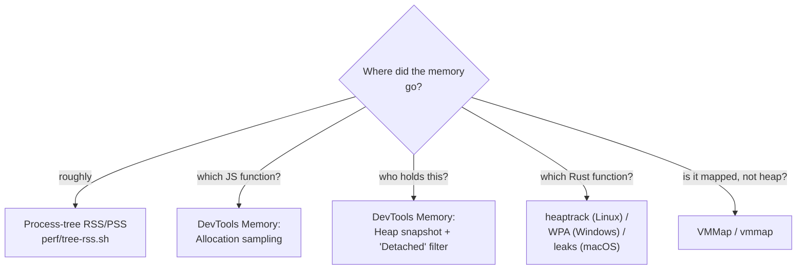

# 03 — Memory and Startup

> Memory is the resource users notice when we get it wrong, and the one they
> cannot do anything about. Startup is the one they notice every single time.

Legend: ✅ **VERIFIED** (cited, with conditions) · 🟡 **UNVERIFIED** ·
🔧 **RECOMMENDED**

---

## 1. Measure the shell, not the main process

🔴 **The single most common error in desktop-app memory reporting**, and it is an
error of *measurement*, not of engineering. ✅ **VERIFIED** — *"Both Electron and
Tauri operate as multi-process. If you only measure the main process, the result
will be misleading. **Always look at the total of the process tree**"*; and
*"Settling for a single measurement. Take at least five measurements and report
the median and range"* ([urhoba — Measuring package size and memory usage,
2026-09-24](https://www.urhoba.net/en/post/measuring-package-size-and-memory-usage)).

### 1.1 The reference measurement

✅ **VERIFIED** — same source, same date, empty skeletons (a single `<h1>`),
**Ubuntu 24.04.4 LTS container, Linux 6.18, 2 vCPU, 8 GB RAM, no GPU, Xvfb
1280×800, non-root, WebKitGTK 2.52.6**, Electron 44.4.5 (Chromium
152.0.7977.130) + Forge 7.11 vs Tauri 2.11.6 / CLI 2.11.5 / rustc 1.95.0 with
`lto`, `codegen-units = 1`, `opt-level = 3`, `panic = "abort"`, `strip`.
Measured 5 s after startup, idle:

| Configuration | Processes | Total RSS | Total PSS |
|---|---|---|---|
| Electron 44.4.5, default | 7 | 596–615 MiB | **264–269 MiB** |
| Tauri 2.11.6, default | 3 | 417 MiB | **267–268 MiB** |
| Electron, `--disable-gpu` | 8 | 529–560 MiB | 212–217 MiB |
| Tauri, `WEBKIT_DISABLE_COMPOSITING_MODE=1` | 3 | 321 MiB | 183–184 MiB |

And ✅ **VERIFIED** — the breakdown of Tauri's three processes: *"the application
itself (~146 MiB RSS), `WebKitNetworkProcess` (~47 MiB), and `WebKitWebProcess`
(~225 MiB)."*

### 1.2 RSS vs PSS, and why the choice changes the answer

✅ **VERIFIED**, from the same article, and this is our reporting policy
verbatim:

> *"Looking at RSS, Tauri seems to use less memory. However, looking at PSS, which
> distributes shared pages, the two applications yielded almost the same result in
> this environment. **Which metric you report changes the result.**"*

| Metric | What it counts | What it lies about |
|--------|----------------|--------------------|
| **RSS** | Every page the process has mapped, including pages shared with 6 other processes | Over-counts massively in Chromium/WebKit, which share the binary, ICU data, fonts and GPU buffers. Matches what Task Manager shows, which is why users compare RSS numbers. |
| **PSS** | Shared pages divided among the processes sharing them | The honest per-app number. Not available on Windows without extra tooling. |
| **Private / Working Set** (Windows) | Roughly "PSS" on Windows | `Get-Process` reports `WorkingSet64` and `PrivateMemorySize64` |

🔴 **So:** 🔧 **on Windows we report Working Set totals, on Linux we report both
RSS and PSS, and we never compare an RSS number to a PSS number.** Any blog post
that does is wrong.

### 1.3 Package size, because "Tauri is 2 MB" is a lie by omission

✅ **VERIFIED**, same measurement:

| | Electron | Tauri |
|---|---|---|
| Application binary | 228,605,256 B (contains Chromium) | 5,947,408 B |
| `.deb` file | 96,262,040 B (~92 MiB) | 2,386,820 B (~2.3 MiB) |
| `.deb` `Installed-Size` | 289,591 KiB | 5,865 KiB |
| `.zip` | 123,081,982 B (~117 MiB) | — |
| External deps (`Depends`) | `libgtk-3-0`, `libnss3`, `libgbm1`, … | `libwebkit2gtk-4.1-0`, `libgtk-3-0` |

And ✅ **VERIFIED** — the honest caveat from the same source: *"Do not let
Tauri's 2.3 MiB package be misleading: this package expects the
`libwebkit2gtk-4.1-0` (**Installed-Size 93,416 KiB**) and its dependency
`libjavascriptcoregtk-4.1-0` (**31,624 KiB**) libraries to be present on the
system."*

So Tauri's real footprint on a bare Linux system is **~5.9 + 91.2 + 30.9 ≈ 128
MiB**, shared with every other GTK/WebKit app. That is the number we report, and
it is still smaller than Electron's 283 MiB unpacked.

🔴 **And the author found a discrepancy we must not repeat.** ✅ **VERIFIED**:
*"the Tauri binary I measured is approximately **ten times** the 'less than 600
KB' figure on the official page. I couldn't find an explanation for this."* 🔧
Whatever size claims we make in our README must come from **our own builds**, not
from a framework's marketing page.

### 1.4 The common mistakes, adopted as our policy

✅ **VERIFIED**, the article's own list, with our responses:

| Mistake | Our response |
|---|---|
| Measuring the development build | 🔧 The perf harness only ever runs `target/release`. A guard in `runner.mjs` refuses to run on a dev build. |
| Measuring only the main process | 🔧 `perf/tree-rss.sh` / `.ps1` walk the tree. §1. |
| Settling for a single measurement | 🔧 n ≥ 5 for memory, n ≥ 20 for startup. Report median + range + p95. |
| Ignoring external dependencies | 🔧 Every size claim states the runtime it assumes (WebView2 mode on Windows; webkit2gtk on Linux). |
| Running as root / with `--no-sandbox` | 🔴 Never. On Linux, Electron does not launch as root without `--no-sandbox`, and measuring that measures a different, less safe application. |

### 1.5 The Windows WebView2 filtering trap

✅ **VERIFIED** — *"In Tauri, WebView2 processes appear as `msedgewebview2.exe`.
Keep in mind that if you filter by this name, you might also count processes of
other applications using WebView2."*

🔴 **Our fix, and it is not optional:** 🔧 set a **per-application WebView2 user
data folder** at startup. Tauri exposes this; in WebView2 terms it means every
process we spawn carries `--user-data-dir=<our path>`, and our memory sampler
filters on that string. Without it, our "Tauri idle memory" number is whatever
else happened to be running on the machine.

🟡 Same class of problem on Linux: WebKitGTK's `WebProcess`/`NetworkProcess` are
spawned by our process tree, so a tree walk finds them; but **other apps' WebKit
processes are siblings, not children**, and a naive `pgrep -f WebKit` would
include them. Tree-walking, not name-matching.

---

## 2. What our content costs

### 2.1 The budget, by document tier

🟡 Planning estimates. Re-measure with the §8 experiment
([01-large-files.md §8.2](01-large-files.md#82-the-experiment)).

| Tier | Canonical text | Block AST | HTML strings | DOM (JS heap side) | Δ over shell |
|------|---------------|-----------|--------------|--------------------|--------------|
| T0 · 5 KB | 0.01 MB | 0.1 MB | 0.02 MB | 0.2 MB | **~0 MB** — noise |
| T1 · 100 KB | 0.2 MB | 1–2.5 MB | 0.2 MB | 1–2 MB | **~5 MB** |
| T2 · 4 MB | 8 MB | 30–100 MB | 6–16 MB | 12–32 MB | **~60–150 MB** (before discarding off-screen ASTs) |
| T2 · 4 MB, with block-AST discard + `content-visibility` | 8 MB | **~4 MB** (visible only) | 6–16 MB | 12–32 MB | **~30–60 MB** |
| T3 · 100 MB, outline-only | 200 MB | ~1 MB (spans only) | ~0 | ~1 MB | **~200 MB** |

🔴 **Two lines in that table are the whole engineering story:**

1. **The canonical text is 2 bytes per byte in the DOM** (UTF-16). 100 MB of
   Markdown is **200 MB** before we do anything. This is why T3 is outline-only.
2. **The block AST is 8–25× the input**, and it is **pure dead weight** once the
   HTML is built. Discarding off-screen block ASTs turns a ~100 MB cost into a
   ~4 MB cost on a 4 MB book. That is the single largest memory win available to
   us, and it is a design decision in the parser, not an optimisation.

### 2.2 What we must *not* hold

🔴 Explicit lists of things that look harmless and are unbounded:

| Thing | Why it grows | Cap |
|-------|--------------|-----|
| Highlight cache | one entry per unique code block ever seen | 🔧 32 MB LRU, cleared on document close |
| Rendered block DOM for a closed document | if we never remove it, it is a detached tree | 🔧 removed on close, and asserted by the leak test |
| Search index | per-block tokens for the whole document | 🔧 drop on document close; build lazily on first search |
| Web Workers | one thread + heap each | 🔧 `terminate()` on document close |
| `IntersectionObserver` / `ResizeObserver` | a strong reference to every observed element | 🔧 `disconnect()` |
| Tauri `listen` subscriptions | one IPC listener per subscription | 🔧 `unlisten()` on teardown |
| Font faces via `FontFace` API | one per dynamically added font | 🔧 reuse a `Map<string, FontFace>` |
| Image decode cache / blob URLs | `URL.createObjectURL` is never revoked by GC | 🔧 `URL.revokeObjectURL` on teardown — **this is a real and commonly-missed leak** |

---

## 3. How to profile

### 3.1 The webview side (JS heap + DOM) — the primary tool

✅ **VERIFIED** — DevTools' Memory panel has three modes that answer different
questions ([Chrome DevTools — Fix memory problems](https://developer.chrome.com/docs/devtools/memory-problems)):

| Mode | Question it answers | How we use it |
|---|---|---|
| **Heap snapshot** | *"how memory is distributed among your page's JS objects and DOM nodes at the point in time of the snapshot"* | The leak test. Take a snapshot, then type `Detached` in the Class filter. *"Detached DOM nodes are a common cause of memory leaks."* The Objects pane shows **what is holding the reference** — which is the actual answer we need. |
| **Allocation timeline** | *"Blue bars represent new memory allocations… these are your candidates for memory leaks."* Zoom a bar to filter the Constructor pane to that timeframe | Find *where* growth happens. Reproduce: open doc A → close → open B → close → repeat. Bars that keep growing with a blue spike per cycle are our leak. |
| **Allocation sampling** | *"a breakdown of memory allocation by function"*, default view *Heavy (Bottom Up)* | Attribute heap to *functions*. If `renderBlock` dominates, the AST/DOM churn is ours. ✅ Note it can target a **worker** via "Select JavaScript VM instance" — use it to check the highlighter pool. |

🔧 **Our nightly leak test, automated:**

```js
// packages/perf/scenarios/leak.mjs — runs in the webview via CDP
async function runLeakCycle(cycles = 20) {
  const gc = async () => { /* CDP HeapProfiler.collectGarbage */ };
  const heapMiB = async () => {
    /* CDP Runtime.getHeapUsage → usedSize */
  };

  await gc();
  const base = await heapMiB();

  for (let i = 0; i < cycles; i++) {
    await openDoc(`fixture:t1-${i % 3}`);        // rotate fixtures so no
    await scrollToEnd();                          // cache keying can't hide a leak
    await closeDoc();
    await openDoc(`fixture:t2-book.md`);          // the 4 MB one, the stress case
    await scrollToEnd();
    await closeDoc();
  }

  await gc();
  const after = await heapMiB();
  return { baseMiB: base, afterMiB: after, growthPct: ((after - base) / base) * 100 };
}
```

🔴 **Budget: growth ≤ 5%.** 🔴 And the test is only meaningful if the second
snapshot is taken **after** `HeapProfiler.collectGarbage` — without a forced GC,
normal allocation noise looks exactly like a leak.

### 3.2 Reaching DevTools in a Tauri production build

🔴 **The inspector is off in release builds**, so "just open DevTools" is not
available when a user reports a leak. ✅ **VERIFIED** — *"By default, the
inspector is only enabled in development and debug builds unless you enable it
with a Cargo feature"* ([Tauri — Debug](https://v2.tauri.app/develop/debug/)).

```bash
npm run tauri build -- --debug     # release-shaped, but with the dev console
```

✅ **VERIFIED** — programmatic control:

```rust
tauri::Builder::default()
  .setup(|app| {
    #[cfg(debug_assertions)]
    {
      let window = app.get_webview_window("main").unwrap();
      window.open_devtools();
    }
    Ok(())
  })
```

⚠️ ✅ **VERIFIED** — Tauri's own warning: *"The devtools API is private on
macOS. Using private APIs on macOS prevents your application from being accepted
in the App Store."* 🔴 **Never** ship a macOS release build with the `devtools`
Cargo feature.

🔧 **Our support story** 🔧 ship a hidden, documented, user-invokable
"Diagnostics → Open Developer Tools" menu item **gated behind
`cfg(debug_assertions)` or a signed `--diagnostics` flag**, and document it in
`docs/TROUBLESHOOTING.md` as "how to help us debug your memory problem". Users
who can send us a heap snapshot will save us a week each.

### 3.3 The OS side (process tree) — the ground truth

| Platform | Tool | Command |
|----------|------|---------|
| Windows | Task Manager, Details tab | sum `Working set (memory)` across our process tree. ✅ **VERIFIED** — *"On Windows, you can see the application's child processes in the Details tab of Task Manager."* |
| Windows | `Get-Process` | `Get-Process -Id <pid> \| Select Name, WS, PM` summed over the tree |
| Windows | **Windows Performance Analyzer (WPA)** | heap/alloc traces; the only tool that separates our Rust allocations from the webview's |
| Windows | **VMMap** (Sysinternals) | 🔴 the tool for *"this process has 400 MB of mapped but nothing is on the heap"* — shows image mappings, private data, mapped files. Use it once, for the baseline. |
| Linux | `/proc/<pid>/smaps_rollup` | ✅ **VERIFIED** — the source of every number in §1.1 |
| Linux | `heaptrack` | 🔧 the default choice for *our own Rust allocations*; interactive, with call-graph attribution |
| Linux | `valgrind --tool=massif --massif-out-file=out.ms` | 🔧 slower but exact; use for the Rust side in a nightly job |
| macOS | `leaks` / `vmmap <pid>` / Instruments' Allocations | `leaks --atExit -- ./app` for a one-shot report |

```bash
# 🔧 The Linux one-liner we will actually use in CI.
$ tree_rss() { local p=$1; awk '/^Rss:/{r+=$2} /^Pss:/{s+=$2} END{print r, s}' \
    /proc/$p/smaps_rollup; }
# $ tree_rss <pid>  ->  "417428 273664"  (KiB)  =  408 MiB RSS / 267 MiB PSS
```

### 3.4 Electron-specific

✅ **VERIFIED** — if we end up on Electron, there is a first-class API for this:

```js
// app.getAppMetrics() -> ProcessMetric[]
// "Array of ProcessMetric objects that correspond to memory and CPU usage
//  statistics of all the processes associated with the app."
const metrics = app.getAppMetrics();
const totalMiB = metrics.reduce((a, m) => a + m.memory.workingSetSize / 1024, 0);
// [electronjs.org/docs/latest/api/app]
```

🔴 **But this is exactly the single-process trap in §1**: `getAppMetrics()` returns
all associated processes, which is *better* than measuring `process.memoryUsage()`,
and it is still **working set**, i.e. RSS-equivalent, i.e. the metric that
over-counts. 🔧 Pair it with `chrome://memory-internals` and DevTools.

### 3.5 Which question each tool answers



🔴 **Order of operations when a user reports "it uses 3 GB":**
1. Process-tree total (is it real?).
2. If the tree total is small but the user sees a big number → it is **shared
   pages** (PSS) or **a different process** (another WebView2 app). This is a
   communication problem, not a bug.
3. If the tree total is large → DevTools heap snapshot → `Detached` filter →
   if empty, DevTools allocation sampling → if that is small, it is the Rust side
   → `heaptrack`.
4. If *nothing* accounts for it → VMMap. It is mapped file, or a GPU/graphics
   allocation, or the allocator's arena fragmentation.

---

## 4. Leak hunting in a long-lived app

### 4.1 Detached DOM nodes — the #1 leak in an app like ours

✅ **VERIFIED** — *"Detached DOM nodes are a common cause of memory leaks"*, and
the DevTools workflow is: *"Type `Detached` in the Class filter input box to search
for detached DOM trees… In the Objects pane you can see more information about the
code that's referencing it. To fix this particular memory leak, you would study
the code that uses `detachedTree` and ensure that it removes its reference to the
node when it's no longer needed"* ([Chrome DevTools](https://developer.chrome.com/docs/devtools/memory-problems)).

🔴 **We are structurally primed to leak these**, because our renderer holds
element references in several places at once:

```ts
// 🔴 The five places a reference to a block element can outlive the document.
const measuredHeights = new Map<number, number>();       // 1
const anchors         = new Map<string, HTMLElement>();   // 2
const searchIndex     = new Map<number, number[]>();     // 3
const pendingHighlights = new Set<HTMLElement>();         // 4
io.disconnect() // …and the observer's internal list  // 5
```

🔧 **The teardown contract**, one function, called on every document close:

```ts
export function teardownDocument(doc: DocRuntime): void {
  doc.measuredHeights.clear();     // 1
  doc.anchors.clear();             // 2
  doc.searchIndex = null;          // 3 — set to null, not emptied: release the
                                   //      arrays so the GC sees no roots at all
  for (const el of doc.pendingHighlights) {
    el.dataset.hydrated = '0';
    delete el.dataset.hydrated;
  }
  doc.pendingHighlights.clear();   // 4
  doc.visibilityObserver.disconnect();  // 5
  doc.resizeObserver.disconnect();
  doc.highlightPool.dispose();     // terminates workers → frees their heaps
  doc.article.replaceChildren();   // detach the whole tree LAST, after all
                                   // references above are gone
  highlightCache.clear();          // byte-budgeted LRU from
                                   // 02-rendering-pipeline-performance §8.2
}
```

🔴 **Order matters.** `replaceChildren()` first, `clear()` last, and you have a
detached tree held by four maps. The heap snapshot will show it; the allocation
timeline will show a blue bar per document open; and the user will see memory
grow by ~50 MB every time they open a book.

### 4.2 Event listener accumulation

🔴 Every `addEventListener` on `document`, `window`, or a long-lived element
without a matching removal is a permanent root.

```ts
// 🔴 Classic: one listener per block, on a long-lived target.
blocks.forEach(b => viewport.addEventListener('scroll', onScrollFor(b)));
// 4000 blocks × 4 documents = 16,000 listeners, and no way to enumerate them.

// ✅ One listener, ever.
viewport.addEventListener('scroll', onScroll, { passive: true });

// ✅ Scoped listeners get removed with the node, but only if the node is
//    actually removed AND nothing else references it.
const onCodeClick = (e: Event) => { /* … */ };
codeBlocks.forEach(el => el.addEventListener('click', onCodeClick));
// 🔴 Removing the node removes the listener only because the listener is
//    reachable solely from the node. If anything else holds `el`, the listener
//    lives too. Prefer delegation from a stable ancestor.
```

🔴 **Tauri-side leak**, verified as a real API shape:

```rust
// 🔴 Every listen() is a subscription that lives until unlisten() or app exit.
let unlisten_fs = app.listen("fs://changed", |e| { /* … */ });
let unlisten_win = app.listen("win://resize",   |e| { /* … */ });

// ✅ teardown must unlisten everything it listened to.
tauri::async_runtime::spawn(async move {
    // …
    unlisten_fs.unlisten().ok();
    unlisten_win.unlisten().ok();
});
```

🔧 **RECOMMENDED**: a `Subscriptions` registry per window/document, with a
`dispose()` that walks it. Every `listen()` in the codebase goes through it. The
same for Rust-side `OnceLock`/`Mutex<HashMap>` registries — 🔴 a `HashMap` keyed by
path that only ever grows is a leak that `heaptrack` finds instantly and that no
heap snapshot will ever show, because it is not in the JS heap.

### 4.3 Unbounded caches

🔴 The three shapes:

```ts
// 1. Plain Map that only grows. The classic.
const codeBlockCache = new Map<string, string>();

// 2. Array used as a queue with a "trim when it feels big" check.
if (results.length > 1000) results.shift();      // 🔴 shift() is O(n) on arrays

// 3. A keyed cache with no eviction at all.
const renderedHtml = new Map<number, string>();  // 🔴 keyed by block INDEX:
//    every reparse of a changed block creates a new entry and orphans the old
```

🔧 **Every cache in the codebase is a byte-budgeted LRU**
([02 §8.2](02-rendering-pipeline-performance.md#82-the-worker-pool)) or a
`WeakRef`/`WeakMap` where the key is an object we do not own:

```ts
// 🔧 For per-document caches keyed by elements we do not control the lifetime of.
const measured = new WeakMap<HTMLElement, number>();
// The entry disappears when the element does. No teardown needed, and no leak
// possible. 🟡 Caveat: WeakMap is not iterable, so "clear the cache" is not a
// call — it is garbage collection, which is fine.
```

### 4.4 Rust-side leaks

🟡 The Rust half has its own set, and they are invisible to DevTools:

| Pattern | Symptom | Fix |
|---------|---------|-----|
| `static mut` / `OnceLock<Mutex<HashMap<PathBuf, T>>>` that only inserts | `heaptrack` shows a growing `HashMap` | explicit eviction, or a bounded map type |
| `Arc<T>` cycles (`Arc<Mutex<Inner>>` holding an `Arc` to itself) | refcount never hits 0; leak with no allocation | break the cycle; prefer `Weak` for the back-reference |
| Spawning a thread/task per event | thread count grows | a bounded worker pool; assert thread count in the perf test |
| `Box::leak` / `mem::forget` | permanent | don't |
| Reading a whole file into a `Vec<u8>` and keeping it | a 100 MB file becomes 200 MB of resident memory | stream it, or drop it after parsing |

🔧 **A concrete Rust leak we will ship if we're not careful**, and it is a direct
consequence of the file watcher:

```rust
// 🔴 Per-path state that is created on first sight and never removed.
struct WatchRegistry { states: HashMap<PathBuf, DocState> }   // grows forever
```

🔧 **Fix**: evict `DocState` when the path is unwatched, and use `HashMap` +
explicit `retain(|k, _| watched_paths.contains(k))` on a timer, or an LRU keyed by
path with a cap of N documents.

### 4.5 The soak test

🔧 **RECOMMENDED** — one nightly CI job, three shapes:

| Shape | Duration | Pass criterion |
|-------|----------|----------------|
| **Open/close** | 20 cycles × (100 KB doc, 4 MB book, 100 KB doc) | JS heap after GC grows **≤ 5%**; tree RSS grows **≤ 5%**; process count unchanged |
| **Scroll** | 30 min continuous programmatic scroll through the 4 MB book | tree RSS flat (± 2%); `longTasksDuringScroll` rate flat |
| **Idle soak** | 8 h, no interaction | tree RSS grows **≤ 10%** from the 1 h mark; no process count change |

🔴 **Assert the process count.** A leaking `Worker` or thread shows up as a
process/thread count increase long before it shows up as RSS. ✅ **VERIFIED** that
process count is a first-class metric here: Electron's default configuration had
7 processes, Tauri's 3
([urhoba](https://www.urhoba.net/en/post/measuring-package-size-and-memory-usage)).

---

## 5. Startup

### 5.1 Define the event points before measuring anything

✅ **VERIFIED** — *"There is no single 'startup time.' There are several different
event points, and if you don't specify which one you are measuring, no one can
compare your results"*
([urhoba — Startup time comparison, 2026-09-24](https://www.urhoba.net/en/post/startup-time-comparison)).

| Event point | Electron equivalent | Tauri equivalent |
|---|---|---|
| Process started | OS `exec` | OS `exec` |
| Framework ready | `app.whenReady()` | `Builder::setup` closure |
| First page loaded | `webContents` `did-finish-load` | `on_page_load` with `PageLoadEvent::Finished` |
| **Content visible** | app-specific | app-specific |

🔴 **We measure `exec → content visible`, externally.** ✅ **VERIFIED**:
*"Internal measurement misses the time elapsed before the framework's own startup.
Therefore, the primary comparison should be the external measurement."*

And ✅ **VERIFIED** — *"Confusing the window opening with the content loading"* is
listed as a common measurement mistake: *"An empty window may seem fast, but the
user expects content."*

### 5.2 The reference measurement, and the surprise

✅ **VERIFIED**, same source, same environment as §1.1, interval **process
started → first page loaded**, warm, n = 10 alternating runs after a warm-up lap:

| Configuration | n | External | Internal |
|---|---|---|---|
| Electron 44.4.5, default | 10 | **260 ms** (243–291) | 167 ms |
| Tauri 2.11.6, default | 10 | **798.5 ms** (772–853) | 770 ms |
| Electron, `--disable-gpu` | 5 | 234–253 ms | — |
| Tauri, `WEBKIT_DISABLE_COMPOSITING_MODE=1` | 5 | 735–776 ms | — |

✅ **VERIFIED** — where Tauri's time goes: *"In Tauri, the setup closure was
reached within **130–175 ms**. The bulk of the time passed after this, during the
startup of WebKit processes and the loading of the page."*

✅ **VERIFIED** — and the author's own reading of it, which we adopt: *"the empty
Tauri skeleton reached the first page approximately **three times slower** than
the empty Electron skeleton"* — followed immediately by *"This result does not
mean 'Tauri is slow'… Since Tauri uses WebView2 (Chromium-based) on Windows, the
memory profile may be completely different. Do not decide without measuring on
your own target platforms."*

🔴 **What this changes for us.** The webview engine's process spawn is
**~2/3 of our cold-start budget and we do not control it**. Therefore:

1. 🔧 **Our budget must be written against the slower engine.** The
   [README targets](README.md#1-startup) are set as **≤ 900 ms cold on a
   2019-class laptop**, which leaves room for a ~600 ms engine spawn plus ~300 ms
   of our own work.
2. 🔧 **We cannot optimise the engine.** Every millisecond we win has to come
   from *our* code, which means the deferral ladder in §6, not from anything we
   do to the webview.
3. 🔴 **We must measure on Windows before committing to a framework.** ✅
   **VERIFIED** — *"I could not measure these in this environment"* (Windows
   WebView2 preloading is a real, separate question).

### 5.3 Cold vs warm

✅ **VERIFIED** — *"On the first launch after the computer has restarted, files are
read from the disk. In subsequent launches, files are in the operating system's
page cache. Warm measurement is more reproducible."*

```bash
# 🔧 Linux cold-cache, test machine only.
sync; echo 3 | sudo tee /proc/sys/vm/drop_caches
```

⚠️ ✅ **VERIFIED** — *"Since this command affects the entire system, use it only
on a test machine."*

🔧 **We report both, always, for every startup metric.** A startup number without
its cache state is not a measurement. And we report **median, range, p95 and n** —
✅ **VERIFIED** — *"Sharing a single number"* is on the common-mistakes list.

### 5.4 What actually costs time

| Cost | Windows (WebView2) | Linux (WebKitGTK) | Ours? |
|---|---|---|---|
| Process `exec` + dynamic linking + CRT init | small (few MB of DLLs) | small (Rust binary + GTK dlopen) | no |
| Webview host process spawn | 🔴 **large**, and shared-runtime dependent | 🔴 **large**, `WebProcess` + `NetworkProcess` | no |
| Engine bootstrap (GPU/raster init, font config) | large | large | no |
| HTML/CSS/JS parse of our bundle | 🟡 ~10–40 ms for 250 KB gz | 🟡 same | **yes — bundle size** |
| Our `setup()` / `whenReady()` work | whatever we do | whatever we do | **yes** |
| IPC + file read | small (local disk) | small | **yes** |
| First parse + first paint of the document | 🔴 **the big one for us** | 🔴 same | **yes** |

🔴 **The engine rows are not ours to fix. The bottom four rows are entirely
ours, and between them they are the majority of the controllable budget.**

---

## 6. The deferral ladder

Ordered by value-per-hour-of-implementation.

### Level 0 — show the window immediately, with a shell

🔧 Create the window with the chrome (toolbar, outline, status bar) and an empty
document pane, and paint it. 🔴 **Never** block window creation on reading the
file. The window existing is worth 100+ ms of perceived latency; the content
arriving 80 ms later is invisible.

### Level 1 — defer everything that is not the document

🔧 In `setup()` / `whenReady()`, **do not**:

- initialise plugins we do not need for the first paint,
- read `settings.json` synchronously (await it),
- enumerate the recent-files list,
- pre-warm the search index,
- create the highlight worker pool (🟡 the `new Worker()` + module compile is
  non-trivial; create it after first paint),
- run `update-metrics` / telemetry.

```rust
// ✅ Tauri: keep setup() to wiring, and hand off the real work.
.setup(|app| {
    let handle = app.handle().clone();
    // Nothing heavy here. Fire and forget onto the async runtime.
    tauri::async_runtime::spawn(async move {
        let settings = load_settings().await;         // I/O
        let _ = handle.emit("settings:loaded", settings);
        window.emit("session:restored", restore_session().await);
    });
    Ok(())
})
```

### Level 2 — dynamic import for everything below the fold

🔧 The initial bundle budget is **250 KB gzipped**
([README](README.md#4-build-and-payload)); the parser + highlighter + renderer
is a **separate lazy chunk**.

```ts
// Shell: tiny, renders chrome, paints.
import { renderShell } from './shell';                 // bundled

// After first paint:
void import('./viewer');                                // 400 KB chunk
void import('./markdown/parser');                       // parser
void import('./markdown/renderer');                     // renderer
void import('./search');                                // index + find UI
```

🔴 **The most common way to lose this is a static `import` anywhere in the shell's
module graph.** One `import { parse } from '../markdown/parser'` at the top of a
shell file puts the parser in the initial bundle. 🔧 **Enforce it in CI**: parse
the emitted bundle's module graph and fail if the initial chunk reaches the
parser directory. That is ~30 lines with `rollup-plugin-visualizer` output or
`esbuild --metafile`.

### Level 3 — defer the plugin initialisation

🔧 Every plugin's `setup()` runs at startup whether or not its feature is used.
For a viewer the honest list of always-on plugins is tiny: file dialog, opener,
window state, single-instance. Everything else (updater, notification, global
shortcut, deep linking) initialises on first use.

### Level 4 — defer the parser bundle itself

🟡 **And then the interesting one**: 🔧 if first paint of *chrome* is fast but
first paint of *content* is not, consider loading the parser from a **separate
origin** or from the filesystem via the asset protocol, so it is not in the
renderer bundle at all. Cost: an extra async hop and a CORS/protocol story. 🟡
**Only do this if the §8 measurement says Level 2 was not enough.**

### Splash screens — an honest assessment

🔴 **A splash screen can make startup feel slower, not faster.** Three verified
facts that combine into that conclusion:

1. The engine spawn (§5.2) is ~600 ms and is **not interruptible by application
   code**. A splash that appears *before* the webview exists must be drawn by the
   **native** window, before the webview paints. That is the only way it can
   cover the gap.
2. ✅ **VERIFIED** — WebKitGTK's window is a `GTK` window with the `WebKitWebView`
   inside; a splash can be a `GtkOverlay`/`GtkRevealer` that covers the view and
   is removed on the first paint.
3. 🔴 But a splash that appears at 800 ms and disappears at 950 ms has taught the
   user nothing and added a flash. A splash that appears at 100 ms (native,
   before the webview) and disappears at 900 ms is genuinely useful.

🔧 **RECOMMENDED** — the decision rule:

> **Only ship a splash if `exec → first native paint` is < 150 ms AND
> `exec → content visible` is > 600 ms.** Otherwise, show a skeleton *inside* the
> webview (a spinner where the document will be, plus the toolbar and outline
> already laid out) and do not use a native splash at all.

🔧 And when we do ship one: **it must not be branded marketing.** It shows the app
name, the version, and the document path being opened. A splash screen with a
slogan and a 400 KB logo is 400 KB we chose to delay ourselves for.

### Lazy initialisation checklist

| # | Item | When |
|---|------|------|
| 1 | Native window + toolbar + outline skeleton | synchronously in `setup()` |
| 2 | `settings.json` read | `async`, after window creation |
| 3 | Window geometry restore / `window-state` plugin | `async` |
| 4 | File read + block scan | `async`, the very first thing after (2) |
| 5 | First-block parse + paint | synchronously, on the main thread — this is the priority |
| 6 | Rest of the document parse | chunked, after first paint |
| 7 | Highlight worker pool | after first paint |
| 8 | Search index | on first search, or after 30 s idle |
| 9 | Recent-files scan, thumbnail generation | after first paint, on idle |
| 10 | Update check | after first paint, 30 s timeout, ≤ once per 24 h |
| 11 | Non-critical plugins (updater, notification, global shortcut) | on first use |
| 12 | Telemetry | opt-in, and only if there is any |

---

## 7. The startup budget, with numbers

🔧 **RECOMMENDED**, final:

### Windows (WebView2, evergreen)

| Segment | Budget | Notes |
|---|---:|---|
| `exec` → native window shown (native splash or bare frame) | **≤ 120 ms** | not measured by the engine; mostly CRT + window creation |
| Engine spawn + bootstrap (WebView2 process tree) | **≤ 500 ms** 🟡 | not ours; WebView2 is shared, and preloading may help or may not |
| Bundle parse/exec (250 KB gz) | **≤ 60 ms** | bundle-size-enforced |
| `setup()` + settings + file read + block scan | **≤ 120 ms** | ours; the deferral ladder |
| First block parse + paint | **≤ 120 ms** | ours; the block-wise parser |
| **Total, warm, 2023-class laptop** | **≤ 500 ms** | |
| **Total, cold, 2019-class laptop** | **≤ 900 ms** | |

### Linux (WebKitGTK)

| Segment | Budget | Notes |
|---|---:|---|
| `exec` → native window | **≤ 150 ms** | GTK init + theme load |
| `WebProcess` + `NetworkProcess` spawn | **≤ 600 ms** 🟡 | ✅ **VERIFIED** as the dominant cost on the reference machine (130–175 ms to `setup`, 770 ms total) |
| Bundle parse/exec | **≤ 60 ms** | |
| Ours (as above) | **≤ 240 ms** | |
| **Total, warm, 2023-class laptop** | **≤ 800 ms** | |
| **Total, cold, 2019-class laptop** | **≤ 1400 ms** | 🟡 WebKitGTK's cold-start penalty is *larger* than WebView2's, because nothing about it is shared or preloaded |

🔴 **The asymmetry in those two tables is the most important performance fact in
this folder.** On Windows, the engine is a **shared, already-installed, already-
updated runtime** that Edge's own updater keeps warm. On Linux, the engine is
**per-user-session process spawn with no sharing**. If our measurements on real
hardware confirm a ~400 ms Linux/Windows cold-start gap, then either:

1. the Windows number wins and we optimise for Windows first (defensible: it is
   the larger market for this kind of app, and the [09-platform](../09-platform/)
   analysis says Windows is where our users are), **or**
2. we ship **Flatpak on Linux** and let the runtime be pre-installed and shared
   across all Flatpak apps — which is 🔧 the strongest technical argument for
   Flatpak we have found, and it is an argument about *startup latency*, not
   about security.

🔧 **Write this question into
[15-open-questions](../15-open-questions/).** It is the kind of decision that
should be made on our own numbers, and it cannot be made until the harness runs.

---

## 8. What we must measure before we believe any of the above

Every table in this document is either (a) cited from someone else's measurement
with its conditions stated, or (b) our target. 🔴 **None of it is our app.**

| # | Question | Experiment | Blocks |
|---|----------|------------|--------|
| 1 | What is our real shell RSS, on both OSes, with a per-app WebView2 data dir? | `perf/tree-rss.sh` / `.ps1`, n = 10, idle at 60 s | the entire memory budget |
| 2 | Is there a Linux/Windows cold-start gap, and how big? | `perf/startup.mjs`, cold and warm, n = 20, real hardware | framework decision ([08](../08-desktop-frameworks/)) |
| 3 | Does our block-wise parser reach "first block painted" in ≤ 120 ms on a 4 MB book? | `perf/render.mjs` with `t2-book.md` | [01](01-large-files.md) tier table |
| 4 | Does offscreen highlighting keep JS heap flat? | `perf/memory.mjs` open/close × 20 with `t2-book-code.md` | worker pool design ([02 §8](02-rendering-pipeline-performance.md#8-syntax-highlighting-and-why-it-must-be-cached)) |
| 5 | Does the leak test stay under 5% growth? | `perf/scenarios/leak.mjs` | whether we can ship |
| 6 | Does the WebKitGTK 2.36 floor change any of the above? | The whole perf matrix on Ubuntu 22.04 | whether we state a higher minimum Linux version |

🔧 **Until #1, #2 and #5 are answered, none of the numbers in this folder are
ours, and the framework decision is being made on other people's blog posts.**
That is the single most actionable thing in this document.

---

## Sources

- [urhoba — Measuring package size and memory usage, 2026-09-24](https://www.urhoba.net/en/post/measuring-package-size-and-memory-usage) — process-tree RSS/PSS methodology (`smaps_rollup`), Electron 44.4.5 vs Tauri 2.11.6 memory and package-size measurements, `libwebkit2gtk-4.1-0` installed size, the common-mistakes list
- [urhoba — Startup time comparison, 2026-09-24](https://www.urhoba.net/en/post/startup-time-comparison) — event-point definitions, external-vs-internal measurement, cold/warm via `drop_caches`, Electron 260 ms vs Tauri 798 ms on Linux/WebKitGTK, `setup()` reached at 130–175 ms
- [Chrome DevTools — Fix memory problems](https://developer.chrome.com/docs/devtools/memory-problems) — heap snapshots, the `Detached` class filter, allocation timelines, allocation sampling with per-worker targets
- [Tauri — Debug](https://v2.tauri.app/develop/debug/) (last updated 2025-03-29) — DevTools off in release builds, `WebviewWindow::open_devtools`, the `devtools` Cargo feature, macOS private-API/App Store warning
- [Electron — `app.getAppMetrics()`](https://www.electronjs.org/docs/latest/api/app) — process metrics for all associated processes
- [crates.io — tauri-plugin-updater](https://crates.io/crates/tauri-plugin-updater) (2.13.1, 2026-09-30)
- [Linux `inotify(7)`](https://man7.org/linux/man-pages/man7/inotify.7.html) and [notify 8.2.0 Known Problems](https://docs.rs/notify/latest/notify/) — the watcher-side limits that shape what we must reconcile
