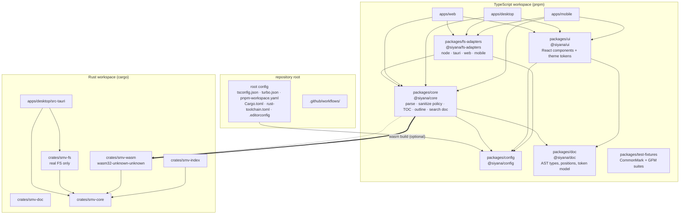

# 01 · Monorepo Strategy

**Question.** Does Siyana Markdown Viewer live in one repository or several,
and which workspace tooling runs it?

**Short answer.** One repository. pnpm workspaces for the TypeScript tree,
a Cargo workspace for the Rust tree, and Turborepo as a thin task orchestrator
that understands both. Fixed (locked-step) versioning, because nothing we build
is ever published to npm. No Bun — not yet, and probably not for the runtime.

---

## 1. The shape of the problem

We are not building a library. We are building an application that happens to
be assembled from internal packages. That single fact eliminates most of the
reason people reach for heavy monorepo tooling.

A published monorepo has two hard problems: (a) independent version ranges must
be *correct* on npm, because a wrong range is a production incident for a
downstream consumer, and (b) the release pipeline must publish N packages in
dependency order with changelogs and provenance.

We have neither problem.

- `@siyana/core` is never installed by anyone except our own apps.
- The apps ship as signed binaries, not as tarballs.
- There is no semver contract with a stranger. There is only a commit hash.

So the version-management feature of a monorepo tool — the part that is hardest
and most valuable for a library author — is pure cost for us. What we actually
want from a monorepo is:

1. **One install** for the whole repo, from one lockfile.
2. **One typecheck/lint/test command** that covers everything.
3. **Dependency boundaries that fail loudly** when `core` imports from `desktop`.
4. **Task ordering and caching** so a change in `core` rebuilds the desktop app
   but not the web app's static assets.
5. **An editor that understands the whole thing** without a plugin explosion.

That is a much smaller ask than "be a package registry", and it means we should
pick the *smallest* tool that does it.

## 2. Monorepo vs polyrepo — the actual trade-off for us

| Dimension | Monorepo (one repo) | Polyrepo (repo per app/pkg) |
|-----------|---------------------|-----------------------------|
| Core change touching renderer + desktop shell + web | One commit, one CI run, atomic | 3 repos, 3 PRs, 3 merges, 3 releases, temporary mismatch window |
| Cross-package refactor | `git mv` + one diff | N repos, N PRs, near-impossible to review |
| Dependency boundary enforcement | One place; lint rule | Impossible without a central policy repo |
| Version skew risk | Zero by construction | Real: web on core v0.3 while desktop on v0.4 |
| CI cost control | One big matrix; needs caching to stay sane | Small repos, easier caching, but N× the setup |
| Onboarding a contributor | `git clone` + `pnpm i` + `cargo build` | Know which of 4 repos to clone, install 4 times |
| Code review across the seam | Possible | Effectively impossible |
| Independent access control / release cadence | Coupled | Free |

**Verdict: monorepo.** The coupling we want to avoid is between *products*,
not between *packages of one product*. `Siyana-Lang` and `Siyana-Chat` stay
separate repos; `core/` and `apps/desktop/` do not.

The real cost of a monorepo here is CI time, and that is entirely a caching
problem. `07-build-and-release-architecture.md` covers it.

## 3. Candidate tools, compared

All version numbers verified 2026-10-06.

### 3.1 npm workspaces

- **Version:** npm 12.x is current (npm 12.0.2 appears in Bun's Oct 2026 install
  benchmark).
- **Strengths:** zero install cost — it ships with Node. `workspaces` field in
  the root `package.json`. Universal CI support.
- **Weaknesses:** historically poor hoisting behaviour and no strict isolation,
  so phantom dependencies are easy. Slow on large graphs. No built-in catalog
  mechanism (recent npm added one, but pnpm's is better developed).

**Assessment:** viable floor. Do not choose it as the *best* option; choose it
if we ever need contributors to be able to `npm ci` with zero extra tooling.

### 3.2 pnpm workspaces

- **Version:** 12.9.1 (3 Oct 2026); the 11.28.x line is still in maintenance.
- **Strengths:**
  - Symlinked `node_modules` by default ⇒ **real** isolation. A package can
    only import what it declared. This is the single most valuable property for
    enforcing the layer boundaries in doc 02.
  - **Catalogs** (`:catalog:` protocol) put every third-party version in one
    place. Since pnpm 11.26 a catalog entry may itself be a `workspace:` range,
    so internal packages can be catalogued too.
  - `overrides`, `packageExtensions`, and patch support.
  - Supply-chain hardening has been a deliberate theme: `allowBuilds` (replacing
    `onlyBuiltDependencies`), `blockExoticSubdeps`, integrity hashes for HTTP
    tarballs (all landed in 10.26), and `--trust-lockfile` / `change check`
    flags in 11.26.
  - `pnpm change check` validates committed versions against
    `versioning.epics` bands and `versioning.fixed` groups without reading
    change intent — cheap to run on every PR.
- **Weaknesses:** contributors on Windows need `pnpm` explicitly; PnP mode
  confuses some bundler plugins; `pnpm deploy` semantics have shifted several
  times.

**Assessment:** best JS option for us, and its strict node_modules is not a
footnote — it is the mechanism that makes "core must not import desktop"
mechanically enforced rather than a code-review promise.

### 3.3 yarn workspaces

- Yarn 1 is legacy/frozen. Yarn Berry (4.x) is modern and has strong PnP
  support, zero-installs, and good constraints, but the ecosystem's tooling
  (Vite, Nx, most Tauri starters, most CI snippets) assumes `node_modules`.
- Yarn Berry's `portal:`/`link:` semantics interact badly with Tauri's
  `beforeDevCommand` and with Vite's dep pre-bundling in a way that has
  consumed real afternoon hours in other projects.

**Assessment:** no. Not because it is bad, but because the default tooling
we will actually use assumes `node_modules`, and we have no reason to fight it.

### 3.4 Nx

- **Version:** 23.2 (3 Sep 2026). Very actively developed — 22.7 added task
  sandboxing and worktree-aware caching; 23.1 added TypeScript 6 and Angular 22;
  23.2 added Oxlint/Oxfmt.
- **Strengths:** best-in-class project graph and inferred task dependencies,
  strong caching, plugin ecosystem, and — relevant to us — a real polyglot story:
  there is `@nx/rust` and `@nx/dotnet`, and the Nx team publishes explicitly on
  "exploring polyglot monorepos with Nx, TanStack and Rust".
- **Weaknesses:** it is a large framework with its own opinions, plugin versions
  that must track the Nx major, and it wants to own your build. For six or seven
  packages this is more machinery than the problem needs.
- **Security note, and it matters:** Nx had **CVE-2026-71476** (self-hosted
  remote cache extracting unvalidated tar entries → arbitrary write; fixed in
  22.7.7 and 23.0.2) and **CVE-2026-48027** (a compromised Nx Console VS Code
  extension build, 18.95.0, published 19 May 2026 and pulled ~18 minutes later
  on the Marketplace, ~36 minutes on OpenVSX). Neither affects a local-cache-only
  setup, but both are reminders that a build tool is a supply-chain dependency
  with real blast radius.

**Assessment:** reserve it. If CI time becomes a real problem in phase 3 with
three apps, Nx is the escalation. Do not start there — it is the largest
possible answer to a question we do not have yet.

### 3.5 Turborepo

- **Version:** 2.11.5 (28 Sep 2026). 26M weekly downloads.
- **Strengths:**
  - Very small conceptual surface: a `turbo.json`, `tasks`, `dependsOn`, inputs.
  - Task graph inference from the workspace layout; `turbo run build --affected`.
  - **Since 2.10.6 (Jul 2026) it supports Cargo-only repos and infers Cargo
    workspace tasks**, and 2.10.x shipped a stream of Cargo fixes ("Resolve
    exact cargo profile outputs", "Resolve Cargo target output layouts", "Disable
    unresolved Cargo artifact caching"). This is new but it is exactly our case.
  - 2.10 added **JIT hashing inputs** (`"mode": "jit"`), deferring hash
    computation until a task's real inputs are known — useful for a build whose
    inputs are produced by an earlier task.
  - Written in Rust, so startup is fast; a repo this size has no cold-start pain.
- **Weaknesses:** the Cargo support is young enough that we should own the
  failure mode (see the escape hatch below). Remote cache requires a Turborepo
  account or self-hosted; local cache is free and sufficient at our size.

**Assessment: recommended.** It is the only candidate that covers the
TypeScript graph *and* the Cargo graph in one task runner without asking us to
adopt a plugin ecosystem. And if its Cargo support disappoints, we degrade
gracefully (below).

### 3.6 Lerna

- **Version:** 10.0.1 (Sep 2026).
- Maintained — the Nx team took stewardship in May 2022 and has shipped every
  release since, five majors (5→10). The "Lerna is dead" narrative dates from
  the original maintainers' April 2022 disclaimer, which the transfer resolved
  a month later.
- Its distinctive feature, `lerna version`/`lerna publish`, is **the feature we
  do not need**, because we do not publish. Modern Lerna also delegates task
  running to Nx under the hood, so choosing it means choosing Nx anyway, plus a
  wrapper.

**Assessment: no.** Not maintained-poorly — just aimed at a different product.

### 3.7 Cargo workspace

Not an alternative to the JS tools; an orthogonal one. We have *two* graphs and
both need workspaces:

```toml
# Cargo.toml (repo root)
[workspace]
resolver = "3"
members = [
  "crates/smv-core",        # pure logic: parse, sanitize policy, TOC, outline
  "crates/smv-doc",         # shared AST/DOM types + tokenizer used by the above
  "crates/smv-fs",          # filesystem: read/write/watch/atomic save (desktop only)
  "crates/smv-index",       # search index build + query
  "crates/smv-wasm",        # wasm32-unknown-unknown façade over smv-core
  "apps/desktop/src-tauri", # the Tauri shell
]

[workspace.package]
version = "0.0.0"          # deliberately always 0.0.0 — see §5
edition = "2024"
rust-version = "1.90"      # Tauri's MSRV as of 2.12
license = "MIT"

[workspace.dependencies]
# One version for the whole tree. Cargo unifies semver-compatible versions
# anyway, but stating it here makes the intent reviewable in one diff.
serde = { version = "1", features = ["derive"] }
notify = "9"
encoding_rs = "0.8"
```

Key property: `crates/smv-fs` is the only crate that touches a real filesystem,
and it is the only crate the desktop shell depends on. `crates/smv-core` compiles
to `wasm32-unknown-unknown` with zero changes, which is what makes doc 02's
recommendation possible.

### 3.8 Do we need Nx *and* Turborepo? No.

They overlap heavily and running both means two graphs to reason about and two
places for a cache to go stale. Pick one. We pick Turborepo.

### 3.9 Bun — verified status and our verdict

**Verified state (Oct 2026).** Bun 1.4.2. MIT licensed. Acquired by Anthropic in
December 2025, which removes the abandonment risk that used to be the main
argument against it. Bun now runs Claude Code as a shipped executable. Its own
install benchmark (bun.sh, medians of 3, warm cache, T3-stack app, 25 direct
deps / ~220 in the lockfile, Linux x64): bun 0.21 s, yarn 1.76 s, pnpm 1.92 s,
npm 4.45 s; peak RAM 12 MB vs 1.4 GB for pnpm. `bun.lock` has been a readable
text lockfile since 1.2. Windows on ARM64 is supported. Bun also ships a test
runner, a bundler, and `Bun.WebView`.

**Assessment, in parts:**

| Use of Bun | Verdict | Why |
|---|---|---|
| `bun install` as our package manager | **No (for now)** | We have chosen pnpm's strictness and supply-chain flags as a feature. Switching trades a real property for speed we do not need on a ~7-package repo where `pnpm i` is already a few seconds. Revisit if CI install time becomes measurable. |
| `bun test` as our test runner | **Consider** | Vitest is what the rest of the ecosystem assumes; Node's built-in test runner plus a thin assertion layer is also fine. Test runner choice should follow from what we test, not from brand. |
| Bun as the *runtime* for the desktop app | **No** | Tauri embeds a system webview; there is no Node/Bun runtime to replace. Bun's server/HTTP advantages are irrelevant. |
| Bun for build tooling scripts | **Maybe** | A 3× faster `pnpm run` is nice; it is not a reason to take a new runtime dependency in a security-sensitive app. |

The honest summary: Bun in 2026 is no longer a risk in the way it was in 2024,
but "no longer a risk" is not a reason to adopt it. The specific thing that made
us choose pnpm — strict `node_modules` isolation — is the specific thing Bun
softens. Revisit at the phase-2 boundary with a measurement, not a vibe.

### 3.10 Do we even need a JS package manager beyond npm?

Yes, but for exactly one reason: **strict isolation**. npm hoists aggressively;
a phantom dependency — importing a package you did not declare — works on your
machine and breaks on a clean CI runner. In a layered architecture where
`core/` must not know about `adapters/`, that is not a style preference, it is
the enforcement mechanism.

The cheap alternative is `eslint-plugin-import`'s `no-extraneous-dependencies`
or `import/no-restricted-paths`. That works. But it is opt-in, it needs the
plugin ecosystem maintained, and it runs only when someone runs lint. pnpm makes
it structural. We take structural.

## 4. Dependency hoisting and phantom dependencies — concretely

With pnpm, `apps/desktop/node_modules/` contains only what `apps/desktop`
declared, plus a `node_modules/.pnpm/` store and symlinks. So this:

```ts
// packages/core/src/render.ts
import { createHash } from 'node:crypto'   // ❌ core is supposed to be isomorphic
```

fails to resolve in `core` (core does not declare `node:crypto`) but would
"work" under npm hoisting if any other package in the tree happened to depend on
something that pulls it in. Under pnpm it is a build error. That is the entire
argument in one line.

The flip side is discipline:

```jsonc
// packages/core/package.json — core declares everything it imports, and only
// isomorphic things.
{
  "name": "@siyana/core",
  "type": "module",
  "sideEffects": false,
  "exports": {
    ".": "./src/index.ts",
    "./adapters": "./src/adapters/index.ts"
  },
  "dependencies": {
    "@siyana/doc": "workspace:^"
  },
  "devDependencies": {
    "vitest": "catalog:"
  }
}
```

Three rules that fall out of this and should go in `CONTRIBUTING.md`:

1. `core` and `adapters` may not declare `node:`-prefixed builtins, or any
   dependency with a `node` export condition.
2. `apps/*` may import anything; `packages/*` may import only `packages/*`.
3. A boundary violation is a **typecheck/lint error**, not a review comment.

Enforce (1)–(3) with a small custom rule rather than trusting review. Turborepo
boundaries can also express (2), but a 20-line ESLint rule is cheaper to
maintain than a plugin.

## 5. Cross-package versioning: fixed / locked-step

Two models:

- **Independent** (`core@0.4.2`, `ui@0.2.0`, each moves on its own schedule).
  Designed for publishing. Needs changesets, an interdependency graph, a publish
  order, and semver discipline across team boundaries.
- **Fixed / locked-step** (everything at `0.0.0`, or everything at the app
  version). Designed for applications. One bump moves all packages.

**We argue for fixed, for five reasons.**

1. **No consumers.** Independent versioning exists so a package's version is a
   promise to strangers. We have no strangers.
2. **The version we actually care about is the app's.** A user does not have
   `@siyana/core@0.4.2`; they have Siyana Markdown Viewer 0.4.2. Making them
   track two version numbers is a bug factory for no benefit.
3. **Changesets friction is real.** Independent versioning means every package
   that changed needs a changeset file, and a missed one silently produces a
   broken dependency graph. We would spend our attention on a mechanism whose
   only failure mode is one we can already see (`git diff --name-only`).
4. **The Cargo tree is already fixed.** Cargo workspaces have exactly one
   `workspace.package.version` unless you do something unusual. Having the TS
   side do independent versions while the Rust side does fixed creates a
   confusing asymmetry for no gain.
5. **pnpm now supports the fixed model natively.** `pnpm change check`
   (11.26) validates committed versions against `versioning.fixed` groups and
   `versioning.epics` bands. We can get a CI check for free.

Concretely: **every package declares `"version": "0.0.0"` forever**, the app's
version lives only in `apps/desktop/src-tauri/tauri.conf.json` and `Cargo.toml`'s
workspace version, and CI has one script that asserts all packages agree.

```bash
# scripts/check-versioning.sh — runs in CI, no external deps
#!/usr/bin/env bash
set -euo pipefail
fail=0
while read -r pkg; do
  v=$(node -p "require('./$pkg/package.json').version")
  if [ "$v" != "0.0.0" ]; then
    echo "::error file=$pkg/package.json::$pkg declares version $v — this repo is fixed-versioned; use 0.0.0"
    fail=1
  fi
done < <(pnpm -r list --depth -1 --json | node -e 'let s="";process.stdin.on("data",d=>s+=d).on("end",()=>JSON.parse(s).forEach(p=>console.log(p.path.replace(process.cwd()+"/",""))))')
exit $fail
```

The one place a version *does* matter is the published web build and the
auto-updater manifest, and those read the app version from one place.

## 6. The shared-config package pattern

Every package repeating "extends `@tsconfig/strictest`" plus an identical
`eslint.config.js` plus an identical `.prettierrc` is how config drift starts.
The standard fix is a `@siyana/config` package that exports configs rather than
duplicates them.

```
packages/config/
├── package.json
├── tsconfig.base.json        # strict, ESNext, bundler resolution
├── tsconfig.lib.json         # composite, declaration emit
├── eslint.base.js            # flat config
├── eslint.dom.js             # DOM globals, for anything that touches the DOM
├── vitest.base.ts            # shared test setup
├── biome.json                # formatter/linter (see below)
└── stylelint.config.mjs
```

```jsonc
// packages/config/package.json
{
  "name": "@siyana/config",
  "version": "0.0.0",
  "private": true,
  "files": ["*.json", "*.js", "*.mjs", "*.ts"]
}
```

```jsonc
// packages/core/tsconfig.json
{
  "extends": "@siyana/config/tsconfig.base.json",
  "compilerOptions": {
    "lib": ["ES2023"],
    "types": []
  },
  "include": ["src"]
}
```

Two cautions that this pattern usually gets wrong:

1. **`tsconfig.json` is not resolvable through `extends` the way JS is** in every
   tool version. Keep the base configs as plain JSON files inside a package that
   is a *file* dependency, and reference them by relative path from the
   workspace root config where possible. Do not fight the resolver over a
   convenience.
2. **Lint configs that are themselves linted** are a bootstrap trap. The config
   package excludes itself from lint.

### Linter: ESLint or Biome?

Nx 23.2 shipped Oxlint and Oxfmt support; Biome v2 moved toward type-aware
linting without the TypeScript compiler. Both are credible. But the Rust half of
the repo needs `clippy` + `rustfmt`, and adding a third JS linter + formatter
pair to match is a tax. **Recommendation: ESLint + Prettier for v1** (universal
editor support, no surprises), with an explicit ADR revisit at the phase-2
boundary. The override rules that matter for us are small: no `node:` builtins in
`packages/*`, no cross-layer imports, no raw `innerHTML`.

## 7. CI time and caching

The monorepo's cost centre is CI. Rough shape at this size:

| Job | Linux (fast) | Windows |
|-----|--------------|---------|
| install (pnpm) | ~15 s warm | ~25 s |
| cargo fetch/build (cold `target/`) | ~4–6 min | ~6–8 min |
| typecheck + lint + test | ~40 s | ~40 s |
| package (frontend build only) | ~20 s | ~20 s |
| full bundle (tauri build) | ~6–9 min | ~8–12 min |

Cold Rust builds dominate. Mitigations, in order of value:

1. **`Swatinem/rust-cache@v2`.** It keys on the current `rustc` version and a
   hash of all `Cargo.toml`/`Cargo.lock`/`rust-toolchain`/`.cargo/config.toml`,
   restores from a previous `Cargo.lock` as well as the current one, sets
   `CARGO_INCREMENTAL=0`, and works around the macOS cache-corruption issue.
   With it, a PR that touches only TypeScript should not recompile Rust at all.
2. **`actions/setup-node@v6` with `cache: 'pnpm'`.** Caches the pnpm store, not
   `node_modules`.
3. **Split the graph.** `turbo run build` for the frontend is separate from
   `tauri build`. A PR touching only `packages/ui` should not produce an
   installer.
4. **`--affected`.** `turbo run test lint typecheck --affected --base=origin/develop`.

Do **not** start with a remote cache. At our size local cache plus the Rust
cache action is enough, and a remote cache adds a service, a secret, and an
`Nx`-class supply-chain surface. (`CVE-2026-71476` is what a self-hosted remote
cache can do when it is not maintained.)

## 8. Editor tooling support

| Tool | Monorepo support | Notes |
|------|------------------|-------|
| VS Code | Native: open the folder, one workspace, TypeScript project references | Recommended editor |
| rust-analyzer | Cargo workspace via `rust-analyzer.workspace.crates` | Pairs well; set `editor.defaultFormatter` per language |
| JetBrains (WebStorm/IntelliJ + Rust plugin) | Workspaces detected automatically | Good but heavier |
| `tsc --build` project references | **Required.** Each `packages/*` has `"composite": true` and the root has an empty `references: []` list | This is what makes a single `tsc -b` incremental across the monorepo |
| `vitest --project` | Use one root `vitest.workspace.ts` | Avoids N× duplicate config |
| Tailwind (if used) | One `content` glob at root | — |

The one that bites people: **TypeScript project references**. Without
`composite: true` in each package, `tsc --build` will not order the graph and
you get both slow builds and cross-package type leakage through `node_modules`
source resolution.

```jsonc
// tsconfig.json (root, solution style)
{
  "files": [],
  "references": [
    { "path": "packages/config" },
    { "path": "packages/doc" },
    { "path": "packages/core" },
    { "path": "packages/ui" },
    { "path": "packages/fs-adapters" },
    { "path": "apps/web" },
    { "path": "apps/desktop" }
  ]
}
```

## 9. Scaling failure modes — what breaks as we grow

These are the documented ways monorepos die. Write them down now so we notice.

| Failure mode | Symptom | Our tripwire |
|--------------|---------|--------------|
| **Build graph complexity** | Nobody can explain why `turbo run build` takes 8 minutes; people start running package-local builds and skipping CI | If `turbo run build --dry=json` becomes hard to read, or if anyone commits a "just run vite in apps/desktop", stop adding packages. |
| **Cache invalidation correctness** | Stale artifacts; "works on my machine"; CI green, release broken | Never use `--dangerously-disable-cache` or `outputs: []` on anything with inputs. If a task is un-cacheable, model it as such explicitly. |
| **Ownership diffusion** | Nobody knows who owns `packages/core`; changes drift in | CODEOWNERS in `.github/CODEOWNERS`, one owner per package, enforced by branch protection. This is a process answer, not a tool answer. |
| **Config package becoming a landfill** | `@siyana/config` grows a `eslint.react.ts` nobody uses | Config packages are `private` and must have a delete-it-in-review trigger: two consumers or it goes. |
| **The "utils" package** | `packages/utils` accumulates 400 unrelated functions and becomes a dependency of everything | No catch-all packages. If two packages need a helper, it lives in the lower one. |
| **Version drift reappearing** | Someone bumps a package version "to test publishing" | The `check-versioning.sh` CI step. |
| **Everything in one package** | The opposite failure: someone merges all of `core` + `ui` to "simplify" | The boundary lint rule fails CI. |
| **Lockfile churn** | A `pnpm update` in one PR rewrites 4000 lockfile lines and buries the real change | Dependabot grouped PRs; never accept a lockfile-only mega-PR without reading the diff. |

## 10. Recommended layout



Note the deliberate **absence of arrows between the two graphs**. The TS tree
and the Rust tree share *specifications* (the AST shape), not *code*, except for
one optional edge: if doc 02's recommendation escalates to "Rust core compiled
to WASM consumed by the web app", `packages/core` would gain a dependency on
`crates/smv-wasm`'s generated npm package. That edge is the expensive one, and
we keep it out of the baseline.

### Concrete tree

```
siyana-markdown-viewer/
├─ package.json                    # private root, scripts only
├─ pnpm-workspace.yaml
├─ pnpm-lock.yaml
├─ turbo.json
├─ Cargo.toml                      # [workspace]
├─ Cargo.lock
├─ rust-toolchain.toml
├─ tsconfig.json                   # solution-style: references only
├─ vitest.workspace.ts
├─ biome.json                      # or eslint.config.js at root
├─ .editorconfig
├─ .npmrc                          # engine-strict=true, save-exact=true
│
├─ .github/
│  ├─ workflows/{ci,release,codeql}.yml
│  ├─ CODEOWNERS
│  └─ dependabot.yml
│
├─ scripts/
│  ├─ check-versioning.sh
│  ├─ check-boundaries.mjs         # the layer-enforcement lint rule
│  └─ gen-wasm.mjs
│
├─ packages/
│  ├─ config/                      # @siyana/config (private)
│  ├─ doc/                         # @siyana/doc
│  ├─ core/                        # @siyana/core   ← the shared core (doc 02)
│  ├─ ui/                          # @siyana/ui
│  ├─ fs-adapters/                 # @siyana/fs-adapters
│  └─ test-fixtures/               # @siyana/test-fixtures (private)
│
├─ crates/
│  ├─ smv-doc/                     # shared AST types (mirrors @siyana/doc)
│  ├─ smv-core/                    # pure logic, no_std-friendly
│  ├─ smv-fs/                      # filesystem: read/write/watch/atomic save
│  ├─ smv-index/                   # search index
│  └─ smv-wasm/                    # wasm32-unknown-unknown façade
│
└─ apps/
   ├─ desktop/
   │  ├─ src/                      # React UI
   │  ├─ src-tauri/                # Tauri shell (a Cargo workspace member)
   │  └─ index.html
   ├─ web/
   └─ mobile/
```

## 11. The config files

### `pnpm-workspace.yaml`

```yaml
packages:
  - 'apps/*'
  - 'packages/*'

# pnpm >= 10: supply-chain defaults.
blockExoticSubdeps: true
auditLevel: high
minimumReleaseAge: 10080        # 7 days — do not adopt a fresh release silently

# Fixed versioning (see §5). pnpm 11.26+ validates this in CI via `change check`.
versioning:
  fixed:
    - '@siyana/*'
  epics: []

# One version of each third-party dependency for the whole repo.
catalog:
  react: ^19.3.0
  react-dom: ^19.3.0
  vite: ^8.3.1
  vitest: ^3.2.4
  '@types/node': ^24.0.0
  typescript: ^6.0.3
  '@tauri-apps/api': ^2.12.0
  '@tauri-apps/cli': ^2.12.0

# Which dependencies may run install scripts. Deny by default; this is the
# supply-chain control that matters most in an app that reads untrusted files.
allowBuilds:
  '@tauri-apps/cli': true      # ships platform binaries via postinstall
  esbuild: true
  sharp: false
```

### Root `package.json`

```jsonc
{
  "name": "siyana-markdown-viewer",
  "private": true,
  "version": "0.0.0",
  "type": "module",
  "packageManager": "pnpm@12.9.1",
  "engines": { "node": ">=24.0.0", "pnpm": ">=12.0.0" },
  "scripts": {
    // --- correctness (CI gate) ---
    "typecheck": "turbo run typecheck",
    "lint": "turbo run lint",
    "lint:boundaries": "node scripts/check-boundaries.mjs",
    "test": "turbo run test",
    "check:versions": "bash scripts/check-versioning.sh",

    // --- rust ---
    "rust:fmt": "cargo fmt --all -- --check",
    "rust:clippy": "cargo clippy --workspace --all-targets -- -D warnings",
    "rust:test": "cargo test --workspace",

    // --- wasm (optional; see doc 02) ---
    "wasm:build": "node scripts/gen-wasm.mjs",

    // --- dev ---
    "dev": "turbo run dev --parallel",
    "dev:desktop": "pnpm --filter @siyana/desktop dev",
    "dev:web": "pnpm --filter @siyana/web dev",

    // --- everything CI runs, in order, locally ---
    "verify": "pnpm run check:versions && pnpm run lint:boundaries && turbo run typecheck lint test && pnpm run rust:fmt && pnpm run rust:clippy && pnpm run rust:test",

    "clean": "turbo run clean && cargo clean"
  },
  "devDependencies": {
    "turbo": "^2.11.5",
    "typescript": "catalog:",
    "vitest": "catalog:",
    "@types/node": "catalog:"
  }
}
```

`"verify"` is the important entry point. If a developer can run one command that
does exactly what CI does, "works locally but not in CI" stops being a category
of bug.

### `turbo.json`

```jsonc
{
  "$schema": "https://turborepo.com/schema.json",
  "ui": "stream",
  "globalDependencies": [
    "tsconfig.json",
    "pnpm-lock.yaml",
    "Cargo.lock",
    "rust-toolchain.toml",
    "turbo.json"
  ],
  "globalEnv": ["CI", "NODE_ENV", "TAURI_ENV_*"],
  "tasks": {
    // --- fast correctness tasks: always run, never cache ---
    "typecheck": {
      "dependsOn": ["^build"],
      "outputs": []
    },
    "lint": { "outputs": [] },
    "test": {
      "dependsOn": ["^build"],
      "outputs": ["coverage/**"]
    },
    "check:versions": { "outputs": [] },

    // --- buildable packages ---
    "build": {
      "dependsOn": ["^build"],
      "outputs": ["dist/**", "lib/**", "*.tsbuildinfo"]
    },

    // --- long tail, cached hard ---
    "test:rust": {
      "cache": true,
      "outputs": [],
      "inputs": ["src/**", "Cargo.toml", "Cargo.lock", "rust-toolchain.toml"]
    },
    "bundle": {
      "dependsOn": ["build", "build:rust"],
      "outputs": ["src-tauri/target/release/bundle/**", "dist/**"],
      "inputs": [
        "$TURBO_DEFAULT$",
        "src-tauri/tauri.conf.json",
        "src-tauri/capabilities/**"
      ],
      "env": ["TAURI_SIGNING_PRIVATE_KEY", "TAURI_SIGNING_PRIVATE_KEY_PASSWORD"]
    },

    // dev tasks are never cached
    "dev": { "cache": false, "persistent": true },
    "clean": { "cache": false }
  }
}
```

### `rust-toolchain.toml`

```toml
# Pin exactly. MSRV is Tauri's as of 2.12.
[toolchain]
channel = "1.97.0"
components = ["rustfmt", "clippy"]
targets = ["wasm32-unknown-unknown"]

[profile.release]
opt-level = "z"      # size over speed for a viewer
lto = "fat"
codegen-units = 1
panic = "abort"
strip = "symbols"
```

`wasm32-unknown-unknown` is listed even though the baseline does not need it, so
that `cargo check -p smv-core --target wasm32-unknown-unknown` is a one-liner if
doc 02's option (b) is adopted later.

### The boundary rule (`.mjs`)

```js
// scripts/check-boundaries.mjs
// Enforces the layering in doc 02. Cheap, deterministic, no plugin ecosystem.
import { readdirSync, readFileSync, statSync } from 'node:fs';
import { join, relative } from 'node:path';

const ROOT = process.cwd();
const PKGS = join(ROOT, 'packages');

/** layer -> packages it may import from */
const ALLOWED = {
  'core': ['doc', 'config'],
  'doc': ['config'],
  'ui': ['doc', 'config'],
  'fs-adapters': ['core', 'doc', 'config'],
};

const FORBIDDEN_SUBSTRINGS = ['node:', 'electron', '@tauri-apps/'];

function pkgImports(pkg, name) {
  const json = JSON.parse(readFileSync(join(PKGS, pkg, 'package.json'), 'utf8'));
  return {
    internal: Object.entries({ ...json.dependencies, ...json.devDependencies })
      .filter(([k]) => k.startsWith('@siyana/'))
      .map(([k]) => k.replace('@siyana/', '')),
    all: Object.keys({ ...json.dependencies, ...json.peerDependencies }),
  };
}

let errors = 0;
for (const pkg of readdirSync(PKGS)) {
  const allowed = ALLOWED[pkg];
  if (!allowed) continue;
  const { internal, all } = pkgImports(pkg, pkg);
  for (const dep of internal) {
    if (!allowed.includes(dep)) {
      console.error(`::error title=layer violation::${pkg} must not depend on ${dep} (allowed: ${allowed.join(', ') || 'nothing'})`);
      errors++;
    }
  }
  for (const dep of all) {
    if (FORBIDDEN_SUBSTRINGS.some((s) => dep.startsWith(s))) {
      console.error(`::error title=isomorphism violation::${pkg} must not depend on ${dep}`);
      errors++;
    }
  }
}
process.exit(errors ? 1 : 0);
```

This is 40 lines and it replaces an entire class of review comment.

## 12. The escape hatch

Turborepo's Cargo support landed in 2.10.6 (July 2026) and the surrounding
2.10.x/2.11.x releases are still shipping Cargo fixes. If it proves flaky for
us, the migration is:

```jsonc
// turbo.json — remove Cargo tasks, keep the JS graph
// package.json — add plain npm scripts for the Rust side
"rust:test": "cargo test --workspace",
"bundle:desktop": "pnpm --filter @siyana/desktop bundle"
```

Cargo is perfectly happy being invoked from an npm script. We lose cross-graph
task ordering — which we can restore with a one-line `dependsOn` in the shell
script — and we lose nothing else that matters at this size. This is why we did
not choose Nx.

## 13. Decision summary

| Question | Answer | Confidence | Reversal condition |
|----------|--------|------------|--------------------|
| Monorepo or polyrepo? | **Monorepo** | High | Never, at our size |
| JS workspace tool? | **pnpm workspaces** | High | If contributor setup friction becomes a reported blocker |
| Task orchestrator? | **Turborepo 2.11.x** | Medium-high | If its Cargo support stays unstable → plain npm scripts |
| Nx? | Not now; documented escalation | Medium | Phase 3, when three apps share a core and CI time hurts |
| Lerna? | **No** | High | Never, while we do not publish |
| Cargo workspaces? | **Yes** | High | — |
| Versioning? | **Fixed, all packages `0.0.0`** | High | Only if we publish packages |
| Config? | `@siyana/config`, private, two-consumers rule | High | — |
| Linter? | ESLint + Prettier for v1 | Medium | Phase 2 review (Biome v2 / Oxlint are credible) |
| Bun? | **No** for now | Medium | Revisit with a CI measurement at the phase-2 boundary |
| Remote build cache? | **No** | High | If CI exceeds ~10 min wall clock on a PR |
| TypeScript project references? | **Yes, mandatory** | High | — |

## 14. What we still do not know

Tracked in [`../15-open-questions/01-question-register.md`](../15-open-questions/01-question-register.md):

- **Q-14** — Is Turborepo's Cargo task inference stable enough to rely on, or
  should we keep the Rust half of the graph on plain npm scripts from day one?
  Owner: build. Deadline: end of Phase 1 M1.
- **Q-15** — Does pnpm's `minimumReleaseAge: 10080` slow down security patches
  too much for a project with a 2-person team? Owner: maintainers.
- **Q-16** — Would a `bun install` benchmark actually save meaningful CI time at
  this repo size? (Unmeasured.) Owner: build.

## 15. Sources

- Nx release notes and changelog, nx.dev — versions 22.7 / 23.0 / 23.1 / 23.2,
  retrieved 2026-10-06.
- NVD CVE-2026-71476 (Nx self-hosted remote cache tar traversal; fixed 22.7.7
  and 23.0.2) and CVE-2026-48027 (Nx Console extension, 19 May 2026), retrieved
  2026-10-06.
- Turborepo 2.10 blog (turborepo.dev/blog/2-10, 24 Jun 2026) and 2.10.6 release
  notes ("Support Cargo-only repos", "Infer Cargo workspace tasks"); npm `turbo`
  2.11.5, retrieved 2026-10-06.
- Lerna 10.0.1 on npm and `nx.dev/docs/kb/nx-vs-lerna` ("Is Lerna dead? No…",
  maintained since May 2022), retrieved 2026-10-06.
- pnpm release notes 10.26, 11.25, 11.26, 11.28.4, 12.8, 12.9.0, 12.9.1;
  `pnpm` 12.9.1 on npm, retrieved 2026-10-06.
- Bun 1.4 homepage and install benchmarks (bun.sh), `bun` 1.4.2 on npm, Bun v1.3
  / v1.4 release notes; acquisition by Anthropic December 2025 as reported in
  secondary coverage, retrieved 2026-10-06. **Unverified from a primary source:**
  the acquisition date — treat as reported, not confirmed.
- `Swatinem/rust-cache` README and `action.yml`; `tauri-apps/tauri-action`
  README; `dtolnay/rust-toolchain`; retrieved 2026-10-06.
- Tauri "Announcing Tauri 2.12" (tauri.app/blog/tauri-2.12, 26 Sep 2026) — MSRV
  1.90, Windows 7 dropped, Gradle 8.13, iOS minimum 15.0.
- GitHub Actions runner pricing (docs.github.com/billing/reference/actions-runner-pricing),
  retrieved 2026-10-06.
- TypeScript 6.0 release notes (module → `esnext`, target → ES2025);
  Vite 8.3.1; React 19.3.0; retrieved 2026-10-06.