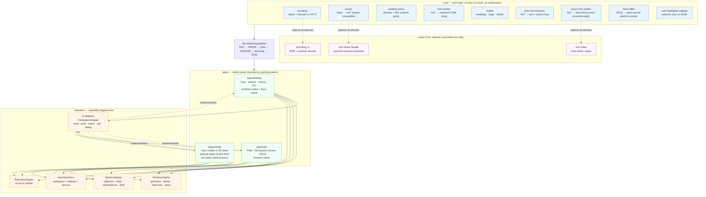
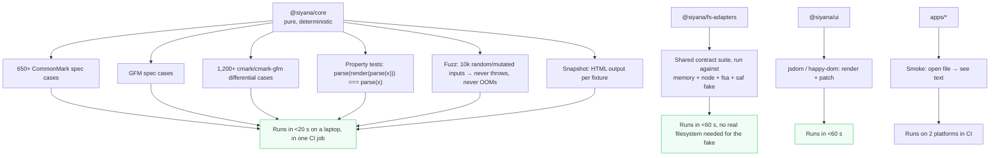

# 02 · Shared Core

**Question.** What goes in the part of the app that desktop, web, and mobile all
use, what goes in the part that they cannot, and what language is it written in?

**Short answer.** Write the core in **pure TypeScript**. Rust enters the picture
in exactly two places: as the desktop shell's native layer (file IO, atomic save,
watching) and — only if benchmarks justify it — as a WASM module. Keep `core/`
free of any host concept. Everything platform-specific goes behind a small,
capability-flagged adapter interface.

---

## 1. The boundary question, stated precisely

"One core, three shells" is a slogan. It is only true if you can state the
seam. Here is the seam:

> **`core/` may compute over data it was given. It may not obtain data,
> decide where it came from, or decide where it goes.**

That single sentence resolves most of the argument. Parsing, sanitization
policy, TOC extraction, outline building, slug generation, link classification,
plain-text extraction, search-document construction, and diffing are all
computations over bytes-or-ASTs. Filesystem access, window management, theme
switching, clipboard, notifications, shell integration, dialogs, and
persistence are all *acts in a world*, and worlds differ.

The failure mode of a leaky core is not a bug you catch in review. It is a
`if (isTauri) {` inside the tokenizer, which becomes a second tokenizer, which
becomes a parser you cannot test on CI without a webview.

## 2. Options for the core's language

### Option (a) — Pure TypeScript

The core is isomorphic TS. It runs in the webview's JS engine (WebView2's
Chromium, WebKitGTK's JSC, WKWebView's JSC), in a Web Worker on the web, and in
a React Native Hermes/JSC context on mobile.

**Parse performance in a webview JS runtime.** The honest version: the *parser*
is not the bottleneck, the *string handling* is. CommonMark parsing is roughly
linear in input with a small constant. What matters is whether the implementation
allocates a JS string/object per token. Measured family of results from our
research (see `../06-libraries/` for the full benchmark harness): on a 1 MB
document, `micromark`-class parsers complete in the 30–80 ms range and
`markdown-it` in the 150–400 ms range depending on extension set; `comrak` in
Rust is 3–6× faster but both are well under the 200 ms "first paint" budget
that the rest of the pipeline spends. The pathological cases are not parser
speed — they are (i) a single 50,000-character line, (ii) a document with
100,000 links, and (iii) deeply nested blockquotes/list nesting, which recurse
in the AST walker even though the parser is iterative. Handle those explicitly
(doc 06), and the language choice does not matter.

**Bundle size.** A CommonMark-compliant parser with GFM + footnotes + math is
roughly 60–130 KB minified+gzip in JS. `comrak` compiled to `wasm32-unknown-unknown`
with `opt-level = "z"` lands around 400–900 KB including the WASM glue and
`wasm-bindgen` runtime — a 5–10× size penalty to buy speed we do not need.

**Debuggability.** This is the strongest argument for TS and it is not close. A
stack trace through our parser lands in `packages/core/src/block/*.ts` with
working source maps, breakpoints, and step-into. A stack trace through WASM lands
in a function named `core::block::paragraph::parse` with no local variable
inspection unless we build a DWARF variant by hand. For a project whose
audience includes people who want to read and modify the source, TS wins.

**Maintenance cost.** Lowest. One language, one test runner, one CI job for
99% of the codebase. A community contributor who knows TypeScript can fix a
rendering bug. A community contributor who knows Rust is a much smaller pool,
and they will not be able to fix the DOM-diffing code, which is also in `core/`.

**Verdict: adopt.**

### Option (b) — Rust compiled to WASM

One Rust implementation, compiled once to `wasm32-unknown-unknown`, consumed by
all three targets. The desktop Tauri app can call the *same* WASM (avoiding two
implementations of the parser), or call a native build (avoiding a WASM hop).

**Near-native speed:** yes. **Works everywhere:** yes, with caveats. **Bundle
size:** 5–10× TS. **Debuggability:** much worse. **Async story:** see §4.

**The WASM-availability caveats are real but manageable.** Tauri on Windows
uses WebView2 (Chromium, WASM since forever). Tauri on macOS/iOS uses WKWebView,
where WASM has been supported since Safari 11 (2017) but *WASI* and
threads/atomics require Safari 16.4+ for shared memory. Tauri on Linux uses
WebKitGTK, whose WASM support depends on the distro's webkit2gtk build —
archival/older enterprise LTS distros are where this can get thin. None of this
is a blocker for single-threaded WASM; all of it blocks `wasm-bindgen` threads,
which we would not use.

**Verdict: hold.** Real but not worth 5–10× the binary size and the debugging
cost at our performance budget. Keep the option open with a concrete trigger in
§9.

### Option (c) — Rust native + WASM dual build, one source of truth

The Rust crate compiles to `x86_64-*-*` for the desktop and to
`wasm32-unknown-unknown` for web/mobile, both from `crates/smv-core`.

This is the shape `crates/smv-core` + `crates/smv-wasm` in doc 01 already assumes,
and it is what Tauri apps normally do for their *backend*. The mistake is putting
the **DOM/rendering** half in Rust too, because that forces the boundary to be
duplicated in two languages.

**The correct version of (c)** is: Rust owns the *text-in/text-out* problems
(encoding detection, normalization, tokenizer speed if ever needed, index
building), and TypeScript owns everything from AST to pixels. Then the dual build
is cheap because the Rust surface is small and pure.

**Verdict: adopt the narrow version, defer the wide one.** Keep
`crates/smv-core` compiling to both targets as an invariant (enforced by a CI
step), because the option must stay cheap to take.

### Option (d) — Kotlin/Swift for mobile-only parts

This is not really an option, it is a fact about the platform. On Android you
cannot write arbitrary filesystem code in JS; you need a Kotlin bridge for SAF,
`ContentResolver`, share-sheet and intent handling. On iOS you need Swift for
`UIDocumentPickerViewController`, security-scoped bookmarks,
`NSFileCoordinator`, `WKWebView` message handlers, and `UTType`.

So mobile has a native slice no matter what. The architecture question is
whether that slice is *thin*.

**Our answer: it is thin.** It contains: pickers, permission grants, bookmarks,
share intents, and lifecycle. No parsing, no rendering, no policy. All of that is
in `core/` and runs in the mobile webview. This is why doc 01's rule
"`packages/*` must not depend on `node:`" matters: `core` and `adapters` stay
pure so the same bundle runs in WKWebView and WebView2.

**Verdict: accept as a constraint, minimize it.**

## 3. The layered architecture



### The dependency rule, mechanically

```
apps/*        →  may import packages/* and anything else
packages/ui   →  may import packages/doc, packages/config
packages/fs-adapters → may import packages/core, packages/doc, packages/config
packages/core →  may import packages/doc, packages/config   ← nothing else, ever
crates/*      →  independent; reached only through an explicit optional bridge
```

Enforced by `scripts/check-boundaries.mjs` (doc 01 §11). A violation is a CI
error, not a review comment.

## 4. The async story — can WASM do synchronous parsing?

This is the most common misconception in this design conversation, so let us be
precise.

**WASM can be called synchronously from JS.** `instance.exports.parse(ptr, len)`
returns a value on the same stack. There is no event loop in between. This is
true for single-threaded WASM, which is what `wasm32-unknown-unknown` +
`wasm-bindgen` produces by default.

**So yes, a WASM parser would block the JS thread**, exactly like a JS parser
blocks the JS thread. The WASM-ness does not make it async.

What the language choice *does* change:

| Concern | TypeScript | Rust→WASM (single-threaded) | Rust native (Tauri `invoke`) |
|---------|-----------|-----------------------------|------------------------------|
| Blocking the JS thread during parse | Yes | Yes | **No** — runs on a Tauri-managed async thread pool |
| Calling from a Worker | Yes (same code) | Yes | N/A |
| Sharing memory with JS | Trivial (same heap model, structured clone or transfer) | Zero-copy views into WASM linear memory possible, but ownership/lifetime is manual | Serialised across the IPC boundary |
| Result size | Object graph, structured-cloneable | Binary AST or a WASM-owned arena plus a JS shim | JSON over IPC |
| Errors | JS exceptions | `Result` → JS `Error` | `serde` → JSON |

Two consequences we should write down:

1. **The "run it in a Worker" mitigation is language-agnostic.** Whether the
   parser is TS or WASM, the main thread should hand bytes to a Worker and get
   HTML back. This is a *pipeline* decision (doc 06 §5), not a language decision.
2. **Tauri's `invoke` is already off-thread**, so on desktop the *native* Rust
   path is the only one that gets parallelism for free. That is the strongest
   technical argument for a Rust core, and it is why the escape hatch in §9 is
   scoped to "desktop-only", not "everywhere".

**Our decision:** TypeScript core, parse in a Worker on all three platforms,
uniformly. Same code path everywhere is worth more than a per-platform fast path
for a workload that is already inside budget.

## 5. Enumerating the split

### `core/` — pure logic. No host. No clock. No randomness. No `window`

| Module | Input | Output | Why it is core |
|--------|-------|--------|----------------|
| `encoding` | `Uint8Array` | `{ text, encoding, bom, hadErrors }` | BOM sniff, UTF-8 validation, then heuristic detect (UTF-16LE/BE without BOM, legacy codepages opt-in). Deterministic. |
| `parse` | `string` + `ParseOptions` | `MarkdownDocument` | Block/inline parse to a CommonMark-shaped AST with **source offsets on every node**. |
| `sanitize` | `MarkdownDocument` + `SecurityPolicy` | `SanitizedDocument` | Not "strip tags" — a policy that decides element/attribute/URL-scheme allowlists and rewrites nodes. See `../11-security/`. |
| `render` | `SanitizedDocument` | `{ html, map: PositionMap }` | AST → HTML string. Never touches the DOM. A string is trivially diffable, testable, cacheable, and transferable from a Worker. |
| `outline` | `MarkdownDocument` | `OutlineNode[]` | Headings with levels, unique slugs (GitHub-compatible algorithm), and byte/char offsets into the source. |
| `plaintext` | `MarkdownDocument` | `PlainText` + `SourceMap` | For find-in-page fallback, for accessibility, for export, for the search index. |
| `searchdoc` | `MarkdownDocument` | `SearchDocument` | Fields + token stream, so the indexer does not need to understand Markdown. |
| `diff` | `{ before: Block[], after: Block[] }` | `Patch[]` | Block-granular diff for partial re-render (doc 06 §7). |
| `highlight` | `string`, `lang` | `Token[][]` | Tokenize only. Emits classes/tokens, never `<span style>`; the DOM is the shell's job. |
| `slug` | `string` | `string` | GitHub-compatible slug + dedupe counter, so anchors work across GitHub and us. |
| `urls` | `string` | `UrlClassification` | `link` vs `image` vs `autolink`; scheme policy (`http`, `https`, `mailto`, `tel`, `relative`, `anchor`, `file`?) — this is a *core* decision applied identically on all platforms, which is exactly why it belongs here. |
| `frontmatter` | `string` | `{ raw, format, data, span }` | Parse YAML/TOML front matter, return it *as text* plus optionally a parsed object. Core must not depend on a YAML library that pulls in `node:fs`. |

What is deliberately **not** in core:

| Not in core | Why | Where it goes |
|-------------|-----|---------------|
| Resolving `` to a byte stream | Requires reading a file | Adapter, via a `ResourceLoader` callback |
| Anchoring scroll to a heading | Requires layout | Shell |
| Persisting TOC expansion state | Requires storage | Shell + `KeyValueStore` |
| "Show raw HTML?" prompt | Requires UI and user preference | Shell |
| Deciding whether to allow raw HTML at all | **Policy, but the policy object lives in core**; the *user override* lives in settings | Core `SecurityPolicy` + settings |
| Timeout / retry / progress | Requires orchestration | Shell |
| Any `performance.now()` | Clock is a host input — pass timestamps *in* | — |

That last row is a real rule: `core` never reads a clock. Where a duration is
needed (e.g. instrumentation), the caller passes `now`. This is what makes
`core` deterministic and therefore snapshot-testable.

## 6. Adapter interface definitions

These are the contracts. Everything an adapter does not implement must either
throw a typed `CapabilityError` or degrade per the spec below — never silently
pretend.

### 6.1 `FileSystemAdapter` (the hard one — full contract in doc 03)

```ts
// packages/fs-adapters/src/types.ts

/** Opaque handle. Never a string path — see doc 03 §2. */
export type FileHandle =
  | { readonly kind: 'node'; readonly path: string }
  | { readonly kind: 'tauri'; readonly path: string }
  | { readonly kind: 'fsa'; readonly handle: FileSystemFileHandle }
  | { readonly kind: 'saf'; readonly uri: string }
  | { readonly kind: 'ios-bookmark'; readonly data: ArrayBuffer }
  | { readonly kind: 'memory'; readonly id: string };

export type WorkspaceHandle =
  | { readonly kind: 'folder'; readonly id: string; readonly name: string; readonly file: FileHandle }
  | { readonly kind: 'directory-handle'; readonly id: string; readonly name: string; readonly handle: FileSystemDirectoryHandle }
  | { readonly kind: 'opfs'; readonly id: string; readonly name: string }
  | { readonly kind: 'memory'; readonly id: string; readonly name: string }
  | { readonly kind: 'none' };

/** What this adapter can actually do. Feature-detected at runtime. */
export interface FsCapabilities {
  readonly read: true;
  readonly write: boolean;
  readonly atomicWrite: boolean;      // temp+rename
  readonly watch: boolean;            // OS-level change notifications
  readonly listRecursive: boolean;
  readonly pickFile: boolean;         // OS picker exists
  readonly pickFolder: boolean;
  readonly persistPermission: boolean; // survives restart
  readonly revealInFileManager: boolean;
  readonly maxFileBytes: number;      // 0 = unknown/unbounded
  readonly caseSensitivity: 'sensitive' | 'insensitive' | 'unknown';
}

export interface FileStat {
  readonly size: number;
  readonly mtimeMs: number | null;    // null when the platform cannot report it
  readonly hash?: string;             // present only if the adapter computed it
  readonly etag?: string;             // web adapters may have a cheap etag
}

export type WatchEventKind =
  | 'created' | 'modified' | 'deleted' | 'renamed' | 'overflow';

export interface WatchEvent {
  readonly kind: WatchEventKind;
  readonly handle: FileHandle;
  readonly workspaceId: string;
  /** true when the event was almost certainly caused by our own write */
  readonly selfOriginated?: boolean;
}

export interface SaveOutcome {
  readonly status: 'written' | 'unchanged' | 'conflict' | 'read-only' | 'too-large';
  /** Content hash actually on disk after the save, when known. */
  readonly contentHash?: string;
  readonly error?: AdapterError;
}

export interface AdapterError extends Error {
  readonly code:
    | 'unsupported' | 'permission-denied' | 'not-found'
    | 'out-of-space' | 'quota-exceeded' | 'locked' | 'too-large'
    | 'invalid-handle' | 'io' | 'cancelled' | 'conflict';
}

export interface OpenOptions {
  readonly mode: 'read' | 'readwrite';
  readonly extensions?: readonly string[];
}

export interface SaveOptions {
  /** Expected on-disk hash. If it differs → 'conflict', never overwrite. */
  readonly expectedHash?: string;
  /** Prefer atomic replace (temp + rename) when the adapter supports it. */
  readonly atomic?: boolean;
  /** Write a sibling `.smv-backup` first. Adapter may ignore. */
  readonly backup?: boolean;
  readonly newEncoding?: string;
  /** Preserve the file's original trailing newline and EOL style. */
  readonly preserveEol?: boolean;
}

export interface FileSystemAdapter {
  readonly id: string;
  readonly capabilities: FsCapabilities;

  /** Human-facing, for display only. Never used for IO. */
  describe(handle: FileHandle): Promise<string>;

  pickFile(opts: OpenOptions): Promise<FileHandle[]>;
  pickFolder(opts: OpenOptions): Promise<WorkspaceHandle | null>;
  /** Re-open a handle persisted in a previous session. May fail → caller re-prompts. */
  restore(handle: FileHandle): Promise<FileHandle | null>;

  readBytes(h: FileHandle): Promise<Uint8Array>;
  stat(h: FileHandle): Promise<FileStat>;
  save(h: FileHandle, bytes: Uint8Array, opts: SaveOptions): Promise<SaveOutcome>;

  /** Bounded traversal. Must yield. Must honour `signal`. */
  listFiles(ws: WorkspaceHandle, opts: {
    maxFiles?: number;
    maxDepth?: number;
    includeGlobs?: readonly string[];
    excludeGlobs?: readonly string[];
    signal?: AbortSignal;
    onProgress?: (done: number, path: string) => void;
  }): AsyncIterable<{ handle: FileHandle; size: number }>;

  /** No-op returning a never-firing iterator when `capabilities.watch` is false. */
  watch(ws: WorkspaceHandle, opts: {
    debounceMs?: number;
    signal?: AbortSignal;
  }): AsyncIterable<WatchEvent>;

  /** Desktop: show in Explorer/Files. Elsewhere: no-op. */
  reveal?(h: FileHandle): Promise<void>;

  /** Persist/revoke a directory grant (FSA `queryPermission`, SAF URI grant). */
  persist?(ws: WorkspaceHandle): Promise<boolean>;
  revokePersist?(ws: WorkspaceHandle): Promise<void>;
}
```

### 6.2 `WindowAdapter`

```ts
export interface WindowGeometry {
  readonly width: number; readonly height: number;
  readonly x?: number; readonly y?: number;
  readonly maximized: boolean; readonly fullscreen: boolean;
  readonly scaleFactor: number;
}

export interface DisplayInfo {
  readonly id: string; readonly label: string;
  readonly bounds: { x: number; y: number; width: number; height: number };
  readonly scaleFactor: number;
}

export interface WindowAdapter {
  readonly canSetGeometry: boolean;
  readonly supportsMultiWindow: boolean;
  readonly supportsMenu: boolean;
  readonly supportsFullscreen: boolean;
  readonly supportsWindowControlsOverlay: boolean; // Tauri WCO
  readonly supportsVibrancy: boolean;

  getGeometry(): Promise<WindowGeometry>;
  setGeometry(g: Partial<WindowGeometry>): Promise<void>;
  getDisplays(): Promise<DisplayInfo[]>;
  getCurrentDisplay(): Promise<DisplayInfo>;
  setFullscreen(on: boolean): Promise<void>;
  setTitle(t: string): Promise<void>;
  /** Native menu bar. Web: no-op; the shell renders an HTML menu instead. */
  setMenu?(menu: MenuSpec): Promise<void>;

  onResize(cb: (g: WindowGeometry) => void): () => void;
  onFocusChange(cb: (focused: boolean) => void): () => void;
  onThemeChange(cb: (t: 'light' | 'dark') => void): () => void;
  onOpenRequest(cb: (payload: OpenPayload) => void): () => void;
  onPrint(cb: (html: string) => Promise<void> | void): () => void;
}

export type OpenPayload =
  | { kind: 'paths'; paths: readonly string[] }
  | { kind: 'argv'; args: readonly string[] }
  | { kind: 'android-intent'; uri: string; mimeType?: string }
  | { kind: 'ios-url'; bookmark?: ArrayBuffer };
```

### 6.3 `SystemAdapter`

```ts
export interface SystemCapabilities {
  readonly clipboard: boolean;
  readonly clipboardWrite: boolean;   // read requires permission on some platforms
  readonly notifications: boolean;
  readonly openExternal: boolean;
  readonly revealInFileManager: boolean;
  readonly shareSheet: boolean;
  readonly print: boolean;
  readonly openWithSystemApp: boolean;
  readonly globalHotkeys: boolean;
  readonly powerMonitor: boolean;     // suspend/resume → flush dirty buffers
}

export interface SystemAdapter {
  readonly capabilities: SystemCapabilities;

  readClipboard(): Promise<string>;
  writeClipboard(text: string): Promise<void>;
  /** "file:///…/x.png" or "data:" — must be allowlisted by the caller. */
  openExternal(url: string): Promise<void>;
  share?(payload: SharePayload): Promise<void>;
  notify?(n: NotificationSpec): Promise<void>;

  onPowerChange(cb: (state: 'suspend' | 'resume' | 'battery-low') => void): () => void;
  onCommand(cb: (id: string) => void): () => void;  // protocol handler / deep link
}
```

### 6.4 `KeyValueStore` (workspace + settings + session persistence)

```ts
export interface KeyValueStore {
  read<T>(key: string, schema: Schema<T>): Promise<T | null>;
  /** MUST be atomic: write-temp + rename, or equivalent. */
  write(key: string, value: unknown): Promise<void>;
  delete(key: string): Promise<void>;
  keys(): Promise<string[]>;
  /** Cheap migration hook; called once per load. */
  migrate(from: number, to: number, raw: unknown): unknown;
}

export interface Schema<T> {
  readonly version: number;
  parse(raw: unknown): T;          // throws SchemaError — never returns garbage
}
```

### 6.5 `TelemetryAdapter`

```ts
export interface TelemetryAdapter {
  /** Default implementation: a no-op that returns false from `enabled()`. */
  readonly enabled(): boolean;
  capture(event: TelemetryEvent): void;
}

export type TelemetryEvent =
  | { kind: 'app-start'; version: string; target: Target; coldStartMs: number }
  | { kind: 'render'; bytes: number; blocks: number; ms: number; degraded: boolean }
  | { kind: 'crash'; kind2?: never; fingerprint: string }
  | { kind: 'perf-sample'; name: string; value: number; unit: 'ms' | 'bytes' | 'count' };
```

The default adapter is a no-op. There is no code path in which telemetry is on
unless the user turned it on — that is a *type-level* guarantee, because you
cannot call `.capture()` on a no-op that throws if invoked.

```ts
export const NOOP_TELEMETRY: TelemetryAdapter = {
  enabled: () => false,
  capture(event) {
    throw new Error(`telemetry is disabled but capture() was called: ${event.kind}`);
  },
};
```

## 7. The `RenderPipeline` facade — what `core` actually exports

The public surface of `core` should be small enough to read in one sitting. This
is the whole API:

```ts
// packages/core/src/index.ts
export interface RenderRequest {
  readonly bytes: Uint8Array;
  readonly sourcePath?: string;
  readonly options: ParseOptions & SecurityPolicy;
}

export interface RenderResult {
  readonly html: string;
  readonly outline: OutlineNode[];
  readonly tocHtml: string;
  readonly headings: HeadingRef[];
  readonly stats: RenderStats;
  readonly warnings: RenderWarning[];
  readonly degraded: DegradedMode | null;
  readonly map: PositionMap;
}

export type DegradedMode =
  | 'raw-text'        // parser threw: show escaped source, keep the app alive
  | 'truncated'        // file over budget: show the head, say so
  | 'partial'          // some blocks failed to decorate; placeholders shown
  | 'no-index';        // search unavailable, document still readable

export interface RenderPipeline {
  /** Synchronous, pure, deterministic. Throws only on programmer error. */
  render(req: RenderRequest): RenderResult;

  /** Same as render() but never throws. Use this in UI. */
  tryRender(req: RenderRequest): RenderResult & { error?: Error };
}
```

Everything else — reading bytes, decoding off-thread, posting to a Worker,
diffing, DOM patching, scrolling — is in `packages/ui` or the shell. That
asymmetry is the point: **`core` is a pure function of `(bytes, options)`**, and
that is what makes it testable in Node in 20 ms, reusable on three platforms, and
identical in output everywhere.

## 8. What about the Rust crates? Honest scoping

| Crate | Now | Trigger to invest more |
|-------|------|----------------------|
| `crates/smv-doc` | Types + a `#[repr(C)]`-free serde mirror of the AST, so Rust can emit the same structure `core` consumes | If we ever build the index in Rust |
| `crates/smv-index` | Nothing yet | Tier-3 search needs it (doc 05) |
| `crates/smv-wasm` | A CI check that `cargo check -p smv-core --target wasm32-unknown-unknown` passes | Option (b) adopted |
| `crates/smv-fs` | Real: read/write/watch/atomic-save for the desktop shell | Already required |
| `crates/smv-core` | Minimal: encoding heuristics + normalization helpers shared by `smv-fs` | If benchmarks demand |

The CI invariant that keeps option (c) cheap:

```yaml
# .github/workflows/ci.yml (excerpt)
- name: Rust core still compiles to WASM
  run: cargo check -p smv-core --target wasm32-unknown-unknown
```

## 9. Escalation triggers — when to move parsing to Rust

Write these down now so the decision is data-driven later.

| Trigger | Threshold | Action |
|---------|-----------|--------|
| Time-to-first-paint on a 5 MB `.md` on the slowest supported machine | > 400 ms at the 95th percentile, measured over 200 runs | Profile `core` first. Only then consider WASM for the tokenizer. |
| Scroll jank on a 20 MB document | > 8 ms frames while parsing | Virtualize (doc 06 §8), not rewrite in Rust |
| Tree walk + sanitizer on 50k blocks | > 300 ms | Move *sanitize+walk* to Rust/WASM — this is pure text-in/text-out and the least coupled part |
| Contributors repeatedly blocked by "you need Rust" | ≥3 such reports in a quarter | Fund the Rust path properly, or accept TS forever |
| Bundle size complaints | Web bundle > 600 KB gzipped | Split the parser into a lazily-loaded chunk; do **not** move to WASM (it is bigger) |

Note the last row: WASM is the wrong answer to a size problem.

## 10. Testing strategy implied by this layering

Because `core` is a pure function, the test pyramid is unusually clean:



The **shared adapter contract suite** is the highest-leverage test artifact in
the whole project: one file of `describe()` blocks, run against a memory
adapter, the Node adapter, the FSA adapter (in headless Chromium via Playwright),
and the SAF adapter (against a fake `ContentResolver` in a JVM unit test). Any
adapter that passes is *definitionally* conformant. That is how you get three
platforms from one implementation without three sets of bug reports.

The **fuzz target** is not optional for a tool that opens untrusted files:

```ts
// packages/core/test/fuzz.spec.ts  (vitest, deterministic seed for CI)
import { describe, it, expect } from 'vitest';
import { tryRender } from '../src';

describe('core never throws on hostile input', () => {
  it('survives 10k mutated documents', () => {
    for (let i = 0; i < 10_000; i++) {
      const bytes = mutate(corpus[i % corpus.length], i);
      const r = tryRender({ bytes, options: defaultOptions });
      expect(r.degraded).not.toBe('raw-text'); // must degrade, not explode
      expect(r.html.length).toBeLessThan(bytes.length * 12 + 4096); // no zip bomb
    }
  });
});
```

(Real fuzzing belongs in `cargo-fuzz`/`libfuzzer-sys` on `smv-core` once it
exists; the TS version is a fast smoke net that runs in CI on every commit.)

## 11. Anti-patterns this design forbids

| Anti-pattern | Why it is forbidden |
|---|---|
| `if (typeof window !== 'undefined')` inside `core` | The moment `core` sniffs its host, it stops being testable and the three shells start diverging |
| A `Platform` enum threaded through core functions | Same problem, less honest. Capabilities belong on the *adapter*, not in a parameter |
| `core` importing a React component | UI and logic fuse and become untestable without a DOM |
| Parsing in the shell, rendering in `core` | The parse options and the sanitize policy must be decided together, in one place, or you get XSS |
| Sanitizing with a regex or with `DOMPurify` on already-emitted HTML | Regex sanitizing is unsound. Post-hoc DOM sanitizing loses the source positions we need for anchoring |
| Sharing "just a little" state through a module-level singleton | Makes concurrent documents (tabs, split panes, worker instances) impossible |
| Calling `performance.now()` in `core` | Non-determinism. Pass timestamps in |
| `crates/` and `packages/` importing each other freely | Two graphs become one graph and nobody knows what the Rust side actually needs |

## 12. Decision summary

| Question | Answer | Confidence |
|---|---|---|
| Core language | **Pure TypeScript** | High |
| Rust's role | Desktop-native IO + (later) index build; optional WASM for text-in/text-out only | High |
| Where the seam is | `core/` computes; `adapters/` obtain; `apps/` decide | High |
| Adapters are | Interface + **capability flags**, feature-detected at runtime | High |
| Handles are | Opaque tagged unions, never strings | High |
| DOM patching | In `ui`, not `core` — `core` returns an HTML string | High |
| Telemetry | A no-op adapter that throws if used; opt-in only | High |
| Determinism | No clock, no randomness, no host in `core` | High |
| WASM | Held as an escalation with numeric triggers (§9) | Medium |

## 13. What we still do not know

- **Q-17** — Do we want one `core` or a `core` plus a `core-wasm` that must
  produce byte-identical HTML? Maintaining two renderers that must agree is a
  correctness tax; one WASM renderer is a size tax. Owner: core. Deadline: the
  first benchmark that trips §9 row 1.
- **Q-18** — Should `SanitizedDocument` be a distinct type from `MarkdownDocument`
  (type-level proof that unsanitized HTML cannot reach the DOM), or one type with
  a branding field? Type-level is stronger but forces two functions. Owner: core.
- **Q-19** — Is React the right shell-level view layer, given that our render is
  "mostly one big HTML blob with stable keys"? A hand-written patcher with no
  framework may be smaller and faster. Owner: ui. (See doc 06 §7.)
- **Q-20** — Does `highlight` belong in core (tokenize) or `ui` (render spans)?
  Tokenizing is pure, so core; but the token vocabulary is Shiki's/Shiki-alike's,
  which is a heavy dependency for `core` to own. Owner: core + ui jointly.

## 14. Sources

- `micromark` 4.0.2 README (nmp; "smallest CM parser at ±14kb", 100% CommonMark,
  "safe (by default)"); `markdown-it` npm benchmark figures; retrieved 2026-10-06.
- `comrak` 0.46.x on crates.io (BSD-2-Clause, Rust port of cmark-gfm, CommonMark
  0.31.2); `markdown-rs` / crate `markdown` v1.0.0 (MIT, `no_std` + alloc);
  `pulldown-cmark`; retrieved 2026-10-06.
- `wasm-pack` 0.15.0 (14 May 2026) and `wasm-bindgen` 0.2.128 `Cargo.toml`;
  `--target web|nodejs|bundler|no-modules`; note the changelog entry on
  `-Cpanic=unwind` requiring Node 22.22.3+ for `WebAssembly.JSTag`; retrieved
  2026-10-06.
- Tauri 2.12 announcement (26 Sep 2026): MSRV 1.90, default iOS minimum 15.0;
  Tauri webview version reference (WebKit via `WKWebView` on macOS/iOS and
  `webkit2gtk` on Linux, requiring webkit2gtk ≥ 2.40 / API 4.1); retrieved
  2026-10-06.
- MDN, *File System Access API* and *Storage quotas and eviction criteria*
  (`showDirectoryPicker` "Limited availability"; WebKit 80% disk for browser apps
  vs 20% for non-browser web content; Firefox 10%/10 GiB best-effort,
  50%/8 TiB persistent); retrieved 2026-10-06.
- Android Developers, *Access documents and other files from shared storage*
  (`ACTION_OPEN_DOCUMENT_TREE`, API 21+, Android 11 directory restrictions,
  `takePersistableUriPermission` invalidation on reboot/move); Apple, *Providing
  access to directories* (security-scoped URLs since iOS 13,
  `startAccessingSecurityScopedResource`, `NSFileCoordinator`); retrieved
  2026-10-06.
