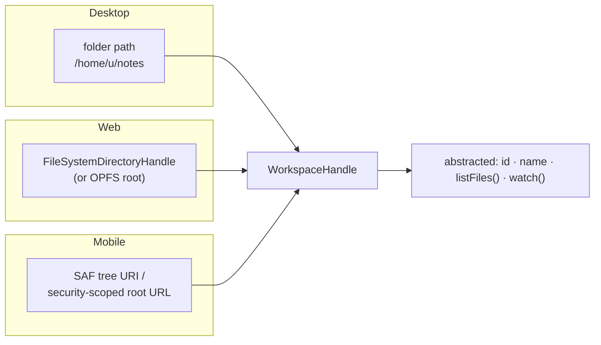

# 03 · Filesystem Strategy

**Question.** How do we read, write, watch, and reconcile a file when the three
targets have three completely different filesystem models?

**Short answer.** One `FileSystemAdapter` interface, four implementations, and
one rule that does the heavy lifting: **handles are opaque tagged unions, never
strings.** Everything else in this document — capability detection, watching,
conflict handling, atomic saves — follows from that.

---

## 1. The three models, stated honestly

This is the central difficulty of the project. It is not "the same thing with
different syntax". Each platform offers a genuinely different *authority model*.

| | Desktop (Windows/Linux) | Web | Mobile |
|---|---|---|---|
| **What exists** | A real, hierarchical, mutable filesystem with paths | An origin-scoped sandbox. Paths do not exist. | A private sandbox. Paths do not exist and are meaningless. |
| **How you get access** | Nothing. It is all already accessible (subject to OS perms). | A user gesture that returns a *handle* (File System Access API) — or a drag-drop `File` — or a `File` from `<input>`. | A system picker returning a URI (Android SAF) or a security-scoped URL (iOS `UIDocumentPickerViewController`). |
| **How you enumerate** | `readdir` | `handle.values()` (async iterator) | `ContentResolver` / `FileManager.enumerator` on a security-scoped root |
| **How you watch** | `inotify`, `FSEvents`/`kqueue`, `ReadDirectoryChangesW` | **Nothing.** No API. Polling is the only option, and in a background tab timers are throttled. | **Nothing portable.** Android has no general directory watch. iOS has `NSFilePresenter`/coordinated reading and nothing that is really a watch. |
| **Atomic replace** | `rename(2)` / `MoveFileEx` | `FileSystemWritableFileStream` + `close()` — not atomic against other readers | `DocumentsContract.renameDocument`; `NSFileManager replaceItemAt` |
| **How you know a file changed** | Watch event + mtime + size | Compare stored etag/mtime/size on next poll; user must keep the tab alive | On resume, re-stat what we care about |
| **Permission persistence** | N/A | `handle.queryPermission` / `requestPermission`; may be revoked | `takePersistableUriPermission` (Android); security-scoped bookmark (iOS) — **both silently invalidated** by reboot (Android), file move, or user action (iOS) |
| **Where does "Save" go** | Back where it was | Back where it was (Chromium only) | Back where it was — if the grant is still valid |

The ugly truths, stated plainly:

1. **Chromium-only.** `window.showDirectoryPicker()` is "Limited availability"
   per MDN as of Sep 2026. Chromium (86+), Edge, and Opera have it. Firefox and
   Safari have the Origin Private File System but **not** the local-disk
   pickers. A "web app that opens a folder from your disk" is therefore a
   Chromium app with a degraded fallback for everyone else. This is a product
   decision, not a technical detail — see Q-21.
2. **No watching in browsers.** There is no filesystem watcher on the web
   platform, at all, in any browser. Poll + explicit "Reload" is the honest UX.
3. **No watching on mobile, either.** Android SAF gives a URI grant over a tree;
   there is no inotify equivalent for `content://` URIs. iOS gives a
   security-scoped URL; coordinated reading tells you when to re-read, but you
   do not get push notifications and the app is usually not running.
4. **Permission grants evaporate.** On Android, a persisted URI grant is lost
   after a device restart and if the document moves or is deleted. On iOS a
   bookmark can fail to resolve at any time. The web's
   `FileSystemDirectoryHandle` can be serialized to IndexedDB and restored, but
   `queryPermission({mode:'readwrite'})` can return `'prompt'` and requires a
   user gesture to re-grant.

Any design that pretends these are the same filesystem will produce a
desktop-first app that cannot be ported, and a mobile app that is really an
Electron app in a phone costume.

## 2. The abstraction: opaque handles

```ts
export type FileHandle =
  | { readonly kind: 'node';      readonly path: string }               // desktop
  | { readonly kind: 'tauri';     readonly path: string }               // desktop
  | { readonly kind: 'fsa';       readonly handle: FileSystemFileHandle }// web/Chromium
  | { readonly kind: 'saf';       readonly uri: string }                 // Android
  | { readonly kind: 'ios-bookmark'; readonly data: ArrayBuffer }        // iOS
  | { readonly kind: 'memory';    readonly id: string };                 // OPFS/tests
```

The rule that keeps this honest:

> **No layer above `fs-adapters` may branch on `handle.kind`, and no layer above
> `fs-adapters` may construct one.**

`handle.kind` is read *only* inside the adapter that matches it. Everything else
passes handles around opaquely and asks the adapter what it can do. If the UI
needs a display string, it calls `adapter.describe(handle)`. If it needs to
compare two handles for identity, it calls `adapter.equals(a, b)` (doc 03 §2.1).

The reason to be this strict: the moment a path string escapes, someone will
`join(wsPath, '..', '..', relPath)` and we have a path-traversal vulnerability
created by our own abstraction. Handles make that impossible by construction.

### 2.1 Identity and resolution

```ts
export interface FileSystemAdapter {
  // …
  /**
   * Stable identity for a file within an adapter. Two handles are the same
   * document iff `equals` is true. Implementations:
   *  - node/tauri: normalized absolute path + a cheap inode/device hint
   *  - fsa:        handle.name + relative path from the workspace root
   *  - saf:        DocumentFile.getUri() (content URIs are stable per doc)
   *  - ios:        bookmark data compared via bookmarkData.isEqual(other)
   *  - memory:     the id
   */
  equals(a: FileHandle, b: FileHandle): Promise<boolean>;

  /** Relative, '/'-separated, workspace-relative path. For display + indexing. */
  relativePath(ws: WorkspaceHandle, h: FileHandle): Promise<string>;

  /**
   * Resolve a possibly-stale handle to a live one. Called on every session
   * restore and before every write.
   * Returns `null` if the grant is gone — the caller must re-prompt.
   */
  resolve(h: FileHandle): Promise<FileHandle | null>;
}
```

`relativePath` is the one place a string path is *produced*, and it is produced
for display and for the search index, never for IO. Path traversal is therefore
impossible through the adapter surface.

## 3. Capability detection, not platform sniffing

**Never** `if (navigator.userAgent.includes('Android'))`. Feature-detect:

```ts
// packages/fs-adapters/src/select.ts
export function detectFs(env: FsEnvironment): FileSystemAdapter {
  // Each branch tests for a *capability*, not for a platform.
  if (env.hasFsaDirectoryPicker) return new FsaAdapter(env.opfs);       // web (Chromium)
  if (env.hasTauriFs)            return new TauriAdapter();              // desktop
  if (env.hasSafDocumentTree)    return new SafAdapter();                // Android
  if (env.hasIosDocumentPicker)  return new IosAdapter();                // iOS
  return new OpfsAdapter(env.opfs);                                     // web fallback
}

export function hasFsaDirectoryPicker(w: Window = window): boolean {
  return typeof w.showDirectoryPicker === 'function'
      && typeof w.FileSystemDirectoryHandle !== 'undefined'
      && w.isSecureContext;                       // FSA is a secure-context API
}

export function hasFsaPersistence(): boolean {
  // Can we serialize a handle into IndexedDB and get it back?
  return typeof indexedDB !== 'undefined'
      && 'getDirectory' in navigator.storage;
}
```

The capability object is then the *only* thing the UI consults:

```ts
// packages/ui/src/OpenButton.tsx
const can = adapter.capabilities;

if (can.pickFolder && can.write && can.watch) {
  return <Button onClick={openFolder}>Open folder…</Button>;   // full experience
}
if (can.pickFolder && can.write) {
  return <Button onClick={openFolder}>Open folder…</Button>;   // no live reload
}
if (can.pickFile) {
  return <Button onClick={openFile}>Open file…</Button>;       // single-document mode
}
return <FileInput onChange={onUpload} accept=".md,.markdown,.txt" />;  // last resort
```

Note what this does: **the fallback ladder is a function of capabilities, not of
platform**, so a future browser that adds `showDirectoryPicker` gets the full
experience with no code change, and a browser that loses it degrades correctly
with no code change.

The capability matrix we expect to ship:

| Capability | Windows | Linux | Chromium web | Firefox/Safari web | Android | iOS |
|---|---|---|---|---|---|---|
| `read` | ✅ | ✅ | ✅ | ✅ (OPFS/upload only) | ✅ | ✅ |
| `write` | ✅ | ✅ | ✅ | ✅ (OPFS only) | ✅ | ✅ |
| `atomicWrite` | ✅ | ✅ | ⚠️ close-then-rename only where writable | ⚠️ | ⚠️ | ✅ |
| `watch` | ✅ | ✅ | ❌ | ❌ | ❌ | ❌ |
| `listRecursive` | ✅ | ✅ | ⚠️ slow, per-entry permission checks | ⚠️ OPFS | ⚠️ via ContentResolver | ⚠️ via FileManager |
| `pickFolder` | ✅ | ✅ | ✅ | ❌ | ✅ | ✅ |
| `persistPermission` | n/a | n/a | ⚠️ IndexedDB + queryPermission | n/a | ⚠️ lost on reboot | ⚠️ bookmark can fail |
| `revealInFileManager` | ✅ | ✅ | ❌ | ❌ | ❌ | ❌ |

## 4. The "workspace" concept

The same idea, three physical forms:



```ts
export type WorkspaceHandle =
  | { kind: 'folder';            id: string; name: string; file: FileHandle }
  | { kind: 'directory-handle';  id: string; name: string; handle: FileSystemDirectoryHandle }
  | { kind: 'opfs';              id: string; name: string }
  | { kind: 'memory';            id: string; name: string }
  | { kind: 'none' };                     // single-document mode
```

A workspace is **not** a search root and **not** a git repo. It is the unit of:
* tree navigation,
* watch scope,
* the search scope for tier (b) search (doc 05),
* the key under which UI state is persisted (doc 04).

Important design consequence: **workspaces are per-adapter.** A desktop workspace
is identified by an absolute path; a web workspace by a handle stored in
IndexedDB; a mobile workspace by a persisted grant. The `id` field is an
adapter-local stable string, not a global UUID, and that is fine because
workspaces are never shared across platforms.

### 4.1 Bounded traversal

Every platform makes `listFiles` pathological if you let it run free. One
signature for all of them, with hard bounds and mandatory yielding:

```ts
async *listFiles(ws, { maxFiles = 20_000, maxDepth = 32, signal, onProgress }) {
  let count = 0;
  const queue: Array<{ dir: unknown; rel: string; depth: number }> = [rootOf(ws, '')];
  let lastYield = Date.now();

  while (queue.length) {
    if (signal?.aborted) return;
    const { dir, rel, depth } = queue.shift()!;

    for await (const entry of entriesOf(dir)) {          // adapter-specific
      if (count >= maxFiles) { onTruncated?.(); return; }
      if (isIgnored(entry.name, rel)) continue;           // .git, node_modules, .smv
      if (entry.isDir) {
        if (depth < maxDepth && !isSymlinkLoop(entry)) queue.push({ dir: entry, rel: join(rel, entry.name), depth: depth + 1 });
      } else if (isMarkdown(entry.name)) {
        count++;
        yield { handle: toHandle(entry), size: entry.size };
        // Yield to the event loop at least every 4 ms so the UI never stalls.
        if (Date.now() - lastYield > 4) { onProgress?.(count, rel); await tick(); lastYield = Date.now(); }
      }
    }
  }
}
```

Three non-negotiable rules, all of which exist because a real user will hit them:
1. **`maxFiles`.** A user who points us at their home directory must not hang
   the app. Default 20,000 files, and when we hit it we *tell them*.
2. **`isIgnored`.** `.git`, `node_modules`, `.obsidian`, `.trash`,
   `$RECYCLE.BIN`, `System Volume Information`, and anything we wrote (`.smv-*`).
   Symlinks are followed at most once and never above the workspace root —
   following an absolute symlink out of the workspace is both a hang risk and a
   traversal risk.
3. **Yield every 4 ms.** Even on desktop where the walk is on a Rust thread, the
   *progress reporting* goes back to the main thread and can flood it.

## 5. File watching

### 5.1 Desktop: the good case

| Platform | Rust crate | Node |
|---|---|---|
| Windows | `ReadDirectoryChangesW` via `notify` | `fs.watch` |
| Linux | `inotify` via `notify` | `inotify` via `fs.watch` |
| macOS | `FSEvents` (or `kqueue`) via `notify` | `FSEvents` via `fs.watch` |

`notify` is the right Rust choice: cross-platform, CC0-licensed, actively
released (`notify-types` 2.1.0, 2026-01-25), and it is what `cargo watch`,
`watchexec`, `rust-analyzer`, and `xi-editor` all use. Its backends are
inotify / FSEvents|kqueue / ReadDirectoryChangesW / PollWatcher, and its docs
call out the one platform-specific landmine: **FSEvents' security model can hide
events for files you do not own**, in which case the PollWatcher is the
workaround.

Because our desktop shell is Rust (Tauri), **`notify` in Rust is the default**,
not `chokidar` in Node — there is no Node. `chokidar` is only relevant if we
ever ship an Electron build, and even then chokidar 4 dropped glob support
(a notable breaking change), so `ignored` filters would need a matcher library
instead.

```ts
// packages/fs-adapters/src/node/watch.ts  → runs in the Rust side via IPC in prod
export function createWatcher(ws: WorkspaceHandle, opts: { debounceMs?: number }) {
  const debounceMs = opts.debounceMs ?? 250;
  const pending = new Map<string, { timer: NodeJS.Timeout; last: WatchEventKind }>();

  return {
    async *[Symbol.asyncIterator]() {
      const watcher = notifyWatcher(
        /* debouncer: coalesce bursts, drop events for paths we just wrote */,
      );
      for await (const ev of watcher) {
        const key = normalize(ev.path);
        const prev = pending.get(key);
        // Collapse create/modify bursts (editors write in several syscalls).
        clearTimeout(prev?.timer);
        pending.set(key, {
          last: mergeKinds(prev?.last, ev.kind),
          timer: setTimeout(() => { pending.delete(key); queue.push(ev); }, debounceMs),
        });
      }
    },
  };
}
```

The three debouncing rules that make watchers usable:

1. **Coalesce.** A single "save" in most editors produces `open`, `write`,
   `write`, `close`, `rename`. Naive handling causes 4 renders and 3 flashes of
   the "file changed" banner. Coalesce on a 250 ms trailing debounce.
2. **Suppress self-originated events.** Record the `(path, mtime, size)` of every
   write we perform; drop a matching event. Without this, saving in the app
   looks like an external edit and the user gets a conflict dialog about their
   own keystroke.
3. **Handle atomic saves as a single event.** Many editors (vim, Obsidian, most
   Rust and Go tooling) write to `foo.md.tmp` and `rename()` over the target.
   Chokidar has explicit support for collapsing this into a `change`; we
   replicate it by watching the parent directory and treating
   `rename(to=foo.md)` as `modify(foo.md)` when `foo.md` existed before.

### 5.2 Web: there is no watcher

This is not a gap in our adapter; it is a gap in the platform. The design:

| Strategy | Where it works | Cost |
|---|---|---|
| `watcher` proposal (`navigator.storage.getDirectory()` + `FileSystemObserver`) | **Not shipped in any browser as of 2026-10-06.** Chromium has had it behind a flag for years. Do not design against it. | — |
| Poll with `handle.getFile()` → `lastModified` + `size` | Chromium | One stat per open file per interval. 200 ms while focused; 2 s while idle. |
| `document.visibilitychange` re-check on return | All | Free, and catches the "I edited in my editor while the tab was in the background" case — the most common case |
| Poll the tree via `handle.values()` | Chromium | `values()` requires a permission check per entry in some implementations. Expensive. Interval 5 s, only while a workspace is open, and only when no file is open. |
| Explicit "Reload" button + `beforeunload` warning if stale | All | Honest, zero-cost, and the only correct answer for Firefox/Safari |

Recommendation: poll stat of open documents every 2 s while the tab is visible;
on `visibilitychange` to visible, re-stat immediately; on any mismatch, show a
**non-modal inline banner** ("`README.md` changed on disk — Reload / Keep this
version") rather than a dialog. Never `alert()`.

### 5.3 Mobile: no watcher either

Android SAF gives a `content://` URI grant. There is no directory-change
notification. What you *can* do:

- Re-stat on `onResume`. Cheap, correct, and covers "I edited in another app
  while this one was backgrounded", which is the mobile equivalent of the
  laptop case.
- Optionally register a `ContentObserver` on the specific document URI — this
  works for some providers (including `DocumentsProvider`-backed cloud
  providers) and silently does not fire for others. Use it as an optimisation,
  never as the mechanism.
- iOS: `NSFileCoordinator` tells you when a document you are presenting has
  changed by another process; Apple requires you to use it for external
  documents. That is the correct primitive and it is push-free by design.

So mobile's external-edit story is: **check on foreground, tell the user, never
write over a document you did not re-read.**

### 5.4 Polling fallback

If `capabilities.watch` is false we still want *something* on desktop. Two
tiers:

1. **Foreground/visibility poll** of open files only, 2 s.
2. **Optional explicit "watch this folder" setting** on web/mobile, off by
   default, clearly labelled as costing battery.

We do **not** implement a full-tree poller. It is O(tree) on every tick, it will
drain a phone, and nobody asked for it.

## 6. External-edit detection

The question is not "did mtime change" — that is a heuristic that produces false
positives constantly (a `git checkout` touches mtimes; a backup tool rewrites
identical content; some filesystems have 1-second mtime granularity on Windows).
The question is "**is the content different from what I last read or wrote?**".

The algorithm we implement, in order:

```ts
interface TrackedFile {
  handle: FileHandle;
  /** Content hash of exactly what we last rendered or wrote. */
  contentHash: string;      // BLAKE3-128 hex, truncated — collision risk is
                            // irrelevant at this scale and it is 3× faster than
                            // SHA-256 in JS
  size: number;
  mtimeMs: number | null;   // hint only, never authoritative
  lastWrittenAt: number | null; // suppresses self-triggered reloads
}

async function detectExternalChange(f: TrackedFile): Promise<ChangeKind> {
  const st = await adapter.stat(f.handle);

  // 0. Gone?
  if (st.size === 0 && f.size !== 0) return 'deleted';

  // 1. Cheap reject: nothing that could have changed.
  if (f.mtimeMs !== null && st.mtimeMs !== null
      && st.mtimeMs <= f.mtimeMs && st.size === f.size) {
    return 'unchanged';      // fast path; no read
  }

  // 2. Read and hash. This is the authoritative check.
  const bytes = await adapter.readBytes(f.handle);
  if (bytes.length !== f.size) return 'modified';
  const hash = blake3_128(bytes);
  if (hash === f.contentHash) return 'touched-but-identical';  // mtime moved, content did not
  return 'modified';
}
```

The `touched-but-identical` result is important and worth its own case: it lets
us say nothing at all when a tool rewrote the file with the same bytes. A tool
that treats that as a change will nag users into uninstalling us.

### 6.1 Conflict handling

Three states, and only three. The copy in the dialog is fixed wording, reviewed
by nobody, and researched in `../12-ux/`.

```text
The file changed on disk since you opened it.

  last-opened: 12:04:31   on-disk: 12:09:12

  [ Reload from disk ]   [ Keep my version ]   [ Save a copy as… ]
```

- **Reload from disk** — discard in-memory state, re-read, re-render, reset
  scroll to top (or to the anchor that was in view, which is nicer and we do
  that instead).
- **Keep my version** — leave the file on disk alone, keep our buffer, mark the
  document `dirty-external`, and **suppress the banner until the content
  changes again**. This is not "save", so we never destroy their data.
- **Save a copy as…** — picker; write `<name>.conflicted-<timestamp>.md`
  next to the original (desktop/web-FSA) or into the app's documents dir
  (mobile), tell the user where.

**We do not auto-merge, and we do not offer a diff-merge UI in v1.** See §8.

### 6.2 3-way merge — the honest analysis

If we ever want auto-merge, the only defensible option is a 3-way merge against
`base` (what we read), `ours` (the buffer), `theirs` (what is on disk):

```ts
type MergeResult =
  | { kind: 'clean'; text: string }                 // auto-appliable
  | { kind: 'conflict'; hunks: ConflictHunk[] }     // needs a human
  | { kind: 'unmergeable'; reason: string };
```

| Option | Assessment |
|---|---|
| `diff3` / `diff-match-patch` | Works at line granularity. Markdown is *not* line-structured: a table row, a list item continued across a wrapped line, and a fenced code block are all semantically unit-sized but not line-sized. A single changed word in a paragraph produces a whole-paragraph conflict. |
| `diff-so-fancy`-style token merge | Same problem, smaller units, more false "clean" results — which is worse, because a wrong auto-merge silently corrupts a file. |
| AST/CommonMark-aware merge | Theoretically right; practically, a heading move, a list renumbering, and a link-reference redefinition all change the AST in ways that have no text-level inverse. Building it is a multi-month research project. |
| CRDT (Yjs/Automerge) | Correct and mature — **but it changes the file format.** Yjs encodes the document as a binary update blob with periodic checkpoints. A `.md` file written by Yjs is not readable by `cat`, not renderable by GitHub, and not usable by the user's other tools. **This is disqualifying for v1 and arguably forever**, given our core promise is that the file stays a plain Markdown file. See doc 04 §6. |

**Decision: 3-way merge is out of scope for v1. The three-button conflict
banner is the feature.** If users ask for merge, the right next step is a
line-based `diff3` with an explicit "unmergeable" outcome and a review screen —
not an automatic merge.

## 7. Writing: atomic, crash-safe, and boring

### 7.1 Atomic save on desktop

```rust
// crates/smv-fs/src/atomic.rs
pub fn write_atomic(path: &Path, bytes: &[u8], opts: &WriteOptions) -> Result<()> {
    let dir  = path.parent().ok_or(NoParent)?;
    let tmp  = dir.join(format!(
        ".smv-{}.tmp",
        hex(&random_bytes(6))            // same directory => same filesystem => rename is atomic
    ));
    let mut f = OpenOptions::new().write(true).create_new(true).open(&tmp)?;
    f.write_all(bytes)?;
    f.sync_all()?;                        // data hits the platter before the rename
    drop(f);

    match std::fs::rename(&tmp, path) {
        Ok(()) => {}
        Err(e) => { let _ = std::fs::remove_file(&tmp); return Err(e.into()); }
    }

    if let Some(parent_dir) = dir_handle(dir) {
        let _ = parent_dir.sync_all();     // make the rename durable
    }
    Ok(())
}
```

Every line of that is load-bearing:

- **Temp file in the same directory**, with a random name. Same directory means
  same filesystem, which is the precondition for `rename(2)` being atomic.
  Writing to `%TEMP%` and then renaming across volumes is *not* atomic and is a
  classic Windows bug.
- **`create_new`** so a hostile pre-planted `.smv-*.tmp` symlink cannot make us
  overwrite an arbitrary file.
- **`sync_all()` on the file before the rename.** Without it, a power cut can
  leave you with a correctly-named file full of zeroes. This is the difference
  between "crash-safe" as a marketing word and "crash-safe" as a property.
- **`sync_all()` on the parent directory after.** Makes the rename itself
  durable on POSIX. On Windows the equivalent is opening the directory with
  `FILE_FLAG_BACKUP_SEMANTICS` and flushing; in practice NTFS journaling plus
  `MoveFileEx(MOVEFILE_REPLACE_EXISTING | MOVEFILE_WRITE_THROUGH)` is what we
  use instead of `rename`.
- **Windows `rename` semantics.** Rust's `std::fs::rename` on Windows uses
  `MoveFileEx` and *does* replace an existing file, but it fails if a
  *directory* of that name exists and it cannot move between volumes. Tauri's
  bundler has `build.windows.staticVCRuntime` (new in 2.12) for the runtime
  side; for the rename path we keep a small `windows-sys` call so we control
  `MOVEFILE_WRITE_THROUGH` explicitly rather than relying on std.

### 7.2 Non-atomic platforms

| Platform | What "atomic" means | Implementation |
|---|---|---|
| Windows (NTFS) | `MoveFileEx(REPLACE_EXISTING \| WRITE_THROUGH)` | Native call |
| Linux (`ext4`, `btrfs`, `xfs`) | `rename(2)` + `fsync` dir | As above |
| macOS APFS | `rename(2)` + `F_FULLFSYNC` | `rename` then `fcntl(F_FULLFSYNC)` |
| Chromium FSA | `createWritable()` → `write` → `close()`. **Not atomic against concurrent readers**, but crash-safe in the sense that a partial write leaves the original truncated — so we write a sibling backup first. | `FileSystemWritableFileStream` |
| OPFS | `FileSystemSyncAccessHandle.write({at:0}, buf)` then `truncate(len)` then `flush()` | Synchronous access handles only; only allowed inside a Worker |
| Android SAF | `DocumentsContract.renameDocument` after writing to a sibling `content://` doc | `createDocument` + `renameDocument`; if rename unsupported, delete-then-rename |
| iOS | `NSFileManager replaceItemAtURL:withItemAtURL:backupItemName:` | Gives a real backup for free |

Every adapter implements `save()` with the best mechanism available and reports
`capabilities.atomicWrite` truthfully. When `atomicWrite` is false, the adapter
**must** write a backup first (`.smv-backup`, or the iOS backup item) and say so
in the result. The UI shows "Saved (backup written)" so the user knows.

### 7.3 Backups and the journal

Do we need a journal file? For a viewer that writes rarely: no. For an editor:
maybe. Our judgement:

- **Autosave with a shadow copy.** When autosave is on and the adapter is not
  atomic, write `foo.md.smv-backup` (truncate-on-write) *before* the main write.
  Cap it at one file per document, and cap total shadow storage at, say, 50 MB
  with LRU eviction, so a workspace of 10,000 files does not double the user's
  disk usage.
- **No write-ahead journal in v1.** Rationale: a journal only pays off when
  there is a long series of small mutations to interleave. Our unit of work is
  "one complete file version", which the atomic-rename already makes all-or-
  nothing. A journal would be a second format to corrupt, version, and recover
  from — and doc 04 §6 argues we should minimise private formats.
- **Autosave, not journalling.** See §8.

### 7.4 Autosave vs explicit save

| | Explicit save (`Ctrl+S`) | Autosave |
|---|---|---|
| Familiarity | Everyone knows it | VS Code / Typora / Obsidian all do it |
| Risk of data loss | Higher (user forgets) | Lower |
| Risk of surprise | None | Writes a file the user did not ask us to write; breaks "plain text is sacred" if it reformats |
| Interaction with external-edit detection | Simple | Harder: our own writes look like external writes |
| Interaction with conflicts | Simple | Must suppress self-triggered banners |
| Interaction with `.git` | Predictable | Surprising diffs appear while typing |

**Recommendation for v1: explicit save as the default, opt-in autosave as a
setting, default 1,500 ms after last keystroke, with a visible "saving…" /
"saved" indicator in the status bar.** Reasons:

1. The product is a **viewer**. A viewer that writes files is already surprising;
   a viewer that writes files *asynchronously while you read* is surprising in a
   way that erodes the trust the whole project is built on.
2. Autosave must be paired with "restore unsaved changes after a crash", which
   means a private format (doc 04 §6) and a recovery UI. That is a phase-2
   feature at best.
3. Explicit save keeps the external-edit story simple, which is worth a lot
   given §6.

If autosave is enabled, it must: (a) write the *exact* buffer bytes with no
reformatting, (b) preserve the file's original EOL style and trailing newline
(`preserveEol: true`), and (c) record `lastWrittenAt` + the new `contentHash` so
§6 step 0 suppresses the resulting event.

### 7.5 Dirty-state tracking

```ts
type DirtyState =
  | 'clean'                                  // bufferHash === onDiskHash
  | 'dirty'                                  // bufferHash !== onDiskHash, base known
  | 'dirty-external'                         // AND on-disk changed under us
  | 'unsaved-new'                            // never written (Save As needed)
  | 'saved-then-conflicted';                 // we wrote, then it changed again

interface DocumentState {
  readonly handle: FileHandle | null;
  readonly buffer: string;                   // the authoritative in-memory text
  readonly bufferHash: string;
  readonly base: string;                     // what we last read OR last wrote
  readonly baseHash: string;
  readonly onDisk: ChangeKind;               // from detectExternalChange
  readonly externalChangeAt: number | null;  // suppresses repeat banners
  readonly scrollTop: number;
  readonly selection: SelectionRange | null;
}
```

Derived: `isDirty = bufferHash !== baseHash`, `needsSave = isDirty || handle === null`.
`dirty-external` is `isDirty && onDisk === 'modified'` and is the only state that
shows the conflict banner. Note that `dirty` alone (disk unchanged, buffer
changed) must **not** show any banner — that would be nagging.

### 7.6 Preserving what we did not understand

This is the one rule that separates a Markdown tool from a Markdown
*corruptor*, and it belongs in the FS layer's contract:

> When saving, write `buffer` — and `buffer` must have round-tripped losslessly
> through `parse → render → serialize`.

That is not automatic. Any AST round-trip that drops a construct (a `{` in a
footnote definition, a 4-space indent inside a list that could be a code block,
an unclosed HTML comment) loses data on save. Therefore:

- The editor's buffer is the **source of truth**, and the AST is derived.
- Saving writes the buffer, never a re-serialization of the AST.
- A "format/normalize" command, if we ever add one, is a separate explicit
  action with a diff preview — never a side effect of saving.
- `core` must have a test that asserts `serialize(parse(x)) === x` for the whole
  CommonMark corpus, and any construct that fails that test is a **known-lossy
  extension that must be re-emitted verbatim from the source span**.

That last clause is the mechanism: nodes the parser does not model get
`{ kind: 'verbatim', source: string, span: SourceSpan }` in the AST and are
re-emitted byte-for-byte. It is the only way to have extensions and still keep
"plain text is sacred" true.

## 8. Document lifecycle

```mermaid
stateDiagram-v2
    direction TB

    [*] --> Unopened

    Unopened --> Reading : adapter.readBytes()
    Unopened --> Unavailable : handle.grant lost / file gone

    Unavailable --> Reading : re-pick / restore()
    Unavailable --> [*] : user closes

    Reading --> Decoding : bytes acquired
    Decoding --> Rendering : core.render()
    Decoding --> DecodeFailed : invalid encoding
    DecodeFailed --> Degraded : lossy decode + warning

    Rendering --> Ready : html + outline produced
    Rendering --> Degraded : parser threw / over budget
    Degraded --> Ready : retry after fix or after partial success

    state Ready {
        [*] --> Clean
        Clean --> Dirty : user edits
        Dirty --> Clean : explicit save (Ctrl+S)
        Clean --> Clean : autosave tick
        Dirty --> Saving : save
        Saving --> Clean : atomic write ok
        Saving --> SaveFailed : ENOSPC / EACCES / read-only

        Clean --> ExternalChanged : watch/poll detects new content
        Dirty --> Conflict : watch/poll detects new content
        ExternalChanged --> Reloading : user picks Reload
        Conflict --> KeepMine : user picks Keep mine
        Conflict --> CopyAs : user picks Save a copy as…

        Reloading --> Clean : re-read + re-render
        KeepMine --> DirtyExternal : buffer preserved, disk untouched
        DirtyExternal --> Clean : user saves (overwrite) → record hash
        DirtyExternal --> ExternalChanged : disk changes again → banner returns
        CopyAs --> Clean : wrote a new file; original untouched

        Saving --> Recovering : crash / kill during write
        Recovering --> Clean : atomic rename found the temp gone; original intact
        Recovering --> PartialWrite : temp present but original truncated
        PartialWrite --> Clean : user chooses backup or accepts
    }

    SaveFailed --> Dirty : show error, keep buffer
    Ready --> Rendering : file changed externally while clean → re-render
    Ready --> [*] : close (clean)
    Ready --> ConfirmClose : close (dirty)
    ConfirmClose --> Ready : cancel
    ConfirmClose --> Saving : user chose Save
    ConfirmClose --> [*] : user chose Discard (with confirmation)

    note right of Ready
      Parse errors never reach this diagram:
      they resolve to Degraded, which is a
      readable document, not a failure.
    end note
```



Reading the diagram for the two rules that matter:

1. **`Rendering → Degraded` is not an error path, it is a state.** A document
   that fails to parse is still a document the user can read. It renders as
   escaped plain text with a banner explaining why. See doc 06 §6.
2. **`Saving → Recovering` only exists for non-atomic adapters.** With
   `write_atomic`, the states "partially written target" and "orphan temp file"
   are unreachable. If `Recovering` ever fires on desktop, that is a bug in the
   atomic path and should be reported as such.

### 8.1 Crash recovery

On next launch:

```ts
async function recoverOrphanTemps(ws: WorkspaceHandle) {
  if (!adapter.capabilities.listRecursive) return;
  for await (const { handle, size } of adapter.listFiles(ws, {
    includeGlobs: ['**/.smv-*.tmp'], maxFiles: 1000,
  })) {
    // An orphan temp means we crashed mid-write. The original is intact on
    // desktop (rename never happened). Surface it; never auto-apply it.
    log.warn('orphan temp file found; original presumed intact', handle, size);
    void handle;
  }
}
```

We deliberately do **not** auto-recover from the temp file. On atomic
platforms, an orphan temp means the write never completed and the original is
fine — promoting the temp would be *less* correct, not more. Offer it in a
"Recovered files" tray so a user who lost work can find it. This is the
"journal files" idea, scoped to what it can actually help with.

## 9. Session persistence across crashes

Multi-document session state is persisted (doc 04 owns the schema), but the FS
layer owns one thing: **recovery state for documents that were dirty at crash
time**.

```ts
interface RecoveryFile {
  readonly v: 1;
  readonly workspaceId: string;
  readonly relPath: string;
  readonly contentHashOnDisk: string;
  readonly buffer: string;              // the unsaved content, verbatim
  readonly savedAt: number;
  readonly appVersion: string;
}
```

- Written to app-data storage (`%APPDATA%/…`, `~/.local/share/…`, IndexedDB,
  app sandbox), **never** next to the user's file.
- Written on a 2 s debounce while dirty, and on `visibilitychange → hidden`,
  and on `beforeunload`.
- On launch, any recovery file whose `contentHashOnDisk` still matches means the
  file was never touched → offer "Restore unsaved changes". If the hash differs,
  it means both sides moved → offer both, with a diff view.
- Deleted the moment the buffer is saved or explicitly discarded.
- **This is the one place we store user content in a private format.** It is a
  crash-recovery scratchpad, not a sync store, and it is documented as such. It
  never gets uploaded and never leaves the device.

## 10. Implementation notes per adapter

### Node/desktop (Tauri + `notify`)

- `crates/smv-fs` owns: `read`, `write_atomic`, `walk`, `notify` watch, EOL
  detection, BOM handling, `restore` (existence + readability check).
- The JS side never sees a `Buffer`; it sees `Uint8Array` transferred over
  Tauri IPC. Large files: Tauri IPC serialises via JSON unless we use the raw
  response body, so for files > 4 MB we stream the bytes as a binary response
  rather than an IPC payload. *(Verify: measure actual overhead in M1; do not
  guess.)*

### Web/Chromium

```ts
export class FsaAdapter implements FileSystemAdapter {
  async pickFolder() {
    const dir = await window.showDirectoryPicker({ id: 'siyana-mdv', mode: 'readwrite' });
    return { kind: 'directory-handle', id: await dirId(dir), name: dir.name, handle: dir };
  }

  async restore(h) {
    const perm = await h.handle.queryPermission({ mode: 'readwrite' });
    if (perm === 'granted') return h;
    if (perm === 'prompt') return h;         // needs a gesture — caller re-requests
    return null;                              // denied; caller re-prompts
  }

  async watch() {
    // Deliberately returns an empty stream. See §5.2.
    return (async function* () { /* never yields */ })();
  }
}
```

The directory handle is persisted by structured-cloning it into IndexedDB
(`idb.put('workspaces', handle)`), which Chromium supports. On restore, check
`queryPermission` and, if `'prompt'`, surface a "Reconnect folder" button —
because `requestPermission` requires transient user activation.

### Android (Kotlin, `content://`)

- Picker: `ACTION_OPEN_DOCUMENT_TREE` with
  `FLAG_GRANT_PERSISTABLE_URI_PERMISSION | FLAG_GRANT_READ_URI_PERMISSION |
  FLAG_GRANT_WRITE_URI_PERMISSION`, then
  `contentResolver.takePersistableUriPermission(...)`.
- Enumerate with `DocumentsContract.buildChildDocumentsUriUsingTree`, read with
  `openInputStream`, write with `openOutputStream` (or
  `openFileDescriptor` with `"rw"`).
- **Known Android 11 (API 30) restrictions:** you cannot request
  `ACTION_OPEN_DOCUMENT_TREE` for the root of internal storage, the root of a
  "reliable" SD card volume, or the `Download` directory. Do not offer
  "open my Downloads folder" — the picker will refuse.
- **Persistable grants are lost on reboot** and when the document moves or is
  deleted. So: on every launch, `try { takePersistableUriPermission(...) }` —
  no. Instead, attempt one read; on `SecurityException`, mark the workspace
  stale and ask the user to re-pick.
- Watch: nothing. Re-stat on `onResume`.

### iOS (Swift)

```swift
func pickFolder() async throws -> URL {
    let vc = UIDocumentPickerViewController(forOpeningContentTypes: [.folder],
                                            asCopy: false)
    vc.allowsMultipleSelection = false
    let url = try await vc.presentAndAwait()
    // Security-scoped: must bracket every access.
    guard url.startAccessingSecurityScopedResource() else { throw Err.noGrant }
    defer { url.stopAccessingSecurityScopedResource() }
    // Persist for next launch.
    let data = try url.bookmarkData(options: [],
          includingResourceValuesForKeys: nil, relativeTo: nil)
    try data.write(to: bookmarksURL)
    return url
}
```

- `asCopy: false` gives a security-scoped URL to the real folder (the app can
  read and write in place). `asCopy: true` gives a temporary copy — which is a
  *different product* (read-only import). We use `false`.
- Apple's rules, per the platform docs: bracket every access with
  `startAccessingSecurityScopedResource()` / `stop…`, use `NSFileCoordinator`
  for read/write of external documents, and use `NSFilePresenter` when displaying
  one. We follow all three; they are not optional politeness.
- `bookmarkData(options:)` with security scope is the persistence mechanism.
  Bookmarks can fail to resolve (file moved, user changed provider) — always
  handle the failure by re-prompting, never by crashing.

### The memory adapter

Not a toy: it is the reference implementation of the contract. It lives in
`packages/fs-adapters/src/memory/`, implements the full interface against a
`Map<string, {bytes, mtimeMs}>`, supports programmatic "external edit" injection
via `__test.externalWrite(handle, bytes)`, and is what the shared contract suite
(doc 02 §10) runs against. If a feature cannot be implemented on the memory
adapter, it does not belong in the interface.

## 11. Testing the FS layer

```ts
// packages/fs-adapters/test/contract.ts — run against EVERY adapter
export function defineFsContract(make: () => Promise<Fixture>) {
  describe('FileSystemAdapter contract', () => {
    it('round-trips bytes exactly, including NULs and invalid UTF-8', async () => {
      const f = await make();
      const bytes = new Uint8Array([0xef, 0xbb, 0xbf, 0x00, 0xff, 0xfe, 0x41]);
      await f.adapter.save(f.file, bytes, { atomic: true });
      expect(await f.adapter.readBytes(f.file)).toEqual(bytes);
    });

    it('save is atomic: never leaves a truncated target', async () => { /* inject a throw mid-write */ });
    it('save reports conflict when expectedHash mismatches and does not write', async () => { /* … */ });
    it('walk yields to the event loop at least every 8 ms', async () => { /* … */ });
    it('walk honours maxFiles and reports truncation', async () => { /* … */ });
    it('walk never escapes the workspace via symlink or ..', async () => { /* … */ });
    it('ignored set covers .git, node_modules, .smv-*', async () => { /* … */ });
    it('restore() returns null rather than throwing on a revoked grant', async () => { /* … */ });
    it('describe() never returns a raw path on non-path adapters', async () => { /* … */ });
    it('watch() yields nothing when capabilities.watch is false', async () => { /* … */ });
  });
}
```

Run against: `MemoryAdapter` (Node), `TauriAdapter` (Rust, via a small
integration test that shells out to the real binary), `FsaAdapter` (Playwright
headless Chromium), `SafAdapter` (JVM + a fake `ContentResolver`),
`IosAdapter` (XCTest on a macOS runner). Five runs of one suite.

## 12. Decision summary

| Question | Answer | Confidence |
|---|---|---|
| Abstraction | `FileSystemAdapter` with opaque tagged-union handles | High |
| Detection | Capability feature-detection at runtime; never UA sniffing | High |
| Traversal | One bounded, yielding, symlink-safe `listFiles` per adapter | High |
| Watching | `notify` (Rust) on desktop; **none** on web/mobile; poll + banner instead | High |
| External-edit detection | mtime as a cheap reject, **content hash as the truth** | High |
| Conflict UI | Reload / Keep mine / Save a copy as — no merge in v1 | High |
| 3-way merge | Deferred; CRDT rejected because it changes the file format | High |
| Atomic write | temp-in-same-dir + `sync_all` + rename + dir fsync on desktop; best-effort + backup elsewhere | High |
| Journal | None in v1; orphan temps surfaced, never auto-applied | Medium |
| Backups | One shadow file per document when `atomicWrite` is false, LRU-capped | Medium |
| Autosave | Off by default; opt-in, 1.5 s, exact buffer bytes, `preserveEol` | High |
| Saving | Writes the buffer, never an AST re-serialization | High |
| Dirty tracking | Hash-based, five states, banner only for `dirty-external` | High |
| Session/crash recovery | One private recovery file per dirty document, in app data | Medium |

## 13. What we still do not know

- **Q-21** — Is a web target that only works in Chromium acceptable, or does the
  Firefox/Safari experience need to be "drop a `.zip` and read it"? Owner: product.
- **Q-22** — Do we ship editing in v1 at all? Everything in §7 only matters if we
  do. A viewer with no `save()` is a dramatically smaller and safer Phase 1.
- **Q-23** — Tauri IPC binary payload overhead for large files is unmeasured.
  Owner: desktop. Deadline: Phase 1 M1.
- **Q-24** — Do we need `NSFileCoordinator` conflict resolution on iOS to detect
  external edits, or is re-stat-on-resume enough? Owner: mobile.
- **Q-25** — Is one shadow backup file enough, or do users want a real
  timestamped backup rotation? Owner: product, after v1 telemetry-free
  feedback.

## 14. Sources

- MDN, *Window: showDirectoryPicker()* — "Limited availability… does not work in
  some of the most widely-used browsers", secure-context only, transient user
  activation required, last modified 11 Sep 2026;
  MDN, *File System API* — `FileSystemDirectoryHandle` is Baseline "Widely
  available" since March 2023 but the local-disk pickers are a separate WICG
  spec (wicg.github.io/file-system-access); `StorageManager.getDirectory` is
  part of WHATWG `fs`. Retrieved 2026-10-06.
- Chromium source, `third_party/blink/renderer/modules/file_system_access/README.md`
  and `content/browser/file_system_access/README.md` — confirms the WHATWG/WICG
  split and that `showDirectoryPicker` is Chromium-only. Retrieved 2026-10-06.
- Android Developers, *Access documents and other files from shared storage*:
  SAF since API 19; `ACTION_OPEN_DOCUMENT_TREE` since API 21; Android 11 (API 30)
  directory restrictions (internal-storage root, reliable-volume roots,
  `Download`); `takePersistableUriPermission` does not survive a reboot, and does
  not survive a document being moved or deleted; requires
  `READ_EXTERNAL_STORAGE` with `maxSdkVersion=28` only for media on ≤API 28.
  Retrieved 2026-10-06.
- Apple, *Providing access to directories* and *UIDocumentPickerViewController*:
  security-scoped URLs from iOS 13, recursive access to the picked directory and
  contents added later, `startAccessingSecurityScopedResource()` /
  `stopAccessingSecurityScopedResource()`, `bookmarkData(options:includingResourceValuesForKeys:relativeTo:)`,
  mandatory `NSFileCoordinator` and `NSFilePresenter` for external documents,
  "don't copy the document if you can avoid it", import mode gives a temporary
  copy. Retrieved 2026-10-06.
- `notify` crate documentation (docs.rs/crate/notify) — platform backends
  (inotify / FSEvents|kqueue / ReadDirectoryChangesW / PollWatcher), CC0, the
  FSEvents security caveat, and the recommendation to use the poll watcher when
  events are hidden; `notify-types` 2.1.0 released 2026-01-25 as evidence of
  active maintenance. Retrieved 2026-10-06.
- `chokidar` README — `fs.watch`-based default, `awaitWriteFinish`,
  atomic-write-artifact collapsing (re-add within 100 ms → `change`),
  EMFILE/ENOSP troubleshooting. Note chokidar **4** removed glob support.
  Retrieved 2026-10-06.
- Tauri 2.12 announcement (26 Sep 2026) — `build.windows.staticVCRuntime` for
  MSVC static runtime linking, relevant to Windows binary distribution.
- MDN, *Storage quotas and eviction criteria* (Jan 2026) — cross-referenced from
  doc 04; the web quota story is the reason §9's recovery file lives in app data
  and is capped.
- Microsooft Learn, *SmartScreen reputation for Windows app developers*
  (last updated 28 Sep 2026) — referenced from doc 07 because unsigned binaries
  build reputation from zero on every version, which is a distribution cost
  compounding the FS layer's unsigned-download problem.
