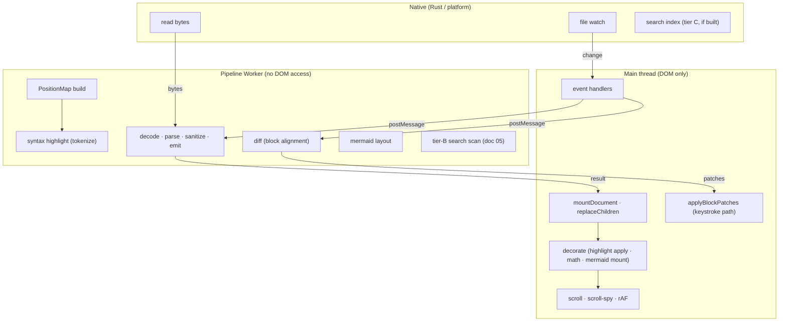

# 06 · Rendering Pipeline Design

**Question.** How do bytes become pixels, and what runs where, what breaks how,
and what changes on a keystroke?

**This is the technical centrepiece of the architecture folder.** If an engineer
implements only this document, they should have a working reader.

---

## 1. The pipeline in one picture

```mermaid
flowchart LR
    subgraph S0["0 · Acquire"]
        A1["adapter.readBytes()"]
    end
    subgraph S1["1 · Decode"]
        B1["BOM sniff"] --> B2["UTF-8 validate"] --> B3["heuristic<br/>(UTF-16 / opt-in legacy)"]
    end
    subgraph S2["2 · Parse"]
        C1["block scan"] --> C2["inline scan"] --> C3["resolve refs<br/>(links, footnote defs)"] --> C4["AST + positions"]
    end
    subgraph S3["3 · Sanitize / transform"]
        D1["apply SecurityPolicy"] --> D2["rewrite URLs"] --> D3["annotate nodes<br/>(heading ids, anchors)"]
    end
    subgraph S4["4 · Emit"]
        E1["AST → HTML string"] --> E2["PositionMap"]
    end
    subgraph S5["5 · Mount"]
        F1["parse HTML off-thread<br/>(template element)"] --> F2["attach to live DOM"]
    end
    subgraph S6["6 · Decorate"]
        G1["highlight code"] --> G2["math (KaTeX)"] --> G3["mermaid"] --> G4["images / lazy load"]
    end
    subgraph S7["7 · Paint"]
        H1["layout · scroll · rAF"]
    end

    A1 --> B1 --> B2 --> B3 --> C1 --> C2 --> C3 --> C4 --> D1 --> D2 --> D3 --> E1 --> E2 --> F1 --> F2 --> G1 --> G2 --> G3 --> G4 --> H1

    style S0 fill:#fff7ed
    style S7 fill:#f0fdf4
    style S2 fill:#e8f4ff
    style S3 fill:#fef2f2
```



Stages 0–4 are **pure and run in a Worker**. Stages 5–7 are **DOM and run on
the main thread**. That split is the single most important structural fact in
this document: everything expensive and everything that can fail catastrophically
happens off the main thread, and everything that touches the DOM happens on the
main thread inside a try/catch with a guaranteed-visible fallback.

## 2. Stage-by-stage specification

### Stage 0 — Acquire

| | Desktop | Web | Mobile |
|---|---|---|---|
| Who | Tauri shell (Rust) | Main thread (async) | Shell |
| How | `crates/smv-fs` read + IPC transfer | `handle.getFile()` / OPFS | SAF / document picker |
| Thread | Rust thread pool | main (async, no CPU) | native |

```ts
// packages/core/src/pipeline/acquire.ts
export interface AcquireResult {
  readonly bytes: Uint8Array;
  readonly stamp: FileStat;      // size, mtime, contentHash
  readonly truncated: boolean;   // hit maxFileBytes
  readonly bytesRead: number;
}

export async function acquire(
  fs: FileSystemAdapter,
  handle: FileHandle,
  limits: Limits,
): Promise<AcquireResult> {
  const st = await fs.stat(handle);
  const max = limits.maxFileBytes;              // default 32 MiB, see §9

  // Head-and-tail read for oversize files: we still want a document the user
  // can read, and we still want the headings.
  if (st.size > max) {
    const bytes = await fs.readRange?.(handle, { start: 0, end: max })
               ?? (await fs.readBytes(handle)).subarray(0, max);
    return { bytes, stamp: st, truncated: true, bytesRead: bytes.length };
  }
  const bytes = await fs.readBytes(handle);
  return { bytes, stamp: st, truncated: false, bytesRead: bytes.length };
}
```

**Instrumentation:** time to first byte, total read ms, bytes, whether the read
was served from the OS page cache (measurable on desktop via
`FileStat` + a warm/cold comparison, or simply by comparing the first and
subsequent read of the same file).

### Stage 1 — Decode

Pure. Fast. The failure mode is silent corruption, which is why it is explicit.

```ts
// packages/core/src/pipeline/decode.ts
export interface DecodeResult {
  readonly text: string;
  readonly encoding: 'utf-8' | 'utf-8-bom' | 'utf-16le' | 'utf-16be' | 'legacy';
  readonly lossy: boolean;        // replacement chars were emitted
  readonly replacementCount: number;
  readonly hadNulBytes: boolean;  // heuristic "this is not text"
  readonly eol: 'lf' | 'crlf' | 'mixed';
  readonly endsWithNewline: boolean;
}

export function decode(bytes: Uint8Array, opts: DecodeOptions): DecodeResult {
  // 1. BOM. Exact and cheap.
  if (startsWith(bytes, [0xEF, 0xBB, 0xBF])) return fromUtf8(strip(bytes, 3), 'utf-8-bom');
  if (startsWith(bytes, [0xFF, 0xFE])) return fromUtf16(strip(bytes, 2), true);
  if (startsWith(bytes, [0xFE, 0xFF])) return fromUtf16(strip(bytes, 2), false);

  // 2. UTF-8 with fatal validation. If it passes, stop — no guessing.
  const strict = new TextDecoder('utf-8', { fatal: true });
  try {
    return { ...fromUtf8(bytes, 'utf-8'), lossy: false };
  } catch { /* fall through */ }

  // 3. UTF-16 without BOM: the dominant case for Windows-authored files.
  //    Heuristic is the interleaved-NUL distribution, which is reliable.
  const zeros = count(bytes, 0);
  if (zeros > bytes.length * 0.3) {
    const utf16 = count(bytes, 0, 1) > count(bytes, 0, 0) ? 'le' : 'be';
    return fromUtf16(bytes, utf16 === 'le');
  }

  // 4. NUL bytes at all → almost certainly binary. Refuse.
  if (zeros > 0) {
    return { text: lossyUtf8(bytes), encoding: 'utf-8', lossy: true,
             replacementCount: 0, hadNulBytes: true, eol: 'lf', endsWithNewline: false };
  }

  // 5. Legacy codepage: OPT-IN ONLY. A viewer must never silently guess
  //    cp1252 over cp1251 over cp932. Default: latin-1 read as UTF-8 with
  //    replacement chars, and tell the user how to fix it.
  if (opts.legacyEncoding) return fromCharset(bytes, opts.legacyEncoding);

  return { text: lossyUtf8(bytes), encoding: 'utf-8', lossy: true,
           replacementCount: countUtf8Replacement(bytes),
           hadNulBytes: false, eol: detectEol(bytes), endsWithNewline: bytes.at(-1) === 0x0A };
}
```

The rule: **never guess a legacy codepage silently.** The banner says
"`file.md` is not valid UTF-8. Open as… [UTF-8] [Windows-1252] [Shift_JIS]
[GBK] [Latin-1]" and remembers the choice per workspace. That is more honest
and more useful than a heuristic.

### Stage 2 — Parse

Pure. This is the parser comparison in `../06-libraries/` applied, not chosen,
here. What the pipeline needs from a parser is a specific list of properties, and
this is the contract the parser must satisfy:

```ts
// packages/doc/src/ast.ts
export interface MarkdownDocument {
  readonly root: Block;
  readonly frontmatter?: { readonly raw: string; readonly span: SourceSpan; readonly format: 'yaml' | 'toml' };
  /** Every byte offset the parser understood, so we can prove losslessness. */
  readonly coveredSpans: readonly SourceSpan[];
  readonly warnings: readonly ParseWarning[];
  readonly sourceLength: number;   // in UTF-16 code units of `text`
}

export interface SourceSpan { readonly start: number; readonly end: number; }

export type Block =
  | { kind: 'document';   children: Block[]; span: SourceSpan }
  | { kind: 'heading';    level: 1|2|3|4|5|6; inline: Inline[];
                      id?: string; span: SourceSpan; textSpan: SourceSpan }
  | { kind: 'paragraph';  inline: Inline[]; span: SourceSpan }
  | { kind: 'code';       info?: string; value: string; span: SourceSpan; fenced: boolean; fenceChar: string; fenceLength: number }
  | { kind: 'html';       value: string; span: SourceSpan; safe: boolean }
  | { kind: 'thematic';   span: SourceSpan; char: '-' | '*' | '_'; length: number }
  | { kind: 'blockquote'; children: Block[]; span: SourceSpan }
  | { kind: 'list';       ordered: boolean; start: number; tight: boolean;
                      items: ListItem[]; span: SourceSpan; delimiter: '.' | ')' }
  | { kind: 'listItem';   checked: boolean | null; children: Block[]; span: SourceSpan; markerSpan: SourceSpan }
  | { kind: 'table';      align: (Align|null)[]; rows: TableRow[]; span: SourceSpan;
                      delimiterRowSpan: SourceSpan }
  | { kind: 'footnoteDef'; label: string; children: Block[]; span: SourceSpan }
  | { kind: 'math';       display: boolean; value: string; span: SourceSpan }
  | { kind: 'linkDef';    label: string; dest: string; title?: string; span: SourceSpan }
  /**
   * The escape hatch. Anything the parser does not model is captured verbatim
   * and re-emitted byte-for-byte. This is what makes extensions + "plain text
   * is sacred" coexist. See doc 03 §7.6.
   */
  | { kind: 'verbatim';   source: string; reason: string; span: SourceSpan };

export type Inline =
  | { kind: 'text';     value: string; span: SourceSpan }
  | { kind: 'emphasis'; depth: 1|2; children: Inline[]; span: SourceSpan }
  | { kind: 'strong';   children: Inline[]; span: SourceSpan }
  | { kind: 'strike';   children: Inline[]; span: SourceSpan }
  | { kind: 'code';     value: string; span: SourceSpan }
  | { kind: 'link';     url: string; title?: string; children: Inline[]; span: SourceSpan;
                      auto: boolean; ok: boolean; reason?: string }
  | { kind: 'image';    url: string; title?: string; alt: Inline[]; span: SourceSpan }
  | { kind: 'autolink'; url: string; span: SourceSpan }
  | { kind: 'html';     value: string; span: SourceSpan; safe: boolean }
  | { kind: 'break';    hard: boolean; span: SourceSpan }
  | { kind: 'math';     display: boolean; value: string; span: SourceSpan }
  | { kind: 'footnoteRef'; label: string; span: SourceSpan }
  | { kind: 'wikilink'; target: string; alias?: string; span: SourceSpan }   // if enabled (Q-36)
  | { kind: 'verbatim'; source: string; reason: string; span: SourceSpan };
```

**The non-negotiable requirement: every node has a `span`.** Without spans:

- find-in-page cannot map a plaintext match back to source (doc 05 §2.3),
- the "open the file at line N" feature cannot work,
- incremental parsing has no unit to key on (doc 06 §7),
- and error messages ("unexpected `]` at line 42") cannot exist.

**Losslessness test**, which is a gate on the parser choice:

```ts
// A parser we accept MUST satisfy this on the whole corpus.
export function assertLossless(doc: MarkdownDocument, source: string): void {
  const rebuilt: string[] = [];
  walk(doc.root, (n) => {
    switch (n.kind) {
      case 'verbatim': case 'code': case 'html': rebuilt.push(n.source ?? n.value); break;
      // …others reconstruct from spans
    }
  });
  expect(rebuilt.join('')).toBe(source);       // or: coveredSpans tile [0, len) exactly
}
```

The weaker but sufficient formulation, and the one to actually implement:
`coveredSpans` must **tile** `[0, sourceLength)` with no gaps and no
overlaps, and every non-`verbatim` node's source slice must equal the
serialisation of that node. A gap is a bug. An overlap is a bug.

**Error containment in parse.** A conformant Markdown parser has essentially no
errors — CommonMark is defined on all byte strings. The failures are:

| Failure | Detection | Response |
|---|---|---|
| Stack overflow from pathological nesting (10,000 nested `>`) | Depth counter in the block loop | Cap depth at 64; deeper levels become `verbatim` with reason `max-depth`. Never recurse. |
| O(n²) from many link references | Count link definitions; cap at 10,000 | Beyond the cap, definitions become `verbatim`. |
| Quadratic behaviour from a very long line | Line-length counter; cap at 1 MiB per line | Beyond, treated as a code block with `reason: line-too-long`. |
| Allocation blowup from a pathological table | Cell counter | Cap cells at 200,000 per table. |
| Actual throw | `tryRender` (doc 02 §7) | `degraded: 'raw-text'` |

**The AST walker must be iterative, not recursive.** This is not
micro-optimisation: a recursive walker on a 10,000-deep list will blow the JS
stack, which is an uncatchable-range failure in some engines.

```ts
// packages/core/src/ast/walk.ts — explicit stack, depth-limited
export function* walk(root: Block, maxDepth = 512): Generator<Block> {
  const stack: Array<{ node: Block; depth: number }> = [{ node: root, depth: 0 }];
  while (stack.length) {
    const { node, depth } = stack.pop()!;
    yield node;
    if (depth >= maxDepth) continue;
    for (const child of childrenOf(node).reverse()) stack.push({ node: child, depth: depth + 1 });
  }
}
```

### Stage 3 — Sanitize and transform

**The design decision: sanitize during transform, not after.** Post-hoc HTML
sanitising (parse HTML → strip disallowed → re-serialise) is what DOMPurify
does and it works, but it throws away exactly the information we need (source
positions, which inline node produced this element, whether a URL came from a
link or from raw HTML) and it forces a DOM parse we would otherwise avoid.

Instead: the AST carries `html` nodes as *untrusted data*, and the emitter
decides per-node what to do under a `SecurityPolicy`. The policy is a value
injected into `core`, so it is identical on all three platforms.

```ts
// packages/core/src/policy.ts
export interface SecurityPolicy {
  /** Raw HTML in a document: 'escape' (default), 'allow-safe', 'strip'. */
  readonly rawHtml: 'escape' | 'allow-safe' | 'strip';
  /** Schemes permitted for link/image destinations. */
  readonly allowedSchemes: readonly string[];       // ['http','https','mailto','tel']
  /** Schemes permitted for images (data: off by default — see 11-security). */
  readonly allowedImageSchemes: readonly string[];
  /** Allow `file:` links to be clicked (desktop only; resolves through the adapter). */
  readonly allowFileLinks: boolean;
  /** Allow remote images at all. Default true, but see the note below. */
  readonly allowRemoteImages: boolean;
  /** Follow `#fragment` links that have no matching target by scrolling to top. */
  readonly danglingAnchorBehaviour: 'top' | 'nothing';
  /** Extensions. */
  readonly wikilinks: boolean;
  readonly footnotes: boolean;
  readonly math: boolean;
  readonly tasklists: boolean;
  readonly tagfilter: boolean;      // GFM's dangerous-tag filter
}

export const DEFAULT_POLICY: SecurityPolicy = Object.freeze({
  rawHtml: 'escape',
  allowedSchemes: ['http', 'https', 'mailto', 'tel'],
  allowedImageSchemes: ['http', 'https'],       // data: and file: off
  allowFileLinks: true,
  allowRemoteImages: true,
  danglingAnchorBehaviour: 'top',
  wikilinks: false,                              // Q-36
  footnotes: true,
  math: true,
  tasklists: true,
  tagfilter: true,
});
```

URL rewriting happens here, once, and its result is what gets emitted:

```ts
function classifyUrl(raw: string, ctx: Ctx): { kind: UrlKind; href?: string; title?: string } {
  const s = raw.trim();
  // Control characters are stripped first: `java\nscript:` is a real bypass.
  const clean = s.replace(/[\u0000-\u0020\u007F-\u009F]/g, '');

  if (clean.startsWith('#')) return { kind: 'fragment', href: clean };

  // Scheme-relative and absolute URLs
  const m = /^([a-zA-Z][a-zA-Z0-9+.\-]*):/.exec(clean);
  if (!m) return { kind: 'relative', href: clean };           // no scheme → relative, safe

  const scheme = m[1].toLowerCase();
  if (scheme === 'data') {
    // Only raster images, only base64, under a size cap. Never SVG — SVG is script.
    if (!ctx.isImage) return { kind: 'blocked', title: 'data: URL blocked' };
    if (!/^data:image\/(png|jpeg|gif|webp|avif);base64,[A-Za-z0-9+/=]+$/.test(clean)) {
      return { kind: 'blocked', title: 'data: URL not an allowed image type' };
    }
    return ctx.policy.allowedImageSchemes.includes('data') ? { kind: 'ok', href: clean } : { kind: 'blocked' };
  }
  if (scheme === 'file') {
    return ctx.policy.allowFileLinks && ctx.isImage === false
      ? { kind: 'file', href: clean }
      : { kind: 'blocked', title: 'file: links are disabled' };
  }
  if (!ctx.policy.allowedSchemes.includes(scheme)) {
    return { kind: 'blocked', title: `The ${scheme}: scheme is not allowed` };
  }
  return { kind: 'ok', href: clean };
}
```

Three details in that function that each correspond to a real bypass technique,
and they are why this belongs in `core` rather than in a post-filter:

1. **Strip control characters before scheme detection.** `java\u0000script:` and
   `java\tscript:` are the classic filter bypasses. Stripping first is what makes
   a string-prefix check sound.
2. **`data:` is scheme-allowlisted *and* content-validated, and SVG is excluded.**
   `data:image/svg+xml` is a script execution vector in any context that renders
   it as an image document. We only permit raster types.
3. **No scheme at all ⇒ relative ⇒ safe.** The dangerous cases all have a
   scheme. A relative path is confined to whatever the adapter resolves it
   against, and that is a capability, not a string (doc 03 §2).

`rawHtml: 'escape'` is the default because a viewer opens files it did not
write, and escaped HTML still *displays* correctly (the user sees `<b>bold</b>`
as text, which is what a plain-text reader should show). `'allow-safe'` is a
user setting that runs the allowlist in `../11-security/`, and even then, `<script>`,
`on*` handlers, `<iframe>`, `<object>`, `<embed>`, `<style>`, and
`javascript:`/`data:text/html` are unconditionally removed with no setting to
re-enable them. See `../11-security/` for the full policy.

**Position preservation through sanitisation.** The emitter never drops a span.
A blocked link emits `<span class="blocked-link" title="…">original text</span>`
at the original `span`, so find-in-page and line-anchoring keep working and the
user can see *why* something did not become a link.

### Stage 4 — Emit

```ts
export interface PositionMap {
  /** plaintext index → source index, for find-in-page (doc 05 §2.3). */
  readonly plainToSource: Uint32Array;      // len = plain.length + 1, delta-encoded
  /** source line (0-based) → byte offset of line start. For "jump to line". */
  readonly lineStarts: Uint32Array;
  /** Stable keys for every top-level block, for the differ (§7). */
  readonly blockKeys: readonly string[];
  /** Map from a rendered DOM node's data attribute back to its source span. */
  readonly nodeSpans: ReadonlyMap<string, SourceSpan>;
}

export interface RenderResult {
  readonly html: string;
  readonly outline: OutlineNode[];
  readonly tocHtml: string;
  readonly headings: HeadingRef[];
  readonly map: PositionMap;
  readonly stats: RenderStats;
  readonly warnings: RenderWarning[];
  readonly degraded: DegradedMode | null;
}
```

Why an HTML **string** and not a DOM fragment:

| | String | DOM fragment | VDOM tree |
|---|---|---|---|
| Built off the main thread | ✅ trivially | ❌ needs DOM or shim | ✅ |
| Transferable to a Worker | ✅ one string | ❌ structured clone cost | ✅ |
| Cheap to diff | ✅ string compare | ⚠️ tree compare | ✅ |
| Cacheable | ✅ | ❌ | ⚠️ |
| Testable in Node | ✅ | ❌ needs jsdom | ✅ |
| Fastest to mount | ❌ needs parsing | ✅ | ❌ hydration cost |

The verdict: **build the string in a Worker, parse it into a fragment on the
main thread in one shot.** `innerHTML` is not "slow" — it is *fast* for a single
whole-document mount. It is the wrong tool for a **keystroke**, which is §7's
subject.

Two things attached to the string for free:

```ts
// Every rendered block carries its source span and a stable key. This is what
// makes find-in-page, jump-to-line, and the differ possible.
html += `<section class="blk" data-blk="${i}" data-span="${start}-${end}" data-key="${key}">…</section>`;
```

`data-key` must be **content-derived, not index-derived** (see §7).

### Stage 5 — Mount

```ts
// packages/ui/src/dom/mount.ts
export function mountDocument(html: string, into: HTMLElement): MountedDoc {
  // 1. Parse OFF the live tree, in an inert template. No script execution,
  //    no image loading, no layout, no reflow of the live document.
  const tpl = document.createElement('template');
  tpl.innerHTML = html;                       // inert: <template> content is not live

  // 2. Adopt the fragment. One insertion = one style/layout pass.
  const frag = tpl.content;
  into.replaceChildren(frag);

  // 3. Force layout once so measurement in §8 is cheap.
  into.getBoundingClientRect();

  return { root: into };
}
```

`<template>` is inert: its content is in a separate document fragment, scripts do
not execute, images do not load, and it is not rendered. That property is the
entire reason to use it instead of a detached `<div>`.

### Stage 6 — Decorate

Decoration is everything that must run *after* the DOM exists because it needs
layout, measurement, or a real element.

| Decorator | Runs in | Failure behaviour |
|---|---|---|
| **Syntax highlight** | Worker, on the `textContent` of each `pre>code` | On throw: leave the plain text, add `data-unhighlighted`. Never blank it. |
| **Math (KaTeX)** | Main thread (needs DOM for measurement), per element, in `requestIdleCallback` | On throw: render the raw TeX in a `<code>` with `data-math-error` |
| **Mermaid** | Worker for layout; main thread for mount; **lazily, on intersection** | On throw or unsupported diagram: show the source in a `<pre>` |
| **Images** | Native lazy loading (`loading="lazy"`, `decoding="async"`), plus a resource loader for `file:` and relative paths | On load failure: keep the `alt` text visible in a placeholder box; never a broken-image icon |
| **Footnotes** | Main thread, link the refs to the defs, add `aria-describedby` | — |
| **Task list checkboxes** | Main thread; `disabled` unless editing is enabled | — |
| **Heading anchors** | Already in the emitted HTML (stage 3) | — |
| **Scroll-spy / outline highlight** | `IntersectionObserver` | — |

**Ordering rule:** math before mermaid before images. Reason: mermaid can embed
math, and images inside a mermaid node must resolve. Highlight first because it
rewrites `textContent`-adjacent structure that the others then measure.

**Idle budget.** Decoration must never block the first paint.

```ts
// packages/ui/src/dom/decorate.ts
const idle = (cb: () => void) =>
  'requestIdleCallback' in window
    ? requestIdleCallback(cb, { timeout: 500 })
    : setTimeout(cb, 1) as unknown as number;

export async function decorate(root: HTMLElement, ctx: DecorateCtx) {
  // Pass 1: highlight in a Worker, all at once (one message, one batch).
  const blocks = [...root.querySelectorAll('pre>code')];
  if (blocks.length) {
    const { tokens } = await highlightInWorker(blocks.map((b) => b.textContent!), ctx.codeTheme);
    applyHighlight(blocks, tokens);           // sync, main thread, fast
  }
  // Pass 2: math + mermaid, idle, intersection-gated, one batch per frame.
  for (const el of intersectOnce(root, 'math, .mermaid')) {
    idle(() => decorateOne(el, ctx));
    await nextFrame();
  }
  // Pass 3: images are native. Nothing to do but verify loading="lazy" is set.
}
```

**Infinite-decorator guard.** If a decorator throws and we retry, and the retry
throws, we get an infinite loop that freezes the app. Every decorator therefore
carries a per-document attempt counter:

```ts
const attempts = new WeakMap<Element, number>();
function decorateOnce(el: Element, fn: () => void, label: string) {
  const n = (attempts.get(el) ?? 0) + 1;
  attempts.set(el, n);
  if (n > 2) { el.setAttribute('data-decorate-failed', label); return; }
  try { fn(); } catch (e) { report(label, e); el.setAttribute('data-decorate-failed', label); }
}
```

### Stage 7 — Paint

- Scroll into view on load (`requestAnimationFrame` after mount, so layout is
  done).
- Scroll-spy via `IntersectionObserver` on headings, throttled to `rAF`.
- `content-visibility: auto` + `contain-intrinsic-size` on block elements.
  This is the single most effective CSS-level performance lever for long
  documents and it costs one line (§8).

## 3. Sequence: opening a file

```mermaid
sequenceDiagram
    autonumber
    participant U as User
    participant UI as ui/ (main thread)
    participant FS as FileSystemAdapter
    participant WK as PipelineWorker
    participant CORE as core/ (in worker)

    U->>UI: double-click foo.md in tree
    UI->>UI: create DocumentState; render skeleton immediately
    UI->>UI: perfMark('open.start')

    alt handle needs re-resolution (web/mobile grant)
        UI->>FS: resolve(handle)
        FS-->>UI: handle | null
        alt null
            UI-->>U: "Reconnect folder" prompt
        end
    end

    UI->>FS: readBytes(handle)
    FS-->>UI: Uint8Array (transferred, zero-copy)
    UI->>WK: postMessage({bytes, options, policy, limits}, [bytes.buffer])
    Note over UI: main thread is free from here

    WK->>CORE: decode(bytes)
    CORE-->>WK: DecodeResult
    alt hadNulBytes
        CORE-->>WK: degraded='binary', render raw escaped bytes
    else lossy
        CORE-->>WK: lossy=true → app shows an encoding banner
    end

    WK->>CORE: parse(text, ParseOptions)
    CORE->>CORE: block scan (iterative, depth-capped)
    CORE->>CORE: inline scan
    CORE->>CORE: resolve links / footnote defs
    alt throw
        CORE-->>WK: tryRender catches → degraded='raw-text'
    end

    WK->>CORE: verifyLosslessness(doc, text)
    alt gap in coveredSpans
        CORE-->>WK: warning + block reported to stderr (CI fails)
    end

    WK->>CORE: sanitize(doc, SecurityPolicy)
    CORE->>CORE: classify every URL; rewrite or block
    CORE->>CORE: assign heading ids + slugs
    CORE->>CORE: compute outline + TOC

    WK->>CORE: emit(doc) → html + PositionMap
    CORE-->>WK: RenderResult

    WK-->>UI: postMessage(result)  // structured-clone of strings + typed arrays
    UI->>UI: perfMark('render.done')

    UI->>UI: mountDocument(html) into <template> → replaceChildren
    UI->>UI: rAF → restore scroll / anchor
    UI->>UI: decorate(): highlight batch → then idle(math, mermaid, images)
    UI->>UI: scroll-spy attached
    UI->>UI: workspace.schedule(state, 'opened'); index hook notified
    UI-->>U: pixels

    Note over UI,CORE: If degraded==='raw-text', mountDocument is skipped and
    Note over UI: <pre class="raw-fallback"> with the escaped source is mounted
    Note over UI: instead. The app is NEVER blank. See §6.
```

## 4. The PositionMap, in detail

Everything downstream depends on this, so it is worth writing out.

```ts
export function buildPositionMap(doc: MarkdownDocument, text: string, plain: PlainText): PositionMap {
  // 1. Line starts (binary search for "jump to line N" and error positions).
  const lineStarts: number[] = [0];
  for (let i = 0; i < text.length; i++) if (text.charCodeAt(i) === 10) lineStarts.push(i + 1);
  const lineStartsU32 = Uint32Array.from(lineStarts);

  // 2. plainToSource as delta encoding: a Uint32Array of deltas, 4 bytes/char,
  //    vs 8 bytes/char for absolute pairs. For a 5 MB doc: 20 MB vs 40 MB.
  //    The deltas are monotone non-decreasing, so we can binary-search them.
  const delta = new Uint32Array(plain.text.length + 1);
  for (let i = 0, s = 0; i < plain.text.length; i++) {
    s = Math.max(s, plain.map[i]);
    delta[i] = s - (i > 0 ? delta[i - 1] : 0);
  }

  // 3. Block keys: content-derived, stable across edits that do not change the
  //    block. See §7 for why index-based keys are wrong.
  const blockKeys = topLevelBlocks(doc.root).map(b => blockKey(b));

  return {
    plainToSource: delta,
    lineStarts: lineStartsU32,
    blockKeys,
    nodeSpans: collectSpans(doc.root),
  };
}

/**
 * A stable identity for a block that survives edits elsewhere in the document.
 *
 * NOT the index. NOT a random id stored in the DOM. Content-derived, so a
 * re-render of an unchanged prefix produces identical keys and the differ can
 * align them.
 */
export function blockKey(b: Block): string {
  switch (b.kind) {
    case 'heading':    return `h${b.level}:${b.id ?? slugOf(textOf(b))}`;
    case 'code':       return `code:${hash32(b.info ?? '')}:${hash32(b.value.slice(0, 256))}:${b.value.length}`;
    case 'math':       return `math:${b.display ? 'd' : 'i'}:${hash32(b.value)}`;
    case 'table':      return `table:${b.rows.length}:${hash32(firstRowText(b))}`;
    case 'thematic':   return `hr:${b.span.start}`;
    case 'list':       return `list:${b.ordered}:${b.items.length}:${hash32(b.items.map(i => textOf(i)).join('\n').slice(0, 256))}`;
    default:           return `${b.kind}:${b.span.start}:${hash32(textOf(b).slice(0, 128))}`;
  }
}
```

Why `blockKey` includes `span.start` for paragraphs but not for headings: a
paragraph's identity genuinely is "the paragraph at this position", because
paragraphs have no intrinsic identity, whereas a heading has its text as an
identity and moving a heading should be treated as a move. This is a heuristic,
and heuristics here are fine — the differ only uses keys to *align*, and falls
back to a positional diff when alignment fails.

## 5. Threading model



**Rules for the Worker:**

1. **One long-lived Worker per document pipeline**, not one per render. Creating
   a Worker costs 5–30 ms; reusing one is free. A pool of `min(4,
   hardwareConcurrency - 1)` workers serves multiple tabs/windows.
2. **Transfer, never copy.** `postMessage(msg, [bytes.buffer])` transfers the
   `ArrayBuffer` (zero-copy) instead of structured-cloning it. The same for
   `PositionMap`'s typed arrays going back. This is the difference between 8 ms
   and 400 ms for a 5 MB document.
3. **The Worker never touches the DOM.** No `document`, no `window`. That is
   what makes it a Worker and not a second main thread.
4. **Version tags.** Every message carries `{ docId, version }`. The UI discards
   any result whose `version` is not the current one. Without this, a slow
   render of a previous keystroke overwrites the current one — the classic
   "typing lags behind" bug.

```ts
// packages/ui/src/pipeline/worker-client.ts
export class Pipeline {
  #worker: Worker;
  #version = 0;
  #pending = new Map<string, (r: RenderResult) => void>();

  constructor() { this.#worker = new Worker(new URL('./pipeline.worker.ts', import.meta.url), { type: 'module' }); }

  render(req: RenderRequest): Promise<RenderResult> {
    const version = ++this.#version;
    return new Promise((resolve) => {
      this.#pending.set(String(version), resolve);
      this.#worker.postMessage(
        { kind: 'render', version, bytes: req.bytes, options: req.options },
        [req.bytes.buffer],          // transfer
      );
    });
  }

  onmessage = (e: MessageEvent) => {
    const { version, result } = e.data;
    if (version !== this.#version) return;          // stale → drop, do not resolve
    this.#pending.get(String(version))?.(result);
    this.#pending.delete(String(version));
  };
}
```

## 6. Error containment — a parse error must never blank the app

The requirement, stated as an invariant:

> **For every input `bytes`, the app must display something a human can read.**
> There is no input that produces a blank window, a stuck spinner, or a crash.

The containment ladder:

| Stage | Failure | Containment | User sees |
|---|---|---|---|
| Acquire | `EACCES`, handle gone | `AcquireError` → `DocumentState.error` | "Cannot read this file" + [Reopen] [Reveal] |
| Decode | binary / NUL bytes | `degraded: 'binary'` | Escaped byte preview in a `<pre>` |
| Decode | invalid UTF-8 | `lossy: true` | Normal render + encoding banner |
| Parse | depth/time/cell cap | Node → `verbatim` | Normal render; one suppressed notice |
| Parse | **throw** | `tryRender` → `degraded: 'raw-text'` | `<pre class="raw-fallback">` with the escaped source, a banner, [Retry], [Copy] |
| Sanitize | policy throws (bug) | caught by `tryRender` | `raw-text` |
| Emit | throw | `tryRender` | `raw-text` |
| Transfer | structured-clone failure | caught in `onmessage` | `raw-text` from a fallback local render |
| Mount | `innerHTML` throws | `try { } catch { }` around `replaceChildren` | `raw-text` |
| Decorate (highlight) | per-element try/catch + 2-attempt cap | plain text stays | Normal render, no highlighting |
| Decorate (math/mermaid) | per-element try/catch | raw source shown | Normal render |
| Decorate (image) | load error | `alt` text in a placeholder | Normal render |
| Scroll restore | bad offset | clamp to `[0, scrollHeight]` | Normal render, top-ish position |

The raw-text fallback, written out, because it is the single most important
error path in the app:

```ts
// packages/ui/src/fallback.ts
export function renderRawFallback(
  text: string,
  info: { reason: string; stage: PipelineStage; errorMessage: string; spanHint?: SourceSpan },
): DocumentFragment {
  const frag = document.createDocumentFragment();
  const wrap = h('div', { class: 'render-fallback', role: 'region', 'aria-label': 'Unrendered source' });

  wrap.append(h('div', { class: 'fallback-banner', role: 'status' }, [
    h('strong', {}, 'This file could not be rendered.'),
    h('p', {}, `The Markdown parser failed during ${info.stage}. ` +
              `You are seeing the original text — nothing has been lost or changed.`),
    h('code', {}, info.errorMessage),
    h('div', { class: 'fallback-actions' }, [
      h('button', { onClick: () => location.reload() }, 'Retry'),
      h('button', { onClick: () => copy(text) }, 'Copy source'),
      h('button', { onClick: () => report(info) }, 'Report'),
    ]),
  ]));

  // The source, escaped. Rendered as TEXT — never as HTML. This is the whole
  // point: a document that failed to parse must not get a second chance to
  // execute script by being rendered as markup.
  wrap.append(h('pre', { class: 'raw-source' }, text));
  frag.append(wrap);
  return frag;
}
```

Three properties of that fallback that must not be compromised:

1. **The source is rendered as a text node**, never as HTML. A document that
   failed the parser must not get a second chance at the DOM.
2. **"Nothing has been lost or changed" is true** — because saving writes the
   buffer, not a re-serialization (doc 03 §7.6), and because the fallback is
   built from the decoded text.
3. **No retry loop.** The Retry button is a full, user-initiated reload of that
   one document, not an automatic retry.

Additionally, a **fuzz target** and a **losslessness gate** in CI (doc 02 §10)
mean the `raw-text` path is *expected to be rare* rather than *normal*. We
instrument it:

```ts
telemetry.capture({ kind: 'render', bytes, blocks, ms, degraded: r.degraded });
// and a distinct, always-on stderr line in dev builds:
if (r.degraded) console.warn('[render] degraded', r.degraded, info);
```

If `raw-text` ever fires for a corpus file, CI fails. That converts a class of
runtime failure into a build failure.

## 7. Re-render and the DOM-diffing strategy

### 7.1 Why we do not `innerHTML` on every keystroke

Measured reasoning (and we will measure it properly in M1):

A 5 MB technical document is roughly 8,000–15,000 block elements. `innerHTML` on
that is:

1. **Parsing** ~2.5 MB of HTML: ~120–400 ms (Chromium's HTML parser is fast but
   it is linear and it is on the main thread).
2. **Rebuilding** the entire node tree: ~15,000 element allocations.
3. **Discarding and re-laying-out** everything: this is the killer. The browser
   has no choice — all the old text nodes are gone, so it must re-shape the
   line boxes. Full style recalc + layout + paint of the visible viewport.
4. **Losing all state**: scroll position, selection, focus, `:target`
   highlighting, any user selection mid-paragraph, and any in-progress find
   highlights.
5. **Re-running every decorator**: 400 code blocks re-highlighted, 40 diagrams
   re-laid-out. Mermaid alone is ~50 ms per diagram.

At 8 keystrokes/second that is an unusable app, and it gets worse with document
size. **`innerHTML` is fine for the initial mount and wrong for everything
after.**

### 7.2 The block boundary

> **The unit of re-render is one top-level block.** Blocks are independently
> addressable (spans, keys), independently stable, and independently
> decoratable.

Everything follows:

```ts
export interface BlockPatch {
  readonly op: 'replace' | 'remove' | 'insert' | 'move' | 'redecorate';
  readonly key: string;                 // BlockKey from §4
  readonly index: number;               // position among top-level blocks
  readonly html?: string;               // for 'replace'/'insert' — just this block's HTML
  readonly span?: SourceSpan;
}
```

Why top-level blocks and not finer:

| Granularity | Benefit | Cost |
|---|---|---|
| **Whole document** (`innerHTML`) | simplest | unusably slow for big docs; loses all state |
| **Top-level block** | a keystroke inside a paragraph rewrites 1 block; a heading edit rewrites the heading + the TOC entry | block boundaries do not align with *visual* boundaries (a paragraph that wraps across a viewport edge still reflows the page) |
| **Inline span** | minimal DOM churn | requires an inline differ and a text-node-splitting reconciler; enormous complexity for the layout reflow it cannot avoid |
| **Character** | impossible | you cannot avoid relayout when text metrics change |

The reason **inline** granularity does not pay, and this is the important insight:
**changing the text of a paragraph changes the height of every line below it.**
Even a surgical one-character DOM mutation relayouts the document. Micro-batching
the DOM does not make the *layout* incremental — that is what CSS containment
and `content-visibility` are for (§8).

So: top-level blocks for the DOM, and §8 for the layout.

### 7.3 The differ

```ts
// packages/core/src/pipeline/diff.ts — runs in the Worker
export function diffBlocks(prev: Block[], next: Block[]): BlockPatch[] {
  const a = prev.map(blockKey);
  const b = next.map(blockKey);

  // 1. Key-based alignment. Myers diff over key sequences.
  const edits = diffSequences(a, b);        // O(ND), N = blocks, D = edits

  // 2. Longest-common-subsequence anchoring for the unchanged prefix/suffix
  //    fast path: identical head and tail are extremely common in an editor.
  const patches: BlockPatch[] = [];
  for (const e of edits) {
    switch (e.kind) {
      case 'equal':   break;                // do nothing — the live DOM node stays
      case 'replace': patches.push({ op: 'replace', key: a[e.i], index: e.j, html: nextHtml[e.j] });
                      break;
      case 'delete':  patches.push({ op: 'remove',  key: a[e.i], index: e.i });
                      break;
      case 'insert':  patches.push({ op: 'insert',  key: b[e.j], index: e.j, html: nextHtml[e.j] });
                      break;
    }
  }
  return patches;
}
```

The `equal` case is the point: **an unchanged block's live DOM node is never
touched.** Its code highlighting, its rendered math, its laid-out mermaid
diagram, and its focus state all survive.

### 7.4 Applying patches

```ts
// packages/ui/src/dom/patch.ts
export function applyBlockPatches(root: HTMLElement, patches: BlockPatch[], ctx: DecorateCtx) {
  // Group by target to minimise DOM ops, and process removals after inserts
  // so indices stay stable.
  const inserts = patches.filter(p => p.op === 'insert' || p.op === 'replace');
  const removes = patches.filter(p => p.op === 'remove');

  for (const p of inserts) {
    const tpl = document.createElement('template');
    tpl.innerHTML = p.html!;                          // inert parse of ONE block
    const node = tpl.content.firstElementChild!;
    node.setAttribute('data-blk', String(p.index));
    const ref = root.children[p.index] ?? null;
    if (p.op === 'insert') root.insertBefore(node, ref);
    else ref!.replaceWith(node);                      // surgical: siblings untouched
    queueDecorate(node, ctx);                         // decorate ONLY this node
  }

  for (const p of removes) {
    root.children[p.index]?.remove();
  }

  // Scroll anchoring: the browser's own scroll anchoring is usually right, but
  // it does not know about a block that changed height above the viewport.
  preserveViewport(root, () => { /* …the DOM ops above… */ });
}
```

`queueDecorate` must be **per-block and idle-scheduled**, so a burst of patches
from a paste of 300 blocks decorates in batches across frames instead of all at
once.

### 7.5 When to fall back to a full remount

Full remount is correct (and we should prefer it) when:

| Condition | Why remount is better |
|---|---|
| Block-key alignment fails badly (> 40% of blocks replaced) | Patching 4,000 nodes is slower and buggier than one `replaceChildren` |
| The document changed from truncated to untruncated (or back) | The whole block set is new |
| Front matter changed | The entire rendering configuration may change |
| Policy changed | Everything may be different |
| Theme change that alters layout metrics | Cheaper to remount than to invalidate every measurement |

```ts
if (patches.filter(p => p.op !== 'redecorate').length > blocks.length * 0.4) {
  fullRemount(nextHtml);        // and this is fine and normal, not a failure
}
```

### 7.6 Live-preview keystroke flow

Live preview is Phase 2+, and this doc specifies it now so the *render* API is
designed for it (doc 02 §7 is deliberately `bytes → result`, not
`Editor → View`).

```mermaid
sequenceDiagram
    autonumber
    participant ED as Editor (CodeMirror 6)
    participant UI as ui/ shell
    participant D as DocState
    participant P as Pipeline (Worker)
    participant DOM as Live DOM

    ED->>ED: user types
    ED->>UI: onChange(transaction)
    UI->>UI: D.buffer = doc.sliceString(fullDoc)
    UI->>UI: D.bufferHash = blake3_128(buffer); isDirty = bufferHash !== baseHash
    UI->>UI: scheduleAutosave (if enabled)
    UI->>UI: D.scroll = captureViewport(root)   // before DOM changes
    UI->>P: render({bytes, options, policy}) with version++

    Note over UI: main thread returns to the editor immediately.<br/>Typing is never blocked by rendering.

    P->>P: decode → parse → sanitize → emit
    P->>P: assertLosslessness (CI only; skipped in dev hot path)
    P->>P: diffBlocks(prevBlocks, nextBlocks)
    P-->>UI: { version, html?, patches, outline, tocHtml, map, stats }

    UI->>UI: if (version !== D.version) return   // stale, drop
    UI->>UI: if (needsFullRemount(patches)) DOM.mount(html)
    else DOM.applyBlockPatches(patches)

    alt a decorated block was replaced
        UI->>P: decorateOnly(elements)   // highlight/math/mermaid, idle + intersected
        P-->>UI: tokens / svg
        UI->>UI: apply to just those elements
    end

    UI->>UI: restoreViewport(anchor)  // keep the caret's block in place
    UI->>UI: if heading structure changed → update TOC (patched, not rebuilt)
    UI-->>ED: nothing — the editor owns the caret, always
```

**The invariant that makes this work: the editor owns the caret; the preview
never touches it.** A live-preview design where the preview tries to keep the
cursor in sync with re-rendered content is a design that will fight the user.
We re-render *behind* the caret and restore the viewport anchor, and that is
all.

**Cursor-to-viewport:** the DOM patcher must not scroll. The editor's scroll
container is separate from the preview's. When the caret moves in the editor,
we scroll the *preview* to the corresponding block using `PositionMap` (§4) — not
by character offset, which would be wrong after a partial re-render.

### 7.7 Debounce and coalesce

```ts
// packages/ui/src/pipeline/scheduler.ts
const RENDER_DEBOUNCE_MS = 40;   // ~25 fps of re-render while typing

export class RenderScheduler {
  #timer: ReturnType<typeof setTimeout> | null = null;
  #rafPending = false;

  request() {
    if (this.#timer) return;
    this.#timer = setTimeout(() => {
      this.#timer = null;
      this.#doRender();
    }, RENDER_DEBOUNCE_MS);
  }

  /** Typing indicator: shows at most every 120 ms, hides 200 ms after last change. */
  setBusy(busy: boolean) { /* …throttled classList.toggle('is-rendering')… */ }
}
```

40 ms is a deliberate number: it is roughly one frame at 25 fps, which is fast
enough to feel live and slow enough that a fast typist triggers ~6 renders per
second rather than 10. Every render that arrives stale is discarded (version
check), so the debounce is a *cost* optimisation, not a *correctness*
requirement — correctness lives in the version tag.

## 8. Layout performance for long documents

These are CSS, they are one line each, and they are the difference between a
smooth 60 fps and a janky app on a 5 MB document.

```css
/* 1. Skip layout and paint for off-screen blocks. The single biggest lever. */
.blk {
  content-visibility: auto;
  contain-intrinsic-size: auto 4rem;   /* reserve a guess; `auto` learns real size */
}

/* 2. Isolate style/layout so a change in one block cannot invalidate the rest. */
.blk { contain: layout style; }

/* 3. Do not select text that is not visible — skips text shaping. */
.blk:not(:focus-within) { user-select: none; }   /* re-enabled on interaction */

/* 4. Long unbroken strings (minified code, base64) must not blow out layout. */
.blk :is(pre, code, td) { overflow-wrap: anywhere; word-break: break-word; }

/* 5. Reserve image space so lazy loading does not cause scroll jumps. */
.blk img { aspect-ratio: attr(data-ar); height: auto; }  /* or explicit w/h attrs */
```

Caveats to verify in M1, not to assume:

- `content-visibility: auto` interacts with `getBoundingClientRect` for
  off-screen elements (they report the intrinsic-size estimate). Any measurement
  code must account for this — this is why `contain-intrinsic-size` uses `auto`,
  which remembers the last-rendered size.
- `user-select: none` on non-focused content breaks drag-selection across
  blocks. **Test this before shipping.** If it breaks, drop it; it is the least
  valuable of the five.
- `contain: layout style` on `.blk` is safe. `contain: size` would break
  auto-height. Do not add `size`.

**Viewport preservation.** Any DOM mutation above the viewport changes the
document height and moves what the user is looking at. One helper handles it:

```ts
export function preserveViewport(root: HTMLElement, mutate: () => void) {
  const before = topVisibleBlock(root);          // key + its offsetTop
  mutate();
  const after = root.querySelector<HTMLElement>(`[data-key="${cssEscape(before.key)}"]`);
  if (!after) return;
  const delta = after.offsetTop - before.offsetTop;
  if (delta !== 0) root.closest<HTMLElement>('.scroll-host')!.scrollTop += delta;
}
```

This is better than the browser's native scroll anchoring because it is keyed
to *our* block identity, which survives edits, and it is deterministic.

## 9. Budgets

These are the numbers the pipeline is designed to hit. They come from
`../10-performance/`; restating them here so the design is falsifiable.

| Budget | Target (p50) | Limit (p95) | Enforced by |
|---|---|---|---|
| Acquire: stat + read, 5 MB, warm cache | 8 ms | 40 ms | `perfMark('open.acquire')` |
| Decode 5 MB | 5 ms | 20 ms | `perfMark('open.decode')` |
| Parse 5 MB | 60 ms | 180 ms | `perfMark('open.parse')` |
| Sanitize 5 MB | 12 ms | 40 ms | `perfMark('open.sanitize')` |
| Emit 5 MB | 25 ms | 70 ms | `perfMark('open.emit')` |
| **Worker total** | **110 ms** | **350 ms** | `perfMark('open.worker')` |
| Mount (`template` + `replaceChildren`) | 90 ms | 250 ms | `perfMark('open.mount')` |
| Decorate (highlight batch) | 40 ms | 120 ms | `perfMark('open.highlight')` |
| **Time to first paint, 5 MB** | **300 ms** | **700 ms** | `perfMark('open.fp')` |
| Re-render, one block changed, 5 MB | 4 ms | 16 ms | `perfMark('edit.patch')` |
| Re-render, whole doc remounted | 300 ms | 700 ms | `perfMark('edit.remount')` |
| Scroll, 60 fps | 8 ms/frame | 16 ms/frame | `PerformanceObserver('longtask')` |
| Memory, 5 MB doc | < 300 MB | < 600 MB | devtools + `performance.memory` |

`maxFileBytes` default **32 MiB**. Past it we truncate, show a banner, and offer
"open the raw text anyway". Rationale: 32 MiB is already ~1.5 million lines; a
larger Markdown file is almost certainly generated, and generated files are
better read in a text editor than rendered. This limit is
`research/10-performance`'s call, not this document's, and Q-37 asks whether it
should be lower.

## 10. Instrumentation

```ts
// packages/ui/src/perf.ts
export type Stage =
  | 'open.acquire' | 'open.decode' | 'open.parse' | 'open.sanitize'
  | 'open.emit' | 'open.worker' | 'open.mount' | 'open.highlight' | 'open.fp'
  | 'edit.patch' | 'edit.remount' | 'find.query' | 'search.scan'
  | 'index.upsert' | 'workspace.write';

export function perfMark(stage: Stage, detail: Record<string, number | string | boolean>) {
  // Always available locally; only sent anywhere if the user opts in (doc 02 §6.5).
  performance.mark(`${stage}:start`);
  devOnly(console.debug, `[perf] ${stage}`, detail);
  metrics.record(stage, detail);   // in-memory ring buffer, 10k entries, never transmitted
}
```

What we record locally, and what is **never** recorded: paths are recorded
(bucketed by extension, not by name, in anything that could be transmitted);
content is never recorded; a `render-degraded` event records the *reason string*
only, never the document.

A built-in **performance panel** (`Ctrl+Shift+P → "Developer: performance"`)
showing the last 200 stages is worth more than any remote telemetry for a
project that has none by default. Build it in v1.

## 11. Security review of this pipeline

| Attack | Where | Control |
|---|---|---|
| XSS via raw HTML | Stage 2 `html` node → stage 4 emit | `rawHtml: 'escape'` default; allowlist-only in `allow-safe`; `tagfilter` |
| `javascript:` in a link | Stage 3 `classifyUrl` | Scheme allowlist + control-char stripping |
| `data:text/html` | Stage 3 | `data:` only for raster images, regex-validated |
| SVG XSS in an `` | Stage 3 `data:` + remote scheme | SVG never permitted from `data:`; remote SVG rendered in `` is inert in all engines, but we set `Content-Security-Policy` and consider a subresource fetch+rasterise for v2 |
| CSS exfiltration via `style=` | Stage 4 emitter | Never emit a `style` attribute from document content. Only our own classes. |
| `target="_blank"` reverse tabnabbing | Stage 4 emitter | Always emit `rel="noopener noreferrer"` |
| Billion-laughs / entity expansion | Stage 2 | CommonMark defines no entity expansion beyond named HTML entities, which are bounded. Cap entity length. |
| Malformed tables producing deep nesting | Stage 2/6 | Cell and depth caps (stage 2) |
| A crafted file exhausting memory during decoration | Stage 6 | Per-decorator attempt cap + `maxFileBytes` |
| Path traversal via an image `src` | Stage 6 resource loader | Resolve relative `src` through the adapter's `relativePath`, reject `..` (doc 03 §2) |
| The raw-text fallback re-introducing XSS | Stage 6 fallback | The source is a **text node** (this doc §6) |

**CSP for the app itself**, which is a Tauri configuration concern but belongs
in this list because it is the backstop:

```
default-src 'self';
img-src 'self' https: data:;      # tighten per policy; 'self' covers local files via the custom protocol
style-src 'self' 'unsafe-inline';  # 'unsafe-inline' needed for theme tokens; scripts are not
script-src 'self';
object-src 'none';
frame-src 'none';
connect-src 'self'                # no network in v1 (doc 14/04 §6)
```

`connect-src 'self'` is a real feature, not just hygiene: it makes "this app
makes no network requests" **enforced by the webview**, which is a claim we can
make in the README and mean.

## 12. Testing

```ts
describe('pipeline', () => {
  it('round-trips every CommonMark spec example losslessly', …);        // 650+
  it('tiles coveredSpans with no gaps over the whole corpus', …);
  it('never throws on 10k fuzzed inputs (uses tryRender)', …);
  it('produces a readable fallback for a synthetic always-throwing parser', …);
  it('caps block depth at 64 and emits verbatim beyond it', …);
  it('caps a 10,000-deep blockquote without a RangeError', …);         // the iterative walker
  it('handles a 50,000-character single line under budget', …);
  it('handles 100,000 links without O(n²)', …);
  it('blocks javascript:, data:text/html, and control-char-obfuscated schemes', …);
  it('permits data:image/png and blocks data:image/svg+xml', …);
  it('emits rel="noopener noreferrer" on every target=_blank', …);
  it('emits no style attribute derived from document content', …);
  it('PositionMap maps a plaintext match back to the right source offset', …);
  it('blockKey is stable across an unrelated edit later in the document', …);
});

describe('differ', () => {
  it('emits zero patches when nothing changed', …);
  it('emits exactly one replace for a keystroke inside a paragraph', …);
  it('emits no patches for unchanged blocks (DOM nodes are not recreated)', …);
  it('aligns correctly when a block is inserted in the middle', …);
  it('aligns correctly when a block is moved', …);
  it('falls back to full remount when >40% of blocks change', …);
  it('preserves the viewport anchor when a block above it changes height', …);
});

describe('decorators', () => {
  it('caps retries at 2 and marks data-decorate-failed', …);
  it('leaves plain text intact when the highlighter throws', …);
  it('shows raw TeX when KaTeX throws', …);
  it('shows the source when a mermaid diagram is invalid', …);
  it('shows alt text when an image 404s', …);
});

describe('raw fallback', () => {
  it('mounts the source as a text node, not as HTML', …);
  it('renders <script>alert(1)</script> as visible text', …);          // must NOT execute
  it('offers Retry / Copy / Report and no auto-retry', …);
});
```

## 13. Decision summary

| Decision | Choice | Rationale | Confidence |
|---|---|---|---|
| Stage split | Pure 0–4 in a Worker; DOM 5–7 on main | Expensive and crash-prone work off the hot path | High |
| Sanitisation | During transform, policy-injected into `core` | Preserves positions; identical on all platforms | High |
| Raw HTML default | `escape` | A viewer opens files it did not write | High |
| Emit target | HTML **string** + `PositionMap` | Transferable, diffable, testable in Node | High |
| Mount | `<template>` → `replaceChildren`, once | Inert parse; one style/layout pass | High |
| Re-render unit | **Top-level block** | Blocks are addressable, stable, decoratable | High |
| Block identity | Content-derived `blockKey` | Survives edits elsewhere; enables alignment | High |
| `innerHTML` on keystroke | **Never** | 120–400 ms parse + full relayout for a 5 MB doc | High |
| Remount threshold | > 40% of blocks changed | Patching more is slower *and* buggier | Medium |
| Fallback granularity | Inline/char | Cannot avoid relayout; huge complexity | High |
| Layout perf | `content-visibility: auto` + `contain: layout style` | The only lever that helps below the DOM | High |
| Staleness | Version tag on every message, discard stale | Correctness, not optimisation | High |
| Decorator retries | 2, then mark failed | No infinite loops | High |
| Error containment | Ladder in §6 + `tryRender` | Blank app is a bug, not a degraded state | High |
| Network | `connect-src 'self'` | Makes "no network" enforceable and true | High |

## 14. What we still do not know

- **Q-36** — Wikilinks: `[[Target]]` and `![[Embed]]`. Enabling them means
  resolving targets, which means a workspace index, which means we are no longer
  a single-file viewer. Big scope question. Owner: product. Deadline: Phase 1 M2.
- **Q-37** — Is 32 MiB the right `maxFileBytes`? Owner: perf, after M1
  benchmarks.
- **Q-38** — Do we build our own block patcher, or use a VDOM (React/Solid)?
  A VDOM brings reconciliation we do not need for a mostly-static document, but
  writing a correct patcher is a real cost. Owner: ui, decision at the M1
  benchmark.
- **Q-39** — Is CodeMirror 6 or ProseMirror the editor for Phase 2 live preview?
  Only matters once live preview exists. Owner: editor-internals research.
- **Q-40** — Should mermaid diagrams be rendered in-process at all, given the
  bundle and the sandboxing surface? An offline mermaid CLI is a heavy
  dependency; a "view source" default is safe but less delightful. Owner: core.
- **Q-41** — Do remote images leak the user's reading habits to third parties
  (they do, today, in any Markdown renderer)? If so, is the answer an opt-in
  "block remote images" setting, a proxy (no — no server), or nothing?
  Owner: product + security. **This is a privacy question our positioning
  forces us to answer.**

## 15. Sources

- HTML spec, `<template>` inertness (template contents are in a separate
  document, scripts do not execute, resources are not fetched) — the basis for
  §5. **Re-verify against the current WHATWG HTML spec before implementing.**
- CSS Containment Level 3: `content-visibility`, `contain-intrinsic-size`;
  CSS `contain` property values. Standard, stable in Chromium/WebKit.
- `requestIdleCallback` (HTML/WHATWG) and the Safari fallback pattern.
- `structuredClone` / transferable `ArrayBuffer` semantics
  (`postMessage(msg, transfer)`), and the structured clone algorithm's behaviour
  on typed arrays — basis for §5 and the `PositionMap` transfer.
- `IntersectionObserver` for the scroll-spy and lazy-decoration gates.
- Tauri capability/permission model and CSP configuration (`app.security.csp`),
  Tauri 2.12 docs. Retrieved 2026-10-06.
- Parser requirements derived from the library survey in `../06-libraries/`:
  `micromark` 4.0.2 (state machine, concrete tokens with positional info,
  100% CommonMark, fuzz tested); `markdown-it` (CommonMark-compliant, larger,
  strong plugin ecosystem); `comrak` 0.46.x (BSD-2-Clause, cmark-gfm port);
  `markdown-rs` / crate `markdown` v1.0.0 (MIT, `no_std`+alloc, 100% coverage,
  fuzz tested). The *spans-on-every-node* requirement follows directly from
  micromark/markdown-rs's "concrete tokens with positional info" design, which
  is the model this AST adopts.
- Performance figures for parse and mount are estimates from the family of
  results in `../10-performance/` and `../06-libraries/` and **must be measured**
  in Phase 1 M1; they are targets, not measurements.
- `DOMPurify`'s model (sanitise-after-parse) and its documented cost, used here
  as the contrast case for why we sanitise during transform instead.
