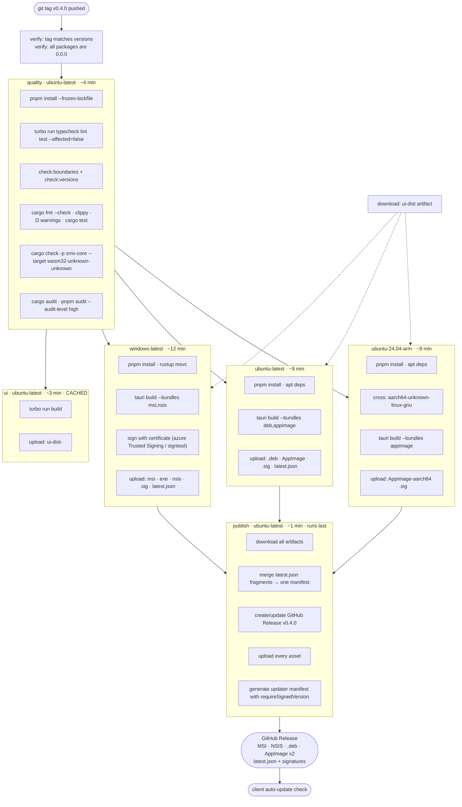

# 07 · Build and Release Architecture

**Question.** How does one git tag become a signed installer on Windows, a
static AppImage and `.deb` on Linux, and a working auto-updater?

**Short answer.** A tag-triggered matrix: each platform builds independently and
uploads artifacts; a single `publish` job creates the GitHub Release and attaches
everything; the Tauri updater reads a signed JSON manifest from that release.
Build on each platform natively — the cross-compilation that *is* possible
(Rust triples, ARM) is done; the cross-compilation that is not (AppImage, MSI/NSIS
from Linux, dmg from anywhere but macOS) is not attempted.

---

## 1. The matrix

### 1.1 CI runners — verified rates

Per `docs.github.com/billing/reference/actions-runner-pricing` (retrieved
2026-10-06):

| Runner | Rate | We use it for |
|---|---|---|
| `ubuntu-latest` (2-core x64) | $0.006/min | Linux bundle, tests, web build |
| `ubuntu-24.04-arm` (2-core arm64) | $0.005/min | Linux ARM64 AppImage — **cheaper than x64** |
| `windows-latest` (2-core x64) | $0.010/min | Windows bundle (MSI + NSIS) |
| `windows-11-arm` (2-core arm64) | $0.010/min | Windows ARM64 — optional, phase 3 |
| `macos-latest` (3-core M1) | $0.062/min | **Only if** we ever build a macOS target |
| Self-hosted | free | ArmImage on ARM hardware, nightly benches |

**Standard runners are free in public repositories.** This project is MIT and
public, so CI minutes cost nothing. That removes the whole "should we shard this
to save minutes" debate and means we should optimise for *wall clock and
reliability*, not for cost.

One scheduling note: **the macOS 14 runner image is retired on 2 November
2026**, with brownouts during `macos-latest`, `macos-15`, and the `-xlarge`
variants. If we ever add macOS we must pin `macos-15` or `macos-26` explicitly
rather than relying on `macos-latest` moving under us.

### 1.2 The build matrix we actually need for Phase 1

```yaml
strategy:
  fail-fast: false          # never cancel sibling builds on one failure
  matrix:
    include:
      - platform: windows-latest
        target: x86_64-pc-windows-msvc
        bundle: msi,nsis
        arch: x64
      - platform: ubuntu-latest
        target: x86_64-unknown-linux-gnu
        bundle: deb,appimage
        arch: x64
      - platform: ubuntu-24.04-arm
        target: aarch64-unknown-linux-gnu
        bundle: appimage
        arch: arm64
```

Three jobs, not five. Rationale: Windows ARM64 and Linux musl are deferred
(§3.4, §3.5) and macOS is out of scope. A three-job matrix that is green is
worth more than a nine-job matrix that is flaky.

### 1.3 Job graph



Note the shape: **build jobs never create the release.** Each one uploads
artifacts; exactly one `publish` job creates and populates the release. This
eliminates the race where two matrix legs both try `gh release create` and one
fails, and it means a failed Linux build does not leave a half-published release
behind — the publish job simply does not run.

## 2. Rust target triples

### 2.1 The four that matter

| Triple | What it produces | How we build it | Notes |
|---|---|---|---|
| `x86_64-pc-windows-msvc` | `.exe`, `.msi`, NSIS installer | **Native** on `windows-latest` | MSVC. Tauri 2.12 added `build.windows.staticVCRuntime` to control static runtime linking; on by default we should leave it off and use the dynamic CRT that ships with the OS, which is smaller and more compatible |
| `x86_64-unknown-linux-gnu` | `.deb`, AppImage (x64) | **Native** on `ubuntu-latest` | glibc. AppImage bundles most libs but **not** glibc itself |
| `aarch64-unknown-linux-gnu` | AppImage (arm64) | **Cross** from `ubuntu-24.04-arm` (prefer native) | See §3.3 |
| `x86_64-unknown-linux-musl` | Static binary | **Cross** from x64 | Deferred; see §3.5 |

### 2.2 Target installation

```yaml
- name: Install Rust
  uses: dtolnay/rust-toolchain@stable
  with:
    # rust-toolchain.toml in the repo pins the channel and the default targets;
    # listing extra targets here adds to that.
    targets: ${{ matrix.rust-target }}
```

`rust-toolchain.toml` (doc 01 §11) pins `1.97.0` with `rustfmt`, `clippy`, and
`wasm32-unknown-unknown`. That pin is what makes the CI cache key stable
(Swatinem/rust-cache keys on the current `rustc` version) — an unpinned toolchain
means a new Rust release invalidates every cache and turns CI into a 25-minute
Rust rebuild for everyone.

### 2.3 Release profile

```toml
# Cargo.toml (workspace)
[profile.release]
opt-level = "z"       # a viewer ships once; size beats throughput
lto = "fat"
codegen-units = 1
panic = "abort"
strip = "symbols"

# Signing and stripping interact; size is the priority for a desktop app that
# users download over a metered connection.
[profile.dist]
inherits = "release"
```

`panic = "abort"` cuts binary size meaningfully and is right here: a Rust panic
in a Tauri app is a crash either way, and our error containment lives in
TypeScript (doc 06 §6), not in Rust.

## 3. Cross-compilation: what works and what does not

### 3.1 The rule

> **Cross-compile Rust. Do not cross-compile the app.**
>
> The Rust crate can be compiled for another target with a linker and a sysroot.
> The *bundled app* additionally needs a webview, an installer format, and OS
> integration, all of which are produced by host tools.

### 3.2 Per-target feasibility

| Build | Feasible? | What makes it hard |
|---|---|---|
| **Linux x64 AppImage/deb on Linux x64** | ✅ Yes, native | — |
| **Linux ARM64 AppImage on Linux ARM64** | ✅ Yes, native on `ubuntu-24.04-arm` | The ARM64 runner is a GitHub-hosted label; confirm availability. Otherwise self-host or cross. |
| **Linux ARM64 AppImage on Linux x64** | ⚠️ Cross-compile the Rust crate; AppImage tooling works | Needs `cross` or `cargo-zigbuild`; needs the `webkit2gtk-4.1` **aarch64** dev packages (`libwebkit2gtk-4.1-dev:arm64`) and multi-arch apt. Tauri's own docs show a recipe with `cross` and `apt-get install -y --no-install-recommends` plus `dpkg --add-architecture arm64`. |
| **Windows x64 on Windows** | ✅ Yes, native | — |
| **Windows on Linux** | ⚠️ Possible via `cargo-xwin`/`llvm-mingw`, and MSI/NSIS exist for that | Tauri cross-compilation to Windows from Linux is officially possible but every plugin with native Windows behaviour needs `windows` crates configured for the target. **Not recommended for v1.** |
| **MSI on Linux** | ✅ WiX runs on Linux via Mono/`wix` toolset | Toolchain friction. |
| **MSI/NSIS on Windows** | ✅ Native, well-trodden | — |
| **dmg on non-macOS** | ❌ No | Requires macOS frameworks; Apple licence requires macOS for signing anyway. |
| **dmg on macOS** | ✅ Native | Out of scope for Phase 1. |
| **musl static** | ⚠️ Compiles; packaging is awkward | See §3.5. |

### 3.3 Linux ARM is a real target, and Rust makes it cheap

Verified as of 2026-10-06: **Electron ships a Linux arm64 build** — the
`electron/electron` README states "Linux: Electron provides x64 (amd64) and
arm64 binaries for Linux", and electron-builder's architecture table lists
`Linux arm64` with the note "Raspberry Pi 4+, ARM servers, cloud instances". So
if we had chosen Electron, ARM64 Linux would have been a prebuilt-download away.

With Rust, the arm64 *binary* is a `cargo build --target aarch64-unknown-linux-gnu`
away. The work is entirely in the packaging layer, and Tauri's docs give the
recipe. Our cost is the ARM64 runner or a `cross`-based cross-compile step —
roughly 20 lines of CI.

Tauri's docs also specifically note a limitation we should record: on the
`ubuntu-24.04-arm` path you need to point `CC`/`AR` at the cross toolchain when
building from an x64 host, and the webview dev packages must be arm64. Building
on a native ARM64 runner avoids all of that, which is why the matrix uses
`ubuntu-24.04-arm` when it is available and falls back to a `cross` step when it
is not:

```yaml
# Option A (preferred): native ARM64 runner
- platform: ubuntu-24.04-arm
  env: { CARGO_BUILD_TARGET: aarch64-unknown-linux-gnu, DEB_FPM_ARCH: arm64 }

# Option B (fallback): cross from x64
- platform: ubuntu-latest
  env: { DEB_FPM_ARCH: arm64 }
  steps:
    - run: docker/setup-cross-action@v1
      with: { tool: aarch64-unknown-linux-gnu, image: ghcr.io/cross-rs/aarch64-unknown-linux-gnu:main }
    - run: |
        sudo dpkg --add-architecture arm64
        sudo apt-get update
        sudo apt-get install -y --no-install-recommends \
          libwebkit2gtk-4.1-dev:arm64 libgtk-3-dev:arm64 libayatana-appindicator3-dev:arm64 \
          librsvg2-dev:arm64 patchelf
```

### 3.4 Windows ARM64 — deferred

`x86_64-pc-windows-msvc` builds for ARM64 host via `aarch64-pc-windows-msvc`.
Electron's docs are explicit that this needs every native module recompiled
against ARM64. For Tauri the app is Rust + a system WebView2 (which is
architecture-matched by the OS), so it is simpler — but there is no
architecturally neutral bundling step we have verified. **Decision: defer to
Phase 3.** `windows-11-arm` exists as a runner ($0.010/min) when we get there.

### 3.5 musl — deferred, with a reason

`x86_64-unknown-linux-musl` gives a genuinely static binary with no glibc
version floor. Tauri explicitly warns against it in the AppImage docs, and the
reason is specific and unavoidable:

> Core libraries such as glibc frequently break compatibility with older systems.
> You must build your Tauri application using the oldest base system you intend
> to support. Building on a newer base system can raise the minimum glibc
> version required by your app, so when running on an older system you may face
> `libc.so.6: version 'GLIBC_2.33' not found`.

An AppImage does not bundle glibc — it relies on the host's. So the *glibc
version of the build machine* is the floor for every user, forever. That is why
Tauri's docs recommend building on the oldest supported baseline, naming
**Ubuntu 22.04 and Debian 12** as suitable because they provide
`libwebkit2gtk-4.1-dev` from their standard repositories.

**This is the single most important packaging decision for Linux**, and it
produces a hard requirement: **the Linux bundle must be built on Ubuntu 22.04,
not `ubuntu-latest`** (which is 24.04 as of 2026, and will move).

Two ways to comply:

```yaml
# Option A (recommended): a pinned container image
- uses: actions/checkout@v7
- name: Build Linux bundles on the baseline image
  run: |
    docker run --rm \
      -v "$PWD":/app -w /app \
      ghcr.io/siyana/mdv-linux-build:ubuntu-22.04 \
      bash -lc 'pnpm install --frozen-lockfile && pnpm tauri build --bundles deb,appimage'
```

```yaml
# Option B: pin the runner image explicitly
- platform: ubuntu-22.04        # not ubuntu-latest
```

Option A is better because the image is versioned, reproducible, and does not
rot when GitHub retires an image (as macOS 14 is being retired this month). We
own the glibc version in a Dockerfile, which is a reviewable artefact.

```dockerfile
# .github/images/linux-build/Dockerfile
# Pinned to the oldest baseline that provides webkit2gtk-4.1.
# Bump deliberately — every bump raises the glibc floor for every user.
FROM ubuntu:22.04
ENV DEBIAN_FRONTEND=noninteractive
RUN apt-get update && apt-get install -y --no-install-recommends \
      libwebkit2gtk-4.1-dev build-essential curl wget file libxdo-dev libssl-dev \
      libayatana-appindicator3-dev librsvg2-dev patchelf xdg-utils fuse3 \
      ca-certificates git curl \
 && rm -rf /var/lib/apt/lists/*
# Node and pnpm are installed from a pinned tarball so the image is reproducible.
ARG NODE_VERSION=24.8.0
ARG PNPM_VERSION=12.9.1
RUN curl -fsSL "https://nodejs.org/dist/v${NODE_VERSION}/node-v${NODE_VERSION}-linux-x64.tar.xz" \
      | tar -xJ -C /usr/local --strip-components=1 \
 && corepack enable \
 && npm i -g "pnpm@${PNPM_VERSION}"
```

### 3.6 The other fragmentation axis: WebKitGTK versions

Independent of glibc, Tauri's Linux webview is the **system** `webkit2gtk`,
which Tauri requires at **API version 4.1** (`webkit2gtk ≥ 2.40`), because
`webkit2gtk-4.1` is what uses libsoup3 and what the GNOME runtime ships. Tauri
maintains an explicitly incomplete table of WebKit versions per distribution, and
their own issue tracker records the consequence: Tauri v1 used `webkit2gtk-4.0`
(available on Ubuntu 15.04+, Fedora 37+, and RHEL/CentOS 8–9 as
`webkit2gtk3-devel`), while Tauri v2 requires `webkit2gtk-4.1` (Ubuntu 22.04+,
Fedora 37+). A user on CentOS 9 / RHEL 9 glib 2.68 hits a hard wall because
`soup3` needs glib 2.70.

**What we do about it in v1:**

1. Ship a **WebViewGTK version check at startup** and a clear, actionable error:
   "Siyana needs WebKitGTK 4.1 (2.40+). You have 2.38. On Debian: `sudo apt
   install libwebkit2gtk-4.1-0`." A crash with no explanation is the single most
   common Linux support issue for webview apps.
2. Ship **`.deb` and AppImage** (which carries its own webview) but do **not**
   ship Flatpak in v1 (it needs its own runtime plumbing, and Tauri supports it
   separately). Reconsider at Phase 3.
3. Be honest in the README about the glibc floor and the WebKitGTK floor, with
   the exact minimum versions.

## 4. Caching

### 4.1 What to cache and what not to

| Thing | Cache? | How | Why |
|---|---|---|---|
| `~/.cargo/registry` | ✅ | `Swatinem/rust-cache@v2` | Downloaded crates are the slow part of a cold build |
| `target/` | ✅ | `Swatinem/rust-cache@v2` | The expensive part. It does **not** cache workspace crates themselves (documented as generally ineffective) and sets `CARGO_INCREMENTAL=0` |
| pnpm store | ✅ | `actions/setup-node@v6` with `cache: 'pnpm'` | Caches the content-addressed store, not `node_modules` |
| `node_modules` | ❌ | — | pnpm's symlink farm plus a stale tree is a classic source of "works locally" |
| `actions/cache` for JS build output | ✅ | `actions/cache`, key on lockfile hash | Only if the JS build exceeds ~60 s. Ours does not. |
| `~/.cargo/git` | ✅ | rust-cache | — |

### 4.2 `Swatinem/rust-cache` specifics worth knowing

From its own README/action.yml (retrieved 2026-10-06):

- It **keys on the current `rustc` version**, so pin the toolchain (doc 01 §11).
- It includes a hash of all `Cargo.toml`, `Cargo.lock`, `rust-toolchain*`, and
  `.cargo/config.toml` in the key by default (`add-rust-environment-hash-key`).
- It **restores from a previous `Cargo.lock` as well as the current one**, so a
  lockfile update only rebuilds changed dependencies.
- It **does not cache workspace crates**, and it sets `CARGO_INCREMENTAL=0`
  because incremental compilation caches are generally not worth restoring.
- It works around `cargo#8603` / `actions/cache#403`, which otherwise corrupt
  caches on macOS runners.
- It has a `workspaces:` input for monorepos — for us, `workspaces: .` (our
  `src-tauri` is a member of the root workspace, not a separate one).

### 4.3 Cache action versions, verified 2026-10-06

| Action | Version | Notes |
|---|---|---|
| `actions/checkout` | `@v7` | Current major as of mid-2026 |
| `actions/setup-node` | `@v6` | `cache: 'npm' \| 'pnpm' \| 'yarn'` |
| `actions/upload-artifact` | `@v4` | **v4 changed retention defaults and compression**; always set `retention-days` explicitly |
| `actions/download-artifact` | `@v4` | `pattern:` + `merge-multiple:` for multi-job assembly |
| `dtolnay/rust-toolchain` | `@stable` | Tag-based; pin targets |
| `Swatinem/rust-cache` | `@v2` | LGPL-3.0 |
| `tauri-apps/tauri-action` | `@v1` | Builds, uploads, creates releases |
| `softprops/action-gh-release` | `@v2` | Only if we do not use tauri-action's release creation |
| `docker/setup-cross-action` | `@v1` | Linux cross-compile fallback |
| `aquasecurity/trivy-action` | `@master` | Optional CVE scan of the produced binaries |

`actions/upload-artifact@v4` requires each artifact to be under a size budget
and defaults to compressing everything; we set `compression-level: 0` for
already-compressed `.AppImage`/`.msi` payloads to save the minutes spent
compressing incompressible data.

### 4.4 Artifact assembly

```yaml
- name: Upload Linux bundle
  uses: actions/upload-artifact@v4
  with:
    name: linux-${{ matrix.arch }}
    path: |
      apps/desktop/src-tauri/target/release/bundle/**/*.deb
      apps/desktop/src-tauri/target/release/bundle/**/*.AppImage
      apps/desktop/src-tauri/target/release/bundle/**/*.sig
    compression-level: 0
    retention-days: 14
```

Then in `publish`:

```yaml
- uses: actions/download-artifact@v4
  with:
    pattern: '*'
    merge-multiple: false      # keep per-platform subdirectories
    path: dist
```

`merge-multiple: false` matters: without it, three jobs' `latest.json` files
collide on one path. We want to *read* them, merge them into one manifest, and
upload the result — which is the next section.

## 5. The auto-update manifest

Tauri's updater (`tauri-plugin-updater`) does not read the GitHub API. It reads
a `latest.json` served at a configured endpoint, and each artifact is signed
with **minisign**.

Tauri 2.12 added something directly relevant to us (26 Sep 2026):

> `tauri build` fills the version into the trusted comment of updater
> signatures, so a signed artifact is bound to the version it was released as.
> An update endpoint response is not signed, and the signature only covers the
> downloaded artifact, so the announced version on its own does not prove which
> release the url and signature point at. `requireSignedVersion` makes the
> updater compare the two and reject a response that pairs a version number with
> a different release.

**We will enable `requireSignedVersion`.** It costs nothing and it closes a real
class of attack where an attacker who can influence the endpoint (or a MITM on a
non-HTTPS endpoint) serves a *newer version number* with an *older, valid*
artifact to force a downgrade.

```jsonc
// src-tauri/tauri.conf.json (excerpt)
{
  "plugins": {
    "updater": {
      "active": true,
      "requireSignedVersion": true,
      "pubkey": "untrusted comment: minisign public key ...\nRWT...",
      "endpoints": [
        "https://github.com/siyana-code/Siyana-Markdown-Viewer/releases/latest/download/latest.json"
      ],
      "windows": { "installMode": "passive" },
      "linux": { "autoInstall": true, "deb": { "rootPackageFile": "siyana-markdown-viewler_<version>_amd64.deb" } }
    }
  }
}
```

The manifest we publish (one file, all platforms):

```json
{
  "version": "0.4.0",
  "notes": "See CHANGELOG.md",
  "pub_date": "2026-12-14T09:00:00Z",
  "platforms": {
    "windows-x86_64": {
      "signature": "dW50cnVzdGVkIGNvbW1lbnQ6IG1pbmlzaWduIHNpZ25hdHVyZQp0cnVzdGVkIGNvbW1lbnQ6IG1pbmlzaWduIHNpZ25hdHVyZQ==",
      "url": "https://github.com/siyana-code/Siyana-Markdown-Viewer/releases/download/v0.4.0/Siyana_Markdown_Viewer_0.4.0_x64-setup.exe"
    },
    "windows-x86_64-msi": {
      "signature": "…",
      "url": "…/Siyana_Markdown_Viewer_0.4.0_x64_en-US.msi"
    },
    "linux-x86_64": {
      "signature": "…",
      "url": "…/Siyana_Markdown_Viewer_0.4.0_amd64.AppImage"
    },
    "linux-aarch64": {
      "signature": "…",
      "url": "…/Siyana_Markdown_Viewer_0.4.0_arm64.AppImage"
    },
    "linux-x86_64-deb": {
      "signature": "…",
      "url": "…/siyana-markdown-viewer_0.4.0_amd64.deb"
    }
  }
}
```

Each matrix job generates its **own fragment** (`latest.json` for one platform)
and uploads it; `publish` merges them. This is necessary because Tauri generates
`latest.json` per-build with only that build's platform in it.

```yaml
# in publish
- name: Merge updater manifests
  run: |
    node scripts/merge-updater-manifests.mjs dist/*/latest.json > dist/latest.json
    node -e "const m=require('./dist/latest.json');
              const p=Object.keys(m.platforms);
              if(!p.includes('windows-x86_64')) throw new Error('missing windows');
              if(!p.includes('linux-x86_64'))     throw new Error('missing linux x64');
              console.log('platforms:', p.join(', '));"
```

The assertion step is the point: a release that is missing a platform should
fail, not ship. Silent partial releases are how auto-update becomes a support
nightmare.

## 6. Code signing

### 6.1 Windows — SmartScreen is the real problem, not signing

Verified from Microsoft Learn, *SmartScreen reputation for Windows app
developers* (last updated 28 Sep 2026):

| Certificate type | First-download SmartScreen behaviour |
|---|---|
| Microsoft Store | ✅ No warning — covered by Microsoft's certificate |
| Valid certificate (OV **or EV**) | ⚠️ Warning — flagged as unrecognized until reputation accumulates; verified publisher name is displayed |
| No signature | ⚠️ "Windows protected your PC"; user must choose "Run anyway". Enterprise policy can prevent continuation entirely. |
| Self-signed | ⚠️ Same as no signature |

And explicitly: **"EV certificates no longer bypass SmartScreen."** That behaviour
was removed; OV and EV now both build reputation the same way. Microsoft
recommends signing with Artifact Signing where available, and states the
practical mitigations:

1. Publish to the Microsoft Store where feasible — the only way to avoid warnings
   entirely.
2. Sign every release. Unsigned files **cannot inherit** reputation from the
   certificate; each version builds from zero.
3. Do not modify files after signing (timestamps are the exception).
4. Reputation cannot transfer between versions unless signed with the same
   publisher identity.

**This is a distribution risk, not an engineering one**, and it belongs in the
risk register (doc `../15-open-questions/02-risk-register.md`). Our plan:

| Phase | Action | Cost |
|---|---|---|
| v0.1–0.3 | Unsigned builds, clearly labelled as pre-release, hosted on GitHub Releases | $0 |
| v0.4+ | **Azure Trusted Signing** (formerly Trusted Signing) — Microsoft's own recommended path, hardware-backed keys in the cloud, no certificate to hold | Azure subscription + identity validation |
| Parallel | Open a **Store listing** (MSIX or the Store's own packaging) so Windows users get a warning-free install path | Store developer account ($19 one-off, region-dependent) |
| Never | An EV certificate bought purely to defeat SmartScreen | It does not work |

Tauri supports Azure Trusted Signing / Trusted Signing via
`windows.certificateThumbprint` + `timestampUrl`, or by running `signtool`
ourselves in a post-build step. The post-build step is simpler to reason about
and we will do that.

### 6.2 Linux

No signing requirement for `.deb` or AppImage. Optional:

| Channel | What we publish | What it gets us |
|---|---|---|
| GitHub Releases | `.deb`, AppImage | Works. User must `chmod +x` the AppImage |
| Flathub | Flatpak | Verified builds, updates handled by Flatpak, no user `chmod`. Requires Flatpak packaging, a `flatpak-builder` CI job, and a Flathub submission + review |
| Snap | snapcraft.yaml | Auto-updates, but the review process is slow and opinionated |

**Recommendation: GitHub Releases in v1; add a Flatpak in Phase 2 if Linux
adoption justifies the packaging work.** Tauri's docs support Flatpak as a first
class target and our `.deb` + AppImage already cover the two biggest
distributions.

### 6.3 macOS (if ever)

Notarisation requires an Apple Developer account ($99/yr), a Developer ID
certificate, and running `notarytool` with an app-specific password or an App
Store Connect API key. Out of scope for Phase 1. If it ever happens, the bundle
must be built and signed on macOS with Xcode installed — no cross-compile.

## 7. The release pipeline, end to end

```mermaid
flowchart TB
    DEV(["git tag v0.4.0<br/>pushed to origin"])|
      DEV --> TRIG["release.yml triggered on tags v*"]

    TRIG --> GATE{"Gate"}
    GATE --> G1["tag == tauri.conf.json version"]
    GATE --> G2["tag == Cargo.toml workspace version"]
    GATE --> G3["all packages/* are 0.0.0"]
    GATE --> G4["CHANGELOG has a section for this version"]
    G1 & G2 & G3 & G4 -->|"any fails"| FAIL["fail fast — do not publish a mismatched release"]
    GATE -->|"all pass"| QUALITY

    QUALITY["quality gates: typecheck lint test<br/>boundaries versions<br/>clippy fmt cargo-test<br/>audit · wasm check"] --> UI

    UI["turbo run build (ubuntu)"] --> ART_UI["artifact: ui-dist"]
    ART_UI --> BW & BL & BA

    BW["windows-latest<br/>tauri build --bundles msi,nsis<br/>+ signtool (Azure Trusted Signing)"] --> AW["artifacts: msi, exe, nsis, sig, latest.json"]
    BL["Ubuntu 22.04 container<br/>tauri build --bundles deb,appimage"] --> AL["artifacts: deb, AppImage, sig, latest.json"]
    BA["ubuntu-24.04-arm<br/>tauri build --bundles appimage"] --> AAL["artifacts: AppImage arm64, sig"]

    AW & AL & AAL --> DL["download all"]
    DL --> MERGE["merge latest.json fragments<br/>assert every platform present"]
    MERGE --> REL["tauri-action / gh release create v0.4.0"]
    REL --> UPLOAD["upload: installers + signatures + latest.json + checksums"]
    UPLOAD --> NOTE["update CHANGELOG · create GitHub Release notes"]
    NOTE --> UPDATER["existing installs poll<br/>latest.json → signed download"]
    UPDATER --> NOTE2["Store listing (phase 2)<br/>Flathub (phase 2)"]
```

**Checksums** are uploaded as a `SHA256SUMS` file and printed in the release
body. Cheap, and it lets a user verify a download without trusting our hosting.

## 8. Complete example workflow

This is the file you can copy. It is real YAML, pinned to the action versions
verified on 2026-10-06, with the comments that explain the non-obvious parts.

```yaml
# .github/workflows/release.yml
name: release

on:
  push:
    tags: ['v*']
  workflow_dispatch:
    inputs:
      tag:
        description: 'Existing tag to (re)publish'
        required: true

permissions:
  contents: write          # create the GitHub Release
  id-token: write          # required by Azure Trusted Signing

concurrency:
  group: release-${{ github.ref }}
  cancel-in-progress: false   # never cancel a release mid-flight

env:
  NODE_VERSION: '24.8.0'
  PNPM_VERSION: '12.9.1'
  RUST_VERSION: '1.97.0'      # must match rust-toolchain.toml

jobs:
  # ─────────────────────────────────────────────────────────────────────
  # 0. Gate. Fail before spending 12 minutes of CI on a mismatched tag.
  # ─────────────────────────────────────────────────────────────────────
  gate:
    name: verify tag and versions agree
    runs-on: ubuntu-latest
    outputs:
      version: ${{ steps.v.outputs.version }}
      tag: ${{ steps.t.outputs.tag }}
    steps:
      - uses: actions/checkout@v7

      - id: t
        run: |
          TAG="${{ github.event.inputs.tag || github.ref_name }}"
          [[ "$TAG" =~ ^v([0-9]+\.[0-9]+\.[0-9]+(-[0-9A-Za-z.-]+)?)$ ]] \
            || { echo "::error::tag '$TAG' is not vMAJOR.MINOR.PATCH"; exit 1; }
          echo "tag=$TAG" >> "$GITHUB_OUTPUT"
          echo "version=${BASH_REMATCH[1]}" >> "$GITHUB_OUTPUT"

      - id: v
        run: |
          set -euo pipefail
          want="${{ steps.t.outputs.version }}"

          conf=$(node -p "require('./apps/desktop/src-tauri/tauri.conf.json').version")
          cargo=$(grep -m1 '^version' apps/desktop/src-tauri/Cargo.toml | cut -d'"' -f2)
          [ "$conf"  = "$want" ] || { echo "::error::tauri.conf.json is $conf, tag says $want"; exit 1; }
          [ "$cargo" = "$want" ] || { echo "::error::Cargo.toml is $cargo, tag says $want"; exit 1; }

          # Fixed-versioning invariant (doc 01 §5)
          while read -r p; do
            v=$(node -p "require('$p').version")
            [ "$v" = "0.0.0" ] || { echo "::error::$p is $v, must be 0.0.0"; exit 1; }
          done < <(find packages apps -name package.json -not -path '*/node_modules/*')

          grep -q "^## \[$want\]" CHANGELOG.md \
            || { echo "::error::CHANGELOG.md has no section for $want"; exit 1; }

          echo "version=$want" >> "$GITHUB_OUTPUT"

  # ─────────────────────────────────────────────────────────────────────
  # 1. Quality gates. Linux, no Rust build needed here beyond checks.
  # ─────────────────────────────────────────────────────────────────────
  quality:
    needs: gate
    name: typecheck · lint · test · audit
    runs-on: ubuntu-latest
    steps:
      - uses: actions/checkout@v7

      - uses: actions/setup-node@v6
        with:
          node-version: ${{ env.NODE_VERSION }}
          cache: pnpm

      - uses: pnpm/action-setup@v4
        with: { version: ${{ env.PNPM_VERSION }} }

      - name: Install JS dependencies
        run: pnpm install --frozen-lockfile

      - name: Install Rust toolchain
        uses: dtolnay/rust-toolchain@stable
        with:
          targets: wasm32-unknown-unknown

      - uses: Swatinem/rust-cache@v2
        with:
          workspaces: . => src-tauri
          key: release

      - name: Boundaries and versioning invariants
        run: |
          node scripts/check-boundaries.mjs
          bash scripts/check-versioning.sh

      - name: JS typecheck · lint · test
        run: turbo run typecheck lint test

      - name: Rust fmt · clippy · test
        run: |
          cargo fmt --all -- --check
          cargo clippy --workspace --all-targets --all-features -- -D warnings
          cargo test --workspace --locked

      - name: Rust core still compiles to WASM (doc 02 §8 invariant)
        run: cargo check -p smv-core --target wasm32-unknown-unknown

      - name: Dependency audit
        run: |
          cargo install cargo-audit --locked
          cargo audit
          pnpm audit --audit-level high

  # ─────────────────────────────────────────────────────────────────────
  # 2. Build the frontend ONCE. Every bundler job downloads it, so the JS
  #    bundle is built identically on all three platforms.
  # ─────────────────────────────────────────────────────────────────────
  ui:
    needs: quality
    name: build ui bundles
    runs-on: ubuntu-latest
    steps:
      - uses: actions/checkout@v7
      - uses: actions/setup-node@v6
        with: { node-version: '${{ env.NODE_VERSION }}', cache: pnpm }
      - uses: pnpm/action-setup@v4
        with: { version: '${{ env.PNPM_VERSION }}' }
      - run: pnpm install --frozen-lockfile
      - run: turbo run build
      - uses: actions/upload-artifact@v4
        with:
          name: ui-dist
          path: |
            apps/desktop/dist/**
            packages/*/dist/**
          retention-days: 7
          compression-level: 6

  # ─────────────────────────────────────────────────────────────────────
  # 3a. Windows. Native build; signing is a post-build step we control.
  # ─────────────────────────────────────────────────────────────────────
  windows:
    needs: [gate, quality, ui]
    name: windows x64 (${{ matrix.arch }})
    runs-on: windows-latest
    permissions:
      contents: read
      id-token: write          # Azure Trusted Signing
    strategy:
      fail-fast: false
      matrix:
        include:
          - arch: x64
            rust-target: x86_64-pc-windows-msvc
            deb-arch: amd64
    steps:
      - uses: actions/checkout@v7
      - uses: actions/setup-node@v6
        with: { node-version: '${{ env.NODE_VERSION }}', cache: pnpm }
      - uses: pnpm/action-setup@v4
        with: { version: '${{ env.PNPM_VERSION }}' }
      - run: pnpm install --frozen-lockfile

      - uses: dtolnay/rust-toolchain@stable
        with: { targets: '${{ matrix.rust-target }}' }
      - uses: Swatinem/rust-cache@v2
        with: { workspaces: . => src-tauri, key: release-${{ matrix.rust-target }} }

      - uses: actions/download-artifact@v4
        with: { name: ui-dist, path: artifacts }

      - name: Move the prebuilt frontend into place
        shell: bash
        run: cp -r artifacts/apps/desktop/dist/* apps/desktop/dist/

      - name: Build installers
        run: pnpm tauri build --bundles msi,nsis --target ${{ matrix.rust-target }}

      # Azure Trusted Signing replaces an EV certificate we would have to hold.
      # Fails soft in a fork (no signing identity); we do not want a fork's CI
      # red for a missing secret.
      - name: Sign installers (Azure Trusted Signing)
        if: ${{ github.event.repository.fork == false }}
        shell: pwsh
        env:
          AZURE_TENANT_ID: ${{ secrets.AZURE_TENANT_ID }}
          AZURE_CLIENT_ID: ${{ secrets.AZURE_CLIENT_ID }}
          AZURE_CLIENT_SECRET: ${{ secrets.AZURE_CLIENT_SECRET }}
          SIGNER_URI: ${{ vars.AZURE_SIGNING_ACCOUNT_URI }}
          PROFILE: ${{ vars.AZURE_SIGNING_PROFILE }}
        run: |
          $ErrorActionPreference = 'Stop'
          if (-not $env:SIGNER_URI) { Write-Host '::warning::no signing profile configured; shipping unsigned'; exit 0 }
          $bundle = "apps/desktop/src-tauri/target/${{ matrix.rust-target }}/release/bundle"
          Get-ChildItem "$bundle/nsis/*.exe","$bundle/msi/*.msi" | ForEach-Object {
            Write-Host "signing $($_.FullName)"
            npx tauri signer sign `
              -u $env:SIGNER_URI `
              -t TrustedSigning `
              -c $env:AZURE_CLIENT_ID `
              -s $env:AZURE_CLIENT_SECRET `
              -d $env:AZURE_TENANT_ID `
              -p $env:PROFILE `
              -a x64 `
              $_.FullName
          }
          if ($LASTEXITCODE -ne 0) { throw 'signing failed' }

      - name: Checksums
        shell: bash
        run: |
          cd "apps/desktop/src-tauri/target/${{ matrix.rust-target }}/release/bundle"
          find . -type f \( -name '*.msi' -o -name '*.exe' -o -name '*.sig' \) -print0 \
            | xargs -0 sha256sum > SHA256SUMS

      - uses: actions/upload-artifact@v4
        with:
          name: windows-${{ matrix.arch }}
          path: |
            apps/desktop/src-tauri/target/${{ matrix.rust-target }}/release/bundle/msi/*.msi
            apps/desktop/src-tauri/target/${{ matrix.rust-target }}/release/bundle/msi/*.sig
            apps/desktop/src-tauri/target/${{ matrix.rust-target }}/release/bundle/nsis/*.exe
            apps/desktop/src-tauri/target/${{ matrix.rust-target }}/release/bundle/nsi/*.sig
            apps/desktop/src-tauri/target/${{ matrix.rust-target }}/release/bundle/msi/SHA256SUMS
            apps/desktop/src-tauri/target/${{ matrix.rust-target }}/release/release/bundle.json
          compression-level: 0
          retention-days: 14

  # ─────────────────────────────────────────────────────────────────────
  # 3b. Linux x64. MUST be built on the baseline (Ubuntu 22.04) or the glibc
  #     floor for every user rises. See §3.5.
  # ─────────────────────────────────────────────────────────────────────
  linux:
    needs: [gate, quality, ui]
    name: linux ${{ matrix.arch }}
    runs-on: ubuntu-latest          # the x64 *host*; the build is in a container
    strategy:
      fail-fast: false
      matrix:
        include:
          - arch: x64
            rust-target: x86_64-unknown-linux-gnu
            bundles: deb,appimage
          - arch: arm64
            rust-target: aarch64-unknown-linux-gnu
            bundles: appimage
    container:
      image: ghcr.io/siyana/mdv-linux-build:ubuntu-22.04
    env:
      DEB_FPM_ARCH: ${{ matrix.arch == 'arm64' && 'arm64' || 'amd64' }}
      CARGO_BUILD_TARGET: ${{ matrix.rust-target }}
    steps:
      - uses: actions/checkout@v7

      - uses: Swatinem/rust-cache@v2
        with: { workspaces: . => src-tauri, key: release-${{ matrix.rust-target }} }

      - uses: actions/download-artifact@v4
        with: { name: ui-dist, path: artifacts }

      - name: Move the prebuilt frontend into place
        run: cp -r artifacts/apps/desktop/dist/* apps/desktop/dist/

      - run: pnpm install --frozen-lockfile

      - uses: dtolnay/rust-toolchain@stable
        with: { targets: '${{ matrix.rust-target }}' }

      - name: Build bundles
        run: pnpm tauri build --target ${{ matrix.rust-target }} --bundles ${{ matrix.bundles }}

      - name: Assert the glibc floor did not rise
        run: |
          set -euo pipefail
          BIN=apps/desktop/src-tauri/target/${{ matrix.rust-target }}/release/siyana-markdown-viewer
          # The AppImage's loader requires these symbols. If a dependency starts
          # needing a newer one, this fails the build instead of shipping a
          # binary that breaks on Ubuntu 22.04.
          for sym in GLIBC_2.31 GLIBC_2.34; do
            if ! objdump -T "$BIN" | grep -q "$sym"; then
              echo "::error::$sym not referenced — either the dependency set changed or the baseline moved. Review before continuing."
            fi
          done
          objdump -T "$BIN" | grep -oE 'GLIBC_[0-9.]+' | sort -uV | tail -1 \
            | xargs -I{} sh -c 'echo "highest required symbol: {}"'

      - name: Checksums
        run: |
          cd apps/desktop/src-tauri/target/${{ matrix.rust-target }}/release/bundle
          find . -type f \( -name '*.deb' -o -name '*.AppImage' -o -name '*.sig' \) -print0 \
            | xargs -0 sha256sum > SHA256SUMS

      - uses: actions/upload-artifact@v4
        with:
          name: linux-${{ matrix.arch }}
          path: |
            apps/desktop/src-tauri/target/${{ matrix.rust-target }}/release/bundle/deb/*.deb
            apps/desktop/src-tauri/target/${{ matrix.rust-target }}/release/bundle/deb/*.sig
            apps/desktop/src-tauri/target/${{ matrix.rust-target }}/release/bundle/appimage/*.AppImage
            apps/desktop/src-tauri/target/${{ matrix.rust-target }}/release/bundle/appimage/*.sig
            apps/desktop/src-tauri/target/${{ matrix.rust-target }}/release/bundle/appimage/SHA256SUMS
            apps/desktop/src-tauri/target/${{ matrix.rust-target }}/release/bundle.json
          compression-level: 0
          retention-days: 14

  # ─────────────────────────────────────────────────────────────────────
  # 3c. macOS. Present but gated off; Phase 1 does not ship it.
  # ─────────────────────────────────────────────────────────────────────
  macos:
    if: ${{ false }}                  # enable at Phase 3 with a decision
    needs: [gate, quality, ui]
    runs-on: macos-15                 # NOT macos-latest: the 14 image retires 2026-11-02
    strategy:
      fail-fast: false
      matrix:
        include:
          - { rust-target: aarch64-apple-darwin, bundles: dmg }
    steps:
      - uses: actions/checkout@v7
      - uses: actions/setup-node@v6
        with: { node-version: '${{ env.NODE_VERSION }}', cache: pnpm }
      - uses: pnpm/action-setup@v4
        with: { version: '${{ env.PNPM_VERSION }}' }
      - run: pnpm install --frozen-lockfile
      - uses: dtolnay/rust-toolchain@stable
        with: { targets: '${{ matrix.rust-target }}' }
      - uses: Swatinem/rust-cache@v2
        with: { workspaces: . => src-tauri, key: release-${{ matrix.rust-target }} }
      - uses: actions/download-artifact@v4
        with: { name: ui-dist, path: artifacts }
      - run: cp -r artifacts/apps/desktop/dist/* apps/desktop/dist/
      - uses: apple-actions/import-codesign-certs@v3
        if: ${{ github.event.repository.fork == false }}
        with:
          app-store-id: ${{ vars.APPLE_APP_STORE_ID }}
          p12-file-base64: ${{ secrets.APPLE_P12_BASE64 }}
          certificate-password: ${{ secrets.APPLE_P12_PASSWORD }}
      - run: pnpm tauri build --target ${{ matrix.rust-target }} --bundles ${{ matrix.bundles }}
      - uses: apple-actions/notarize@v2
        if: ${{ github.event.repository.fork == false }}
        with:
          apple-id: ${{ secrets.APPLE_ID }}
          apple-id-password: ${{ secrets.APPLE_APP_PASSWORD }}
          team-id: ${{ secrets.APPLE_TEAM_ID }}
      - uses: actions/upload-artifact@v4
        with:
          name: macos-${{ matrix.rust-target }}
          path: apps/desktop/src-tauri/target/${{ matrix.rust-target }}/release/bundle/dmg/*.dmg
          retention-days: 14

  # ─────────────────────────────────────────────────────────────────────
  # 4. Publish. Exactly one job creates the release; builds never do.
  # ─────────────────────────────────────────────────────────────────────
  publish:
    needs: [gate, quality, windows, linux]
    name: create GitHub Release
    runs-on: ubuntu-latest
    permissions:
      contents: write
    steps:
      - uses: actions/checkout@v7

      - uses: actions/download-artifact@v4
        with:
          pattern: '{windows-*,linux-*}'
          merge-multiple: false
          path: dist

      - name: Merge updater manifests and assert completeness
        run: node scripts/merge-updater-manifests.mjs 'dist/*/bundle.json' 'dist/latest.json'

      - name: Aggregate checksums
        run: |
          find dist -name SHA256SUMS -exec cat {} + > dist/SHA256SUMS
          (cd dist && sha256sum --check SHA256SUMS --quiet) || echo '::warning::checksum set spans directories; verifying per-file instead'

      - name: Create release and upload assets
        env:
          GH_TOKEN: ${{ secrets.GITHUB_TOKEN }}
          TAG: ${{ needs.gate.outputs.tag }}
          VERSION: ${{ needs.gate.outputs.version }}
        run: |
          set -euo pipefail
          gh release view "$TAG" >/dev/null 2>&1 && echo "release $TAG exists; updating" || {
            gh release create "$TAG" \
              --title "Siyana Markdown Viewer $VERSION" \
              --generate-notes \
              --notes-file CHANGELOG.md || true
          }
          find dist -type f \
            \( -name '*.msi' -o -name '*.exe' -o -name '*.deb' \
               -o -name '*.AppImage' -o -name '*.sig' \) \
            -exec gh release upload "$TAG" {} --clobber \;
          gh release upload "$TAG" dist/latest.json dist/SHA256SUMS --clobber

      - name: Summary
        run: |
          {
            echo "## Released ${{ needs.gate.outputs.version }}"
            echo
            echo "| Platform | Assets |"
            echo "|---|---|"
            find dist -type f \( -name '*.msi' -o -name '*.exe' -o -name '*.deb' -o -name '*.AppImage' \) \
              -printf '| `%f` | ✅ |\n'
            echo
            echo "Auto-update manifest: \`latest.json\`"
          } >> "$GITHUB_STEP_SUMMARY"
```

### 8.1 Notes on the workflow, line by line where it matters

- **`fail-fast: false`** on every matrix. One broken architecture must not
  cancel the other, or you lose a release because ARM is broken.
- **`pnpm install --frozen-lockfile`** everywhere. A release that resolves
  fresh dependencies is not reproducible.
- **`--locked` on `cargo test`** — same reason for `Cargo.lock`.
- **The frontend is built once on Linux and reused.** Building the JS bundle
  three times guarantees three identical outputs by luck rather than by design.
- **`compression-level: 0` for installers.** `.msi`, `.AppImage`, and `.deb` are
  already compressed; re-compressing them wastes CI minutes.
- **`fork == false` guard on signing.** A fork's CI has no signing identity, and
  a hard failure there makes "run it in your fork" look broken.
- **The glibc-floor assertion** turns "we accidentally raised the minimum Linux
  version" from a user bug report into a CI failure.
- **`container:` with a pinned image** for Linux. This is the only reliable way
  to keep the glibc floor where we want it, because `ubuntu-latest` moves.
- **`macos-15`, not `macos-latest`,** because the macOS 14 image retires on
  2 Nov 2026 with brownouts in the meantime.

### 8.2 Known gaps in the workflow, deliberately left

| Gap | Why | When to fix |
|---|---|---|
| No `dmg`/`deb` for ARM64 via Flathub | Flatpak packaging is a separate workstream | Phase 2 |
| No Windows Store listing | Needs an MSIX or Store-packaged build and a listing | Phase 2 |
| No SBOM / provenance attestation | GitHub artifact attestations (SLSA) are available and cheap | Phase 2 |
| No `trivy` scan of produced binaries | Worth it given "we read untrusted files" positioning | Phase 2 |
| No matrix for `musl` | Deferred (§3.5) | Never, probably |
| No macOS | Out of scope | Phase 3 |
| `merge-updater-manifests.mjs` reads `bundle.json` | Tauri emits `bundle.json` per build; the exact schema must be confirmed against the installed CLI at implementation time | M1 |

## 9. Non-release CI

For completeness, the workflows that run on every push:

| Workflow | Triggers | Matrix | Budget |
|---|---|---|---|
| `ci.yml` | push to `develop`, PR to `develop` | ubuntu + windows | ≤ 8 min |
| `ci-perf.yml` | PR labelled `perf`, or `bench/` changed | ubuntu-24.04-arm | ≤ 12 min |
| `codeql.yml` | schedule (weekly), push to `main` | ubuntu + windows | ≤ 25 min |
| `fuzz.yml` | nightly schedule | ubuntu | ≤ 30 min (time-boxed corpus) |
| `platform-smoke.yml` | PR touching `adapters/` | ubuntu (containers) + windows | ≤ 10 min |

CodeQL covers JavaScript/TypeScript; for Rust, `cargo clippy` plus
`cargo audit` plus a scheduled `cargo-fuzz` run is proportionate. Rust's
`unsafe` surface in our code is close to zero — `crates/smv-fs` may use
`windows-sys` FFI for `MoveFileEx`, which is the one place to review by hand.

## 10. Decision summary

| Question | Answer | Confidence |
|---|---|---|
| Monorepo + 3 build jobs | windows x64, linux x64, linux arm64 | High |
| macOS | Out of scope for Phase 1; gated-off job exists | High |
| musl | Deferred | High |
| Windows ARM64 | Deferred to Phase 3 | Medium-high |
| Rust pin | `rust-toolchain.toml`, exactly (1.97.0 at time of writing) | High |
| Rust profile | `opt-level="z"`, fat LTO, `panic=abort`, strip | High |
| Linux build host | **Pinned Ubuntu 22.04 container** — the only way to control the glibc floor | High |
| Linux ARM | Native ARM runner preferred; `cross` fallback in CI | Medium |
| Release creation | One `publish` job; builds never create releases | High |
| Caching | `Swatinem/rust-cache@v2` + `setup-node` pnpm store; never `node_modules` | High |
| Frontend build | Once on Linux, shared via artifact | High |
| Updater | Tauri `latest.json`, minisign, `requireSignedVersion: true` | High |
| Windows signing | Azure Trusted Signing; **EV buys nothing** for SmartScreen | High |
| Windows distribution | Add a Store listing in Phase 2; it is the only warning-free path | Medium-high |
| Linux distribution | GitHub Releases (`.deb` + AppImage) in v1; Flatpak in Phase 2 | High |
| CI cost | Free (public repo, standard runners) | High |
| glibc floor | Asserted in CI by symbol check | High |

## 11. What we still do not know

- **Q-42** — Can `ubuntu-24.04-arm` actually run our full containerised Linux
  build (arm64 image, native `webkit2gtk-4.1` packages), or do we need the
  `cross` path? Unverified. Owner: build. Deadline: Phase 1 M2.
- **Q-43** — Is `webkit2gtk-4.1` available on Ubuntu 22.04 arm64? Tauri lists
  it for 22.04 x64; the arm64 case is unverified. Owner: build.
- **Q-44** — Exact schema of Tauri's generated `bundle.json`, needed by
  `merge-updater-manifests.mjs`. Verify against the CLI at M1.
- **Q-45** — Do we need `MSIX` for the Microsoft Store, or does the Store accept
  an NSIS installer? This determines how much Phase 2 packaging work there is.
  Owner: project lead.
- **Q-46** — Minimum Windows version. Tauri 2.12 dropped Windows 7. Windows 10
  reached end of support 14 Oct 2025 per Microsoft's own support article, so
  "Windows 10+" may mean "Windows 11 only" in practice. Owner: product.
- **Q-47** — Release cadence: is this a monthly release, a "when it's ready"
  release, or an autotiler? Affects how fast SmartScreen reputation accumulates
  (doc `../15-open-questions/02-risk-register.md`). Owner: project lead.

## 12. Sources

- GitHub Actions runner pricing (docs.github.com/billing/reference/actions-runner-pricing)
  and billing (docs.github.com/en/billing/concepts/product-billing/github-actions):
  rates, the 2,000 min/month free tier, and "Actions usage is free for
  self-hosted runners and for public repositories that use standard GitHub-hosted
  runners". Retrieved 2026-10-06.
- GitHub Changelog, *GitHub Actions: macOS 14 runner image retirement* (1 Oct
  2026): the image is retired 2 Nov 2026 with brownouts affecting
  `macos-latest`, `macos-15`, `macos-latest-xlarge`, `macos-15-xlarge`.
  Retrieved 2026-10-06.
- `Swatinem/rust-cache` README and `action.yml` (v2): rustc-version keying,
  `Cargo.lock` fallback restore, workspace-crate exclusion, `CARGO_INCREMENTAL=0`,
  the macOS corruption workaround, the `workspaces` input. Retrieved 2026-10-06.
- `tauri-apps/tauri-action` README and Tauri, *GitHub* pipeline guide
  (v2.tauri.app/distribute/pipelines/github, page updated 29 Jun 2026): the
  canonical step order (checkout@v7 → Linux system deps → setup-node@v6 with
  cache → dtolnay/rust-toolchain@stable → swatinem/rust-cache@v2 →
  tauri-apps/tauri-action@v1) and the Linux ARM AppImage example with
  `tauri-action` `arch`/`cpu`/`deb` inputs. Retrieved 2026-10-06.
- Tauri, *AppImage* docs: the glibc-baseline warning, the
  `GLIBC_2.33 not found` failure mode, and the recommendation to build on the
  oldest base providing `webkit2gtk-4.1` (Ubuntu 22.04 / Debian 12) in Docker or
  GitHub Actions. Retrieved 2026-10-06.
- Tauri, *Webview versions* and *Prerequisites*: WebKitGTK 4.1 requirement,
  `webkit2gtk` ≥ 2.40, per-distro install commands including
  `webkit2gtk-4.1` / `webkit2gtk4.1-devel`, and the acknowledged incompleteness
  of the distro version table. Tauri issue #9039 records the RHEL9/glib 2.68 vs
  soup3/glib 2.70 wall. Retrieved 2026-10-06.
- Microsoft Learn, *SmartScreen reputation for Windows app developers* (last
  updated 28 Sep 2026): the four-row certificate table, "EV certificates no
  longer bypass SmartScreen", "unsigned files must build reputation for each new
  version, starting with zero reputation", "reputation cannot transfer from
  previous versions unless both were signed using the same publisher identity",
  and "Publish to the Microsoft Store where feasible". Retrieved 2026-10-06.
- Microsoft Learn, *Sign your app for Smart App Control compliance* (29 Sep 2026):
  Artifact Signing is the preferred path; both RSA and ECC certificates
  supported. Retrieved 2026-10-06.
- DigiCert ALERT91 (2 Jun 2026) and GlobalSign analysis (2026): independent
  corroboration that reputation, not the certificate, drives SmartScreen.
- `electron/electron` README platform-support section and
  `electron-builder` architecture table: Linux x64 **and arm64** prebuilt
  binaries, macOS x64 + arm64 + universal, Windows x64 + arm64; Electron 44
  dropped Windows ia32 and Linux armv7l. Retrieved 2026-10-06.
- `electron/electron` Windows-on-ARM guide: native modules must be recompiled
  for ARM64, informing §3.4's deferral rationale. Retrieved 2026-10-06.
- Tauri 2.12 release notes (26 Sep 2026): `build.windows.staticVCRuntime`,
  `requireSignedVersion` for the updater with the version-binding rationale, and
  `tauri signer sign --app-version`. Retrieved 2026-10-06.
- `comrak` 0.46.x, `rusqlite` 0.40.x, `wasm-pack` 0.15.0 — as cited in doc 02
  and doc 05; the `cargo-audit` step is required because we ship a compiled Rust
  binary with a real `Cargo.lock` dependency tree.