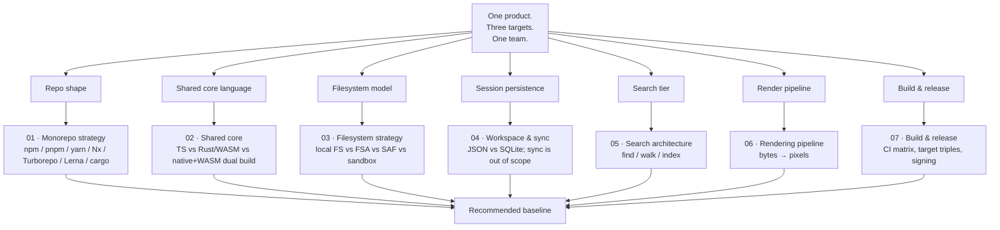

# 14 · Architecture Options

> Research phase. Nothing here is decided — see `docs/adr/` for decisions.
> Every doc in this folder answers one structural question and ends with a
> recommendation you could implement from tomorrow.

## What this folder is for

`research/13-competitors/` tells us what other products got right. This folder
takes the shape of *our* product and answers the questions that only arise once
you know what you are building: how many repositories, where does the shared
logic live, what does a "file" mean on a phone, where does search state go, how
does a keystroke become pixels, and how do three platforms get a signed
installer out of one tag.

These are the questions that decide whether the desktop app ships in six months
or dies in a refactor.

## The decision space at a glance

## Reading order

| # | Doc | The question it answers | Read it when |
|---|-----|------------------------|--------------|
| 01 | [Monorepo strategy](01-monorepo-strategy.md) | One repo or many? Which workspace tool? Fixed or independent versioning? Is Bun worth it? | Before writing the first `package.json` |
| 02 | [Shared core](02-shared-core.md) | What is framework-agnostic? TypeScript, Rust→WASM, or both? Where exactly is the seam? | Before writing the parser |
| 03 | [Filesystem strategy](03-filesystem-strategy.md) | How do we abstract a local folder, a browser directory handle, and a sandboxed mobile picker? How do we watch, detect external edits, and save atomically? | Before writing the open-file path |
| 04 | [Workspace and sync](04-workspace-and-sync.md) | What is a workspace, where does it live, JSON or SQLite? Why is sync out of scope? | Before writing the sidebar state |
| 05 | [Search architecture](05-search-architecture.md) | Native find, bounded walk, or a real index? What is the cost at 10,000 files? | Before promising "search" |
| 06 | [Rendering pipeline](06-rendering-pipeline-design.md) | Bytes → DOM. Where each stage runs, how errors are contained, how re-renders diff, what the block boundary is. | Before writing the renderer. **This is the technical centrepiece.** |
| 07 | [Build and release](07-build-and-release-architecture.md) | CI matrix, Rust target triples, what can and cannot be cross-compiled, signing, updater manifest. | Before the first release tag |

## The four decisions everything else hangs off

Almost every doc here reduces to one of these. Getting them wrong is expensive
and getting them wrong *late* is more expensive, because they are load-bearing
for the other decisions.

| Decision | Chosen direction | Why it is load-bearing |
|----------|------------------|------------------------|
| **Repo shape** | Monorepo, pnpm workspaces + cargo workspace, Turborepo for task graph | Determines how CI caches, how you enforce a dependency boundary, and whether a core change can break a shell in the same commit |
| **Core language** | Pure TypeScript core; Rust only where the platform demands it (file IO on desktop, atomic save) | Determines who can contribute, how the parser is tested, and whether the web target is possible at all |
| **Filesystem abstraction** | A `FileSystemAdapter` with capability flags, not a platform `switch` | Determines whether mobile/web are adaptations or rewrites |
| **No sync in v1** | Explicitly deferred with reasons | Determines how much conflict-resolution machinery we write before we know the file format is stable |

## Verification dates and version claims

Every version number in this folder was checked against the vendor's own
release page or registry on **6 October 2026**. Where a number could not be
verified from a primary source it is marked *unverified* or *verify at build
time*. The ones that move fast and that we will need to re-check:

| Thing | Verified state on 2026-10-06 | Re-check trigger |
|-------|------------------------------|------------------|
| Nx | 23.2 (3 Sep 2026) | quarterly |
| Turborepo | 2.11.5 (28 Sep 2026); Cargo-workspace inference shipped in 2.10.6 | monthly |
| Lerna | 10.0.1 (Sep 2026), maintained by the Nx team since May 2022 | quarterly |
| pnpm | 12.9.1 (3 Oct 2026) | monthly |
| Bun | 1.4.2 (Oct 2026) | quarterly |
| Tauri | 2.12.0 (26 Sep 2026), MSRV raised to 1.90 | monthly |
| Electron | 44.5.1 (29 Sep 2026), Chromium 152 | monthly |
| Vite | 8.3.1 (Sep 2026), Rolldown-based | quarterly |
| TypeScript | 6.0.3 stable, 7.0.2 native port | quarterly |
| rusqlite | 0.40.x, bundled SQLite 3.53.x | quarterly |
| wasm-pack / wasm-bindgen | 0.15.0 (May 2026) / 0.2.128 | quarterly |

## How to disagree with these docs

Every recommendation in this folder names the option it is rejecting and the
condition under which that rejection would be wrong. If you can demonstrate that
condition holds for this project, the recommendation is wrong — write the ADR
and change it. The questions that are genuinely still open, with owners and
deadlines, are tracked in
[`../15-open-questions/`](../15-open-questions/).

## Related research

- [`../06-libraries/`](../06-libraries/) — the parser survey that feeds doc 02
- [`../08-desktop-frameworks/`](../08-desktop-frameworks/) — the shell survey that feeds doc 07
- [`../09-platform/`](../09-platform/) — WebView versions, packaging, signing reality
- [`../10-performance/`](../10-performance/) — the budgets that docs 05 and 06 must hit
- [`../11-security/`](../11-security/) — the threat model that constrains every adapter in doc 03