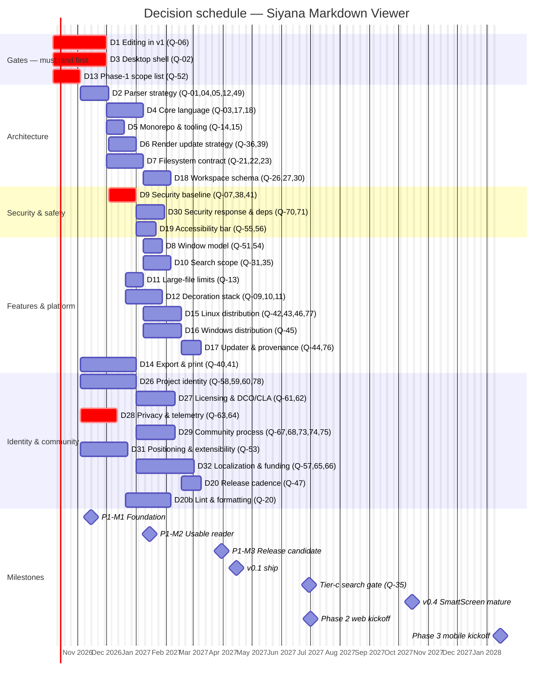

# 03 · Decision Schedule

> Which decision must land before which milestone, in what order, and by when.
> With a deadline for each so nothing blocks indefinitely.

**As of 2026-10-06.** All dates are ISO 8601 and refer to decision *deadlines*
(the date by which **not** having decided has a cost), not aspirational
completion dates.

---

## 1. Roadmap anchors

These are the milestones the deadlines are anchored to. If the roadmap changes,
every dependent deadline moves with it and the slip policy applies.

| Milestone | Date | What "done" means |
|---|---|---|
| **P1-M0** Research complete | 2026-10-06 | `research/` complete; this folder written. **Achieved.** |
| **P1-M1** Foundation | 2026-11-15 | A signed-for-development desktop build opens a `.md` file from disk and renders it. |
| **P1-M2** Usable reader | 2027-01-15 | TOC/outline, in-document find, cross-file search, workspace persistence, settings, first a11y pass. |
| **P1-M3** Release candidate | 2027-03-31 | Error containment complete, performance budgets met, security baseline audited, Linux + Windows bundles reproducible. |
| **P1** v0.1 ship | 2027-04-15 | A public GitHub Release with signed artefacts. |
| **P1+** v0.2/v0.3 | 2027-06 / 2027-08 | Tier-(c) search decision; Linux ARM; Flatpak evaluation. |
| **P1+** v0.4 | 2027-10 | SmartScreen reputation mature; Microsoft Store listing. |
| **P2** Web | 2027-07 → 2028-03 | Chromium-first web build, then Firefox/Safari degradation. |
| **P3** Mobile | 2028-01 → 2028-12 | Android first, then iOS. |

---

## 2. Dependency ordering

The decisions are not independent. The graph below is the order they *have* to
be taken in; anything on an incoming arrow must be settled first, because a
decision made without it is a decision made on a guess.

```mermaid
graph TD
    D1["D1 · Editing in v1?<br/>Q-06"] --> D2["D2 · Parser<br/>Q-01, Q-04, Q-05, Q-12, Q-49"]
    D0["D0 · Platform sequencing<br/>Q-48"] --> D1
    D0 --> D3["D3 · Desktop shell<br/>Q-02"]
    D1 --> D4["D4 · Core language<br/>Q-03, Q-17, Q-18"]
    D3 --> D5["D5 · Monorepo & tooling<br/>Q-14, Q-15"]
    D4 --> D6["D6 · Render update strategy<br/>Q-36, Q-39"]
    D2 --> D6
    D3 --> D7["D7 · Filesystem contract<br/>Q-21, Q-22, Q-23"]
    D1 --> D7
    D7 --> D8["D8 · Window model<br/>Q-51, Q-54"]
    D2 --> D9["D9 · Security baseline<br/>Q-07, Q-38, Q-41"]
    D4 --> D9
    D1 --> D9
    D9 --> D10["D10 · Search scope<br/>Q-31, Q-35"]
    D7 --> D10
    D6 --> D11["D11 · Large-file limits<br/>Q-13"]
    D2 --> D12["D12 · Decoration stack<br/>Q-09, Q-10, Q-11"]
    D0 --> D13["D13 · Phase-1 scope list<br/>Q-52"]
    D13 --> D14["D14 · Export & print<br/>Q-40"]
    D3 --> D15["D15 · Linux distribution<br/>Q-42, Q-43, Q-46, Q-77"]
    D3 --> D16["D16 · Windows distribution<br/>Q-45"]
    D3 --> D17["D17 · Updater & provenance<br/>Q-44, Q-76"]
    D2 --> D18["D18 · Workspace schema<br/>Q-26, Q-27, Q-30"]
    D7 --> D18
    D13 --> D19["D19 · Accessibility bar<br/>Q-55, Q-56"]
    D9 --> D19
    D15 --> D20["D20 · Release cadence<br/>Q-47"]
    D16 --> D20
    D0 --> D21["D21 · Platform sequencing detail<br/>Q-21, Q-28, Q-32"]
    D21 --> D22["D22 · Search decision (tier c)<br/>Q-29, Q-32, Q-33, Q-34"]
    D22 --> D23["D23 · Mobile storage model<br/>Q-24"]
    D22 --> D24["D24 · Editing expansion<br/>Q-25, Q-37"]
    D22 --> D25["D25 · Storage engine<br/>Q-29"]
    D13 --> D26["D26 · Project identity<br/>Q-58, Q-59, Q-60, Q-78"]
    D26 --> D27["D27 · Licensing<br/>Q-61, Q-62"]
    D13 --> D28["D28 · Privacy & telemetry<br/>Q-63, Q-64"]
    D13 --> D29["D29 · Community process<br/>Q-67, Q-68, Q-73, Q-74, Q-75"]
    D27 --> D30["D30 · Security response<br/>Q-70, Q-71"]
    D28 --> D30
    D29 --> D30
    D13 --> D31["D31 · Positioning & extensibility<br/>Q-53, Q-74"]
    D13 --> D32["D32 · Localization & funding<br/>Q-57, Q-65, Q-66"]
    D20 --> D33["D33 · Phase-2 kickoff<br/>Q-45, Q-76"]
    D19 --> D33
    D12 --> D33

    classDef gate fill:#fef2f2,stroke:#dc2626,stroke-width:2px
    classDef early fill:#fff7ed,stroke:#ea580c
    classDef late fill:#f0fdf4,stroke:#16a34a
    class D1,D3,D13 gate
    class D2,D4,D5,D6,D7 early
    class D22,D24,D25,D26,D27,D30,D33 late
```



### The three decisions that gate everything

| Gate | Question | Why it gates | Default if the deadline passes |
|---|---|---|---|
| **D1** | Editing in v1? ([Q-06](01-question-register.md#q-06)) | Determines the FS surface, session state, autosave, conflict handling, and the editor dependency. Everything in doc 03 §7 exists only if we edit. | **Viewer only.** Explicit save, no autosave, no editor dependency. |
| **D3** | Desktop shell ([Q-02](01-question-register.md#q-02)) | Determines size, webview, security model, updater, ARM, and the Rust/TS balance. | **Tauri 2.12.** Smallest surface, best fit for a local-first tool, and the research already assumes it. |
| **D13** | Phase-1 scope list ([Q-52](01-question-register.md#q-52)) | Everything else is "is this in scope?" — an undefined scope makes every other decision arbitrary. | **The exclusions drafted in [R-04](../15-open-questions/02-risk-register.md#r-04).** |

---

## 3. The schedule



`crit` marks decisions on the critical path. Everything else can slip a month
without harm — the gates cannot.

---

## 4. Milestone gates — what must be decided before each

### P1-M0 → P1-M1 · Foundation (deadline 2026-11-15)

Six weeks from today. Only the gates plus the immediately dependent items.

| Decision | Questions | Why it must land first |
|---|---|---|
| **D1** Editing in v1 | [Q-06](01-question-register.md#q-06) | Sets the FS contract's shape (doc 03 §7 is entirely conditional) |
| **D3** Desktop shell | [Q-02](01-question-register.md#q-02) | Sets the build, the IPC, the ARM story, and doc 07 entirely |
| **D13** Phase-1 scope | [Q-52](01-question-register.md#q-52) | Without it, "done" is undefined |
| **D5** Monorepo & tooling | [Q-14](01-question-register.md#q-14), [Q-15](01-question-register.md#q-15) | The repo must exist before anything can be built |
| **D4** Core language | [Q-03](01-question-register.md#q-03), [Q-18](01-question-register.md#q-18) | Determines whether `core/` is TS or Rust — the first line of code depends on it |
| **D26** Project identity | [Q-58](01-question-register.md#q-58), [Q-59](01-question-register.md#q-59), [Q-60](01-question-register.md#q-60) | Bundle id and app-data dir are baked into the first build |
| — measure | [Q-23](01-question-register.md#q-23), [Q-44](01-question-register.md#q-44) | Both answered by a two-hour spike on a real build |
| — measure | [Q-14](01-question-register.md#q-14) | Try Turborepo's Cargo inference for two hours; fall back per doc 01 §12 |

**Exit criterion:** the three gates are `decided`, `pnpm install && cargo check`
works on two platforms, and a Windows dev build opens a file.

### P1-M1 → P1-M2 · Usable reader (deadline 2027-01-15)

| Decision | Questions | Notes |
|---|---|---|
| **D2** Parser strategy | [Q-01](01-question-register.md#q-01), [Q-04](01-question-register.md#q-04), [Q-05](01-question-register.md#q-05), [Q-12](01-question-register.md#q-12), [Q-49](01-question-register.md#q-49) | The golden tests are written against it; changing it later is a rewrite |
| **D9** Security baseline | [Q-07](01-question-register.md#q-07), [Q-38](01-question-register.md#q-38) | **Critical path.** Cannot ship without it |
| **D6** Render update strategy | [Q-36](01-question-register.md#q-36), [Q-39](01-question-register.md#q-39) | Decided from the M1 benchmark, not by preference |
| **D7** Filesystem contract | [Q-21](01-question-register.md#q-21), [Q-22](01-question-register.md#q-22) | The adapter contract test suite is the deliverable |
| **D28** Privacy & telemetry | [Q-63](01-question-register.md#q-63), [Q-64](01-question-register.md#q-64) | **Critical path.** The README's claim depends on it |
| **D8** Window model | [Q-51](01-question-register.md#q-51), [Q-54](01-question-register.md#q-54) | Tabs vs windows changes the session model |
| **D27** Workspace write policy | [Q-27](01-question-register.md#q-27) | Small, but blocks the session-persistence work |
| **D46** Minimum OS versions | [Q-46](01-question-register.md#q-46) | Affects the webview checks and the README |
| **D20** Release cadence | [Q-47](01-question-register.md#q-47) | Affects SmartScreen reputation strategy |
| **D77** Linux artefact priority | [Q-77](01-question-register.md#q-77) | Affects CI matrix shape |
| **D67/70/71** Governance, security response, dependency policy | [Q-67](01-question-register.md#q-67), [Q-70](01-question-register.md#q-70), [Q-71](01-question-register.md#q-71) | Cheap, and they cannot be retrofitted credibly |

**Exit criterion:** a user can open a folder, read a document, use find, search
across the folder, and close and reopen with their state intact — with an error
banner rather than a crash on a malformed file.

### P1-M2 → P1-M3 · Release candidate (deadline 2027-03-31)

| Decision | Questions | Notes |
|---|---|---|
| **D15** Linux distribution | [Q-42](01-question-register.md#q-42), [Q-43](01-question-register.md#q-43), [Q-46](01-question-register.md#q-46) | ARM runner and arm64 WebKitGTK availability |
| **D16** Windows distribution | [Q-45](01-question-register.md#q-45) | Determines the Phase-2 Store work |
| **D17** Updater manifest | [Q-44](01-question-register.md#q-44) | `requireSignedVersion: true` is not negotiable |
| **D19** Accessibility bar | [Q-55](01-question-register.md#q-55), [Q-56](01-question-register.md#q-56) | Cannot be retrofitted credibly |
| **D30** Security response | [Q-70](01-question-register.md#q-70), [Q-71](01-question-register.md#q-71) | Needed before the first public release |
| **D10** Search scope | [Q-31](01-question-register.md#q-31) | v1 scope of tier (b) |
| **D35** Tier-(c) gate | [Q-35](01-question-register.md#q-35) | **The most important date in Phase 1.** Decides whether 60 days of index work happen |
| **D12** Decoration stack | [Q-09](01-question-register.md#q-09), [Q-10](01-question-register.md#q-10), [Q-11](01-question-register.md#q-11) | Bundle budget |
| **D11** Large-file limits | [Q-13](01-question-register.md#q-13) | From the M2 benchmark |
| **D26** Ecosystem integration | [Q-57](01-question-register.md#q-57) | Design-token reuse |
| **D8** Wikilinks | [Q-08](01-question-register.md#q-08) | The scope-creep test: wikilinks need an index |
| **D41** EPUB | [Q-41](01-question-register.md#q-41) | Likely "no" — that is a legitimate outcome |
| **D29** Community process | [Q-73](01-question-register.md#q-73), [Q-74](01-question-register.md#q-74), [Q-75](01-question-register.md#q-75) | Before the issue tracker opens to the world |

**Exit criterion:** a signed build passes the performance budgets (doc 06 §9),
passes the losslessness gate, survives the fuzz corpus, and installs cleanly on
one Windows and one Linux machine from a clean download.

### P1-M3 → v0.1 (deadline 2027-04-15)

No new decisions. This is a shipping milestone. If a decision from above is
still open, the default in this document applies and we ship.

### Post-v0.1

| Date | Decision | Notes |
|---|---|---|
| 2027-06-30 | [Q-32](01-question-register.md#q-32) workspace size distribution, [Q-34](01-question-register.md#q-34) ranking, [Q-25](01-question-register.md#q-25) backups, [Q-26](01-question-register.md#q-26) bookmarks, [Q-30](01-question-register.md#q-30) sidecar state, [Q-20](01-question-register.md#q-20) linting, [Q-40](01-question-register.md#q-40) print, [Q-45](01-question-register.md#q-45) Store packaging, [Q-50](01-question-register.md#q-50) notebooks, [Q-65](01-question-register.md#q-65) localization, [Q-66](01-question-register.md#q-66) funding, [Q-78](01-question-register.md#q-78) account ownership, [Q-76](01-question-register.md#q-76) reproducibility | Informed by real users |
| 2027-07-01 | Phase 2 web kickoff: [Q-21](01-question-register.md#q-21), [Q-28](01-question-register.md#q-28), [Q-16](01-question-register.md#q-16) | Scope the web target before writing it |
| 2027-10-15 | v0.4: SmartScreen reputation mature | Not a decision, a milestone |
| 2028-01-15 | Phase 3 mobile kickoff: [Q-24](01-question-register.md#q-24), [Q-33](01-question-register.md#q-33) | Re-validate the adapter contract against real SAF and iOS |
| 2028-03-31 | [Q-17](01-question-register.md#q-17) WASM escalation, [Q-19](01-question-register.md#q-19) config package, [Q-29](01-question-register.md#q-29) storage engine | Only if their triggers fire |
| 2028-06-30 | [Q-53](01-question-register.md#q-53) extensibility | Only with adoption evidence |

---

## 5. Slip policy

**The problem this solves.** A decision without a deadline does not get decided;
it gets deferred, and the deferral is invisible. Meanwhile work that depended on
it either blocks or, worse, proceeds on an assumption nobody wrote down.

**The policy.**

1. Every decision in the [question register](01-question-register.md) has a
   **deadline** and a **default** (the option stated in the relevant section of
   `research/14`, or "no").
2. **On or before the deadline**, the decision is made and written up as an ADR.
3. **If the deadline passes without a decision, the default applies
   automatically.** No meeting, no negotiation, no drift. The default is
   recorded in the ADR as `Decided: by deadline, default applied`.
4. If applying a default would be actively harmful, that is an escalation:
   the owner raises it *before* the deadline, not after.
5. Slipping a deadline requires an explicit, dated, written reason and a new
   deadline. A slipped deadline without a new date is not a slip; it is a
   deletion.
6. **Every applied default is reviewed at the next milestone.** If a default was
   wrong, we learn it cheaply rather than expensively.

**Why defaults are better than deferral.** A wrong default that is applied
immediately costs one ADR to change. A default that is deferred costs the same
ADR *plus* the work built on the assumption *plus* the schedule slip *plus* the
loss of the reason the assumption was reasonable.

---

## 6. Dependency-ordered decision list

Copy-pasteable. The order is the point.

```markdown
## Gate decisions (critical path)

- [ ] **D1 · Editing in v1** — Q-06 — due 2026-11-15 — default: viewer only
- [ ] **D3 · Desktop shell** — Q-02 — due 2026-11-15 — default: Tauri 2.12
- [ ] **D13 · Phase-1 scope list** — Q-52 — due 2026-10-27 — default: R-04 exclusions

## After D13
- [ ] **D2 · Parser** — Q-01, Q-04, Q-05, Q-12, Q-49 — due 2026-11-17 — default: micromark + mdast
- [ ] **D26 · Project identity** — Q-58, Q-59, Q-60 — due 2026-11-17 — default: dev.siyana.markdownviewer

## After D1
- [ ] **D4 · Core language** — Q-03, Q-18 — due 2026-12-04 — default: pure TypeScript
- [ ] **D7 · Filesystem contract** — Q-22, Q-23 — due 2026-12-04 — default: adapter contract (doc 03 §2)

## After D3
- [ ] **D5 · Monorepo & tooling** — Q-14, Q-15 — due 2026-11-29 — default: pnpm + Turborepo + cargo
- [ ] **D15 · Linux distribution** — Q-42, Q-43, Q-46, Q-77 — due 2027-01-15 — default: .deb + AppImage, Ubuntu 22.04 container
- [ ] **D16 · Windows distribution** — Q-45 — due 2027-01-15 — default: NSIS + MSI, Azure Trusted Signing
- [ ] **D17 · Updater manifest** — Q-44 — due 2027-01-29 — default: tauri-action manifest, requireSignedVersion

## After D2 + D4
- [ ] **D6 · Render update strategy** — Q-36, Q-39 — due 2027-01-15 — default: hand-written block patcher
- [ ] **D9 · Security baseline** — Q-07, Q-38 — due 2027-01-15 — default: rawHtml escape, remote images blocked
- [ ] **D12 · Decoration stack** — Q-09, Q-10, Q-11 — due 2027-02-12 — default: Shiki in worker, KaTeX, no mermaid

## After D7
- [ ] **D8 · Window model** — Q-51, Q-54 — due 2027-01-29 — default: single instance, tabs inside one window
- [ ] **D10 · Search scope** — Q-31, Q-35 — due 2027-03-31 — default: literal + case + whole-word only
- [ ] **D18 · Workspace schema** — Q-27, Q-30 — due 2027-02-12 — default: debounced write, app-data only

## Not on the critical path
- [ ] **D14 · Export & print** — Q-40, Q-41 — due 2027-03-31 — default: webview print only, no EPUB
- [ ] **D20 · Release cadence** — Q-47 — due 2027-01-15 — default: every 6-8 weeks
- [ ] **D27 · Licensing** — Q-61, Q-62 — due 2027-01-29 — default: MIT, no CLA
- [ ] **D28 · Privacy & telemetry** — Q-63, Q-64 — due 2027-01-15 — default: no telemetry, local diagnostics only
- [ ] **D29 · Community process** — Q-73, Q-74, Q-75 — due 2027-03-31 — default: curated good-first-issues, published scope list
- [ ] **D30 · Security response** — Q-70, Q-71 — due 2027-03-31 — default: GitHub advisories, weekly dependabot
- [ ] **D31 · Positioning** — Q-53 — due 2027-03-31 — default: standalone, no plugins
- [ ] **D32 · Localization & funding** — Q-57, Q-65, Q-66 — due 2027-06-30 — default: English UI, shared tokens, sponsors

## Deferred with triggers (not scheduled)
- Q-08 wikilinks — default: no
- Q-16 Bun — trigger: CI > 10 min
- Q-17 WASM core — trigger: doc 02 §9 row 1
- Q-19 config package — trigger: > 12 files
- Q-24 iOS coordination — trigger: Phase 3
- Q-25 backups — trigger: autosave ships
- Q-26 bookmarks — trigger: 5+ requests
- Q-28 storage.persist — trigger: Phase 2
- Q-29 storage engine — trigger: tier-(c) gate reached
- Q-32 workspace sizes — trigger: v1 released
- Q-33 mobile search — trigger: Phase 3
- Q-34 ranking — trigger: tier (c) ships
- Q-37 editor engine — trigger: live preview
- Q-39 content-visibility — trigger: M1 benchmark
- Q-50 notebooks — trigger: 5+ requests
- Q-76 reproducibility — trigger: distribution trust blocks
- Q-78 accounts — trigger: a signing account is created
```

---

## 7. What we deliberately do not schedule

Some work is real and is not on this chart, because scheduling it would imply
commitment we cannot make:

| Work | Why it is unscheduled |
|---|---|
| Mobile implementation | Phase 3. Designing it now would freeze interfaces we have not validated on a real platform |
| Web implementation | Phase 2. Q-21 must be answered first |
| Tier-(c) index | Behind the benchmark gate (Q-35) |
| Plugin system | Q-53, deferred pending adoption |
| Sync | Explicitly out of scope for v1 (doc 04 §6). Revisit only when the file format is stable and someone asks seriously |
| New CI acceleration | Caching is adequate at our size; remote caching adds a supply-chain surface (CVE-2026-71476 is the cautionary tale) |
| Performance work beyond budget | The budgets in doc 06 §9 are the target; exceeding them triggers investigation, not a project |

---

## Related

- [Question register](01-question-register.md) — the questions this schedule
  sequences
- [Risk register](02-risk-register.md) — what happens when a mitigation slips
- [`../14-architecture-options/`](../14-architecture-options/) — the defaults these
  decisions refer to
